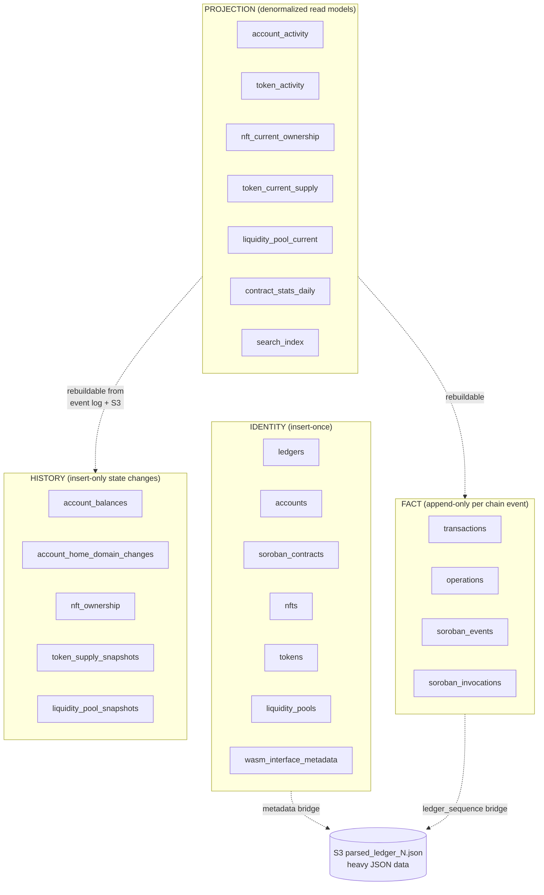

# ADR 0012 — Database Schema ERD

> Generated from ADR 0012 (zero-upsert schema with activity projections and full
> indexing strategy).
> **23 tables** (16 core + 7 projections), **~34 FK constraints** (all `ON DELETE RESTRICT`).
>
> `ledgers` is treated as a **dimension table** — other tables reference `ledger_sequence`
> by value only (plain `BIGINT`), not via FK. See ADR 0012 section "Why ledger_sequence
> is not a FK" for rationale.

---

## Diagram 1: Full schema with fields

```mermaid
erDiagram
    ledgers {
        BIGINT sequence PK
        VARCHAR_64 hash UK
        INTEGER tx_count
        INTEGER op_count
        TIMESTAMPTZ closed_at
        INTEGER protocol_version
        BIGINT base_fee
    }

    transactions {
        BIGSERIAL id PK
        VARCHAR_64 hash UK
        BIGINT ledger_sequence
        VARCHAR_69 source_account FK
        BIGINT source_post_sequence_number
        BIGINT fee_charged
        BOOLEAN successful
        TIMESTAMPTZ created_at
        BOOLEAN parse_error
    }

    operations {
        BIGSERIAL id PK
        BIGINT transaction_id FK
        SMALLINT application_order
        VARCHAR_69 source_account FK
        VARCHAR_50 type
        VARCHAR_69 destination FK
        VARCHAR_56 contract_id FK
        VARCHAR_100 function_name
        VARCHAR_12 asset_code
        VARCHAR_69 asset_issuer
        VARCHAR_64 pool_id FK
        TIMESTAMPTZ created_at PK
    }

    accounts {
        VARCHAR_69 account_id PK
        BIGINT first_seen_ledger
    }

    account_balances {
        BIGSERIAL id PK
        VARCHAR_69 account_id FK
        BIGINT ledger_sequence
        VARCHAR_20 asset_type
        VARCHAR_12 asset_code
        VARCHAR_69 issuer
        SMALLINT event_order
        NUMERIC balance
    }

    account_home_domain_changes {
        BIGSERIAL id PK
        VARCHAR_69 account_id FK
        BIGINT ledger_sequence
        VARCHAR_256 home_domain
    }

    soroban_contracts {
        VARCHAR_56 contract_id PK
        VARCHAR_64 wasm_hash FK
        VARCHAR_69 deployer_account FK
        BIGINT deployed_at_ledger
        VARCHAR_50 contract_type
        BOOLEAN is_sac
        VARCHAR_256 name
        TSVECTOR search_vector
    }

    soroban_events {
        BIGSERIAL id PK
        BIGINT transaction_id FK
        VARCHAR_56 contract_id FK
        VARCHAR_20 event_type
        VARCHAR_100 topic0
        SMALLINT event_index
        BIGINT ledger_sequence
        TIMESTAMPTZ created_at PK
    }

    soroban_invocations {
        BIGSERIAL id PK
        BIGINT transaction_id FK
        VARCHAR_56 contract_id FK
        VARCHAR_69 caller_account FK
        VARCHAR_100 function_name
        BOOLEAN successful
        SMALLINT invocation_index
        BIGINT ledger_sequence
        TIMESTAMPTZ created_at PK
    }

    tokens {
        BIGSERIAL id PK
        VARCHAR_20 asset_type
        VARCHAR_12 asset_code
        VARCHAR_56 issuer_address FK
        VARCHAR_56 contract_id FK
        VARCHAR_256 name
        BIGINT metadata_ledger
    }

    token_supply_snapshots {
        BIGSERIAL id PK
        BIGINT token_id FK
        BIGINT ledger_sequence
        NUMERIC total_supply
        INTEGER holder_count
    }

    nfts {
        BIGSERIAL id PK
        VARCHAR_56 contract_id FK
        VARCHAR_256 token_id
        VARCHAR_256 collection_name
        VARCHAR_256 name
        TEXT media_url
        BIGINT minted_at_ledger
        TSVECTOR search_vector
    }

    nft_ownership {
        BIGSERIAL id PK
        BIGINT nft_id FK
        BIGINT transaction_id FK
        VARCHAR_69 owner_account FK
        VARCHAR_20 event_type
        BIGINT ledger_sequence
        SMALLINT event_order
        TIMESTAMPTZ created_at
    }

    liquidity_pools {
        VARCHAR_64 pool_id PK
        VARCHAR_20 asset_a_type
        VARCHAR_12 asset_a_code
        VARCHAR_56 asset_a_issuer FK
        VARCHAR_20 asset_b_type
        VARCHAR_12 asset_b_code
        VARCHAR_56 asset_b_issuer FK
        INTEGER fee_bps
        BIGINT created_at_ledger
    }

    liquidity_pool_snapshots {
        BIGSERIAL id PK
        VARCHAR_64 pool_id FK
        BIGINT ledger_sequence
        TIMESTAMPTZ created_at PK
        NUMERIC reserve_a
        NUMERIC reserve_b
        NUMERIC total_shares
        NUMERIC tvl
        NUMERIC volume
        NUMERIC fee_revenue
    }

    wasm_interface_metadata {
        VARCHAR_64 wasm_hash PK
        VARCHAR_256 name
        BIGINT uploaded_at_ledger
        VARCHAR_50 contract_type
    }

    account_activity {
        VARCHAR_69 account_id PK
        BIGINT transaction_id PK
        BIGINT ledger_sequence
        TIMESTAMPTZ created_at PK
        VARCHAR_20 role PK
    }

    token_activity {
        BIGINT token_id PK
        BIGINT transaction_id PK
        BIGINT ledger_sequence
        TIMESTAMPTZ created_at PK
    }

    nft_current_ownership {
        BIGINT nft_id PK
        VARCHAR_69 owner_account FK
        BIGINT ledger_sequence
        BIGINT transaction_id FK
    }

    token_current_supply {
        BIGINT token_id PK
        NUMERIC total_supply
        INTEGER holder_count
        BIGINT ledger_sequence
    }

    liquidity_pool_current {
        VARCHAR_64 pool_id PK
        NUMERIC reserve_a
        NUMERIC reserve_b
        NUMERIC total_shares
        NUMERIC tvl
        NUMERIC volume_24h
        NUMERIC fee_revenue
        BIGINT ledger_sequence
    }

    contract_stats_daily {
        VARCHAR_56 contract_id PK
        DATE day PK
        BIGINT invocation_count
        HLL unique_callers
        TIMESTAMPTZ last_active_at
    }

    search_index {
        VARCHAR_20 entity_type PK
        VARCHAR_128 entity_ref PK
        VARCHAR_256 search_key
        VARCHAR_256 display_label
        TSVECTOR search_tsv
        SMALLINT rank_weight
    }

    %% NOTE: ledgers has no outgoing FK relationships.
    %% ledger_sequence / *_at_ledger columns exist in most tables as plain BIGINT
    %% (dimension-style reference), not FK. See ADR 0012: "Why ledger_sequence is not a FK".

    %% ===== Core-table relationships =====
    accounts ||--o{ transactions : "source_account"
    accounts ||--o{ operations : "source_account"
    accounts ||--o{ operations : "destination"
    accounts ||--o{ soroban_invocations : "caller"
    accounts ||--o{ nft_ownership : "owner"
    accounts ||--o{ account_balances : "account_id"
    accounts ||--o{ account_home_domain_changes : "account_id"
    accounts ||--o{ soroban_contracts : "deployer"
    accounts ||--o{ tokens : "issuer"
    accounts ||--o{ liquidity_pools : "asset_a_issuer"
    accounts ||--o{ liquidity_pools : "asset_b_issuer"

    soroban_contracts ||--o{ operations : "contract_id"
    soroban_contracts ||--o{ soroban_events : "contract_id"
    soroban_contracts ||--o{ soroban_invocations : "contract_id"
    soroban_contracts ||--o{ nfts : "contract_id"
    soroban_contracts ||--o{ tokens : "contract_id"

    liquidity_pools ||--o{ operations : "pool_id"
    liquidity_pools ||--o{ liquidity_pool_snapshots : "history"

    tokens ||--o{ token_supply_snapshots : "history"

    nfts ||--o{ nft_ownership : "history"

    wasm_interface_metadata ||--o{ soroban_contracts : "wasm_hash"

    transactions ||--o{ operations : "contains"
    transactions ||--o{ soroban_events : "emits"
    transactions ||--o{ soroban_invocations : "invokes"
    transactions ||--o{ nft_ownership : "records"

    %% ===== Projection-table relationships =====
    accounts ||--o{ account_activity : "account_id"
    transactions ||--o{ account_activity : "transaction_id"

    tokens ||--o{ token_activity : "token_id"
    transactions ||--o{ token_activity : "transaction_id"

    nfts ||--|| nft_current_ownership : "current"
    accounts ||--o{ nft_current_ownership : "owner"
    transactions ||--o{ nft_current_ownership : "last_tx"

    tokens ||--|| token_current_supply : "current"
    liquidity_pools ||--|| liquidity_pool_current : "current"

    soroban_contracts ||--o{ contract_stats_daily : "daily_rollup"
```

---

## Diagram 2: Relationships only (cleaner view)

Parent tables point to their dependents. Every FK is `ON DELETE RESTRICT`.

```mermaid
erDiagram
    %% ledgers is a dimension table with no outgoing FKs.
    %% Every table has a BIGINT ledger_sequence column referencing by value only.

    %% Core-table relationships
    accounts ||--o{ transactions : ""
    accounts ||--o{ operations : ""
    accounts ||--o{ soroban_invocations : ""
    accounts ||--o{ nft_ownership : ""
    accounts ||--o{ account_balances : ""
    accounts ||--o{ account_home_domain_changes : ""
    accounts ||--o{ soroban_contracts : ""
    accounts ||--o{ tokens : ""
    accounts ||--o{ liquidity_pools : ""

    soroban_contracts ||--o{ operations : ""
    soroban_contracts ||--o{ soroban_events : ""
    soroban_contracts ||--o{ soroban_invocations : ""
    soroban_contracts ||--o{ nfts : ""
    soroban_contracts ||--o{ tokens : ""

    liquidity_pools ||--o{ operations : ""
    liquidity_pools ||--o{ liquidity_pool_snapshots : ""

    tokens ||--o{ token_supply_snapshots : ""
    nfts ||--o{ nft_ownership : ""
    wasm_interface_metadata ||--o{ soroban_contracts : ""

    transactions ||--o{ operations : ""
    transactions ||--o{ soroban_events : ""
    transactions ||--o{ soroban_invocations : ""
    transactions ||--o{ nft_ownership : ""

    %% Projection-table relationships
    accounts ||--o{ account_activity : ""
    transactions ||--o{ account_activity : ""
    tokens ||--o{ token_activity : ""
    transactions ||--o{ token_activity : ""
    nfts ||--|| nft_current_ownership : ""
    accounts ||--o{ nft_current_ownership : ""
    transactions ||--o{ nft_current_ownership : ""
    tokens ||--|| token_current_supply : ""
    liquidity_pools ||--|| liquidity_pool_current : ""
    soroban_contracts ||--o{ contract_stats_daily : ""
```

---

## Diagram 3: Logical groups

Tables grouped by role. Identity / Fact / History / Projection / standalone.

---

## Legend

- **PK** — Primary Key
- **FK** — Foreign Key (all `ON DELETE RESTRICT`)
- **UK** — Unique Constraint
- `||--||` — one-to-one (projection current-state)
- `||--o{` — one-to-many
- Quoted strings after keys (e.g. `"part of composite PK"`) are Mermaid comments
  used to note that an attribute participates in a composite primary key that
  Mermaid's single-key-per-attribute notation cannot express directly

### Composite primary keys

Some tables have composite PKs that can't be fully represented in Mermaid's notation:

| Table                      | Composite PK                                     | Reason                                      |
| -------------------------- | ------------------------------------------------ | ------------------------------------------- |
| `operations`               | `(id, created_at)`                               | Partitioning by `created_at`                |
| `soroban_events`           | `(id, created_at)`                               | Partitioning by `created_at`                |
| `soroban_invocations`      | `(id, created_at)`                               | Partitioning by `created_at`                |
| `liquidity_pool_snapshots` | `(id, created_at)`                               | Partitioning by `created_at`                |
| `account_activity`         | `(account_id, transaction_id, role, created_at)` | Partitioning by `created_at`; role tiebreak |
| `token_activity`           | `(token_id, transaction_id, created_at)`         | Partitioning by `created_at`                |
| `contract_stats_daily`     | `(contract_id, day)`                             | Daily rollup grain                          |
| `search_index`             | `(entity_type, entity_ref)`                      | Composite identity                          |

PostgreSQL requires the partition key to be part of every UNIQUE constraint and PK
on a partitioned table.

### Cardinality notation

- `||--o{` — one-to-many (parent to many children)
- `||--||` — one-to-one (current-state projection per entity)

### Table roles

| Role                                             | Tables                                                                                                         | Write pattern                                                                                         |
| ------------------------------------------------ | -------------------------------------------------------------------------------------------------------------- | ----------------------------------------------------------------------------------------------------- |
| **Identity** (insert-once)                       | ledgers, accounts, soroban_contracts, nfts, tokens, liquidity_pools, wasm_interface_metadata                   | `ON CONFLICT DO NOTHING`, progressive COALESCE fill                                                   |
| **Fact** (append-only)                           | transactions, operations, soroban_events, soroban_invocations                                                  | INSERT, immutable per chain                                                                           |
| **History** (cumulative)                         | account_balances, account_home_domain_changes, nft_ownership, token_supply_snapshots, liquidity_pool_snapshots | INSERT, reconstruct current state via `ORDER BY ledger_sequence DESC LIMIT 1`                         |
| **Projection — activity** (append-only feed)     | account_activity, token_activity                                                                               | INSERT at persist time; rebuildable from fact tables                                                  |
| **Projection — current** (watermark upsert)      | nft_current_ownership, token_current_supply, liquidity_pool_current                                            | Upsert keyed by entity; replace only when `ledger_sequence` is newer; rebuildable from history tables |
| **Projection — rollup** (periodic refresh)       | contract_stats_daily                                                                                           | Daily aggregate from `soroban_invocations`; HyperLogLog for unique callers                            |
| **Projection — search** (identity-driven upsert) | search_index                                                                                                   | Upsert on identity insert; rebuildable from identity tables                                           |

### Key hubs (most-referenced entities)

1. **`accounts`** — referenced by 12 FK columns across 10 tables (adds `account_activity`, `nft_current_ownership`)
2. **`transactions`** — referenced by 6 tables (operations, events, invocations, nft_ownership, account_activity, token_activity, nft_current_ownership)
3. **`soroban_contracts`** — referenced by 6 tables (adds `contract_stats_daily`)
4. **`tokens`** — referenced by 3 tables (token_supply_snapshots, token_activity, token_current_supply)
5. **`nfts`** — referenced by 2 tables (nft_ownership, nft_current_ownership)
6. **`liquidity_pools`** — referenced by 3 tables (operations, liquidity_pool_snapshots, liquidity_pool_current)

### Dimension (not FK-referenced)

- **`ledgers`** — referenced by value only. 18+ tables carry a `ledger_sequence` or
  `*_at_ledger` `BIGINT` column, but these are not FKs. Pattern: dimensional modeling
  (fact tables value-join to date/time dimension without enforced constraint).

---

## Partition plan

| Table                      | Partition key      | Cadence                                   |
| -------------------------- | ------------------ | ----------------------------------------- |
| `operations`               | `created_at` RANGE | Monthly (aligned with events/invocations) |
| `soroban_events`           | `created_at` RANGE | Monthly                                   |
| `soroban_invocations`      | `created_at` RANGE | Monthly                                   |
| `liquidity_pool_snapshots` | `created_at` RANGE | Monthly                                   |
| `account_activity`         | `created_at` RANGE | Monthly                                   |
| `token_activity`           | `created_at` RANGE | Monthly                                   |

All other tables are unpartitioned.

---

## Related files

- [ADR 0012](../lore/2-adrs/0012_zero-upsert-schema-full-fk-graph.md) — source of truth for schema
- [ADR 0011](../lore/2-adrs/0011_s3-offload-lightweight-db-schema.md) (superseded) — previous design
- [schema-erd.md](schema-erd.md) — ERD of the pre-0011 schema
