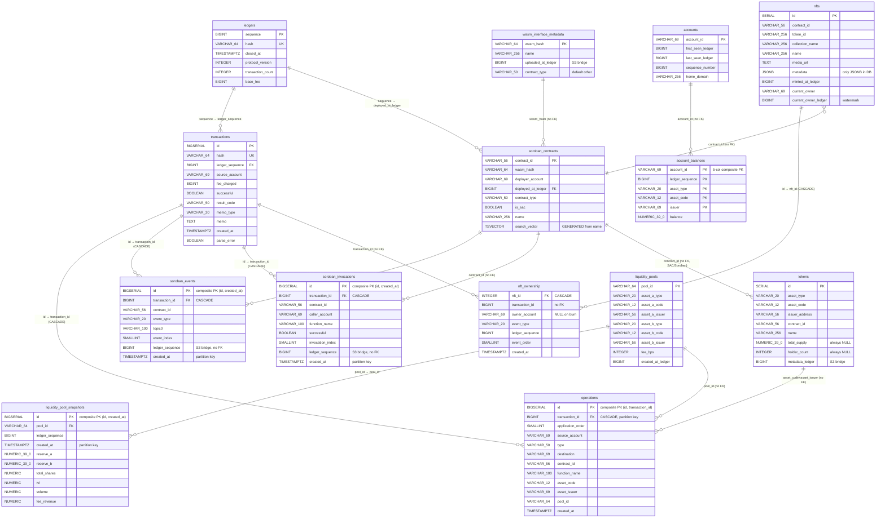

# ADR 0011 — Database Schema ERD

> Generated from ADR 0011. 14 tables, S3-offloaded schema.

## Diagram 1: Enforced FK only (7 relationships)

Only real foreign key constraints in the database. Clean view of data integrity.

```mermaid
erDiagram
    ledgers {
        BIGINT sequence PK
        VARCHAR_64 hash UK
        TIMESTAMPTZ closed_at
        INTEGER protocol_version
        INTEGER transaction_count
        BIGINT base_fee
    }

    transactions {
        BIGSERIAL id PK
        VARCHAR_64 hash UK
        BIGINT ledger_sequence FK
        VARCHAR_69 source_account
        BIGINT fee_charged
        BOOLEAN successful
        VARCHAR_50 result_code
        VARCHAR_20 memo_type
        TEXT memo
        TIMESTAMPTZ created_at
        BOOLEAN parse_error
    }

    operations {
        BIGSERIAL id PK "composite PK (id, transaction_id)"
        BIGINT transaction_id FK "CASCADE, partition key"
        SMALLINT application_order
        VARCHAR_69 source_account
        VARCHAR_50 type
        VARCHAR_69 destination
        VARCHAR_56 contract_id
        VARCHAR_100 function_name
        VARCHAR_12 asset_code
        VARCHAR_69 asset_issuer
        VARCHAR_64 pool_id
        TIMESTAMPTZ created_at
    }

    soroban_contracts {
        VARCHAR_56 contract_id PK
        VARCHAR_64 wasm_hash
        VARCHAR_69 deployer_account
        BIGINT deployed_at_ledger FK
        VARCHAR_50 contract_type
        BOOLEAN is_sac
        VARCHAR_256 name
        TSVECTOR search_vector "GENERATED from name"
    }

    soroban_events {
        BIGSERIAL id PK "composite PK (id, created_at)"
        BIGINT transaction_id FK "CASCADE"
        VARCHAR_56 contract_id
        VARCHAR_20 event_type
        VARCHAR_100 topic0
        SMALLINT event_index
        BIGINT ledger_sequence "S3 bridge, no FK"
        TIMESTAMPTZ created_at "partition key"
    }

    soroban_invocations {
        BIGSERIAL id PK "composite PK (id, created_at)"
        BIGINT transaction_id FK "CASCADE"
        VARCHAR_56 contract_id
        VARCHAR_69 caller_account
        VARCHAR_100 function_name
        BOOLEAN successful
        SMALLINT invocation_index
        BIGINT ledger_sequence "S3 bridge, no FK"
        TIMESTAMPTZ created_at "partition key"
    }

    accounts {
        VARCHAR_69 account_id PK
        BIGINT first_seen_ledger
        BIGINT last_seen_ledger
        BIGINT sequence_number
        VARCHAR_256 home_domain
    }

    account_balances {
        VARCHAR_69 account_id PK "5-col composite PK"
        BIGINT ledger_sequence PK
        VARCHAR_20 asset_type PK
        VARCHAR_12 asset_code PK
        VARCHAR_69 issuer PK
        NUMERIC_39_0 balance
    }

    tokens {
        SERIAL id PK
        VARCHAR_20 asset_type
        VARCHAR_12 asset_code
        VARCHAR_56 issuer_address
        VARCHAR_56 contract_id
        VARCHAR_256 name
        NUMERIC_39_0 total_supply "always NULL"
        INTEGER holder_count "always NULL"
        BIGINT metadata_ledger "S3 bridge"
    }

    nfts {
        SERIAL id PK
        VARCHAR_56 contract_id
        VARCHAR_256 token_id
        VARCHAR_256 collection_name
        VARCHAR_256 name
        TEXT media_url
        JSONB metadata "only JSONB in DB"
        BIGINT minted_at_ledger
        VARCHAR_69 current_owner
        BIGINT current_owner_ledger "watermark"
    }

    nft_ownership {
        INTEGER nft_id FK "CASCADE"
        BIGINT transaction_id "no FK"
        VARCHAR_69 owner_account "NULL on burn"
        VARCHAR_20 event_type
        BIGINT ledger_sequence
        SMALLINT event_order
        TIMESTAMPTZ created_at
    }

    liquidity_pools {
        VARCHAR_64 pool_id PK
        VARCHAR_20 asset_a_type
        VARCHAR_12 asset_a_code
        VARCHAR_56 asset_a_issuer
        VARCHAR_20 asset_b_type
        VARCHAR_12 asset_b_code
        VARCHAR_56 asset_b_issuer
        INTEGER fee_bps
        BIGINT created_at_ledger
    }

    liquidity_pool_snapshots {
        BIGSERIAL id PK "composite PK (id, created_at)"
        VARCHAR_64 pool_id FK
        BIGINT ledger_sequence
        TIMESTAMPTZ created_at "partition key"
        NUMERIC_39_0 reserve_a
        NUMERIC_39_0 reserve_b
        NUMERIC total_shares
        NUMERIC tvl
        NUMERIC volume
        NUMERIC fee_revenue
    }

    wasm_interface_metadata {
        VARCHAR_64 wasm_hash PK
        VARCHAR_256 name
        BIGINT uploaded_at_ledger "S3 bridge"
        VARCHAR_50 contract_type "default other"
    }

    %% === ENFORCED FK ONLY ===
    ledgers ||--o{ transactions : "sequence → ledger_sequence"
    transactions ||--o{ operations : "id → transaction_id (CASCADE)"
    transactions ||--o{ soroban_events : "id → transaction_id (CASCADE)"
    transactions ||--o{ soroban_invocations : "id → transaction_id (CASCADE)"
    ledgers ||--o{ soroban_contracts : "sequence → deployed_at_ledger"
    nfts ||--o{ nft_ownership : "id → nft_id (CASCADE)"
    liquidity_pools ||--o{ liquidity_pool_snapshots : "pool_id → pool_id"
```



---

## Diagram 2: FK + logical relationships (16 relationships)

All data connections — enforced FK + application-level JOINs (no FK in DB).



---

## Legend

| Symbol          | Meaning                                                         |
| --------------- | --------------------------------------------------------------- |
| `PK`            | Primary key                                                     |
| `FK`            | Foreign key (enforced)                                          |
| `UK`            | Unique constraint                                               |
| `(no FK)`       | Logical relationship, no enforced FK (parallel backfill safety) |
| `CASCADE`       | ON DELETE CASCADE                                               |
| `S3 bridge`     | Column used to locate data in `parsed_ledger_{value}.json`      |
| `partition key` | Column used for PARTITION BY RANGE                              |

## S3 Bridge Columns

```
transactions.ledger_sequence ──────────────┐
soroban_events.ledger_sequence ────────────┤
soroban_invocations.ledger_sequence ───────┤
soroban_contracts.deployed_at_ledger ──────┼──► parsed_ledger_{value}.json
tokens.metadata_ledger ────────────────────┤
wasm_interface_metadata.uploaded_at_ledger ┘
```

## Partitioned Tables

| Table                      | Partition key    | Strategy                  |
| -------------------------- | ---------------- | ------------------------- |
| `operations`               | `transaction_id` | RANGE (10M IDs/partition) |
| `soroban_events`           | `created_at`     | RANGE (monthly)           |
| `soroban_invocations`      | `created_at`     | RANGE (monthly)           |
| `liquidity_pool_snapshots` | `created_at`     | RANGE (monthly)           |

## Insert-Only History Tables

| Entity table      | History table              | Pattern                                |
| ----------------- | -------------------------- | -------------------------------------- |
| `accounts`        | `account_balances`         | Balance snapshots per ledger per asset |
| `nfts`            | `nft_ownership`            | Ownership changes (mint/transfer/burn) |
| `liquidity_pools` | `liquidity_pool_snapshots` | Pool state per ledger change           |
