# ADR 0012: Lightweight bridge DB schema — revision of ADR 0011

**Related:**

- [ADR 0011: S3 offload — lightweight DB schema](0011_s3-offload-lightweight-db-schema.md) — baseline, revised here
- [ADR 0004: Rust-only XDR parsing](0004_rust-only-xdr-parsing.md)
- [ADR 0005: Rust-only backend API](0005_rust-only-backend-api.md)

---

## Context

ADR 0011 defines the correct direction — DB as lightweight index, S3 as heavy payload
storage — but five independent senior reviews of the schema surfaced concrete execution
errors that prevent several endpoints from working correctly at mainnet scale:

1. **Partitioning of `operations` by `transaction_id`** blocks partition pruning for
   `filter[contract_id]`, `filter[operation_type]`, `filter[pool_id]`, `filter[assets]` —
   exactly the filters exposed by the API. Full fan-out scan over all partitions.
2. **`transactions` is not partitioned.** Mainnet projection: 225-375M rows after S3
   offload. VACUUM/ANALYZE on a multi-hundred-GB table becomes operationally untenable.
3. **FKs to `ledgers(sequence)`** are kept on `transactions`, `soroban_contracts`,
   `nfts`, `liquidity_pools`, but removed from `soroban_events`, `soroban_invocations`,
   `account_balances` with comment "parallel backfill safety". Inconsistent — the same
   policy must apply uniformly. `ledgers` is a timeline, not a relational hub.
4. **`GET /accounts/:account_id/transactions` is incomplete** — filtering only by
   `source_account` misses transactions where the account is destination, signer,
   caller, NFT recipient, etc. No N:M table links accounts to transactions.
5. **`GET /tokens/:id/transactions` and `GET /liquidity-pools/:id/transactions` cannot
   return a usable list** — after offloading `soroban_events.topics`/`data` to S3, the
   DB has no `from`/`to`/`amount` for SEP-0041 transfer events. List rows would be
   empty shells.
6. **`account_balances` combines current-balance lookup and full history in one table
   with `ledger_sequence` in PK.** `GET /accounts/:id` needs "current balance per
   asset", which becomes `SELECT DISTINCT ON (...) ORDER BY ledger_sequence DESC` over
   hundreds of millions of rows. The same pattern that ADR 0011 correctly applies to
   `liquidity_pools` + `liquidity_pool_snapshots` (identity + history split) is not
   applied to accounts.
7. **Frontend "Pool participants" view on `/liquidity-pools/:id`** has no backing table.
8. **`asset_issuer VARCHAR(69)`** — issuers cannot be muxed (M-addresses are payment
   routing hints, not asset identity). ADR 0011 acknowledges this in a comment but
   keeps 69 "for consistency". Correct width is 56.
9. **`tokens.total_supply` and `tokens.holder_count`** have no write path. Insert-once
   `ON CONFLICT DO NOTHING`, no UPDATE mechanism. Garbage columns.
10. **Fee-bump transactions** are not representable — no `inner_tx_hash`, no
    `fee_account`, no `is_fee_bump` flag.

This ADR revises ADR 0011 to address all ten issues without expanding scope. Principles
of ADR 0011 (S3 offload, insert-only history, normalized JSONB, column sizing) are
preserved. Every change below maps to a concrete endpoint requirement or a concrete
XDR/Stellar correctness issue.

---

## Decision

### Principles (inherited from ADR 0011, reaffirmed)

- **DB = lightweight index, S3 = full parsed payload.** One JSON file per ledger on S3:
  `parsed_ledger_{sequence}.json`, write-once, immutable.
- **List endpoints served from DB only.** Detail endpoints: DB + at most 1 S3 fetch.
- **`ledger_sequence` is a bridge column, not a FK target.** Stored as `BIGINT NOT NULL`
  - B-tree index. No FK to `ledgers(sequence)` in any table. `ledgers` is a timeline for
    `/ledgers` endpoints, not a relational hub.
- **FKs only between domain entities** where cascade/integrity matters (operations →
  transactions, nft_ownership → nfts, liquidity_pool_snapshots → liquidity_pools,
  transaction_participants → transactions). Never to `ledgers`.
- **Insert-only history for mutable state with user-visible temporal value:** balances,
  NFT ownership, LP snapshots. Split current (upsert) + history (insert-only) whenever
  current-state lookup is a hot path.
- **Partitioning by `created_at` monthly** for all high-volume time-series tables —
  uniform strategy enables partition-wise joins and retention.
- **No FK to `ledgers`. No M→G address normalization** (separate product decision). **No
  hash→BYTEA conversion** in this iteration (migration cost > gain).

### Column conventions

- Account addresses (G + muxed M): `VARCHAR(69)` (`source_account`, `destination`,
  `caller_account`, `owner_account`, `deployer_account`, `from_account`, `to_account`).
- Asset issuers, contract IDs (never muxed): `VARCHAR(56)`.
- Raw token amounts (i128, SEP-0041): `NUMERIC(39,0)`.
- Computed amounts (tvl, volume, shares): bare `NUMERIC`.
- Hashes (SHA-256 hex): `VARCHAR(64)`.

### Schema (full DDL)

#### 1. `ledgers` — no change vs ADR 0011

```sql
CREATE TABLE ledgers (
    sequence          BIGINT PRIMARY KEY,
    hash              VARCHAR(64) NOT NULL UNIQUE,
    closed_at         TIMESTAMPTZ NOT NULL,
    protocol_version  INTEGER NOT NULL,
    transaction_count INTEGER NOT NULL,
    base_fee          BIGINT NOT NULL
);
CREATE INDEX idx_ledgers_closed_at ON ledgers (closed_at DESC);
```

#### 2. `transactions` — partitioned, fee-bump support, denormalized filter columns

```sql
CREATE TABLE transactions (
    id                  BIGSERIAL,
    hash                VARCHAR(64) NOT NULL,
    ledger_sequence     BIGINT NOT NULL,               -- no FK
    application_order   SMALLINT NOT NULL,             -- stable ordering in ledger
    source_account      VARCHAR(69) NOT NULL,
    fee_charged         BIGINT NOT NULL,
    fee_account         VARCHAR(69),                   -- fee-bump outer payer
    is_fee_bump         BOOLEAN NOT NULL DEFAULT FALSE,
    inner_tx_hash       VARCHAR(64),                   -- fee-bump inner tx reference
    successful          BOOLEAN NOT NULL,
    result_code         VARCHAR(30),
    operation_count     SMALLINT NOT NULL,             -- denorm for list badge
    has_soroban         BOOLEAN NOT NULL DEFAULT FALSE, -- denorm filter shortcut
    memo_type           VARCHAR(8),
    memo                VARCHAR(128),
    parse_error         BOOLEAN NOT NULL DEFAULT FALSE,
    parse_error_reason  TEXT,
    created_at          TIMESTAMPTZ NOT NULL,
    PRIMARY KEY (id, created_at),
    UNIQUE (hash, created_at)
) PARTITION BY RANGE (created_at);

CREATE INDEX idx_tx_hash           ON transactions (hash);
CREATE INDEX idx_tx_source_created ON transactions (source_account, created_at DESC);
CREATE INDEX idx_tx_ledger         ON transactions (ledger_sequence, application_order);
CREATE INDEX idx_tx_created        ON transactions (created_at DESC);
CREATE INDEX idx_tx_has_soroban    ON transactions (created_at DESC) WHERE has_soroban;
CREATE INDEX idx_tx_inner_hash     ON transactions (inner_tx_hash) WHERE inner_tx_hash IS NOT NULL;
```

#### 3. `operations` — repartitioned by `created_at`, bridge `ledger_sequence`

```sql
CREATE TABLE operations (
    id                BIGSERIAL,
    transaction_id    BIGINT NOT NULL,                 -- no FK (parallel backfill)
    application_order SMALLINT NOT NULL,
    source_account    VARCHAR(69) NOT NULL,
    type              VARCHAR(32) NOT NULL,
    destination       VARCHAR(69),
    contract_id       VARCHAR(56),
    function_name     VARCHAR(100),
    asset_code        VARCHAR(12),
    asset_issuer      VARCHAR(56),                     -- 56, not 69
    pool_id           VARCHAR(64),
    ledger_sequence   BIGINT NOT NULL,                 -- bridge to S3, no FK
    created_at        TIMESTAMPTZ NOT NULL,
    PRIMARY KEY (id, created_at),
    UNIQUE (transaction_id, application_order, created_at)
) PARTITION BY RANGE (created_at);

CREATE INDEX idx_ops_tx          ON operations (transaction_id);
CREATE INDEX idx_ops_contract    ON operations (contract_id, created_at DESC)
    WHERE contract_id IS NOT NULL;
CREATE INDEX idx_ops_type        ON operations (type, created_at DESC);
CREATE INDEX idx_ops_destination ON operations (destination, created_at DESC)
    WHERE destination IS NOT NULL;
CREATE INDEX idx_ops_asset       ON operations (asset_code, asset_issuer, created_at DESC)
    WHERE asset_code IS NOT NULL;
CREATE INDEX idx_ops_pool        ON operations (pool_id, created_at DESC)
    WHERE pool_id IS NOT NULL;
```

#### 4. `transaction_participants` — NEW (N:M for account-centric queries)

```sql
CREATE TABLE transaction_participants (
    transaction_id  BIGINT NOT NULL,
    account_id      VARCHAR(69) NOT NULL,
    role            VARCHAR(16) NOT NULL,   -- 'source' | 'destination' | 'signer'
                                            -- | 'caller' | 'fee_payer' | 'counter'
    ledger_sequence BIGINT NOT NULL,
    created_at      TIMESTAMPTZ NOT NULL,
    PRIMARY KEY (account_id, created_at, transaction_id, role)
) PARTITION BY RANGE (created_at);

CREATE INDEX idx_tp_tx ON transaction_participants (transaction_id);
-- Dedup: ON CONFLICT (account_id, created_at, transaction_id, role) DO NOTHING
-- PK order (account_id first) serves GET /accounts/:id/transactions directly.
```

#### 5. `soroban_contracts` — wasm_uploaded_at_ledger bridge, no ledger FK

```sql
CREATE TABLE soroban_contracts (
    contract_id              VARCHAR(56) PRIMARY KEY,
    wasm_hash                VARCHAR(64),
    wasm_uploaded_at_ledger  BIGINT,                    -- bridge to S3 wasm_uploads[]
    deployer_account         VARCHAR(69),
    deployed_at_ledger       BIGINT,                    -- bridge to S3 contract_metadata[]
    contract_type            VARCHAR(20) NOT NULL DEFAULT 'other',
    is_sac                   BOOLEAN NOT NULL DEFAULT FALSE,
    name                     VARCHAR(256),
    search_vector            TSVECTOR GENERATED ALWAYS AS (
                                 to_tsvector('simple', coalesce(name, ''))
                             ) STORED
);
CREATE INDEX idx_contracts_type     ON soroban_contracts (contract_type);
CREATE INDEX idx_contracts_wasm     ON soroban_contracts (wasm_hash) WHERE wasm_hash IS NOT NULL;
CREATE INDEX idx_contracts_deployer ON soroban_contracts (deployer_account) WHERE deployer_account IS NOT NULL;
CREATE INDEX idx_contracts_search   ON soroban_contracts USING GIN (search_vector);
```

#### 6. `wasm_interface_metadata` — retained as staging (revisit after task 0118 cache)

```sql
CREATE TABLE wasm_interface_metadata (
    wasm_hash           VARCHAR(64) PRIMARY KEY,
    name                VARCHAR(256),
    uploaded_at_ledger  BIGINT NOT NULL,
    contract_type       VARCHAR(20) NOT NULL DEFAULT 'other'
);
-- Retained per ADR 0011. Revisit removal after task 0118 in-memory WASM
-- classification cache is in place.
```

#### 7. `soroban_events` — slim, partitioned by `created_at`

```sql
CREATE TABLE soroban_events (
    id               BIGSERIAL,
    transaction_id   BIGINT NOT NULL,                  -- no FK
    contract_id      VARCHAR(56),
    event_type       VARCHAR(20) NOT NULL,
    topic0           VARCHAR(32),                      -- Symbol name; 32 sufficient
    event_index      SMALLINT NOT NULL,
    ledger_sequence  BIGINT NOT NULL,
    created_at       TIMESTAMPTZ NOT NULL,
    PRIMARY KEY (id, created_at),
    UNIQUE (transaction_id, event_index, created_at)
) PARTITION BY RANGE (created_at);

CREATE INDEX idx_events_contract ON soroban_events (contract_id, created_at DESC);
CREATE INDEX idx_events_topic0   ON soroban_events (contract_id, topic0, created_at DESC)
    WHERE topic0 IS NOT NULL;
CREATE INDEX idx_events_tx       ON soroban_events (transaction_id);
```

#### 8. `soroban_invocations` — slim, partitioned by `created_at`

```sql
CREATE TABLE soroban_invocations (
    id               BIGSERIAL,
    transaction_id   BIGINT NOT NULL,                  -- no FK
    contract_id      VARCHAR(56),
    caller_account   VARCHAR(69),
    function_name    VARCHAR(100) NOT NULL,
    successful       BOOLEAN NOT NULL,
    invocation_index SMALLINT NOT NULL,
    ledger_sequence  BIGINT NOT NULL,
    created_at       TIMESTAMPTZ NOT NULL,
    PRIMARY KEY (id, created_at),
    UNIQUE (transaction_id, invocation_index, created_at)
) PARTITION BY RANGE (created_at);

CREATE INDEX idx_inv_contract ON soroban_invocations (contract_id, created_at DESC);
CREATE INDEX idx_inv_function ON soroban_invocations (contract_id, function_name, created_at DESC);
CREATE INDEX idx_inv_caller   ON soroban_invocations (caller_account, created_at DESC)
    WHERE caller_account IS NOT NULL;
CREATE INDEX idx_inv_tx       ON soroban_invocations (transaction_id);
```

#### 9. `accounts` — no change vs ADR 0011

```sql
CREATE TABLE accounts (
    account_id        VARCHAR(69) PRIMARY KEY,
    first_seen_ledger BIGINT NOT NULL,
    last_seen_ledger  BIGINT NOT NULL,
    sequence_number   BIGINT NOT NULL,
    home_domain       VARCHAR(256)
);
CREATE INDEX idx_accounts_last_seen ON accounts (last_seen_ledger DESC);
```

#### 10. `account_balances_current` — NEW (hot lookup, upsert with watermark)

```sql
CREATE TABLE account_balances_current (
    account_id          VARCHAR(69) NOT NULL,
    asset_type          VARCHAR(20) NOT NULL,
    asset_code          VARCHAR(12) NOT NULL DEFAULT '',
    issuer              VARCHAR(56) NOT NULL DEFAULT '',   -- 56, not 69
    balance             NUMERIC(39,0) NOT NULL,
    last_updated_ledger BIGINT NOT NULL,
    PRIMARY KEY (account_id, asset_type, asset_code, issuer)
);
-- Upsert with watermark:
-- ON CONFLICT (account_id, asset_type, asset_code, issuer) DO UPDATE
--   SET balance = EXCLUDED.balance,
--       last_updated_ledger = EXCLUDED.last_updated_ledger
--   WHERE account_balances_current.last_updated_ledger < EXCLUDED.last_updated_ledger;

CREATE INDEX idx_abc_asset_balance ON account_balances_current (asset_code, issuer, balance DESC)
    WHERE asset_type <> 'native';
-- "Top holders of X" query.
```

#### 11. `account_balance_history` — NEW (full history, partitioned)

```sql
CREATE TABLE account_balance_history (
    account_id      VARCHAR(69) NOT NULL,
    ledger_sequence BIGINT NOT NULL,
    asset_type      VARCHAR(20) NOT NULL,
    asset_code      VARCHAR(12) NOT NULL DEFAULT '',
    issuer          VARCHAR(56) NOT NULL DEFAULT '',
    balance         NUMERIC(39,0) NOT NULL,
    created_at      TIMESTAMPTZ NOT NULL,
    PRIMARY KEY (account_id, ledger_sequence, asset_type, asset_code, issuer, created_at)
) PARTITION BY RANGE (created_at);
-- Insert-only. ON CONFLICT DO NOTHING.
-- Replaces ADR 0011 `account_balances` single-table model.
```

#### 12. `tokens` — search_vector added, total_supply/holder_count removed

```sql
CREATE TABLE tokens (
    id                SERIAL PRIMARY KEY,
    asset_type        VARCHAR(20) NOT NULL
                      CHECK (asset_type IN ('native', 'classic', 'sac', 'soroban')),
    asset_code        VARCHAR(12),
    issuer_address    VARCHAR(56),
    contract_id       VARCHAR(56),
    name              VARCHAR(256),
    decimals          SMALLINT,                       -- populated from SEP-41 when available
    metadata_ledger   BIGINT,                         -- bridge to S3 token_metadata[]
    search_vector     TSVECTOR GENERATED ALWAYS AS (
                          to_tsvector('simple',
                              coalesce(asset_code, '') || ' ' || coalesce(name, ''))
                      ) STORED
);
CREATE UNIQUE INDEX idx_tokens_classic ON tokens (asset_code, issuer_address)
    WHERE asset_type IN ('classic', 'sac');
CREATE UNIQUE INDEX idx_tokens_soroban ON tokens (contract_id)
    WHERE asset_type = 'soroban';
CREATE UNIQUE INDEX idx_tokens_sac     ON tokens (contract_id)
    WHERE asset_type = 'sac';
CREATE INDEX idx_tokens_type   ON tokens (asset_type);
CREATE INDEX idx_tokens_search ON tokens USING GIN (search_vector);
```

#### 13. `token_transfers` — NEW (canonical transfer table for tokens/accounts/pools)

```sql
CREATE TABLE token_transfers (
    id              BIGSERIAL,
    transaction_id  BIGINT NOT NULL,
    ledger_sequence BIGINT NOT NULL,
    transfer_index  SMALLINT NOT NULL,
    asset_type      VARCHAR(20) NOT NULL,
    asset_code      VARCHAR(12),
    asset_issuer    VARCHAR(56),
    contract_id     VARCHAR(56),
    from_account    VARCHAR(69),                       -- NULL on mint
    to_account      VARCHAR(69),                       -- NULL on burn
    amount          NUMERIC(39,0) NOT NULL,
    transfer_type   VARCHAR(20) NOT NULL,              -- 'payment' | 'path_payment'
                                                        -- | 'transfer' | 'mint' | 'burn'
                                                        -- | 'lp_deposit' | 'lp_withdraw' | 'trade'
    pool_id         VARCHAR(64),                       -- for LP-related transfers
    source          VARCHAR(10) NOT NULL,              -- 'operation' | 'event' (provenance)
    created_at      TIMESTAMPTZ NOT NULL,
    PRIMARY KEY (id, created_at),
    UNIQUE (transaction_id, transfer_index, created_at)
) PARTITION BY RANGE (created_at);

CREATE INDEX idx_tt_contract ON token_transfers (contract_id, created_at DESC)
    WHERE contract_id IS NOT NULL;
CREATE INDEX idx_tt_asset    ON token_transfers (asset_code, asset_issuer, created_at DESC)
    WHERE asset_code IS NOT NULL;
CREATE INDEX idx_tt_from     ON token_transfers (from_account, created_at DESC)
    WHERE from_account IS NOT NULL;
CREATE INDEX idx_tt_to       ON token_transfers (to_account, created_at DESC)
    WHERE to_account IS NOT NULL;
CREATE INDEX idx_tt_pool     ON token_transfers (pool_id, created_at DESC)
    WHERE pool_id IS NOT NULL;
CREATE INDEX idx_tt_tx       ON token_transfers (transaction_id);
```

#### 14. `nfts` — no structural change vs ADR 0011 (minus asset_issuer width fix N/A here)

```sql
CREATE TABLE nfts (
    id                    SERIAL PRIMARY KEY,
    contract_id           VARCHAR(56) NOT NULL,
    token_id              VARCHAR(256) NOT NULL,
    collection_name       VARCHAR(256),
    name                  VARCHAR(256),
    media_url             TEXT,
    metadata              JSONB,                       -- SEP-0050 has no standard schema
    minted_at_ledger      BIGINT,                      -- no FK
    current_owner         VARCHAR(69),
    current_owner_ledger  BIGINT,
    UNIQUE (contract_id, token_id)
);
CREATE INDEX idx_nfts_collection ON nfts (contract_id, collection_name)
    WHERE collection_name IS NOT NULL;
CREATE INDEX idx_nfts_owner      ON nfts (current_owner) WHERE current_owner IS NOT NULL;
-- Note: current_owner denormalization retained from ADR 0011. Removal can be
-- considered after measurement (LATERAL JOIN on nft_ownership is fast while the
-- table stays small).
```

#### 15. `nft_ownership` — partitioned by `created_at`

```sql
CREATE TABLE nft_ownership (
    nft_id          INTEGER NOT NULL REFERENCES nfts(id) ON DELETE CASCADE,
    transaction_id  BIGINT NOT NULL,                   -- no FK (parallel backfill)
    owner_account   VARCHAR(69),                       -- NULL on burn
    event_type      VARCHAR(20) NOT NULL,              -- 'mint' | 'transfer' | 'burn'
    ledger_sequence BIGINT NOT NULL,
    event_order     SMALLINT NOT NULL,
    created_at      TIMESTAMPTZ NOT NULL,
    PRIMARY KEY (nft_id, created_at, ledger_sequence, event_order)
) PARTITION BY RANGE (created_at);

CREATE INDEX idx_nft_own_owner ON nft_ownership (owner_account, created_at DESC)
    WHERE owner_account IS NOT NULL;
```

#### 16. `liquidity_pools` — asset_issuer width fix, no other changes

```sql
CREATE TABLE liquidity_pools (
    pool_id           VARCHAR(64) PRIMARY KEY,
    asset_a_type      VARCHAR(20) NOT NULL,
    asset_a_code      VARCHAR(12),
    asset_a_issuer    VARCHAR(56),                     -- 56, not 69
    asset_b_type      VARCHAR(20) NOT NULL,
    asset_b_code      VARCHAR(12),
    asset_b_issuer    VARCHAR(56),
    fee_bps           INTEGER NOT NULL,
    created_at_ledger BIGINT NOT NULL                   -- no FK
);
CREATE INDEX idx_pools_asset_a ON liquidity_pools (asset_a_code, asset_a_issuer)
    WHERE asset_a_code IS NOT NULL;
CREATE INDEX idx_pools_asset_b ON liquidity_pools (asset_b_code, asset_b_issuer)
    WHERE asset_b_code IS NOT NULL;
```

#### 17. `liquidity_pool_snapshots` — no FK to liquidity_pools

```sql
CREATE TABLE liquidity_pool_snapshots (
    id               BIGSERIAL,
    pool_id          VARCHAR(64) NOT NULL,              -- no FK (parallel backfill)
    ledger_sequence  BIGINT NOT NULL,
    reserve_a        NUMERIC(39,0) NOT NULL,
    reserve_b        NUMERIC(39,0) NOT NULL,
    total_shares     NUMERIC NOT NULL,
    tvl              NUMERIC,
    volume           NUMERIC,
    fee_revenue      NUMERIC,
    created_at       TIMESTAMPTZ NOT NULL,
    PRIMARY KEY (id, created_at),
    UNIQUE (pool_id, ledger_sequence, created_at)
) PARTITION BY RANGE (created_at);

CREATE INDEX idx_lps_pool ON liquidity_pool_snapshots (pool_id, created_at DESC);
CREATE INDEX idx_lps_tvl  ON liquidity_pool_snapshots (tvl DESC, created_at DESC)
    WHERE tvl IS NOT NULL;
```

#### 18. `lp_positions` — NEW (pool participants)

```sql
CREATE TABLE lp_positions (
    pool_id              VARCHAR(64) NOT NULL,
    account_id           VARCHAR(69) NOT NULL,
    shares               NUMERIC(39,0) NOT NULL,
    first_deposit_ledger BIGINT NOT NULL,
    last_updated_ledger  BIGINT NOT NULL,
    PRIMARY KEY (pool_id, account_id)
);
-- Upsert with watermark on last_updated_ledger.

CREATE INDEX idx_lpp_account ON lp_positions (account_id);
CREATE INDEX idx_lpp_shares  ON lp_positions (pool_id, shares DESC)
    WHERE shares > 0;
```

---

## Mermaid ERD

```mermaid
erDiagram
    ledgers {
        BIGINT sequence PK
        VARCHAR hash UK
        TIMESTAMPTZ closed_at
        INTEGER protocol_version
        INTEGER transaction_count
        BIGINT base_fee
    }

    transactions {
        BIGSERIAL id PK
        VARCHAR hash
        BIGINT ledger_sequence "bridge to S3, no FK"
        SMALLINT application_order
        VARCHAR source_account
        BOOLEAN is_fee_bump
        VARCHAR inner_tx_hash
        SMALLINT operation_count
        BOOLEAN has_soroban
        TIMESTAMPTZ created_at PK
    }

    operations {
        BIGSERIAL id PK
        BIGINT transaction_id "no FK, parallel backfill"
        SMALLINT application_order
        VARCHAR type
        VARCHAR contract_id
        VARCHAR asset_code
        VARCHAR asset_issuer
        VARCHAR pool_id
        BIGINT ledger_sequence
        TIMESTAMPTZ created_at PK
    }

    transaction_participants {
        BIGINT transaction_id PK
        VARCHAR account_id PK
        VARCHAR role PK
        BIGINT ledger_sequence
        TIMESTAMPTZ created_at PK
    }

    soroban_contracts {
        VARCHAR contract_id PK
        VARCHAR wasm_hash
        BIGINT wasm_uploaded_at_ledger
        BIGINT deployed_at_ledger
        VARCHAR contract_type
        BOOLEAN is_sac
        VARCHAR name
        TSVECTOR search_vector
    }

    wasm_interface_metadata {
        VARCHAR wasm_hash PK
        VARCHAR name
        BIGINT uploaded_at_ledger
        VARCHAR contract_type
    }

    soroban_events {
        BIGSERIAL id PK
        BIGINT transaction_id
        VARCHAR contract_id
        VARCHAR event_type
        VARCHAR topic0
        SMALLINT event_index
        BIGINT ledger_sequence
        TIMESTAMPTZ created_at PK
    }

    soroban_invocations {
        BIGSERIAL id PK
        BIGINT transaction_id
        VARCHAR contract_id
        VARCHAR caller_account
        VARCHAR function_name
        BOOLEAN successful
        SMALLINT invocation_index
        BIGINT ledger_sequence
        TIMESTAMPTZ created_at PK
    }

    accounts {
        VARCHAR account_id PK
        BIGINT first_seen_ledger
        BIGINT last_seen_ledger
        BIGINT sequence_number
        VARCHAR home_domain
    }

    account_balances_current {
        VARCHAR account_id PK
        VARCHAR asset_type PK
        VARCHAR asset_code PK
        VARCHAR issuer PK
        NUMERIC balance
        BIGINT last_updated_ledger
    }

    account_balance_history {
        VARCHAR account_id PK
        BIGINT ledger_sequence PK
        VARCHAR asset_type PK
        VARCHAR asset_code PK
        VARCHAR issuer PK
        NUMERIC balance
        TIMESTAMPTZ created_at PK
    }

    tokens {
        SERIAL id PK
        VARCHAR asset_type
        VARCHAR asset_code
        VARCHAR issuer_address
        VARCHAR contract_id
        VARCHAR name
        SMALLINT decimals
        BIGINT metadata_ledger
        TSVECTOR search_vector
    }

    token_transfers {
        BIGSERIAL id PK
        BIGINT transaction_id
        BIGINT ledger_sequence
        SMALLINT transfer_index
        VARCHAR asset_type
        VARCHAR asset_code
        VARCHAR asset_issuer
        VARCHAR contract_id
        VARCHAR from_account
        VARCHAR to_account
        NUMERIC amount
        VARCHAR transfer_type
        VARCHAR pool_id
        TIMESTAMPTZ created_at PK
    }

    nfts {
        SERIAL id PK
        VARCHAR contract_id
        VARCHAR token_id
        VARCHAR collection_name
        VARCHAR name
        JSONB metadata
        BIGINT minted_at_ledger
        VARCHAR current_owner
        BIGINT current_owner_ledger
    }

    nft_ownership {
        INTEGER nft_id PK
        BIGINT transaction_id
        VARCHAR owner_account
        VARCHAR event_type
        BIGINT ledger_sequence PK
        SMALLINT event_order PK
        TIMESTAMPTZ created_at PK
    }

    liquidity_pools {
        VARCHAR pool_id PK
        VARCHAR asset_a_type
        VARCHAR asset_a_code
        VARCHAR asset_a_issuer
        VARCHAR asset_b_type
        VARCHAR asset_b_code
        VARCHAR asset_b_issuer
        INTEGER fee_bps
        BIGINT created_at_ledger
    }

    liquidity_pool_snapshots {
        BIGSERIAL id PK
        VARCHAR pool_id
        BIGINT ledger_sequence
        NUMERIC reserve_a
        NUMERIC reserve_b
        NUMERIC total_shares
        NUMERIC tvl
        NUMERIC volume
        NUMERIC fee_revenue
        TIMESTAMPTZ created_at PK
    }

    lp_positions {
        VARCHAR pool_id PK
        VARCHAR account_id PK
        NUMERIC shares
        BIGINT first_deposit_ledger
        BIGINT last_updated_ledger
    }

    transactions                ||--o{ transaction_participants : "involves (N:M roles)"
    nfts                        ||--o{ nft_ownership            : "has history"
    liquidity_pools             ||--o{ liquidity_pool_snapshots : "has history (soft)"
    liquidity_pools             ||--o{ lp_positions             : "has participants (soft)"
    soroban_contracts           ||--o{ tokens                   : "backs (soft, sac/soroban only)"
    accounts                    ||--o{ account_balances_current : "holds (soft)"
    accounts                    ||--o{ account_balance_history  : "past balances (soft)"
    tokens                      ||--o{ token_transfers          : "are transferred (soft)"
    transactions                ||--o{ operations                : "contains (soft)"
    transactions                ||--o{ soroban_events            : "emits (soft)"
    transactions                ||--o{ soroban_invocations       : "triggers (soft)"
    transactions                ||--o{ token_transfers           : "records (soft)"
    soroban_contracts           ||--o{ soroban_events            : "emits (soft)"
    soroban_contracts           ||--o{ soroban_invocations       : "invoked (soft)"
    wasm_interface_metadata     ||--o{ soroban_contracts         : "classifies (soft)"
```



> **Note on ERD relationships:** lines marked "(soft)" are domain relationships without
> declared foreign keys. They are enforced at write time by the parser/indexer (stable
> identifiers) and exist as indexed columns. FKs are declared only where cascade
> semantics matter: `nft_ownership → nfts ON DELETE CASCADE`, and the compound
> `transaction_participants` PK binds the entity. No FK points at `ledgers`.

---

## Rationale

### Why partition by `created_at` uniformly

Every time-series table (`transactions`, `operations`, `soroban_events`,
`soroban_invocations`, `token_transfers`, `transaction_participants`,
`account_balance_history`, `nft_ownership`, `liquidity_pool_snapshots`) shares the same
partition key and granularity. This enables:

- partition-wise joins between, e.g., `transactions` and `operations` in the same month,
- uniform retention (drop old partitions together if ever needed),
- a single partition-management Lambda policy.

Partitioning `operations` by `transaction_id` (ADR 0011) loses pruning for the most
common list filters: `contract_id`, `type`, `pool_id`, `asset`.

### Why split `account_balances` into current + history

Same pattern as `liquidity_pools` + `liquidity_pool_snapshots` (identity + history).
`GET /accounts/:id` needs fast "current balance per asset" — an upsert table with PK
`(account_id, asset_type, asset_code, issuer)` answers it in a single index lookup.
Full history goes to `account_balance_history`, partitioned, queried only when a user
asks for "balance at block X". Without the split, the hot-path query degrades as
history grows.

### Why `transaction_participants` is required

The endpoint `GET /accounts/:account_id/transactions` must return every transaction
involving the account — source, destination, signer, caller, LP counter-party. Filtering
only by `transactions.source_account` (ADR 0011) returns a misleading subset. UNIONing
five tables at query time (`transactions.source_account`, `operations.destination`,
`operations.source_account`, `soroban_invocations.caller_account`,
`nft_ownership.owner_account`) is not viable at mainnet scale. The canonical N:M table
with PK prefixed by `account_id` makes the query a direct index range scan.

### Why `token_transfers` is required

After ADR 0011 offloads `soroban_events.topics`/`data` to S3, the DB cannot answer
`GET /tokens/:id/transactions` or `GET /liquidity-pools/:id/transactions` with meaningful
rows: `from`, `to`, and `amount` live only in S3. The parser already has full payload in
memory; extracting a canonical transfer row per SEP-0041 event (and per classic payment)
to a single indexed table makes every token-centric list query a direct index scan. It
also unifies classic payments and Soroban events under one access pattern.

### Why no FK to `ledgers`

`ledger_sequence` is derived deterministically from the ledger file name on S3 — there
is no referential hazard. FKs to `ledgers(sequence)` force ingest ordering (ledger row
before any child write) and block parallel backfill. ADR 0011 already violates its own
policy by keeping these FKs on some tables and removing them from others. This ADR
removes them uniformly.

### Why `asset_issuer` is `VARCHAR(56)`

SEP-0023 muxed addresses are payment-routing hints. Issuers are asset identity — they
cannot be muxed. Storing `VARCHAR(69)` for issuers invites incorrect data and wastes
space on wide indexes. ADR 0011 acknowledged this in a comment but kept 69 "for
consistency" — the fix is trivial and the space savings on indexed join columns is
real at mainnet scale.

### What is NOT included (explicit non-goals)

- **No denormalized `current_tvl` in `liquidity_pools`.** ADR 0011 already notes this
  can be added under pressure. At ~thousands of pools, LATERAL JOIN on
  `liquidity_pool_snapshots` is fast. Add after measurement.
- **No `topic1_address`/`topic2_address` on `soroban_events`.** Redundant with
  `token_transfers.from_account`/`to_account`. `soroban_events` stays generic.
- **No M→G address normalization.** Separate product decision — not a schema concern.
- **No hash → BYTEA conversion.** Migration cost exceeds gain at this scale.
- **No removal of `wasm_interface_metadata`.** Retained until task 0118's in-memory
  WASM classification cache is in place; then revisited as a follow-up.
- **No removal of `nfts.current_owner` denormalization.** Kept per ADR 0011 until the
  LATERAL JOIN alternative is measured.
- **No materialized views** (`network_stats_mv`, `liquidity_pools_latest`). Optional
  later optimizations, not blockers.

---

## Alternatives Considered

### Alternative 1: Keep `account_balances` as a single partitioned table (ADR 0011)

**Description:** Single table with PK including `ledger_sequence`, full history.

**Pros:** one table to reason about, no duplication.

**Cons:** `GET /accounts/:id` hot-path query (`DISTINCT ON` per asset) scans history for
every asset at every request. Growth past 100M rows degrades the endpoint.

**Decision:** REJECTED — split pattern mirrors `liquidity_pools` + snapshots already
approved in ADR 0011; cost is one extra table for order-of-magnitude faster current
balance lookup.

### Alternative 2: Omit `transaction_participants`; use UNION over existing tables

**Description:** `GET /accounts/:id/transactions` issues a UNION across
`transactions.source_account`, `operations.destination`, `soroban_invocations.caller_account`,
`nft_ownership.owner_account`, `token_transfers.from_account`/`to_account`.

**Pros:** no new table.

**Cons:** five-way UNION with DISTINCT over partitioned tables at mainnet scale. Cursor
pagination across a UNION is not stable. Endpoint is effectively broken in production.

**Decision:** REJECTED — one narrow, partitioned N:M table is cheaper than a broken
endpoint.

### Alternative 3: Partition `operations` by `transaction_id` (ADR 0011)

**Description:** Inherited from current schema.

**Pros:** cascade delete alignment with `transactions`.

**Cons:** filters `contract_id`, `type`, `pool_id`, `asset` (all first-class API filters)
fan out across every partition. No retention value — we never delete old transactions.

**Decision:** REJECTED — `created_at` partitioning aligns with the rest of the schema
and enables pruning for the API's actual query patterns.

### Alternative 4: Drop all balance history (one reviewer's proposal)

**Description:** Store only current balances; compute historical balances on demand
from S3 `parsed_ledger_*.json`.

**Pros:** minimal DB footprint.

**Cons:** Contradicts the project's stated requirement of Etherscan-style "balance at
block X". On-demand S3 recomputation is infeasible for arbitrary historical queries.

**Decision:** REJECTED — violates explicit product requirement.

### Alternative 5: Remove `wasm_interface_metadata`, fold into `soroban_contracts`

**Description:** Replace staging table with `soroban_contracts.wasm_uploaded_at_ledger`,
rely on parser-level cache (task 0118).

**Pros:** one fewer table, simpler write path.

**Cons:** depends on task 0118 being merged first.

**Decision:** DEFERRED — implement after task 0118's cache lands, as follow-up ADR.

---

## Consequences

### Positive

- **`GET /accounts/:id/transactions` is complete** — returns every transaction involving
  the account, not just those where it is source.
- **`GET /tokens/:id/transactions` and `GET /liquidity-pools/:id/transactions` return
  usable rows** with from/to/amount directly from DB, no N×S3 fetches.
- **`GET /accounts/:id` current balance lookup is O(log N)** through the current-balances
  table rather than O(N) DISTINCT ON history.
- **Pool participants endpoint is implementable** against `lp_positions`.
- **Partition pruning works for all first-class API filters** (`contract_id`, `type`,
  `pool_id`, `asset`, time range).
- **Parallel backfill has no ordering constraints** on `ledgers` — no FK hazard.
- **Fee-bump transactions are representable** in the transaction model.
- **Search covers tokens, contracts, NFTs** (trigram/tsvector indexes).

### Negative

- **One additional table for `transaction_participants`** — writes fan out during ingest
  (N rows per transaction). Mitigated by bulk insert batches.
- **`token_transfers` is a derived table** — adds ~200 GB-1 TB at mainnet scale.
  Accepted cost vs broken endpoints and N×S3 fetches.
- **Partition count is higher** (monthly across more tables). Partition-management
  Lambda must create all partitions in lockstep.
- **Split `account_balances_*`** means two write sites per balance change (current
  upsert + history insert). Both use ON CONFLICT semantics — no extra lock contention.
- **`nfts.current_owner` denormalization retained** — must be kept in sync on every
  transfer (watermark-guarded). Revisit after measurement.

### Migration path from ADR 0011

If ADR 0011 is already partially implemented:

1. `account_balances` → split into `account_balances_current` (populated from latest
   row per PK tuple) + rename existing table to `account_balance_history`.
2. `operations` → repartition by `created_at` via `CREATE TABLE ... PARTITION BY (created_at)`
   - `INSERT INTO ... SELECT` + swap.
3. `transactions` → partition via the same pattern.
4. Add `transaction_participants`, `token_transfers`, `lp_positions` — new tables, no
   migration conflict.
5. Drop FKs to `ledgers(sequence)` on affected tables.
6. `asset_issuer VARCHAR(69)` → `VARCHAR(56)` — ALTER COLUMN TYPE, truncates nothing
   because values already fit.

Migration scripts out of scope for this ADR; to be authored as a follow-up task.

---

## References

- [ADR 0011: S3 offload — lightweight DB schema](0011_s3-offload-lightweight-db-schema.md)
- [Backend Overview](../../docs/architecture/backend/backend-overview.md)
- [Technical Design General Overview](../../docs/architecture/technical-design-general-overview.md)
- [Database Audit](../../docs/database-audit-first-implementation.md)
- [SEP-0023: Muxed Accounts](https://github.com/stellar/stellar-protocol/blob/master/ecosystem/sep-0023.md)
- [SEP-0041: Soroban Token Standard](https://github.com/stellar/stellar-protocol/blob/master/ecosystem/sep-0041.md)
- [SEP-0050: Non-Fungible Tokens](https://github.com/stellar/stellar-protocol/blob/master/ecosystem/sep-0050.md)
