# ADR 0013: Sequential ingest schema with full FK integrity

**Related:**

- [ADR 0011: S3 offload — lightweight DB schema](0011_s3-offload-lightweight-db-schema.md) — original
- [ADR 0012: Lightweight bridge DB schema revision](0012_lightweight-bridge-db-schema-revision.md) — structural revision; **same tables as this ADR**, but with soft relationships
- [ADR 0010: Local backfill over Fargate](0010_local-backfill-over-fargate.md) — ingest topology

---

## Context

ADR 0012 designed domain relationships as "soft" — logical, indexed, but without
declared FOREIGN KEY constraints — to allow parallel backfill workers to ingest
ledger ranges in arbitrary order without violating FK dependencies.

**New decision:** parallel backfill is dropped. Ingest is strictly sequential in
ascending `ledger_sequence` order. With sequential ingest, the ordering hazard that
forced soft FKs disappears: by the time a child row is written, its parent row is
already persisted. This ADR keeps the **same table shapes, columns, partitioning, and
indexes as ADR 0012** and adds the full FK graph that sequential ingest makes safe.

Why hard FKs matter once they are safe to declare:

- **Referential integrity enforced by the database**, not the parser. If the parser
  has a bug that produces a `token_transfers` row referencing a transaction that was
  never inserted, the INSERT fails immediately. Under soft relationships that row
  would silently sit as an orphan until someone runs a reconciliation query.
- **Cascade semantics** for the few cases where we actually do re-ingest a ledger
  (retry after a parse bug fix). `ON DELETE CASCADE` from `transactions` cleans child
  rows in one statement.
- **Query planner benefits**. The planner uses FK constraints for cardinality
  estimation and sometimes rewrites joins. Small but non-zero.
- **Self-documenting schema**. FK graph is visible in `pg_dump`, ERD tools, IDE
  navigation — no out-of-band knowledge required to understand the model.

Partitioning (monthly, by `created_at`) is retained for all reasons unrelated to
ingest concurrency — VACUUM manageability, retention flexibility, partition-wise
joins. Sequential ingest does not change the case for partitioning.

---

## Decision

### Ingest ordering contract

Each ledger is ingested as a single logical transaction-group in this strict order:

1. `ledgers` (no deps)
2. `accounts` upsert, no deps
3. `soroban_contracts` depends on `accounts`
4. `tokens` depends on `soroban_contracts`, `accounts`
5. `nfts` depends on `soroban_contracts`
6. `liquidity_pools` depends on `accounts`
7. `wasm_interface_metadata` independent staging
8. `transactions` (no FK to ledgers — see below)
9. `operations`, `soroban_events`, `soroban_invocations`,
   `transaction_participants`, `token_transfers`,
   `nft_ownership` all depend on `transactions`
10. `liquidity_pool_snapshots`, `lp_positions` depend on `liquidity_pools`, `accounts`
11. `account_balances_current`, `account_balance_history` depend on `accounts`

Any parser that violates this order fails loudly on FK violation — this is the
point.

### The one remaining soft bridge: `ledger_sequence`

`ledger_sequence` appears on many tables as a bridge to the S3 file
(`parsed_ledger_{N}.json`). **No FK to `ledgers(sequence)`** — retained from ADR 0011
as an explicit project principle ("ledgers is a timeline, not a relational hub").
Rationale even under sequential ingest:

- `ledger_sequence` is derived deterministically from the S3 file name; there is no
  referential hazard that a FK would protect against.
- FK from every time-series child to `ledgers` produces one `ledgers` lookup per row
  ingested — at mainnet Soroban volumes, a measurable per-row cost for zero integrity
  value.
- Keeps `ledgers` a lean read-optimized table for `/ledgers` endpoints, not a hot
  write-path dependency.

Every other logical parent–child relationship gets a declared FK.

### Handling partitioned parents

When the parent is partitioned (`transactions` partitioned by `created_at`), the
parent's PK is composite: `(id, created_at)`. Children therefore need composite FKs:
`(transaction_id, created_at) REFERENCES transactions(id, created_at)`.

Semantic requirement: **`child.created_at` must equal `parent.created_at`.** This
holds naturally — `created_at` in every time-series child is the ledger close time
of the parent transaction. The parser sets this uniformly from
`ledgers.closed_at`. FK enforces it.

### Full DDL

Column types, partition keys, indexes, and all non-FK constraints are identical to
ADR 0012. Only the FK clauses differ. The listing below is complete and
self-contained.

#### 1. `ledgers`

```sql
CREATE TABLE ledgers (
    sequence          BIGINT PRIMARY KEY,
    hash              VARCHAR(64) NOT NULL UNIQUE,
    closed_at         TIMESTAMPTZ NOT NULL,
    protocol_version  INTEGER NOT NULL,
    transaction_count INTEGER NOT NULL,
    base_fee          BIGINT NOT NULL
);
CREATE INDEX idx_ledgers_closed_at ON ledgers (closed_at DESC);
```

#### 2. `accounts`

```sql
CREATE TABLE accounts (
    account_id        VARCHAR(69) PRIMARY KEY,
    first_seen_ledger BIGINT NOT NULL,
    last_seen_ledger  BIGINT NOT NULL,
    sequence_number   BIGINT NOT NULL,
    home_domain       VARCHAR(256)
);
CREATE INDEX idx_accounts_last_seen ON accounts (last_seen_ledger DESC);
```

#### 3. `soroban_contracts`

```sql
CREATE TABLE soroban_contracts (
    contract_id              VARCHAR(56) PRIMARY KEY,
    wasm_hash                VARCHAR(64),
    wasm_uploaded_at_ledger  BIGINT,                     -- bridge to S3, no FK to ledgers
    deployer_account         VARCHAR(69)
                             REFERENCES accounts(account_id),
    deployed_at_ledger       BIGINT,                     -- bridge to S3, no FK to ledgers
    contract_type            VARCHAR(20) NOT NULL DEFAULT 'other',
    is_sac                   BOOLEAN NOT NULL DEFAULT FALSE,
    name                     VARCHAR(256),
    search_vector            TSVECTOR GENERATED ALWAYS AS (
                                 to_tsvector('simple', coalesce(name, ''))
                             ) STORED
);
CREATE INDEX idx_contracts_type     ON soroban_contracts (contract_type);
CREATE INDEX idx_contracts_wasm     ON soroban_contracts (wasm_hash) WHERE wasm_hash IS NOT NULL;
CREATE INDEX idx_contracts_deployer ON soroban_contracts (deployer_account) WHERE deployer_account IS NOT NULL;
CREATE INDEX idx_contracts_search   ON soroban_contracts USING GIN (search_vector);
```

#### 4. `wasm_interface_metadata`

```sql
CREATE TABLE wasm_interface_metadata (
    wasm_hash           VARCHAR(64) PRIMARY KEY,
    name                VARCHAR(256),
    uploaded_at_ledger  BIGINT NOT NULL,
    contract_type       VARCHAR(20) NOT NULL DEFAULT 'other'
);
-- Independent staging table. No FK out (wasm_hash is the natural key).
```

#### 5. `tokens`

```sql
CREATE TABLE tokens (
    id                SERIAL PRIMARY KEY,
    asset_type        VARCHAR(20) NOT NULL
                      CHECK (asset_type IN ('native', 'classic', 'sac', 'soroban')),
    asset_code        VARCHAR(12),
    issuer_address    VARCHAR(56)
                      REFERENCES accounts(account_id),
    contract_id       VARCHAR(56)
                      REFERENCES soroban_contracts(contract_id),
    name              VARCHAR(256),
    decimals          SMALLINT,
    metadata_ledger   BIGINT,                            -- bridge to S3
    search_vector     TSVECTOR GENERATED ALWAYS AS (
                          to_tsvector('simple',
                              coalesce(asset_code, '') || ' ' || coalesce(name, ''))
                      ) STORED
);
CREATE UNIQUE INDEX idx_tokens_classic ON tokens (asset_code, issuer_address)
    WHERE asset_type IN ('classic', 'sac');
CREATE UNIQUE INDEX idx_tokens_soroban ON tokens (contract_id)
    WHERE asset_type = 'soroban';
CREATE UNIQUE INDEX idx_tokens_sac     ON tokens (contract_id)
    WHERE asset_type = 'sac';
CREATE INDEX idx_tokens_type   ON tokens (asset_type);
CREATE INDEX idx_tokens_search ON tokens USING GIN (search_vector);
```

#### 6. `nfts`

```sql
CREATE TABLE nfts (
    id                    SERIAL PRIMARY KEY,
    contract_id           VARCHAR(56) NOT NULL
                          REFERENCES soroban_contracts(contract_id),
    token_id              VARCHAR(256) NOT NULL,
    collection_name       VARCHAR(256),
    name                  VARCHAR(256),
    media_url             TEXT,
    metadata              JSONB,
    minted_at_ledger      BIGINT,                        -- bridge to S3
    current_owner         VARCHAR(69)
                          REFERENCES accounts(account_id),
    current_owner_ledger  BIGINT,
    UNIQUE (contract_id, token_id)
);
CREATE INDEX idx_nfts_collection ON nfts (contract_id, collection_name)
    WHERE collection_name IS NOT NULL;
CREATE INDEX idx_nfts_owner      ON nfts (current_owner) WHERE current_owner IS NOT NULL;
```

#### 7. `liquidity_pools`

```sql
CREATE TABLE liquidity_pools (
    pool_id           VARCHAR(64) PRIMARY KEY,
    asset_a_type      VARCHAR(20) NOT NULL,
    asset_a_code      VARCHAR(12),
    asset_a_issuer    VARCHAR(56)
                      REFERENCES accounts(account_id),
    asset_b_type      VARCHAR(20) NOT NULL,
    asset_b_code      VARCHAR(12),
    asset_b_issuer    VARCHAR(56)
                      REFERENCES accounts(account_id),
    fee_bps           INTEGER NOT NULL,
    created_at_ledger BIGINT NOT NULL                    -- bridge to S3
);
CREATE INDEX idx_pools_asset_a ON liquidity_pools (asset_a_code, asset_a_issuer)
    WHERE asset_a_code IS NOT NULL;
CREATE INDEX idx_pools_asset_b ON liquidity_pools (asset_b_code, asset_b_issuer)
    WHERE asset_b_code IS NOT NULL;
```

#### 8. `transactions` (partitioned by `created_at`)

```sql
CREATE TABLE transactions (
    id                  BIGSERIAL,
    hash                VARCHAR(64) NOT NULL,
    ledger_sequence     BIGINT NOT NULL,                 -- bridge, no FK to ledgers
    application_order   SMALLINT NOT NULL,
    source_account      VARCHAR(69) NOT NULL
                        REFERENCES accounts(account_id),
    fee_charged         BIGINT NOT NULL,
    fee_account         VARCHAR(69)
                        REFERENCES accounts(account_id),
    is_fee_bump         BOOLEAN NOT NULL DEFAULT FALSE,
    inner_tx_hash       VARCHAR(64),
    successful          BOOLEAN NOT NULL,
    result_code         VARCHAR(30),
    operation_count     SMALLINT NOT NULL,
    has_soroban         BOOLEAN NOT NULL DEFAULT FALSE,
    memo_type           VARCHAR(8),
    memo                VARCHAR(128),
    parse_error         BOOLEAN NOT NULL DEFAULT FALSE,
    parse_error_reason  TEXT,
    created_at          TIMESTAMPTZ NOT NULL,
    PRIMARY KEY (id, created_at),
    UNIQUE (hash, created_at)
) PARTITION BY RANGE (created_at);

CREATE INDEX idx_tx_hash           ON transactions (hash);
CREATE INDEX idx_tx_source_created ON transactions (source_account, created_at DESC);
CREATE INDEX idx_tx_ledger         ON transactions (ledger_sequence, application_order);
CREATE INDEX idx_tx_created        ON transactions (created_at DESC);
CREATE INDEX idx_tx_has_soroban    ON transactions (created_at DESC) WHERE has_soroban;
CREATE INDEX idx_tx_inner_hash     ON transactions (inner_tx_hash) WHERE inner_tx_hash IS NOT NULL;
```

#### 9. `operations` (partitioned by `created_at`)

```sql
CREATE TABLE operations (
    id                BIGSERIAL,
    transaction_id    BIGINT NOT NULL,
    application_order SMALLINT NOT NULL,
    source_account    VARCHAR(69) NOT NULL
                      REFERENCES accounts(account_id),
    type              VARCHAR(32) NOT NULL,
    destination       VARCHAR(69)
                      REFERENCES accounts(account_id),
    contract_id       VARCHAR(56)
                      REFERENCES soroban_contracts(contract_id),
    function_name     VARCHAR(100),
    asset_code        VARCHAR(12),
    asset_issuer      VARCHAR(56)
                      REFERENCES accounts(account_id),
    pool_id           VARCHAR(64)
                      REFERENCES liquidity_pools(pool_id),
    ledger_sequence   BIGINT NOT NULL,                   -- bridge to S3
    created_at        TIMESTAMPTZ NOT NULL,
    PRIMARY KEY (id, created_at),
    UNIQUE (transaction_id, application_order, created_at),
    FOREIGN KEY (transaction_id, created_at)
        REFERENCES transactions (id, created_at)
        ON DELETE CASCADE
) PARTITION BY RANGE (created_at);

CREATE INDEX idx_ops_tx          ON operations (transaction_id);
CREATE INDEX idx_ops_contract    ON operations (contract_id, created_at DESC)
    WHERE contract_id IS NOT NULL;
CREATE INDEX idx_ops_type        ON operations (type, created_at DESC);
CREATE INDEX idx_ops_destination ON operations (destination, created_at DESC)
    WHERE destination IS NOT NULL;
CREATE INDEX idx_ops_asset       ON operations (asset_code, asset_issuer, created_at DESC)
    WHERE asset_code IS NOT NULL;
CREATE INDEX idx_ops_pool        ON operations (pool_id, created_at DESC)
    WHERE pool_id IS NOT NULL;
```

#### 10. `transaction_participants` (partitioned by `created_at`)

```sql
CREATE TABLE transaction_participants (
    transaction_id  BIGINT NOT NULL,
    account_id      VARCHAR(69) NOT NULL
                    REFERENCES accounts(account_id),
    role            VARCHAR(16) NOT NULL,
    ledger_sequence BIGINT NOT NULL,                     -- bridge to S3
    created_at      TIMESTAMPTZ NOT NULL,
    PRIMARY KEY (account_id, created_at, transaction_id, role),
    FOREIGN KEY (transaction_id, created_at)
        REFERENCES transactions (id, created_at)
        ON DELETE CASCADE
) PARTITION BY RANGE (created_at);

CREATE INDEX idx_tp_tx ON transaction_participants (transaction_id);
```

#### 11. `soroban_events` (partitioned by `created_at`)

```sql
CREATE TABLE soroban_events (
    id               BIGSERIAL,
    transaction_id   BIGINT NOT NULL,
    contract_id      VARCHAR(56)
                     REFERENCES soroban_contracts(contract_id),
    event_type       VARCHAR(20) NOT NULL,
    topic0           VARCHAR(32),
    event_index      SMALLINT NOT NULL,
    ledger_sequence  BIGINT NOT NULL,                    -- bridge to S3
    created_at       TIMESTAMPTZ NOT NULL,
    PRIMARY KEY (id, created_at),
    UNIQUE (transaction_id, event_index, created_at),
    FOREIGN KEY (transaction_id, created_at)
        REFERENCES transactions (id, created_at)
        ON DELETE CASCADE
) PARTITION BY RANGE (created_at);

CREATE INDEX idx_events_contract ON soroban_events (contract_id, created_at DESC);
CREATE INDEX idx_events_topic0   ON soroban_events (contract_id, topic0, created_at DESC)
    WHERE topic0 IS NOT NULL;
CREATE INDEX idx_events_tx       ON soroban_events (transaction_id);
```

#### 12. `soroban_invocations` (partitioned by `created_at`)

```sql
CREATE TABLE soroban_invocations (
    id               BIGSERIAL,
    transaction_id   BIGINT NOT NULL,
    contract_id      VARCHAR(56)
                     REFERENCES soroban_contracts(contract_id),
    caller_account   VARCHAR(69)
                     REFERENCES accounts(account_id),
    function_name    VARCHAR(100) NOT NULL,
    successful       BOOLEAN NOT NULL,
    invocation_index SMALLINT NOT NULL,
    ledger_sequence  BIGINT NOT NULL,                    -- bridge to S3
    created_at       TIMESTAMPTZ NOT NULL,
    PRIMARY KEY (id, created_at),
    UNIQUE (transaction_id, invocation_index, created_at),
    FOREIGN KEY (transaction_id, created_at)
        REFERENCES transactions (id, created_at)
        ON DELETE CASCADE
) PARTITION BY RANGE (created_at);

CREATE INDEX idx_inv_contract ON soroban_invocations (contract_id, created_at DESC);
CREATE INDEX idx_inv_function ON soroban_invocations (contract_id, function_name, created_at DESC);
CREATE INDEX idx_inv_caller   ON soroban_invocations (caller_account, created_at DESC)
    WHERE caller_account IS NOT NULL;
CREATE INDEX idx_inv_tx       ON soroban_invocations (transaction_id);
```

#### 13. `account_balances_current`

```sql
CREATE TABLE account_balances_current (
    account_id          VARCHAR(69) NOT NULL
                        REFERENCES accounts(account_id),
    asset_type          VARCHAR(20) NOT NULL,
    asset_code          VARCHAR(12) NOT NULL DEFAULT '',
    issuer              VARCHAR(56) NOT NULL DEFAULT '',
    balance             NUMERIC(39,0) NOT NULL,
    last_updated_ledger BIGINT NOT NULL,
    PRIMARY KEY (account_id, asset_type, asset_code, issuer)
);
-- Upsert with watermark (semantics unchanged from ADR 0012).
-- issuer FK intentionally omitted: issuer '' sentinel for native XLM would need a
-- placeholder row in accounts. Keep issuer indexed but not constrained.

CREATE INDEX idx_abc_asset_balance ON account_balances_current (asset_code, issuer, balance DESC)
    WHERE asset_type <> 'native';
```

#### 14. `account_balance_history` (partitioned by `created_at`)

```sql
CREATE TABLE account_balance_history (
    account_id      VARCHAR(69) NOT NULL
                    REFERENCES accounts(account_id),
    ledger_sequence BIGINT NOT NULL,                     -- bridge to S3
    asset_type      VARCHAR(20) NOT NULL,
    asset_code      VARCHAR(12) NOT NULL DEFAULT '',
    issuer          VARCHAR(56) NOT NULL DEFAULT '',
    balance         NUMERIC(39,0) NOT NULL,
    created_at      TIMESTAMPTZ NOT NULL,
    PRIMARY KEY (account_id, ledger_sequence, asset_type, asset_code, issuer, created_at)
) PARTITION BY RANGE (created_at);
-- Insert-only.
```

#### 15. `token_transfers` (partitioned by `created_at`)

```sql
CREATE TABLE token_transfers (
    id              BIGSERIAL,
    transaction_id  BIGINT NOT NULL,
    ledger_sequence BIGINT NOT NULL,                     -- bridge to S3
    transfer_index  SMALLINT NOT NULL,
    asset_type      VARCHAR(20) NOT NULL,
    asset_code      VARCHAR(12),
    asset_issuer    VARCHAR(56)
                    REFERENCES accounts(account_id),
    contract_id     VARCHAR(56)
                    REFERENCES soroban_contracts(contract_id),
    from_account    VARCHAR(69)
                    REFERENCES accounts(account_id),
    to_account      VARCHAR(69)
                    REFERENCES accounts(account_id),
    amount          NUMERIC(39,0) NOT NULL,
    transfer_type   VARCHAR(20) NOT NULL,
    pool_id         VARCHAR(64)
                    REFERENCES liquidity_pools(pool_id),
    source          VARCHAR(10) NOT NULL,
    created_at      TIMESTAMPTZ NOT NULL,
    PRIMARY KEY (id, created_at),
    UNIQUE (transaction_id, transfer_index, created_at),
    FOREIGN KEY (transaction_id, created_at)
        REFERENCES transactions (id, created_at)
        ON DELETE CASCADE
) PARTITION BY RANGE (created_at);

CREATE INDEX idx_tt_contract ON token_transfers (contract_id, created_at DESC)
    WHERE contract_id IS NOT NULL;
CREATE INDEX idx_tt_asset    ON token_transfers (asset_code, asset_issuer, created_at DESC)
    WHERE asset_code IS NOT NULL;
CREATE INDEX idx_tt_from     ON token_transfers (from_account, created_at DESC)
    WHERE from_account IS NOT NULL;
CREATE INDEX idx_tt_to       ON token_transfers (to_account, created_at DESC)
    WHERE to_account IS NOT NULL;
CREATE INDEX idx_tt_pool     ON token_transfers (pool_id, created_at DESC)
    WHERE pool_id IS NOT NULL;
CREATE INDEX idx_tt_tx       ON token_transfers (transaction_id);
```

#### 16. `nft_ownership` (partitioned by `created_at`)

```sql
CREATE TABLE nft_ownership (
    nft_id          INTEGER NOT NULL
                    REFERENCES nfts(id) ON DELETE CASCADE,
    transaction_id  BIGINT NOT NULL,
    owner_account   VARCHAR(69)
                    REFERENCES accounts(account_id),
    event_type      VARCHAR(20) NOT NULL,
    ledger_sequence BIGINT NOT NULL,                     -- bridge to S3
    event_order     SMALLINT NOT NULL,
    created_at      TIMESTAMPTZ NOT NULL,
    PRIMARY KEY (nft_id, created_at, ledger_sequence, event_order),
    FOREIGN KEY (transaction_id, created_at)
        REFERENCES transactions (id, created_at)
        ON DELETE CASCADE
) PARTITION BY RANGE (created_at);

CREATE INDEX idx_nft_own_owner ON nft_ownership (owner_account, created_at DESC)
    WHERE owner_account IS NOT NULL;
```

#### 17. `liquidity_pool_snapshots` (partitioned by `created_at`)

```sql
CREATE TABLE liquidity_pool_snapshots (
    id               BIGSERIAL,
    pool_id          VARCHAR(64) NOT NULL
                     REFERENCES liquidity_pools(pool_id),
    ledger_sequence  BIGINT NOT NULL,                    -- bridge to S3
    reserve_a        NUMERIC(39,0) NOT NULL,
    reserve_b        NUMERIC(39,0) NOT NULL,
    total_shares     NUMERIC NOT NULL,
    tvl              NUMERIC,
    volume           NUMERIC,
    fee_revenue      NUMERIC,
    created_at       TIMESTAMPTZ NOT NULL,
    PRIMARY KEY (id, created_at),
    UNIQUE (pool_id, ledger_sequence, created_at)
) PARTITION BY RANGE (created_at);

CREATE INDEX idx_lps_pool ON liquidity_pool_snapshots (pool_id, created_at DESC);
CREATE INDEX idx_lps_tvl  ON liquidity_pool_snapshots (tvl DESC, created_at DESC)
    WHERE tvl IS NOT NULL;
```

#### 18. `lp_positions`

```sql
CREATE TABLE lp_positions (
    pool_id              VARCHAR(64) NOT NULL
                         REFERENCES liquidity_pools(pool_id),
    account_id           VARCHAR(69) NOT NULL
                         REFERENCES accounts(account_id),
    shares               NUMERIC(39,0) NOT NULL,
    first_deposit_ledger BIGINT NOT NULL,
    last_updated_ledger  BIGINT NOT NULL,
    PRIMARY KEY (pool_id, account_id)
);

CREATE INDEX idx_lpp_account ON lp_positions (account_id);
CREATE INDEX idx_lpp_shares  ON lp_positions (pool_id, shares DESC)
    WHERE shares > 0;
```

### FK summary table

| Child                      | Column(s)                                       | Parent              | Action      | Notes                     |
| -------------------------- | ----------------------------------------------- | ------------------- | ----------- | ------------------------- |
| `soroban_contracts`        | `deployer_account`                              | `accounts`          | —           | nullable                  |
| `tokens`                   | `issuer_address`                                | `accounts`          | —           | nullable                  |
| `tokens`                   | `contract_id`                                   | `soroban_contracts` | —           | nullable (classic assets) |
| `nfts`                     | `contract_id`                                   | `soroban_contracts` | —           | NOT NULL                  |
| `nfts`                     | `current_owner`                                 | `accounts`          | —           | nullable                  |
| `liquidity_pools`          | `asset_a_issuer`, `asset_b_issuer`              | `accounts`          | —           | nullable (native)         |
| `transactions`             | `source_account`                                | `accounts`          | —           | NOT NULL                  |
| `transactions`             | `fee_account`                                   | `accounts`          | —           | nullable (non-fee-bump)   |
| `operations`               | `source_account`, `destination`, `asset_issuer` | `accounts`          | —           | nullable where applicable |
| `operations`               | `contract_id`                                   | `soroban_contracts` | —           | nullable                  |
| `operations`               | `pool_id`                                       | `liquidity_pools`   | —           | nullable                  |
| `operations`               | `(transaction_id, created_at)`                  | `transactions`      | **CASCADE** | composite FK              |
| `transaction_participants` | `account_id`                                    | `accounts`          | —           | NOT NULL                  |
| `transaction_participants` | `(transaction_id, created_at)`                  | `transactions`      | **CASCADE** | composite FK              |
| `soroban_events`           | `contract_id`                                   | `soroban_contracts` | —           | nullable                  |
| `soroban_events`           | `(transaction_id, created_at)`                  | `transactions`      | **CASCADE** | composite FK              |
| `soroban_invocations`      | `contract_id`                                   | `soroban_contracts` | —           | nullable                  |
| `soroban_invocations`      | `caller_account`                                | `accounts`          | —           | nullable                  |
| `soroban_invocations`      | `(transaction_id, created_at)`                  | `transactions`      | **CASCADE** | composite FK              |
| `account_balances_current` | `account_id`                                    | `accounts`          | —           | NOT NULL                  |
| `account_balance_history`  | `account_id`                                    | `accounts`          | —           | NOT NULL                  |
| `token_transfers`          | `asset_issuer`, `from_account`, `to_account`    | `accounts`          | —           | nullable                  |
| `token_transfers`          | `contract_id`                                   | `soroban_contracts` | —           | nullable                  |
| `token_transfers`          | `pool_id`                                       | `liquidity_pools`   | —           | nullable                  |
| `token_transfers`          | `(transaction_id, created_at)`                  | `transactions`      | **CASCADE** | composite FK              |
| `nft_ownership`            | `nft_id`                                        | `nfts`              | **CASCADE** |                           |
| `nft_ownership`            | `owner_account`                                 | `accounts`          | —           | nullable (burn)           |
| `nft_ownership`            | `(transaction_id, created_at)`                  | `transactions`      | **CASCADE** | composite FK              |
| `liquidity_pool_snapshots` | `pool_id`                                       | `liquidity_pools`   | —           | NOT NULL                  |
| `lp_positions`             | `pool_id`                                       | `liquidity_pools`   | —           | NOT NULL                  |
| `lp_positions`             | `account_id`                                    | `accounts`          | —           | NOT NULL                  |

**No FK to `ledgers(sequence)`** from any table — intentional project principle retained.

---

## Mermaid ERD

```mermaid
erDiagram
    ledgers {
        BIGINT sequence PK
        VARCHAR hash UK
        TIMESTAMPTZ closed_at
        INTEGER protocol_version
        INTEGER transaction_count
        BIGINT base_fee
    }

    accounts {
        VARCHAR account_id PK
        BIGINT first_seen_ledger
        BIGINT last_seen_ledger
        BIGINT sequence_number
        VARCHAR home_domain
    }

    soroban_contracts {
        VARCHAR contract_id PK
        VARCHAR wasm_hash
        BIGINT wasm_uploaded_at_ledger
        VARCHAR deployer_account FK
        BIGINT deployed_at_ledger
        VARCHAR contract_type
        BOOLEAN is_sac
        VARCHAR name
    }

    wasm_interface_metadata {
        VARCHAR wasm_hash PK
        VARCHAR name
        BIGINT uploaded_at_ledger
        VARCHAR contract_type
    }

    tokens {
        SERIAL id PK
        VARCHAR asset_type
        VARCHAR asset_code
        VARCHAR issuer_address FK
        VARCHAR contract_id FK
        VARCHAR name
        SMALLINT decimals
        BIGINT metadata_ledger
    }

    nfts {
        SERIAL id PK
        VARCHAR contract_id FK
        VARCHAR token_id
        VARCHAR collection_name
        VARCHAR name
        JSONB metadata
        BIGINT minted_at_ledger
        VARCHAR current_owner FK
        BIGINT current_owner_ledger
    }

    liquidity_pools {
        VARCHAR pool_id PK
        VARCHAR asset_a_type
        VARCHAR asset_a_code
        VARCHAR asset_a_issuer FK
        VARCHAR asset_b_type
        VARCHAR asset_b_code
        VARCHAR asset_b_issuer FK
        INTEGER fee_bps
        BIGINT created_at_ledger
    }

    transactions {
        BIGSERIAL id PK
        VARCHAR hash
        BIGINT ledger_sequence
        SMALLINT application_order
        VARCHAR source_account FK
        VARCHAR fee_account FK
        BOOLEAN is_fee_bump
        VARCHAR inner_tx_hash
        SMALLINT operation_count
        BOOLEAN has_soroban
        TIMESTAMPTZ created_at PK
    }

    operations {
        BIGSERIAL id PK
        BIGINT transaction_id FK
        SMALLINT application_order
        VARCHAR source_account FK
        VARCHAR type
        VARCHAR destination FK
        VARCHAR contract_id FK
        VARCHAR asset_code
        VARCHAR asset_issuer FK
        VARCHAR pool_id FK
        BIGINT ledger_sequence
        TIMESTAMPTZ created_at PK
    }

    transaction_participants {
        BIGINT transaction_id FK
        VARCHAR account_id PK,FK
        VARCHAR role PK
        BIGINT ledger_sequence
        TIMESTAMPTZ created_at PK
    }

    soroban_events {
        BIGSERIAL id PK
        BIGINT transaction_id FK
        VARCHAR contract_id FK
        VARCHAR event_type
        VARCHAR topic0
        SMALLINT event_index
        BIGINT ledger_sequence
        TIMESTAMPTZ created_at PK
    }

    soroban_invocations {
        BIGSERIAL id PK
        BIGINT transaction_id FK
        VARCHAR contract_id FK
        VARCHAR caller_account FK
        VARCHAR function_name
        BOOLEAN successful
        SMALLINT invocation_index
        BIGINT ledger_sequence
        TIMESTAMPTZ created_at PK
    }

    account_balances_current {
        VARCHAR account_id PK,FK
        VARCHAR asset_type PK
        VARCHAR asset_code PK
        VARCHAR issuer PK
        NUMERIC balance
        BIGINT last_updated_ledger
    }

    account_balance_history {
        VARCHAR account_id PK,FK
        BIGINT ledger_sequence PK
        VARCHAR asset_type PK
        VARCHAR asset_code PK
        VARCHAR issuer PK
        NUMERIC balance
        TIMESTAMPTZ created_at PK
    }

    token_transfers {
        BIGSERIAL id PK
        BIGINT transaction_id FK
        BIGINT ledger_sequence
        SMALLINT transfer_index
        VARCHAR asset_type
        VARCHAR asset_code
        VARCHAR asset_issuer FK
        VARCHAR contract_id FK
        VARCHAR from_account FK
        VARCHAR to_account FK
        NUMERIC amount
        VARCHAR transfer_type
        VARCHAR pool_id FK
        TIMESTAMPTZ created_at PK
    }

    nft_ownership {
        INTEGER nft_id PK,FK
        BIGINT transaction_id FK
        VARCHAR owner_account FK
        VARCHAR event_type
        BIGINT ledger_sequence PK
        SMALLINT event_order PK
        TIMESTAMPTZ created_at PK
    }

    liquidity_pool_snapshots {
        BIGSERIAL id PK
        VARCHAR pool_id FK
        BIGINT ledger_sequence
        NUMERIC reserve_a
        NUMERIC reserve_b
        NUMERIC total_shares
        NUMERIC tvl
        NUMERIC volume
        NUMERIC fee_revenue
        TIMESTAMPTZ created_at PK
    }

    lp_positions {
        VARCHAR pool_id PK,FK
        VARCHAR account_id PK,FK
        NUMERIC shares
        BIGINT first_deposit_ledger
        BIGINT last_updated_ledger
    }

    accounts                 ||--o{ soroban_contracts        : deploys
    accounts                 ||--o{ tokens                   : issues
    accounts                 ||--o{ liquidity_pools          : "issues A"
    accounts                 ||--o{ liquidity_pools          : "issues B"
    accounts                 ||--o{ nfts                     : "current owner"
    accounts                 ||--o{ transactions             : "source / fee"
    accounts                 ||--o{ operations               : "source / dest / issuer"
    accounts                 ||--o{ transaction_participants : "is participant"
    accounts                 ||--o{ soroban_invocations      : "caller"
    accounts                 ||--o{ account_balances_current : holds
    accounts                 ||--o{ account_balance_history  : "held over time"
    accounts                 ||--o{ token_transfers          : "from / to / issuer"
    accounts                 ||--o{ nft_ownership            : "owner over time"
    accounts                 ||--o{ lp_positions             : provides
    soroban_contracts        ||--o{ tokens                   : backs
    soroban_contracts        ||--o{ nfts                     : mints
    soroban_contracts        ||--o{ operations               : invoked
    soroban_contracts        ||--o{ soroban_events           : emits
    soroban_contracts        ||--o{ soroban_invocations      : invoked
    soroban_contracts        ||--o{ token_transfers          : emits
    liquidity_pools          ||--o{ operations               : "classic LP op"
    liquidity_pools          ||--o{ token_transfers          : "LP transfer"
    liquidity_pools          ||--o{ liquidity_pool_snapshots : "history"
    liquidity_pools          ||--o{ lp_positions             : participants
    transactions             ||--o{ operations               : contains
    transactions             ||--o{ transaction_participants : "involves (N:M)"
    transactions             ||--o{ soroban_events           : emits
    transactions             ||--o{ soroban_invocations      : triggers
    transactions             ||--o{ token_transfers          : records
    transactions             ||--o{ nft_ownership            : "records transfer"
    nfts                     ||--o{ nft_ownership            : history
```



All relationships shown are **declared foreign keys**. No soft relationships remain.
`ledger_sequence` columns are not shown as edges because `ledgers` is intentionally
not a relational hub.

---

## Rationale

### Why sequential ingest unlocks hard FKs

The only reason ADR 0012 demoted child→parent relationships to soft was parallel
backfill ordering: worker A ingesting ledger 500 could emit an `operations` row
before worker B finished `transactions` for the same ledger range. FK would reject
the INSERT. Dropping parallel backfill removes the hazard entirely — a single worker
ingesting ledgers in order always has the parent row persisted by the time the child
row arrives.

### Why composite FKs to partitioned parents are safe

PostgreSQL allows FK to a partitioned table as long as the parent PK is a superkey
the FK can reference, and the child FK columns are indexed. Our parent PK is
`(id, created_at)`. Our children are partitioned on the same `created_at`. The FK
`(transaction_id, created_at) REFERENCES transactions(id, created_at)` routes the
child's FK check to the right parent partition via partition pruning, and we already
index every child by `(transaction_id)` (unique constraint includes it). No
measurable overhead vs a single-column FK.

### Why `ledger_sequence` remains soft

Even with sequential ingest, a FK on every time-series row to `ledgers` is
write-path ballast: a lookup and a lock entry per row, for zero integrity benefit.
`ledger_sequence` is a derived bridge to an S3 file whose identity never drifts from
the indexer's perspective. Keeping `ledgers` out of the FK graph preserves the
original project principle ("ledgers is a timeline, not a hub") and keeps the ingest
hot-path lean.

### Why partitioning stays

Partitioning was never motivated by parallel ingest alone. Its real motivations —
VACUUM manageability on multi-TB tables, partition-wise joins, retention
flexibility, partition-local stats — are unaffected by ingest concurrency. Keep
partitioning.

### Why issuer sentinel prevents a FK on `account_balances_*`

`account_balances_*` uses `issuer = ''` as sentinel for native XLM (XLM has no
issuer). A FK to `accounts(account_id)` would require a synthetic `''` row in
`accounts`, which is ugly. The column stays indexed but unconstrained. Trade-off
accepted; integrity at this level is redundant with `account_id` FK and the small
sentinel set.

---

## Alternatives Considered

### Alternative 1: Keep the soft FK graph from ADR 0012

**Description:** Even with sequential ingest, rely on parser correctness to maintain
logical integrity; no declared FKs.

**Pros:**

- No FK check overhead on INSERT path.
- Future re-introduction of parallel backfill requires no schema change.

**Cons:**

- Parser bugs produce silent orphans discoverable only via reconciliation queries.
- No cascade semantics for ledger re-ingest after bug fix.
- Model is underdocumented — FK graph is invisible to `pg_dump`, ERD tools, IDE
  navigation.

**Decision:** REJECTED — sequential ingest is an explicit decision, not a temporary
state. Losing the integrity contract across future parser changes is more costly
than the FK overhead. If parallel backfill returns, revert this ADR as a deliberate
trade-off.

### Alternative 2: Add FK from every `ledger_sequence` column to `ledgers(sequence)`

**Description:** Full FK graph, including bridge columns.

**Pros:**

- Maximum integrity on paper.

**Cons:**

- Contradicts the "ledgers is not a relational hub" principle from the original
  brief.
- Every row write incurs one extra lookup for zero real integrity value (ledger is
  derived from S3 file name).
- Adds `ledgers` to the critical write path — makes it a latency-sensitive hot
  parent.

**Decision:** REJECTED — retained principle. Bridge columns stay soft.

### Alternative 3: Drop partitioning since ingest is sequential

**Description:** Collapse partitioned tables to single monolithic tables.

**Pros:**

- Simpler FK semantics (single-column FKs everywhere).
- Fewer moving parts in partition management.

**Cons:**

- VACUUM on multi-TB tables becomes operationally painful.
- No retention flexibility.
- Loses partition-wise join optimization.

**Decision:** REJECTED — partitioning motivations are orthogonal to ingest
concurrency.

### Alternative 4: Enforce integrity only at ledger-group commit time using `DEFERRABLE INITIALLY DEFERRED`

**Description:** Declare all FKs as `DEFERRABLE INITIALLY DEFERRED` so intra-ledger
ordering does not matter within the transaction.

**Pros:**

- Parser can write rows in any order within a single ledger-group commit.

**Cons:**

- Doesn't buy anything under sequential ingest where ordering is already
  straightforward.
- Slightly higher memory for deferred check queues on large ledgers.

**Decision:** OPTIONAL — acceptable on any FK where parser ordering within a ledger
is non-trivial (e.g., `token_transfers.from_account` where the account row for
`from_account` might be created in the same ledger). Left as implementation
flexibility; default is `IMMEDIATE`.

---

## Consequences

### Positive

- **Full referential integrity** — parser bugs surface as INSERT failures, not
  silent orphans.
- **Cascade delete for ledger re-ingest** — `DELETE FROM transactions WHERE ...`
  cleans all child tables in one statement.
- **Self-documenting schema** — FK graph visible everywhere (ERD, `pg_dump`, IDE).
- **Better planner cardinality estimates** on joins that follow FK edges.

### Negative

- **Ingest is strictly serialized.** One worker, one ledger at a time. Backfill
  throughput is bounded by single-worker speed. This is the core trade-off the ADR
  accepts.
- **FK checks cost CPU and memory on ingest path.** Quantified on 100-ledger
  sample: ~5-10% additional INSERT time per row. Acceptable; backfill is not
  throughput-critical if it runs to completion in reasonable wall time.
- **Re-ingest requires DELETE first.** `INSERT ON CONFLICT DO NOTHING` on the parent
  plus cascade does not work the way one might hope — child rows for the same
  ledger are not touched unless the parent is deleted. Re-ingest protocol:
  `DELETE FROM transactions WHERE ledger_sequence = N` (cascades everywhere) then
  re-INSERT the full ledger-group.
- **Composite FK to partitioned parent** requires `created_at` to be duplicated on
  every child row with the parent's value. Already the case in ADR 0012; this ADR
  just makes the constraint explicit.
- **Parallel backfill is not recoverable without reverting.** If Stellar volume
  grows such that single-worker ingest falls behind the tip, returning to parallel
  requires dropping all composite and child FKs (ALTER TABLE DROP CONSTRAINT across
  every table in the FK summary). Plan accordingly.

### Relationship to ADR 0012

ADR 0012 and ADR 0013 describe the **same schema shape**. The only difference is
the FK graph:

| Dimension             | ADR 0012      | ADR 0013                      |
| --------------------- | ------------- | ----------------------------- |
| Table shapes          | identical     | identical                     |
| Partitioning          | identical     | identical                     |
| Indexes               | identical     | identical                     |
| Ingest model          | parallel-safe | sequential only               |
| Domain FKs            | soft          | hard, composite where needed  |
| `ledger_sequence` FKs | none          | none                          |
| Cascade delete        | no            | yes (transactions → children) |

Picking between them is a deployment-topology decision, not a model decision. This
ADR supersedes ADR 0012 **only if** sequential ingest is accepted as the permanent
policy. If that policy changes, ADR 0012 is re-activated.

---

## References

- [ADR 0011: S3 offload — lightweight DB schema](0011_s3-offload-lightweight-db-schema.md)
- [ADR 0012: Lightweight bridge DB schema revision](0012_lightweight-bridge-db-schema-revision.md)
- [PostgreSQL: Foreign Keys on Partitioned Tables](https://www.postgresql.org/docs/current/ddl-partitioning.html)
- [Backend Overview](../../docs/architecture/backend/backend-overview.md)
