# ADR 0019: Schema snapshot and sizing projection — 11M ledgers

**Related:**

- [ADR 0011: S3 offload — lightweight DB schema](0011_s3-offload-lightweight-db-schema.md)
- [ADR 0012: Lightweight bridge DB schema revision](0012_lightweight-bridge-db-schema-revision.md)
- [ADR 0013: Sequential ingest with full FK integrity](0013_sequential-ingest-full-fk-schema.md)
- [ADR 0014: Stellar/XDR compliance fixes](0014_schema-fixes-stellar-xdr-compliance.md)
- [ADR 0015: Hash index, typed topic0, migration honesty, CHECK policy](0015_hash-index-topic-typing-migration-honesty.md)
- [ADR 0016: Hash fail-fast, topic0 unification, filter contract](0016_hash-fail-fast-topic-unification-filter-contract.md)
- [ADR 0017: Ingest guard clarification, topic0 validation, final schema](0017_ingest-guard-clarification-topic0-validation-final-schema.md)
- [ADR 0018: Minimal transactions and operations; token_transfers removed](0018_minimal-transactions-detail-to-s3.md)

---

## Status

`proposed` — documentation / snapshot. No new decisions. Consolidates the
state of the schema after ADR 0011–0018 and projects per-table size for
approximately 11M ledgers (Soroban era of Stellar mainnet, ~1.9 years at
the protocol's ~5.5 s ledger cadence).

---

## Context

Eight sequential ADRs (0011–0018) reshaped the schema from the original
design in the technical-design general overview into a lightweight bridge
over S3. At this point the state of the model is spread across those
eight documents. This ADR collects the **final DDL of every table** into
one snapshot and projects per-table size for an 11M-ledger chain horizon
so that future capacity planning, index maintenance, and operational
sizing have a single reference.

No schema change is made by this ADR. Every DDL block below is the
consolidation of decisions already taken. Where a specific ADR is the
origin of a given piece, it is referenced inline.

---

## Decision

### Schema surface

**18 tables** (down from 19 in ADR 0017 after `token_transfers` removal
per ADR 0018):

1. `ledgers`
2. `accounts`
3. `transactions` (partitioned)
4. `transaction_hash_index`
5. `operations` (partitioned)
6. `transaction_participants` (partitioned)
7. `soroban_contracts`
8. `wasm_interface_metadata`
9. `soroban_events` (partitioned)
10. `soroban_invocations` (partitioned)
11. `tokens`
12. `nfts`
13. `nft_ownership` (partitioned)
14. `liquidity_pools`
15. `liquidity_pool_snapshots` (partitioned)
16. `lp_positions`
17. `account_balances_current`
18. `account_balance_history` (partitioned)

9 tables are partitioned by `created_at` monthly. 9 are not partitioned.
No FK to `ledgers(sequence)` anywhere (preserved project principle).

### Column conventions (consolidated)

- Account addresses (G-form): `VARCHAR(56)`.
- Contract IDs, pool IDs, issuer addresses: `VARCHAR(56)` / `VARCHAR(64)`.
- Raw token amounts (i128, SEP-0041): `NUMERIC(39,0)`.
- Computed amounts (TVL, volume, shares): `NUMERIC`.
- Hashes (SHA-256 hex): `VARCHAR(64)`.
- Binary payloads (memo): `BYTEA` (offloaded to S3 per ADR 0018 — no
  DB column).
- Muxed M-form: preserved in `parsed_ledger_{N}.json` on S3; no DB columns
  (removed per ADR 0018).
- Partitioning: monthly by `created_at` on all high-volume time-series
  tables.
- `ledger_sequence`: indexed bridge column to S3, never an FK target.

---

## Full schema snapshot (final DDL after ADR 0011–0018)

### 1. `ledgers` (unchanged since ADR 0011)

```sql
CREATE TABLE ledgers (
    sequence          BIGINT PRIMARY KEY,
    hash              VARCHAR(64) NOT NULL UNIQUE,
    closed_at         TIMESTAMPTZ NOT NULL,
    protocol_version  INTEGER NOT NULL,
    transaction_count INTEGER NOT NULL,
    base_fee          BIGINT NOT NULL
);
CREATE INDEX idx_ledgers_closed_at ON ledgers (closed_at DESC);
```

### 2. `accounts` (from ADR 0014, `account_id` narrowed to VARCHAR(56))

```sql
CREATE TABLE accounts (
    account_id        VARCHAR(56) PRIMARY KEY,
    first_seen_ledger BIGINT NOT NULL,
    last_seen_ledger  BIGINT NOT NULL,
    sequence_number   BIGINT NOT NULL,
    home_domain       VARCHAR(256)
);
CREATE INDEX idx_accounts_last_seen ON accounts (last_seen_ledger DESC);
CREATE INDEX idx_accounts_prefix    ON accounts (account_id text_pattern_ops);
```

### 3. `transactions` — 12 columns (after ADR 0018)

```sql
CREATE TABLE transactions (
    id                BIGSERIAL,
    hash              VARCHAR(64) NOT NULL,
    ledger_sequence   BIGINT NOT NULL,
    application_order SMALLINT NOT NULL,
    source_account    VARCHAR(56) NOT NULL REFERENCES accounts(account_id),
    fee_charged       BIGINT NOT NULL,
    inner_tx_hash     VARCHAR(64),                     -- NULL = not fee-bump
    successful        BOOLEAN NOT NULL,
    operation_count   SMALLINT NOT NULL,
    has_soroban       BOOLEAN NOT NULL DEFAULT FALSE,
    parse_error       BOOLEAN NOT NULL DEFAULT FALSE,
    created_at        TIMESTAMPTZ NOT NULL,
    PRIMARY KEY (id, created_at),
    UNIQUE (hash, created_at)
) PARTITION BY RANGE (created_at);

CREATE INDEX idx_tx_hash           ON transactions (hash);
CREATE INDEX idx_tx_hash_prefix    ON transactions (hash text_pattern_ops);
CREATE INDEX idx_tx_source_created ON transactions (source_account, created_at DESC);
CREATE INDEX idx_tx_ledger         ON transactions (ledger_sequence, application_order);
CREATE INDEX idx_tx_created        ON transactions (created_at DESC);
CREATE INDEX idx_tx_has_soroban    ON transactions (created_at DESC) WHERE has_soroban;
CREATE INDEX idx_tx_inner_hash     ON transactions (inner_tx_hash) WHERE inner_tx_hash IS NOT NULL;
```

### 4. `transaction_hash_index` (from ADR 0015; fail-fast per ADR 0016)

```sql
CREATE TABLE transaction_hash_index (
    hash            VARCHAR(64) PRIMARY KEY,
    ledger_sequence BIGINT NOT NULL,
    created_at      TIMESTAMPTZ NOT NULL
);
-- No FK. No secondary indexes.
```

### 5. `operations` — 12 columns (after ADR 0018)

```sql
CREATE TABLE operations (
    id                BIGSERIAL,
    transaction_id    BIGINT NOT NULL,
    application_order SMALLINT NOT NULL,
    type              VARCHAR(32) NOT NULL,
    destination       VARCHAR(56) REFERENCES accounts(account_id),
    contract_id       VARCHAR(56) REFERENCES soroban_contracts(contract_id),
    asset_code        VARCHAR(12),
    asset_issuer      VARCHAR(56) REFERENCES accounts(account_id),
    pool_id           VARCHAR(64) REFERENCES liquidity_pools(pool_id),
    transfer_amount   NUMERIC(39,0),
    ledger_sequence   BIGINT NOT NULL,
    created_at        TIMESTAMPTZ NOT NULL,
    PRIMARY KEY (id, created_at),
    UNIQUE (transaction_id, application_order, created_at),
    FOREIGN KEY (transaction_id, created_at)
        REFERENCES transactions (id, created_at)
        ON DELETE CASCADE
) PARTITION BY RANGE (created_at);

CREATE INDEX idx_ops_tx       ON operations (transaction_id);
CREATE INDEX idx_ops_type     ON operations (type, created_at DESC);
CREATE INDEX idx_ops_contract ON operations (contract_id, created_at DESC)
    WHERE contract_id IS NOT NULL;
CREATE INDEX idx_ops_asset    ON operations (asset_code, asset_issuer, created_at DESC)
    WHERE asset_code IS NOT NULL;
CREATE INDEX idx_ops_pool     ON operations (pool_id, created_at DESC)
    WHERE pool_id IS NOT NULL;
```

### 6. `transaction_participants` (from ADR 0012; conditions from ADR 0018)

```sql
CREATE TABLE transaction_participants (
    transaction_id  BIGINT NOT NULL,
    account_id      VARCHAR(56) NOT NULL REFERENCES accounts(account_id),
    role            VARCHAR(16) NOT NULL,     -- 'source'|'destination'|'signer'
                                              -- |'caller'|'fee_payer'|'counter'
    ledger_sequence BIGINT NOT NULL,
    created_at      TIMESTAMPTZ NOT NULL,
    PRIMARY KEY (account_id, created_at, transaction_id, role),
    FOREIGN KEY (transaction_id, created_at)
        REFERENCES transactions (id, created_at)
        ON DELETE CASCADE
) PARTITION BY RANGE (created_at);

CREATE INDEX idx_tp_tx ON transaction_participants (transaction_id);
```

### 7. `soroban_contracts` (from ADR 0014)

```sql
CREATE TABLE soroban_contracts (
    contract_id              VARCHAR(56) PRIMARY KEY,
    wasm_hash                VARCHAR(64),
    wasm_uploaded_at_ledger  BIGINT,
    deployer_account         VARCHAR(56) REFERENCES accounts(account_id),
    deployed_at_ledger       BIGINT,
    contract_type            VARCHAR(20) NOT NULL DEFAULT 'other',
    is_sac                   BOOLEAN NOT NULL DEFAULT FALSE,
    name                     VARCHAR(256),
    search_vector            TSVECTOR GENERATED ALWAYS AS (
                                 to_tsvector('simple', coalesce(name, ''))
                             ) STORED,
    CONSTRAINT ck_contracts_contract_type CHECK (
        contract_type IN ('nft', 'fungible', 'token', 'other')
    )
);
CREATE INDEX idx_contracts_type     ON soroban_contracts (contract_type);
CREATE INDEX idx_contracts_wasm     ON soroban_contracts (wasm_hash) WHERE wasm_hash IS NOT NULL;
CREATE INDEX idx_contracts_deployer ON soroban_contracts (deployer_account) WHERE deployer_account IS NOT NULL;
CREATE INDEX idx_contracts_search   ON soroban_contracts USING GIN (search_vector);
CREATE INDEX idx_contracts_prefix   ON soroban_contracts (contract_id text_pattern_ops);
```

### 8. `wasm_interface_metadata` (from ADR 0013, retained per ADR 0017)

```sql
CREATE TABLE wasm_interface_metadata (
    wasm_hash           VARCHAR(64) PRIMARY KEY,
    name                VARCHAR(256),
    uploaded_at_ledger  BIGINT NOT NULL,
    contract_type       VARCHAR(20) NOT NULL DEFAULT 'other'
);
```

### 9. `soroban_events` — slim + 3 transfer columns (after ADR 0018)

```sql
CREATE TABLE soroban_events (
    id               BIGSERIAL,
    transaction_id   BIGINT NOT NULL,
    contract_id      VARCHAR(56) REFERENCES soroban_contracts(contract_id),
    event_type       VARCHAR(20) NOT NULL,
    topic0           TEXT,                               -- typed: "{type_code}:{value}"
    event_index      SMALLINT NOT NULL,
    transfer_from    VARCHAR(56),                        -- NULL except for transfer/mint/burn
    transfer_to      VARCHAR(56),                        -- NULL except for transfer/mint/burn
    transfer_amount  NUMERIC(39,0),                      -- NULL except for transfer/mint/burn
    ledger_sequence  BIGINT NOT NULL,
    created_at       TIMESTAMPTZ NOT NULL,
    PRIMARY KEY (id, created_at),
    UNIQUE (transaction_id, event_index, created_at),
    FOREIGN KEY (transaction_id, created_at)
        REFERENCES transactions (id, created_at)
        ON DELETE CASCADE,
    CONSTRAINT ck_events_event_type CHECK (
        event_type IN ('contract', 'system', 'diagnostic')
    ),
    CONSTRAINT ck_events_topic0_typed CHECK (
        topic0 IS NULL OR
        topic0 ~ '^(sym|str|bool|void|u32|i32|u64|i64|u128|i128|u256|i256|tp|dur|bytes|addr|err|xdr):'
    )
) PARTITION BY RANGE (created_at);

CREATE INDEX idx_events_contract      ON soroban_events (contract_id, created_at DESC);
CREATE INDEX idx_events_topic0        ON soroban_events (contract_id, topic0, created_at DESC)
    WHERE topic0 IS NOT NULL;
CREATE INDEX idx_events_tx            ON soroban_events (transaction_id);
CREATE INDEX idx_events_transfer_from ON soroban_events (transfer_from, created_at DESC)
    WHERE transfer_from IS NOT NULL;
CREATE INDEX idx_events_transfer_to   ON soroban_events (transfer_to, created_at DESC)
    WHERE transfer_to IS NOT NULL;
```

### 10. `soroban_invocations` (from ADR 0013)

```sql
CREATE TABLE soroban_invocations (
    id                    BIGSERIAL,
    transaction_id        BIGINT NOT NULL,
    contract_id           VARCHAR(56) REFERENCES soroban_contracts(contract_id),
    caller_account        VARCHAR(56) REFERENCES accounts(account_id),
    function_name         VARCHAR(100) NOT NULL,
    successful            BOOLEAN NOT NULL,
    invocation_index      SMALLINT NOT NULL,
    ledger_sequence       BIGINT NOT NULL,
    created_at            TIMESTAMPTZ NOT NULL,
    PRIMARY KEY (id, created_at),
    UNIQUE (transaction_id, invocation_index, created_at),
    FOREIGN KEY (transaction_id, created_at)
        REFERENCES transactions (id, created_at)
        ON DELETE CASCADE
) PARTITION BY RANGE (created_at);

CREATE INDEX idx_inv_contract ON soroban_invocations (contract_id, created_at DESC);
CREATE INDEX idx_inv_function ON soroban_invocations (contract_id, function_name, created_at DESC);
CREATE INDEX idx_inv_caller   ON soroban_invocations (caller_account, created_at DESC)
    WHERE caller_account IS NOT NULL;
CREATE INDEX idx_inv_tx       ON soroban_invocations (transaction_id);
```

### 11. `tokens` (from ADR 0014)

```sql
CREATE TABLE tokens (
    id                SERIAL PRIMARY KEY,
    asset_type        VARCHAR(20) NOT NULL,
    asset_code        VARCHAR(12),
    issuer_address    VARCHAR(56) REFERENCES accounts(account_id),
    contract_id       VARCHAR(56) REFERENCES soroban_contracts(contract_id),
    name              VARCHAR(256),
    decimals          SMALLINT,
    metadata_ledger   BIGINT,
    search_vector     TSVECTOR GENERATED ALWAYS AS (
                          to_tsvector('simple',
                              coalesce(asset_code, '') || ' ' || coalesce(name, ''))
                      ) STORED,
    CONSTRAINT ck_tokens_asset_type CHECK (
        asset_type IN ('native', 'classic', 'sac', 'soroban')
    )
);
CREATE UNIQUE INDEX idx_tokens_classic   ON tokens (asset_code, issuer_address)
    WHERE asset_type IN ('classic', 'sac');
CREATE UNIQUE INDEX idx_tokens_soroban   ON tokens (contract_id)
    WHERE asset_type = 'soroban';
CREATE UNIQUE INDEX idx_tokens_sac       ON tokens (contract_id)
    WHERE asset_type = 'sac';
CREATE INDEX idx_tokens_type   ON tokens (asset_type);
CREATE INDEX idx_tokens_search ON tokens USING GIN (search_vector);
CREATE INDEX idx_tokens_code_trgm ON tokens USING GIN (asset_code gin_trgm_ops)
    WHERE asset_code IS NOT NULL;
```

### 12. `nfts` (from ADR 0012)

```sql
CREATE TABLE nfts (
    id                    SERIAL PRIMARY KEY,
    contract_id           VARCHAR(56) NOT NULL REFERENCES soroban_contracts(contract_id),
    token_id              VARCHAR(256) NOT NULL,
    collection_name       VARCHAR(256),
    name                  VARCHAR(256),
    media_url             TEXT,
    metadata              JSONB,
    minted_at_ledger      BIGINT,
    current_owner         VARCHAR(56) REFERENCES accounts(account_id),
    current_owner_ledger  BIGINT,
    UNIQUE (contract_id, token_id)
);
CREATE INDEX idx_nfts_collection ON nfts (contract_id, collection_name)
    WHERE collection_name IS NOT NULL;
CREATE INDEX idx_nfts_owner      ON nfts (current_owner)
    WHERE current_owner IS NOT NULL;
CREATE INDEX idx_nfts_name_trgm  ON nfts USING GIN (name gin_trgm_ops)
    WHERE name IS NOT NULL;
```

### 13. `nft_ownership` (from ADR 0012)

```sql
CREATE TABLE nft_ownership (
    nft_id          INTEGER NOT NULL REFERENCES nfts(id) ON DELETE CASCADE,
    transaction_id  BIGINT NOT NULL,
    owner_account   VARCHAR(56) REFERENCES accounts(account_id),  -- NULL on burn
    event_type      VARCHAR(20) NOT NULL,
    ledger_sequence BIGINT NOT NULL,
    event_order     SMALLINT NOT NULL,
    created_at      TIMESTAMPTZ NOT NULL,
    PRIMARY KEY (nft_id, created_at, ledger_sequence, event_order),
    FOREIGN KEY (transaction_id, created_at)
        REFERENCES transactions (id, created_at)
        ON DELETE CASCADE,
    CONSTRAINT ck_nft_event_type CHECK (
        event_type IN ('mint', 'transfer', 'burn')
    )
) PARTITION BY RANGE (created_at);

CREATE INDEX idx_nft_own_owner ON nft_ownership (owner_account, created_at DESC)
    WHERE owner_account IS NOT NULL;
```

### 14. `liquidity_pools` (from ADR 0012)

```sql
CREATE TABLE liquidity_pools (
    pool_id           VARCHAR(64) PRIMARY KEY,
    asset_a_type      VARCHAR(20) NOT NULL,
    asset_a_code      VARCHAR(12),
    asset_a_issuer    VARCHAR(56) REFERENCES accounts(account_id),
    asset_b_type      VARCHAR(20) NOT NULL,
    asset_b_code      VARCHAR(12),
    asset_b_issuer    VARCHAR(56) REFERENCES accounts(account_id),
    fee_bps           INTEGER NOT NULL,
    created_at_ledger BIGINT NOT NULL
);
CREATE INDEX idx_pools_asset_a ON liquidity_pools (asset_a_code, asset_a_issuer)
    WHERE asset_a_code IS NOT NULL;
CREATE INDEX idx_pools_asset_b ON liquidity_pools (asset_b_code, asset_b_issuer)
    WHERE asset_b_code IS NOT NULL;
CREATE INDEX idx_pools_prefix  ON liquidity_pools (pool_id text_pattern_ops);
```

### 15. `liquidity_pool_snapshots` (from ADR 0012)

```sql
CREATE TABLE liquidity_pool_snapshots (
    id               BIGSERIAL,
    pool_id          VARCHAR(64) NOT NULL REFERENCES liquidity_pools(pool_id),
    ledger_sequence  BIGINT NOT NULL,
    reserve_a        NUMERIC(39,0) NOT NULL,
    reserve_b        NUMERIC(39,0) NOT NULL,
    total_shares     NUMERIC NOT NULL,
    tvl              NUMERIC,
    volume           NUMERIC,
    fee_revenue      NUMERIC,
    created_at       TIMESTAMPTZ NOT NULL,
    PRIMARY KEY (id, created_at),
    UNIQUE (pool_id, ledger_sequence, created_at)
) PARTITION BY RANGE (created_at);

CREATE INDEX idx_lps_pool ON liquidity_pool_snapshots (pool_id, created_at DESC);
CREATE INDEX idx_lps_tvl  ON liquidity_pool_snapshots (tvl DESC, created_at DESC)
    WHERE tvl IS NOT NULL;
```

### 16. `lp_positions` (from ADR 0012)

```sql
CREATE TABLE lp_positions (
    pool_id              VARCHAR(64) NOT NULL REFERENCES liquidity_pools(pool_id),
    account_id           VARCHAR(56) NOT NULL REFERENCES accounts(account_id),
    shares               NUMERIC(39,0) NOT NULL,
    first_deposit_ledger BIGINT NOT NULL,
    last_updated_ledger  BIGINT NOT NULL,
    PRIMARY KEY (pool_id, account_id)
);
CREATE INDEX idx_lpp_account ON lp_positions (account_id);
CREATE INDEX idx_lpp_shares  ON lp_positions (pool_id, shares DESC)
    WHERE shares > 0;
```

### 17. `account_balances_current` (from ADR 0012)

```sql
CREATE TABLE account_balances_current (
    account_id          VARCHAR(56) NOT NULL REFERENCES accounts(account_id),
    asset_type          VARCHAR(20) NOT NULL,
    asset_code          VARCHAR(12) NOT NULL DEFAULT '',
    issuer              VARCHAR(56) NOT NULL DEFAULT '',
    balance             NUMERIC(39,0) NOT NULL,
    last_updated_ledger BIGINT NOT NULL,
    PRIMARY KEY (account_id, asset_type, asset_code, issuer),
    CONSTRAINT ck_abc_asset_type CHECK (
        asset_type IN ('native', 'credit_alphanum4', 'credit_alphanum12',
                       'pool_share', 'contract')
    )
);
CREATE INDEX idx_abc_asset_balance
    ON account_balances_current (asset_code, issuer, balance DESC)
    WHERE asset_type <> 'native';
```

### 18. `account_balance_history` (from ADR 0012)

```sql
CREATE TABLE account_balance_history (
    account_id      VARCHAR(56) NOT NULL REFERENCES accounts(account_id),
    ledger_sequence BIGINT NOT NULL,
    asset_type      VARCHAR(20) NOT NULL,
    asset_code      VARCHAR(12) NOT NULL DEFAULT '',
    issuer          VARCHAR(56) NOT NULL DEFAULT '',
    balance         NUMERIC(39,0) NOT NULL,
    created_at      TIMESTAMPTZ NOT NULL,
    PRIMARY KEY (account_id, ledger_sequence, asset_type, asset_code, issuer, created_at),
    CONSTRAINT ck_abh_asset_type CHECK (
        asset_type IN ('native', 'credit_alphanum4', 'credit_alphanum12',
                       'pool_share', 'contract')
    )
) PARTITION BY RANGE (created_at);
```

---

## Sizing projection — 11M ledgers

### Base assumptions (documented explicitly so projections are auditable)

| Parameter                                        | Value                          | Justification                                                                             |
| ------------------------------------------------ | ------------------------------ | ----------------------------------------------------------------------------------------- |
| Ledger count                                     | 11,000,000                     | Project target horizon (~1.9 years at ~5.5 s/ledger, roughly Soroban-era mainnet to date) |
| Avg transactions / ledger                        | 100                            | Conservative midpoint for mainnet; peaks reach 500+, quiet periods <10                    |
| Avg operations / transaction                     | 1.5                            | Most tx have 1 op; some tx (multi-payment batches, DEX) push average up                   |
| Avg participants / transaction                   | 3                              | Source + destination + signer is the common pattern; Soroban tx add caller                |
| % transactions with Soroban activity             | ~30%                           | Post-activation mainnet, growing share                                                    |
| Avg Soroban events / Soroban tx                  | ~1                             | Many invocations emit 0–2 events                                                          |
| Avg Soroban invocations / Soroban tx             | ~1                             | One top-level invoke per tx, sub-calls are in S3 tree                                     |
| Unique accounts (cumulative)                     | ~12M                           | Consistent with mainnet account growth                                                    |
| Active accounts (participated in window)         | ~3M                            | Estimate; top 10% carries most activity                                                   |
| Avg balance changes / active account over window | ~100                           | Wildly variable; small accounts ~10, DEX hot wallets ~100k+                               |
| Avg assets held / active account                 | ~3                             | Includes native XLM + trustlines/tokens                                                   |
| NFT universe                                     | ~5M NFTs, ~10M transfer events | Stellar NFT ecosystem is nascent                                                          |
| Classic LP pools                                 | ~5,000                         | Stellar LP adoption is modest                                                             |
| LP snapshots / pool / window                     | ~40,000                        | 1 per activity-change-ledger × active days                                                |
| Soroban contracts (deployed)                     | ~100,000                       | Includes SAC wrappers + real contracts                                                    |
| Unique WASM hashes                               | ~20,000                        | Many deploys share WASM (factories, SAC wrapper)                                          |
| Classic token registrations                      | ~50,000                        | Mainnet asset count                                                                       |

**All projections are midpoint estimates.** Real numbers depend on
activity level during the window. Low-end estimates would be ~50% of
these; high-end (peak Soroban activity) ~2-3×.

### Per-table sizing

Values are **heap data + indexes** in GB unless noted. Row-size assumptions
include PostgreSQL overhead (~24 B per heap tuple) and NULL-bitmap cost.

|   # | Table                      |    Rows | Avg B/row | Heap data | Indexes |   **Total** | Growth rate                        |
| --: | -------------------------- | ------: | --------: | --------: | ------: | ----------: | ---------------------------------- |
|   1 | `ledgers`                  |    11 M |        96 |   1.05 GB | 0.15 GB |  **1.2 GB** | Fixed — 1 row per ledger           |
|   2 | `accounts`                 |    12 M |       150 |    1.8 GB |  0.7 GB |  **2.5 GB** | Upsert; grows with new accounts    |
|   3 | `transactions`             | 1,100 M |       120 |    132 GB |   70 GB | **~200 GB** | Linear with tx rate                |
|   4 | `transaction_hash_index`   | 1,100 M |        90 |     99 GB |   60 GB | **~160 GB** | 1:1 with transactions              |
|   5 | `operations`               | 1,650 M |       110 |    182 GB |   90 GB | **~270 GB** | Linear; partitioned monthly        |
|   6 | `transaction_participants` | 3,300 M |       118 |    390 GB |   30 GB | **~420 GB** | 3× tx rate; partitioned monthly    |
|   7 | `soroban_contracts`        |   100 K |       300 |     30 MB |   25 MB |  **~55 MB** | Slow (deploy-driven)               |
|   8 | `wasm_interface_metadata`  |    20 K |       300 |      6 MB |    3 MB |   **~9 MB** | Very slow                          |
|   9 | `soroban_events`           |   330 M |       110 |     36 GB |   18 GB |  **~54 GB** | Soroban-adoption driven            |
|  10 | `soroban_invocations`      |   330 M |       130 |     43 GB |   20 GB |  **~63 GB** | Soroban-adoption driven            |
|  11 | `tokens`                   |    50 K |       300 |     15 MB |   18 MB |  **~33 MB** | Very slow growth                   |
|  12 | `nfts`                     |     5 M |       500 |    2.5 GB |    1 GB | **~3.5 GB** | Mint-rate driven                   |
|  13 | `nft_ownership`            |    10 M |       100 |      1 GB |  0.5 GB | **~1.5 GB** | Transfer-rate driven               |
|  14 | `liquidity_pools`          |     5 K |       200 |      1 MB |    1 MB |   **~2 MB** | Fixed-size universe                |
|  15 | `liquidity_pool_snapshots` |   200 M |       120 |     24 GB |   12 GB |  **~36 GB** | Snapshot-per-pool-change           |
|  16 | `lp_positions`             |   100 K |       150 |     15 MB |   10 MB |  **~25 MB** | Upsert per LP participant          |
|  17 | `account_balances_current` |     9 M |       150 |    1.4 GB |  0.5 GB |   **~2 GB** | Upsert; fixed by active acct count |
|  18 | `account_balance_history`  |   400 M |       150 |     60 GB |   30 GB |  **~90 GB** | Insert-only; grows with activity   |

### Totals

- **Heap data:** ~990 GB
- **Indexes:** ~335 GB
- **Projected total DB footprint at 11M ledgers:** **~1.25–1.3 TB**

Range considering estimate variance:

- **Low-end** (~50% of midpoint): ~650 GB
- **Midpoint:** ~1.25 TB
- **High-end** (2–3× midpoint activity): ~2.5–3.5 TB

### Top 5 heaviest tables

| Rank | Table                      |    Size | % of total |
| :--: | -------------------------- | ------: | ---------: |
|  1   | `transaction_participants` | ~420 GB |      ~33 % |
|  2   | `operations`               | ~270 GB |      ~21 % |
|  3   | `transactions`             | ~200 GB |      ~16 % |
|  4   | `transaction_hash_index`   | ~160 GB |      ~13 % |
|  5   | `account_balance_history`  |  ~90 GB |       ~7 % |

These five tables together are **~90% of the DB footprint**. Any future
optimization work should be sized against this.

### Remaining tables (combined ~10 %)

`soroban_events` (~54 GB) + `soroban_invocations` (~63 GB) +
`liquidity_pool_snapshots` (~36 GB) + smaller tables (`nfts`,
`nft_ownership`, `accounts`, etc.) sum to ~165 GB combined.

---

## Consequences

### Capacity-planning implications

- **RDS storage target:** ~1.3 TB gp3 at midpoint; provision for 2–3 TB
  with room for indexes, WAL, and temp. RDS gp3 pricing at ~$0.115/GB =
  ~$150/month just for storage at midpoint. Add IOPS, instance, backup,
  Multi-AZ (if enabled) on top.
- **S3 storage for `parsed_ledger_{N}.json`:** independent of DB — 11M
  files × ~100 KB–5 MB average = ~1–50 TB on S3 (depends on ledger
  density). S3 Standard cost ~$23/TB-month. Infrequent-access tier
  could halve it once ledgers age out of active read window.
- **Partition count:** 9 partitioned tables × ~24 monthly partitions
  (for 2 years) = ~216 partitions. EventBridge partition-management
  Lambda handles creation ahead of time. Retention policy can drop
  partitions if storage becomes a concern (note: this ADR does not
  propose retention; it is noted for awareness).

### Performance implications

- Partitioned tables with monthly `created_at` range keep each partition
  small: largest (`transaction_participants`) is ~17 GB per month
  partition at midpoint. VACUUM and autovacuum stay manageable per
  partition.
- Indexes on partitioned tables are per-partition; PostgreSQL planner
  prunes unneeded partitions for time-bounded queries.
- Cursor pagination by `(created_at, id)` is stable across partitions.

### What's NOT in this ADR

This is a snapshot — no new decisions. Specifically, the ADR does **not**:

- propose further column removals,
- propose retention / partition-drop policies,
- propose materialized views or new indexes,
- change any parser condition from ADR 0013–0018,
- alter the FK graph.

Next-optimization targets (if pursued, in separate ADRs) with their
realistic ceilings:

- `transaction_participants` (~420 GB) — biggest candidate; options
  include narrower `role` encoding (SMALLINT vs VARCHAR), reconsidering
  whether quarterly partitioning beats monthly for query patterns that
  always start at `account_id`.
- `account_balance_history` (~90 GB) — retention window (e.g. 12 months
  in DB, older balances reconstructable from S3).
- `transaction_hash_index` (~160 GB) — trade-off vs cross-partition
  `transactions.hash` lookup (ADR 0015 chose to keep it for fail-fast
  uniqueness + fast routing).

None of these are prerequisites for correctness or endpoint coverage.
They are only relevant if DB size becomes an operational pressure.

---

## Open questions

None. This ADR documents state.

---

## Mermaid ERD

Full entity-relationship diagram after ADR 0011–0018. 18 tables, all
declared FKs shown as edges. `ledger_sequence` columns are bridge fields
to S3 (`parsed_ledger_{N}.json`) and are not rendered as edges —
`ledgers` is intentionally not a relational hub.

```mermaid
erDiagram
    ledgers {
        BIGINT sequence PK
        VARCHAR hash UK
        TIMESTAMPTZ closed_at
        INTEGER protocol_version
        INTEGER transaction_count
        BIGINT base_fee
    }

    accounts {
        VARCHAR account_id PK
        BIGINT first_seen_ledger
        BIGINT last_seen_ledger
        BIGINT sequence_number
        VARCHAR home_domain
    }

    transactions {
        BIGSERIAL id PK
        VARCHAR hash
        BIGINT ledger_sequence
        SMALLINT application_order
        VARCHAR source_account FK
        BIGINT fee_charged
        VARCHAR inner_tx_hash
        BOOLEAN successful
        SMALLINT operation_count
        BOOLEAN has_soroban
        BOOLEAN parse_error
        TIMESTAMPTZ created_at PK
    }

    transaction_hash_index {
        VARCHAR hash PK
        BIGINT ledger_sequence
        TIMESTAMPTZ created_at
    }

    operations {
        BIGSERIAL id PK
        BIGINT transaction_id FK
        SMALLINT application_order
        VARCHAR type
        VARCHAR destination FK
        VARCHAR contract_id FK
        VARCHAR asset_code
        VARCHAR asset_issuer FK
        VARCHAR pool_id FK
        NUMERIC transfer_amount
        BIGINT ledger_sequence
        TIMESTAMPTZ created_at PK
    }

    transaction_participants {
        BIGINT transaction_id PK,FK
        VARCHAR account_id PK,FK
        VARCHAR role PK
        BIGINT ledger_sequence
        TIMESTAMPTZ created_at PK
    }

    soroban_contracts {
        VARCHAR contract_id PK
        VARCHAR wasm_hash
        BIGINT wasm_uploaded_at_ledger
        VARCHAR deployer_account FK
        BIGINT deployed_at_ledger
        VARCHAR contract_type
        BOOLEAN is_sac
        VARCHAR name
        TSVECTOR search_vector
    }

    wasm_interface_metadata {
        VARCHAR wasm_hash PK
        VARCHAR name
        BIGINT uploaded_at_ledger
        VARCHAR contract_type
    }

    soroban_events {
        BIGSERIAL id PK
        BIGINT transaction_id FK
        VARCHAR contract_id FK
        VARCHAR event_type
        TEXT topic0
        SMALLINT event_index
        VARCHAR transfer_from
        VARCHAR transfer_to
        NUMERIC transfer_amount
        BIGINT ledger_sequence
        TIMESTAMPTZ created_at PK
    }

    soroban_invocations {
        BIGSERIAL id PK
        BIGINT transaction_id FK
        VARCHAR contract_id FK
        VARCHAR caller_account FK
        VARCHAR function_name
        BOOLEAN successful
        SMALLINT invocation_index
        BIGINT ledger_sequence
        TIMESTAMPTZ created_at PK
    }

    tokens {
        SERIAL id PK
        VARCHAR asset_type
        VARCHAR asset_code
        VARCHAR issuer_address FK
        VARCHAR contract_id FK
        VARCHAR name
        SMALLINT decimals
        BIGINT metadata_ledger
        TSVECTOR search_vector
    }

    nfts {
        SERIAL id PK
        VARCHAR contract_id FK
        VARCHAR token_id
        VARCHAR collection_name
        VARCHAR name
        TEXT media_url
        JSONB metadata
        BIGINT minted_at_ledger
        VARCHAR current_owner FK
        BIGINT current_owner_ledger
    }

    nft_ownership {
        INTEGER nft_id PK,FK
        BIGINT transaction_id FK
        VARCHAR owner_account FK
        VARCHAR event_type
        BIGINT ledger_sequence PK
        SMALLINT event_order PK
        TIMESTAMPTZ created_at PK
    }

    liquidity_pools {
        VARCHAR pool_id PK
        VARCHAR asset_a_type
        VARCHAR asset_a_code
        VARCHAR asset_a_issuer FK
        VARCHAR asset_b_type
        VARCHAR asset_b_code
        VARCHAR asset_b_issuer FK
        INTEGER fee_bps
        BIGINT created_at_ledger
    }

    liquidity_pool_snapshots {
        BIGSERIAL id PK
        VARCHAR pool_id FK
        BIGINT ledger_sequence
        NUMERIC reserve_a
        NUMERIC reserve_b
        NUMERIC total_shares
        NUMERIC tvl
        NUMERIC volume
        NUMERIC fee_revenue
        TIMESTAMPTZ created_at PK
    }

    lp_positions {
        VARCHAR pool_id PK,FK
        VARCHAR account_id PK,FK
        NUMERIC shares
        BIGINT first_deposit_ledger
        BIGINT last_updated_ledger
    }

    account_balances_current {
        VARCHAR account_id PK,FK
        VARCHAR asset_type PK
        VARCHAR asset_code PK
        VARCHAR issuer PK
        NUMERIC balance
        BIGINT last_updated_ledger
    }

    account_balance_history {
        VARCHAR account_id PK,FK
        BIGINT ledger_sequence PK
        VARCHAR asset_type PK
        VARCHAR asset_code PK
        VARCHAR issuer PK
        NUMERIC balance
        TIMESTAMPTZ created_at PK
    }

    accounts                 ||--o{ soroban_contracts        : "deploys"
    accounts                 ||--o{ tokens                   : "issues"
    accounts                 ||--o{ nfts                     : "currently owns"
    accounts                 ||--o{ liquidity_pools          : "issues asset A"
    accounts                 ||--o{ liquidity_pools          : "issues asset B"
    accounts                 ||--o{ transactions             : "source"
    accounts                 ||--o{ operations               : "dest / issuer"
    accounts                 ||--o{ transaction_participants : "participates in"
    accounts                 ||--o{ soroban_invocations      : "caller"
    accounts                 ||--o{ account_balances_current : "current balance"
    accounts                 ||--o{ account_balance_history  : "balance history"
    accounts                 ||--o{ nft_ownership            : "owner over time"
    accounts                 ||--o{ lp_positions             : "LP participant"

    soroban_contracts        ||--o{ tokens                   : "backs"
    soroban_contracts        ||--o{ nfts                     : "mints"
    soroban_contracts        ||--o{ operations               : "invoked in"
    soroban_contracts        ||--o{ soroban_events           : "emits"
    soroban_contracts        ||--o{ soroban_invocations      : "invoked via"

    liquidity_pools          ||--o{ operations               : "classic LP op"
    liquidity_pools          ||--o{ liquidity_pool_snapshots : "history"
    liquidity_pools          ||--o{ lp_positions             : "participants"

    transactions             ||--o{ operations               : "contains (composite FK, CASCADE)"
    transactions             ||--o{ transaction_participants : "involves (composite FK, CASCADE)"
    transactions             ||--o{ soroban_events           : "emits (composite FK, CASCADE)"
    transactions             ||--o{ soroban_invocations      : "triggers (composite FK, CASCADE)"
    transactions             ||--o{ nft_ownership            : "records transfer (composite FK, CASCADE)"

    nfts                     ||--o{ nft_ownership            : "ownership history (CASCADE)"
```



**Notes on the diagram:**

- All visible edges are **declared foreign keys**. No soft relationships.
- **`ledgers`, `transaction_hash_index`, `wasm_interface_metadata`** have
  no outgoing or incoming FKs (intentional). `ledgers` is not a
  relational hub; `transaction_hash_index` is a lookup table; WASM
  metadata is a staging table keyed by natural `wasm_hash`.
- **Composite FK** `(transaction_id, created_at) → transactions(id,
created_at)` is used by every child of the partitioned `transactions`
  table — labeled in edge description.
- **CASCADE** is explicit on child→`transactions` edges and on
  `nft_ownership → nfts`. Other FKs are `NO ACTION` (default).
- **`token_transfers` is absent** — table dropped per ADR 0018;
  transfer semantics absorbed by `operations` (classic) and
  `soroban_events` (Soroban, with `transfer_from/to/amount` columns).

---

## References

- All ADRs 0011–0018 referenced above (inline per DDL block).
- [Backend Overview](../../docs/architecture/backend/backend-overview.md) — endpoint inventory
- [Frontend Overview](../../docs/architecture/frontend/frontend-overview.md) — list column inventory
- [Technical Design General Overview](../../docs/architecture/technical-design-general-overview.md) — original schema baseline
- [PostgreSQL: Partitioning storage sizing](https://www.postgresql.org/docs/current/ddl-partitioning.html)
