# ADR 0020: `transaction_participants` cut to 3 columns (drop `role` + `ledger_sequence`); `soroban_contracts` drops `idx_contracts_deployer`

**Related:**

- [ADR 0012: Lightweight bridge DB schema revision](0012_lightweight-bridge-db-schema-revision.md)
- [ADR 0014: Schema fixes — Stellar/XDR compliance](0014_schema-fixes-stellar-xdr-compliance.md)
- [ADR 0018: Minimal transactions and operations; token_transfers removed](0018_minimal-transactions-detail-to-s3.md)
- [ADR 0019: Schema snapshot and sizing at 11M ledgers](0019_schema-snapshot-and-sizing-11m-ledgers.md)

---

## Status

`proposed` — corrective delta on top of ADR 0019 snapshot, scoped to two
changes:

1. `transaction_participants`: drop `role` and `ledger_sequence` columns;
   primary key tightens from `(account_id, created_at, transaction_id, role)`
   to `(account_id, created_at, transaction_id)`. This deduplicates
   per-(account, tx) pairs.
2. `soroban_contracts`: drop `idx_contracts_deployer` index. No endpoint
   filters by `deployer_account`.

Every other table and index from ADR 0011–0019 stands unchanged.

---

## Context

Per-table audit against the current backend and frontend specs
(`backend-overview.md`, `frontend-overview.md`) surfaced two structures
whose size or row count is driven by fields that no documented endpoint
reads:

- `transaction_participants` is projected at **~420 GB** at 11M-ledger scale
  (ADR 0019, sizing table row 6) — the single largest table in the schema
  (~33 % of total projected DB size). Its shape assumes that role-aware
  access (source vs. destination vs. signer vs. fee-payer vs. caller vs.
  counter) is a hot-path query. It is not: every role shown in the UI is
  sourced from a different, already-denormalized column or from S3 XDR.
- `soroban_contracts.idx_contracts_deployer` exists in anticipation of a
  "contracts deployed by account X" view. That view is not in the
  current frontend scope (section 6.7 Account has only summary,
  balances, recent transactions — no "deployed contracts" sub-section).

### Endpoint coverage audit (full backend-overview.md endpoint list)

Every endpoint was tested for dependence on `transaction_participants.role`
and `soroban_contracts.idx_contracts_deployer`:

| Endpoint                                               |                              Uses `tp.role`?                               | Uses `idx_contracts_deployer`? |
| ------------------------------------------------------ | :------------------------------------------------------------------------: | :----------------------------: |
| `GET /network/stats`                                   |                                     no                                     |               no               |
| `GET /transactions` (+ `filter[source_account]`)       |              no (uses `transactions.source_account` directly)              |               no               |
| `GET /transactions/:hash`                              | no (source from `transactions`, signatures from S3, ops from `operations`) |               no               |
| `GET /ledgers`                                         |                                     no                                     |               no               |
| `GET /ledgers/:sequence`                               |                                     no                                     |               no               |
| `GET /accounts/:account_id`                            |                                     no                                     |               no               |
| `GET /accounts/:account_id/transactions`               |         **uses `tp` — but only for `account_id` filter, not role**         |               no               |
| `GET /tokens`                                          |                                     no                                     |               no               |
| `GET /tokens/:id`                                      |                                     no                                     |               no               |
| `GET /tokens/:id/transactions`                         |                                     no                                     |               no               |
| `GET /contracts/:contract_id`                          |                                     no                                     |         no (PK lookup)         |
| `GET /contracts/:contract_id/interface`                |                                     no                                     |               no               |
| `GET /contracts/:contract_id/invocations`              |                                     no                                     |               no               |
| `GET /contracts/:contract_id/events`                   |                                     no                                     |               no               |
| `GET /nfts`, `/nfts/:id`, `/nfts/:id/transfers`        |                                     no                                     |               no               |
| `GET /liquidity-pools` (+ detail, transactions, chart) |                                     no                                     |               no               |
| `GET /search?q=&type=...`                              |                                     no                                     |               no               |

Zero endpoints query `transaction_participants.role`. Zero endpoints filter
contracts by `deployer_account`.

### Role reconstruction from remaining tables

After dropping `role`, every role value is still reconstructible
on-demand. Four of six are fully reconstructible from DB; two require S3
(which is already the documented source for those fields per ADR 0018).

| Role                   | Source after drop                                                                                                                                             |             DB-only?             |
| ---------------------- | ------------------------------------------------------------------------------------------------------------------------------------------------------------- | :------------------------------: |
| `source`               | `transactions.source_account`                                                                                                                                 |               yes                |
| `destination`          | `operations.destination`                                                                                                                                      |               yes                |
| `counter`              | `operations.asset_issuer`                                                                                                                                     |               yes                |
| `caller` (Soroban)     | `soroban_invocations.caller`                                                                                                                                  |               yes                |
| `signer`               | S3 `envelope.signatures[*]` (already required per ADR 0018: signatures are never in DB; spec 6.4 displays `signer, weight, signature hex` which requires XDR) |                no                |
| `fee_payer` (fee-bump) | S3 `envelope.fee_bump.feeSource` (signaled by `transactions.inner_tx_hash IS NOT NULL`); for non-fee-bump transactions `fee_payer = source_account`           | no (only for fee-bump edge case) |

Resolver query (DB-only, for the four in-DB roles):

```sql
SELECT DISTINCT role FROM (
    SELECT 'source'      AS role WHERE EXISTS (
        SELECT 1 FROM transactions
         WHERE id = :tx_id AND source_account = :account_id)
    UNION ALL
    SELECT 'destination'       WHERE EXISTS (
        SELECT 1 FROM operations
         WHERE transaction_id = :tx_id AND destination = :account_id)
    UNION ALL
    SELECT 'counter'           WHERE EXISTS (
        SELECT 1 FROM operations
         WHERE transaction_id = :tx_id AND asset_issuer = :account_id)
    UNION ALL
    SELECT 'caller'            WHERE EXISTS (
        SELECT 1 FROM soroban_invocations
         WHERE transaction_id = :tx_id AND caller = :account_id)
) r;
```

Cost: four indexed PK / FK lookups, O(log n) each. Resolver is not
required by any current endpoint — documented for completeness in case a
future "participants with roles" view is added to `GET /transactions/:hash`.

---

## Decision

### 1. `transaction_participants` — cut 5 columns to 3

**Before (ADR 0019 §6):**

```sql
CREATE TABLE transaction_participants (
    transaction_id  BIGINT NOT NULL,
    account_id      VARCHAR(56) NOT NULL REFERENCES accounts(account_id),
    role            VARCHAR(16) NOT NULL,     -- source|destination|signer
                                              -- |caller|fee_payer|counter
    ledger_sequence BIGINT NOT NULL,
    created_at      TIMESTAMPTZ NOT NULL,
    PRIMARY KEY (account_id, created_at, transaction_id, role),
    FOREIGN KEY (transaction_id, created_at)
        REFERENCES transactions (id, created_at) ON DELETE CASCADE
) PARTITION BY RANGE (created_at);

CREATE INDEX idx_tp_tx ON transaction_participants (transaction_id);
```

**After:**

```sql
CREATE TABLE transaction_participants (
    transaction_id  BIGINT NOT NULL,
    account_id      VARCHAR(56) NOT NULL REFERENCES accounts(account_id),
    created_at      TIMESTAMPTZ NOT NULL,
    PRIMARY KEY (account_id, created_at, transaction_id),
    FOREIGN KEY (transaction_id, created_at)
        REFERENCES transactions (id, created_at) ON DELETE CASCADE
) PARTITION BY RANGE (created_at);

CREATE INDEX idx_tp_tx ON transaction_participants (transaction_id);
```

**What changes:**

| Column            | Decision | Reason                                                                                                                                                                                                                                                            |
| ----------------- | -------- | ----------------------------------------------------------------------------------------------------------------------------------------------------------------------------------------------------------------------------------------------------------------- |
| `transaction_id`  | keep     | join key back to `transactions`                                                                                                                                                                                                                                   |
| `account_id`      | keep     | the single filter column this table exists for                                                                                                                                                                                                                    |
| `role`            | **DROP** | no endpoint queries or displays role; roles reconstructible from `transactions.source_account`, `operations.destination`, `operations.asset_issuer`, `soroban_invocations.caller`, or S3 XDR (signer, fee-bump fee_payer)                                         |
| `ledger_sequence` | **DROP** | redundant with `transactions.ledger_sequence` accessed via the composite FK JOIN that `GET /accounts/:id/transactions` already performs to fetch `hash`, `fee_charged`, etc. No query reads `ledger_sequence` from this table without also joining `transactions` |
| `created_at`      | keep     | partitioning key; composite FK co-key                                                                                                                                                                                                                             |

**Row count impact — deduplication side effect:**

Today the same `(account_id, transaction_id)` pair is stored up to 6 times
(one per role: source + destination + signer + caller + fee_payer +
counter). Real average per ADR 0019 row-count model: ~3× transaction rate,
i.e. ~3,300 M rows at 11 M-ledger scale.

After dropping `role`, the primary key `(account_id, created_at,
transaction_id)` enforces uniqueness per pair. Parser must emit at most
one row per `(account, tx)`, regardless of how many roles the account
plays in that tx. Projected row count: **~1,800 M** (roughly halved).

### 2. `soroban_contracts` — drop `idx_contracts_deployer`

**Before (ADR 0014 / ADR 0019 §7):** 5 indexes including
`idx_contracts_deployer ON soroban_contracts (deployer_account)`.

**After:** 4 indexes. `idx_contracts_deployer` removed.

```sql
-- REMOVE:
DROP INDEX idx_contracts_deployer;

-- KEEP:
--   PK on contract_id
--   idx_contracts_wasm_hash
--   idx_contracts_type
--   idx_contracts_deployment_ledger
```

Column `deployer_account` remains in the table (still rendered as a link
in Contract summary per frontend spec 6.10). Only the acceleration
structure for `WHERE deployer_account = ?` is removed — no endpoint uses
that predicate.

---

## Rationale

### Why drop `role` instead of narrowing to `SMALLINT`

Considered in alternatives below. Narrowing `role VARCHAR(16) → SMALLINT`
saves ~25 GB (from ~420 GB → ~395 GB). Dropping `role` entirely plus
per-pair deduplication saves ~260 GB (from ~420 GB → ~160 GB). The latter
is ~10× larger and does not sacrifice any current endpoint.

Dropping `role` is reversible: if a future spec revision adds a
"participants with roles" view to `GET /transactions/:hash`, the column
can be re-added by `ALTER TABLE ADD COLUMN role SMALLINT` followed by a
targeted reingest. Until such a spec exists, the column is
speculative — exactly the class of "just in case" the schema iteration
has been cutting throughout ADR 0011–0018.

### Why drop `ledger_sequence`

`GET /accounts/:account_id/transactions` is the only endpoint that reads
this table at list-view scale. Its query shape is:

```sql
SELECT t.id, t.hash, t.ledger_sequence, t.fee_charged, t.created_at, ...
FROM transaction_participants tp
JOIN transactions t
     ON t.id = tp.transaction_id
    AND t.created_at = tp.created_at
WHERE tp.account_id = ?
ORDER BY tp.created_at DESC
LIMIT ?;
```

The JOIN to `transactions` is mandatory — every column displayed in the
row (hash, fee, timestamp) lives only there. `ledger_sequence` is fetched
from `transactions.ledger_sequence` through the same JOIN. Keeping a
duplicate `ledger_sequence` on `tp` would only pay off if there were a
query that selects `ledger_sequence` without joining `transactions`.
There is none.

### Why drop `idx_contracts_deployer`

Section 6.10 Contract shows `deployer_account` as a **display link** in
the summary — a read of the column for a PK-lookup'd row, not a filter.
Section 6.7 Account has no "deployed contracts" sub-section. No backend
endpoint exposes a filter by `deployer_account`. The index supports zero
queries.

Cost of the index: write amplification on every `INSERT` into
`soroban_contracts` (low rate — ~100 K rows total projected), plus
~15-20 MB of index pages. Cost is small, but so is the downside of
dropping: the column remains, and `CREATE INDEX CONCURRENTLY` takes
minutes to rebuild if a future spec adds the predicate.

---

## Size projection impact

Re-running ADR 0019 row-count and sizing model for the affected tables:

### `transaction_participants`

| Metric                   | Before (ADR 0019) | After (this ADR) |
| ------------------------ | ----------------: | ---------------: |
| Rows                     |           3,300 M |         ~1,800 M |
| Row width                |            ~118 B |            ~80 B |
| Heap                     |           ~390 GB |          ~140 GB |
| Indexes (PK + idx_tp_tx) |            ~30 GB |           ~20 GB |
| **Total**                |       **~420 GB** |      **~160 GB** |

Saving: **~260 GB** on this table alone (~21 % of the total projected DB
size at 11 M ledgers).

### `soroban_contracts`

| Metric    |             Before |              After |
| --------- | -----------------: | -----------------: |
| Heap      |             ~30 MB | ~30 MB (unchanged) |
| Indexes   | ~25 MB (5 indexes) | ~10 MB (4 indexes) |
| **Total** |         **~55 MB** |         **~40 MB** |

Saving: ~15-20 MB. Negligible at DB-level but cleans up the index set.

### Updated top-5 heaviest tables at 11 M ledgers

| Rank | Table                      | Size before |  Size after |
| :--: | -------------------------- | ----------: | ----------: |
|  1   | `operations`               |     ~270 GB |     ~270 GB |
|  2   | `transactions`             |     ~200 GB |     ~200 GB |
|  3   | `transaction_hash_index`   |     ~160 GB |     ~160 GB |
|  4   | `transaction_participants` |     ~420 GB | **~160 GB** |
|  5   | `account_balance_history`  |      ~90 GB |      ~90 GB |

`transaction_participants` moves from **rank 1** (33 % of total) to
**tied rank 3-4** with similar weight to hash_index and operations,
reshaping the cost profile significantly.

Total projected DB size: **~1.25-1.3 TB → ~1.0-1.05 TB** at 11 M-ledger
scale.

---

## Alternatives Considered

### Alternative 1: Narrow `role` to `SMALLINT` instead of dropping

**Description:** Encode `role VARCHAR(16)` as `SMALLINT` (1=source,
2=destination, 3=signer, 4=caller, 5=fee_payer, 6=counter). Keep PK
`(account_id, created_at, transaction_id, role)`.

**Pros:**

- Preserves role information in DB for a hypothetical future
  "participants with roles" view.
- Zero API surface change.

**Cons:**

- Saves only ~25 GB (vs ~260 GB with full drop + dedup).
- Keeps the `(account, tx)` multiplier ~3× in row count.
- Preserves column that zero current endpoints read.

**Decision:** REJECTED — saves one-tenth of what the full drop saves;
role column is speculative per current spec.

### Alternative 2: Drop only `role` (keep non-dedupe behavior)

**Description:** Drop `role` column but keep `(account_id, created_at,
transaction_id)` as non-unique. Allow duplicates when an account plays
multiple roles.

**Pros:**

- Preserves the ~3× row multiplier if any future analysis ever needs
  row-count fidelity of role multiplicity.

**Cons:**

- No reason to preserve that multiplier; no endpoint counts
  participants-with-multiplicity.
- Forgoes ~50 % of the row-count saving.
- Violates normalization — the table becomes `(account, tx)` edge list
  with no extra attribute; duplicates are pure waste.

**Decision:** REJECTED — the deduplication is a free consequence of
dropping `role` and tightening the PK; no reason to preserve bloat.

### Alternative 3: Drop `transaction_participants` entirely; use UNION ALL across denormalized columns

**Description:** Remove the bridge table. Build
`GET /accounts/:account_id/transactions` via UNION ALL across
`transactions.source_account`, `operations.destination`,
`operations.asset_issuer`, `soroban_invocations.caller`.

**Pros:**

- Saves the full ~160 GB (post-cut) that the slimmer table would still
  occupy.
- No bridge table to maintain.

**Cons:**

- `GET /accounts/:account_id/transactions` is a hot, paginated list
  endpoint. UNION ALL across four tables with `DISTINCT` + sort by
  `created_at DESC` does not scale to millions-of-rows-per-account
  cases. Query planner must scan four indexes, deduplicate, sort.
- Bridge table exists precisely to precompute this union cheaply for
  the main hot endpoint.
- Misses roles that don't have a denormalized column (e.g. fee-bump
  fee_payer before detail fetch).

**Decision:** REJECTED — the bridge table is the correct mechanism for
the account-transactions endpoint. Only its bloat is wrong; the table
itself is needed.

### Alternative 4: Keep `idx_contracts_deployer`

**Description:** Leave the index in place against future use.

**Pros:** future-proof for a "deployed by account X" view.

**Cons:** zero endpoints use it today; rebuildable in minutes with
`CREATE INDEX CONCURRENTLY` when/if a spec adds the predicate.

**Decision:** REJECTED — this is exactly the "just in case" pattern the
schema iteration has been cutting since ADR 0012.

---

## Parser / ingest impact

### `transaction_participants`

Current parser emits 1–6 rows per (account, tx) pair (one per role).

**After this ADR:** parser collects the set of accounts touched by a
transaction across all six role sources, then emits **exactly one row per
distinct `account_id`** per transaction.

Pseudocode:

```
participants_for_tx(tx) -> Set<account_id>:
    accounts = {}
    accounts.add(tx.source_account)
    for op in tx.operations:
        if op.destination: accounts.add(op.destination)
        if op.asset_issuer: accounts.add(op.asset_issuer)
    for inv in tx.soroban_invocations:
        accounts.add(inv.caller)
    for sig in tx.envelope.signatures:
        accounts.add(sig.signer_account)
    if tx.is_fee_bump:
        accounts.add(tx.envelope.fee_bump.fee_source)
    return accounts  # deduped

INSERT INTO transaction_participants (transaction_id, account_id, created_at)
SELECT tx.id, account_id, tx.created_at
FROM UNNEST(participants_for_tx(tx)) AS account_id;
```

Primary key `(account_id, created_at, transaction_id)` enforces the
invariant at the DB level — duplicate emission is a conflict.

### `soroban_contracts`

No parser change. Only `DROP INDEX idx_contracts_deployer` at migration
time.

---

## Consequences

### Positive

- **~260 GB removed** from projected DB size at 11 M ledgers (~21 % of
  total).
- `transaction_participants` moves from being the single biggest table
  (33 %) to a normal-sized partitioned table.
- Parser code for `transaction_participants` simplifies: one row per
  distinct account per tx, no role classification logic.
- Smaller per-partition heap means faster VACUUM, faster pagination on
  `GET /accounts/:account_id/transactions` (tighter index = more rows
  per page = fewer I/O).
- `soroban_contracts` index set matches current spec — no dead indexes.

### Negative

- Role information is no longer queryable by direct column. Four of six
  roles remain reconstructible from DB (resolver query); two (signer,
  fee-bump fee_payer) require S3. Current spec never surfaces per-role
  information in UI, so no user-visible regression.
- If a future spec adds a "participants with roles" view on
  `GET /transactions/:hash`, three options reopen:
  1. Live resolver query (4 indexed queries + 1 S3 fetch; ms-latency).
  2. Re-add `role SMALLINT` column with targeted reingest.
  3. Compute per-row in the detail response by joining
     `transactions`, `operations`, `soroban_invocations`, and parsing S3
     for signers — no schema change needed.
- Migration for an existing populated DB would need to deduplicate
  existing rows (`DELETE FROM tp WHERE (account_id, created_at,
transaction_id) IN (...) AND ctid <> min(ctid) ...`) before adding
  the unique PK. Since ADRs 0011–0020 are pre-GA, this is not expected
  to apply — but called out for completeness.

---

## Migration note (pre-GA)

ADR 0015 established the pre-GA migration honesty principle: schema
changes before general availability may assume no production data and
require a full reingest rather than in-place ALTER. This ADR continues
that stance:

- On any existing non-production DB, drop and recreate
  `transaction_participants` and reingest.
- `DROP INDEX idx_contracts_deployer` is safe as an in-place operation
  regardless of data state.

---

## References

- [ADR 0012: Lightweight bridge DB schema revision](0012_lightweight-bridge-db-schema-revision.md) — introduced `transaction_participants` with `role`
- [ADR 0014: Schema fixes — Stellar/XDR compliance](0014_schema-fixes-stellar-xdr-compliance.md) — `soroban_contracts` column types and index set
- [ADR 0015: Hash index, topic typing, migration honesty](0015_hash-index-topic-typing-migration-honesty.md) — pre-GA migration stance
- [ADR 0018: Minimal transactions and operations](0018_minimal-transactions-detail-to-s3.md) — established denormalization sources for `source_account`, `destination`, `asset_issuer`
- [ADR 0019: Schema snapshot and sizing at 11M ledgers](0019_schema-snapshot-and-sizing-11m-ledgers.md) — baseline sizing model
- [backend-overview.md](../../docs/architecture/backend/backend-overview.md) — full endpoint inventory used for coverage audit
- [frontend-overview.md](../../docs/architecture/frontend/frontend-overview.md) — sections 6.4 Transaction, 6.7 Account, 6.10 Contract

---

## Mermaid ERD (post ADR 0020)

Full entity-relationship diagram after ADRs 0011–0020. 18 tables, all
declared FKs shown as edges. Changes vs ADR 0019 snapshot:

- `transaction_participants` reduced from 5 columns to 3 (dropped `role`
  and `ledger_sequence`; PK tightened to `(account_id, created_at,
transaction_id)`).
- `soroban_contracts` schema unchanged; one index dropped
  (`idx_contracts_deployer`) — not visible in mermaid as indexes are not
  rendered.

`ledger_sequence` columns on remaining tables are bridge fields to S3
(`parsed_ledger_{N}.json`) and are not rendered as edges — `ledgers` is
intentionally not a relational hub.

```mermaid
erDiagram
    ledgers {
        BIGINT sequence PK
        VARCHAR hash UK
        TIMESTAMPTZ closed_at
        INTEGER protocol_version
        INTEGER transaction_count
        BIGINT base_fee
    }

    accounts {
        VARCHAR account_id PK
        BIGINT first_seen_ledger
        BIGINT last_seen_ledger
        BIGINT sequence_number
        VARCHAR home_domain
    }

    transactions {
        BIGSERIAL id PK
        VARCHAR hash
        BIGINT ledger_sequence
        SMALLINT application_order
        VARCHAR source_account FK
        BIGINT fee_charged
        VARCHAR inner_tx_hash
        BOOLEAN successful
        SMALLINT operation_count
        BOOLEAN has_soroban
        BOOLEAN parse_error
        TIMESTAMPTZ created_at PK
    }

    transaction_hash_index {
        VARCHAR hash PK
        BIGINT ledger_sequence
        TIMESTAMPTZ created_at
    }

    operations {
        BIGSERIAL id PK
        BIGINT transaction_id FK
        SMALLINT application_order
        VARCHAR type
        VARCHAR destination FK
        VARCHAR contract_id FK
        VARCHAR asset_code
        VARCHAR asset_issuer FK
        VARCHAR pool_id FK
        NUMERIC transfer_amount
        BIGINT ledger_sequence
        TIMESTAMPTZ created_at PK
    }

    transaction_participants {
        BIGINT transaction_id PK,FK
        VARCHAR account_id PK,FK
        TIMESTAMPTZ created_at PK
    }

    soroban_contracts {
        VARCHAR contract_id PK
        VARCHAR wasm_hash
        BIGINT wasm_uploaded_at_ledger
        VARCHAR deployer_account FK
        BIGINT deployed_at_ledger
        VARCHAR contract_type
        BOOLEAN is_sac
        VARCHAR name
        TSVECTOR search_vector
    }

    wasm_interface_metadata {
        VARCHAR wasm_hash PK
        VARCHAR name
        BIGINT uploaded_at_ledger
        VARCHAR contract_type
    }

    soroban_events {
        BIGSERIAL id PK
        BIGINT transaction_id FK
        VARCHAR contract_id FK
        VARCHAR event_type
        TEXT topic0
        SMALLINT event_index
        VARCHAR transfer_from
        VARCHAR transfer_to
        NUMERIC transfer_amount
        BIGINT ledger_sequence
        TIMESTAMPTZ created_at PK
    }

    soroban_invocations {
        BIGSERIAL id PK
        BIGINT transaction_id FK
        VARCHAR contract_id FK
        VARCHAR caller_account FK
        VARCHAR function_name
        BOOLEAN successful
        SMALLINT invocation_index
        BIGINT ledger_sequence
        TIMESTAMPTZ created_at PK
    }

    tokens {
        SERIAL id PK
        VARCHAR asset_type
        VARCHAR asset_code
        VARCHAR issuer_address FK
        VARCHAR contract_id FK
        VARCHAR name
        SMALLINT decimals
        BIGINT metadata_ledger
        TSVECTOR search_vector
    }

    nfts {
        SERIAL id PK
        VARCHAR contract_id FK
        VARCHAR token_id
        VARCHAR collection_name
        VARCHAR name
        TEXT media_url
        JSONB metadata
        BIGINT minted_at_ledger
        VARCHAR current_owner FK
        BIGINT current_owner_ledger
    }

    nft_ownership {
        INTEGER nft_id PK,FK
        BIGINT transaction_id FK
        VARCHAR owner_account FK
        VARCHAR event_type
        BIGINT ledger_sequence PK
        SMALLINT event_order PK
        TIMESTAMPTZ created_at PK
    }

    liquidity_pools {
        VARCHAR pool_id PK
        VARCHAR asset_a_type
        VARCHAR asset_a_code
        VARCHAR asset_a_issuer FK
        VARCHAR asset_b_type
        VARCHAR asset_b_code
        VARCHAR asset_b_issuer FK
        INTEGER fee_bps
        BIGINT created_at_ledger
    }

    liquidity_pool_snapshots {
        BIGSERIAL id PK
        VARCHAR pool_id FK
        BIGINT ledger_sequence
        NUMERIC reserve_a
        NUMERIC reserve_b
        NUMERIC total_shares
        NUMERIC tvl
        NUMERIC volume
        NUMERIC fee_revenue
        TIMESTAMPTZ created_at PK
    }

    lp_positions {
        VARCHAR pool_id PK,FK
        VARCHAR account_id PK,FK
        NUMERIC shares
        BIGINT first_deposit_ledger
        BIGINT last_updated_ledger
    }

    account_balances_current {
        VARCHAR account_id PK,FK
        VARCHAR asset_type PK
        VARCHAR asset_code PK
        VARCHAR issuer PK
        NUMERIC balance
        BIGINT last_updated_ledger
    }

    account_balance_history {
        VARCHAR account_id PK,FK
        BIGINT ledger_sequence PK
        VARCHAR asset_type PK
        VARCHAR asset_code PK
        VARCHAR issuer PK
        NUMERIC balance
        TIMESTAMPTZ created_at PK
    }

    accounts                 ||--o{ soroban_contracts        : "deploys"
    accounts                 ||--o{ tokens                   : "issues"
    accounts                 ||--o{ nfts                     : "currently owns"
    accounts                 ||--o{ liquidity_pools          : "issues asset A"
    accounts                 ||--o{ liquidity_pools          : "issues asset B"
    accounts                 ||--o{ transactions             : "source"
    accounts                 ||--o{ operations               : "dest / issuer"
    accounts                 ||--o{ transaction_participants : "participates in"
    accounts                 ||--o{ soroban_invocations      : "caller"
    accounts                 ||--o{ account_balances_current : "current balance"
    accounts                 ||--o{ account_balance_history  : "balance history"
    accounts                 ||--o{ nft_ownership            : "owner over time"
    accounts                 ||--o{ lp_positions             : "LP participant"

    soroban_contracts        ||--o{ tokens                   : "backs"
    soroban_contracts        ||--o{ nfts                     : "mints"
    soroban_contracts        ||--o{ operations               : "invoked in"
    soroban_contracts        ||--o{ soroban_events           : "emits"
    soroban_contracts        ||--o{ soroban_invocations      : "invoked via"

    liquidity_pools          ||--o{ operations               : "classic LP op"
    liquidity_pools          ||--o{ liquidity_pool_snapshots : "history"
    liquidity_pools          ||--o{ lp_positions             : "participants"

    transactions             ||--o{ operations               : "contains (composite FK, CASCADE)"
    transactions             ||--o{ transaction_participants : "involves (composite FK, CASCADE)"
    transactions             ||--o{ soroban_events           : "emits (composite FK, CASCADE)"
    transactions             ||--o{ soroban_invocations      : "triggers (composite FK, CASCADE)"
    transactions             ||--o{ nft_ownership            : "records transfer (composite FK, CASCADE)"

    nfts                     ||--o{ nft_ownership            : "ownership history (CASCADE)"
```



**Notes on the diagram:**

- Visual diff from ADR 0019 ERD: `transaction_participants` shows 3
  fields instead of 5 (no `role`, no `ledger_sequence`). All other
  tables identical.
- All visible edges are **declared foreign keys**. No soft relationships.
- **`ledgers`, `transaction_hash_index`, `wasm_interface_metadata`** have
  no outgoing or incoming FKs (intentional). `ledgers` is not a
  relational hub; `transaction_hash_index` is a lookup table; WASM
  metadata is a staging table keyed by natural `wasm_hash`.
