# ADR 0023: Token metadata as typed columns on `tokens` (not JSONB, not separate S3 namespace)

**Related:**

- [ADR 0011: S3 offload — lightweight DB schema](0011_s3-offload-lightweight-db-schema.md) — establishes "one parsed JSON per ledger" S3 invariant
- [ADR 0018: Minimal transactions and operations; token_transfers removed](0018_minimal-transactions-detail-to-s3.md) — reinforces DB-as-bridge / S3-as-payload split
- [ADR 0021: Schema ↔ endpoint ↔ frontend coverage matrix](0021_schema-endpoint-frontend-coverage-matrix.md) — surfaced E9 as blocker
- [ADR 0022: Schema correction + token metadata enrichment](0022_schema-correction-and-token-metadata-enrichment.md) — Part 3 is refined by this ADR

---

## Status

`proposed` — refines ADR 0022 Part 3 (token metadata enrichment worker output).

All other parts of ADR 0022 stand:

- Part 1 (snapshot corrections for `tokens`, `wasm_interface_metadata`, `soroban_contracts`) — unchanged
- Part 2 (E12 resolved via existing `wasm_interface_metadata.metadata.functions`) — unchanged
- Part 4 (ADR 0021 coverage matrix update: E9 → ⚠️, E12 → ✅) — unchanged

This ADR changes only where the enrichment worker writes the `description` / `icon_url` / `home_page` fields required by frontend §6.9.

---

## Context

ADR 0022 Part 3 proposed that the token metadata enrichment worker
populates `tokens.metadata JSONB` with `{description, icon_url,
home_page, enriched_at, enriched_source}`. During review, two
objections surfaced that invalidate that shape in sequence:

### Objection 1 — JSONB is not justified for stable SEP-1 fields

Reason for using JSONB in ADR 0022: "tolerates metadata shape
evolution." But the SEP-1 spec defines a stable set of per-asset
metadata fields. The fields we actually consume for §6.9
(`description`, `icon_url`, `home_page`) do not shift shape. Typed
columns are:

- self-documenting (schema is the contract)
- queryable without `->>` operator overhead
- cheaper in bytes (no JSON framing per row)
- checkable by DB constraints

"Shape evolution" is a weak justification for a known stable schema.
If a future SEP extends the set, `ALTER TABLE ADD COLUMN` is cheap.

### Objection 2 — separate S3 namespace violates the "one JSON per ledger" invariant

Considered alternative: worker writes
`s3://bucket/token_metadata/{token_id}.json` instead of DB. At first
glance, this aligns with the "lightweight bridge / S3 for heavy
payload" principle from ADR 0011 and ADR 0018.

It does not. ADR 0011's S3 model is specifically:

> "One parsed JSON file per ledger on S3
> (`parsed_ledger_{N}.json`), bridged from DB rows via
> `ledger_sequence`."

Introducing `token_metadata/{token_id}.json`:

- breaks the uniform key layout (per-ledger → per-entity),
- introduces a second S3 write pipeline with different lifecycle
  (worker schedule, not ledger ingest),
- splits backend S3 access patterns into two key-resolution
  strategies instead of one,
- adds operational surface (two classes of S3 objects, two
  monitoring paths, two backup considerations) for a saving
  measured in single-digit megabytes.

The "lightweight bridge" principle targets **ledger-indexed content**:
heavy payload per ledger → S3, small indexes per row → DB. Token
metadata is not ledger-indexed — it is external, slowly-changing
enrichment. Forcing it into a per-entity S3 namespace just to avoid
putting it in DB misreads the principle.

### What lightweight bridge actually partitions

| Data class                                                        | Where                             | Why                                                           |
| ----------------------------------------------------------------- | --------------------------------- | ------------------------------------------------------------- |
| Ledger content (tx body, operations raw, events data, XDR)        | S3 `parsed_ledger_{N}.json`       | Heavy, per-ledger, one-write / cold-read, detail-view only    |
| Indexes / filters / aggregates per row                            | DB (typed columns)                | Hot-path list / filter / pagination                           |
| External metadata (SEP-1, SEP-41 descriptions, icons, home pages) | **DB (typed columns)** — this ADR | Small, bounded, not ledger-indexed, lives on its own schedule |
| Variable-shape per-item traits (NFT attributes)                   | DB JSONB (e.g. `nfts.metadata`)   | Per-collection custom shape; legit JSONB                      |

Token description / icon / home page belong in the third row. Typed
columns are the correct tool.

---

## Decision

Add three typed columns to `tokens`:

```sql
ALTER TABLE tokens
    ADD COLUMN description TEXT,
    ADD COLUMN icon_url    VARCHAR(1024),
    ADD COLUMN home_page   VARCHAR(256);
```

Authoritative `tokens` schema (supersedes ADR 0022 Part 1 `tokens`):

```sql
CREATE TABLE tokens (
    id                SERIAL PRIMARY KEY,
    asset_type        VARCHAR(20) NOT NULL,
    asset_code        VARCHAR(12),
    issuer_address    VARCHAR(56) REFERENCES accounts(account_id),
    contract_id       VARCHAR(56) REFERENCES soroban_contracts(contract_id),
    name              VARCHAR(256),
    total_supply      NUMERIC(28, 7),              -- closed by task 0135
    holder_count      INTEGER,                     -- closed by task 0135
    description       TEXT,                        -- this ADR; populated by enrichment worker
    icon_url          VARCHAR(1024),               -- this ADR
    home_page         VARCHAR(256),                -- this ADR
    CONSTRAINT ck_tokens_asset_type CHECK (
        asset_type IN ('native', 'classic', 'sac', 'soroban')
    )
);
-- Indexes unchanged from ADR 0022 Part 1.
```

The pre-existing `metadata JSONB` column on `tokens` (currently always
NULL per the first-implementation audit) is **not used by this ADR**
and is left in place. A future housekeeping ADR may drop it; not
scoped here.

### Enrichment worker contract (refined from ADR 0022 Part 3)

Worker writes **directly to DB**, not S3, not JSONB:

```sql
UPDATE tokens
   SET description = $1,
       icon_url    = $2,
       home_page   = $3
 WHERE id = $4;
```

All other worker behavior from ADR 0022 Part 3 stands:

- Trigger: scheduled (every 6h) or event-driven (new token row).
- Sources:
  - `classic` / `sac` → `stellar.toml` at issuer's `home_domain` (SEP-1)
  - `soroban` → Soroban RPC calls (`name()`, `symbol()`, `decimals()`)
  - `native` → hardcoded seed
- Decoupled from indexer pipeline.
- Graceful on source failure: leave row untouched, NULL fields in
  response.

### E9 query (final shape)

```sql
SELECT t.id, t.asset_type, t.asset_code, t.issuer_address, t.contract_id,
       t.name, t.total_supply, t.holder_count,
       t.description, t.icon_url, t.home_page,
       CASE WHEN t.asset_type IN ('soroban', 'sac')
            THEN sc.deployed_at_ledger END AS deployed_at_ledger
  FROM tokens t
  LEFT JOIN soroban_contracts sc ON sc.contract_id = t.contract_id
 WHERE t.id = :id;
```

Single DB query. Zero S3 GETs. Zero JSONB `->>` operations.
NULL-tolerant per §6.9 ("metadata should tolerate partial
availability").

---

## Rationale

### Why not JSONB

SEP-1 and SEP-41 fields are bounded and stable. JSONB is the wrong
tool for known schemas. It:

- costs per-row framing (~20 B overhead just for `{}` and keys)
- requires `->>` on every read
- loses DB-level typing (all values are text until cast)
- leaks cognitive complexity ("what keys exist?") into application code

Typed columns inverse every one of these: zero framing, direct column
access, typed at DB, schema is the contract.

### Why not S3

S3 is the right choice for:

- large blobs (XDR, memo binary)
- per-ledger immutable payload (`parsed_ledger_{N}.json`)
- content that scales with ledger count, not entity count

Token metadata is:

- small (bytes to KB per entity)
- mutable on external schedule (stellar.toml changes)
- bounded by entity count (~thousands, not millions)
- needed on a hot-ish endpoint (token detail)

None of those align with the S3 offload profile. Forcing token
metadata into S3 would add a second S3 namespace with different
lifecycle, different write pipeline, different access patterns — for a
saving of **single-digit megabytes** in DB size. Not worth breaking
the "one JSON per ledger" invariant.

### Why three separate columns, not one JSON/text column

`description`, `icon_url`, `home_page` serve visually distinct UI
elements. Storing them as separate columns:

- makes NULL state per-field explicit (can have icon without description)
- supports future filters / sorts per field without JSON extraction
- keeps DDL truthful to the UI contract

### Size impact

Per token row, worst case: ~500 B description + ~200 B icon_url + ~50 B home_page = ~750 B. At ~10 K tokens projected: **~7 MB total**. Negligible.

Compared to alternatives:

- JSONB same fields: ~900 B per row (framing overhead) → ~9 MB. Larger, not smaller.
- S3: ~5-10 MB on S3 + same DB row count (minus the 3 columns). Net zero saving, plus operational cost.

---

## Consequences

### Positive

- **E9 fully closes** with zero JSONB, zero additional S3 namespace.
- `tokens` stays a clean indexed reference with typed columns.
- "One JSON per ledger" S3 invariant from ADR 0011 is preserved.
- Enrichment worker has a simple UPDATE contract.
- Frontend §6.9 renders directly from columns, no `->>` at API layer.

### Negative

- `tokens` grows by three columns relative to the ADR 0019 / 0022
  snapshots. Size cost: ~7 MB. Acceptable.
- Pre-existing `tokens.metadata JSONB` column stays unused. Housekeeping
  debt, not functional problem.
- If SEP-1 adds fields beyond the three covered, a future ADR +
  `ALTER TABLE ADD COLUMN` is required. This is cheap.

---

## Supersedes / affects

- **ADR 0022 Part 3**: the "Token metadata enrichment worker"
  implementation is refined — worker writes typed columns on `tokens`
  instead of `tokens.metadata JSONB`. ADR 0022 Part 1 `tokens` snapshot
  is superseded by the schema in this ADR's Decision section.
- **ADR 0021 coverage matrix**: E9 remains ⚠️ (soft-blocked pending
  worker) until the enrichment worker ships. After that, E9 is fully
  ✅. No change to the ADR 0021 status line.

---

## References

- [Stellar SEP-1: stellar.toml](https://stellar.org/protocol/sep-1) —
  asset metadata field conventions (`desc`, `image`, `conditions`,
  `anchor_asset_type`, etc.)
- [Stellar SEP-41: Token Interface](https://stellar.org/protocol/sep-41) —
  Soroban fungible token contract interface
- [`frontend-overview.md §6.9`](../../docs/architecture/frontend/frontend-overview.md) —
  token detail display requirements
- [ADR 0011: S3 offload — lightweight DB schema](0011_s3-offload-lightweight-db-schema.md) —
  "one JSON per ledger" S3 invariant
- [ADR 0022: Schema correction + token metadata enrichment](0022_schema-correction-and-token-metadata-enrichment.md) —
  Part 3 refined by this ADR

---

## Mermaid ERD (post ADR 0011–0023)

Full entity-relationship diagram reflecting the cumulative state after
ADRs 0011–0023. 18 tables, all declared FKs shown as edges. Changes
vs ADR 0020 ERD:

- **`tokens`**: adds `total_supply`, `holder_count` (restored per ADR
  0022 correction), and `description`, `icon_url`, `home_page` (added
  by this ADR). Removes speculative columns `decimals`,
  `metadata_ledger`, `search_vector` (never materialized per
  first-implementation audit).
- **`wasm_interface_metadata`**: corrected to actual shape
  (`wasm_hash PK`, `metadata JSONB`) per ADR 0022 Part 1.
- **`soroban_contracts`**: adds `metadata JSONB` (restored per ADR
  0022 Part 1); `search_vector` regenerated from `metadata ->> 'name'`.

```mermaid
erDiagram
    ledgers {
        BIGINT sequence PK
        VARCHAR hash UK
        TIMESTAMPTZ closed_at
        INTEGER protocol_version
        INTEGER transaction_count
        BIGINT base_fee
    }

    accounts {
        VARCHAR account_id PK
        BIGINT first_seen_ledger
        BIGINT last_seen_ledger
        BIGINT sequence_number
        VARCHAR home_domain
    }

    transactions {
        BIGSERIAL id PK
        VARCHAR hash
        BIGINT ledger_sequence
        SMALLINT application_order
        VARCHAR source_account FK
        BIGINT fee_charged
        VARCHAR inner_tx_hash
        BOOLEAN successful
        SMALLINT operation_count
        BOOLEAN has_soroban
        BOOLEAN parse_error
        TIMESTAMPTZ created_at PK
    }

    transaction_hash_index {
        VARCHAR hash PK
        BIGINT ledger_sequence
        TIMESTAMPTZ created_at
    }

    operations {
        BIGSERIAL id PK
        BIGINT transaction_id FK
        SMALLINT application_order
        VARCHAR type
        VARCHAR destination FK
        VARCHAR contract_id FK
        VARCHAR asset_code
        VARCHAR asset_issuer FK
        VARCHAR pool_id FK
        NUMERIC transfer_amount
        BIGINT ledger_sequence
        TIMESTAMPTZ created_at PK
    }

    transaction_participants {
        BIGINT transaction_id PK,FK
        VARCHAR account_id PK,FK
        TIMESTAMPTZ created_at PK
    }

    soroban_contracts {
        VARCHAR contract_id PK
        VARCHAR wasm_hash
        BIGINT wasm_uploaded_at_ledger
        VARCHAR deployer_account FK
        BIGINT deployed_at_ledger
        VARCHAR contract_type
        BOOLEAN is_sac
        VARCHAR name
        JSONB metadata
        TSVECTOR search_vector
    }

    wasm_interface_metadata {
        VARCHAR wasm_hash PK
        JSONB metadata
    }

    soroban_events {
        BIGSERIAL id PK
        BIGINT transaction_id FK
        VARCHAR contract_id FK
        VARCHAR event_type
        TEXT topic0
        SMALLINT event_index
        VARCHAR transfer_from
        VARCHAR transfer_to
        NUMERIC transfer_amount
        BIGINT ledger_sequence
        TIMESTAMPTZ created_at PK
    }

    soroban_invocations {
        BIGSERIAL id PK
        BIGINT transaction_id FK
        VARCHAR contract_id FK
        VARCHAR caller_account FK
        VARCHAR function_name
        BOOLEAN successful
        SMALLINT invocation_index
        BIGINT ledger_sequence
        TIMESTAMPTZ created_at PK
    }

    tokens {
        SERIAL id PK
        VARCHAR asset_type
        VARCHAR asset_code
        VARCHAR issuer_address FK
        VARCHAR contract_id FK
        VARCHAR name
        NUMERIC total_supply
        INTEGER holder_count
        TEXT description
        VARCHAR icon_url
        VARCHAR home_page
    }

    nfts {
        SERIAL id PK
        VARCHAR contract_id FK
        VARCHAR token_id
        VARCHAR collection_name
        VARCHAR name
        TEXT media_url
        JSONB metadata
        BIGINT minted_at_ledger
        VARCHAR current_owner FK
        BIGINT current_owner_ledger
    }

    nft_ownership {
        INTEGER nft_id PK,FK
        BIGINT transaction_id FK
        VARCHAR owner_account FK
        VARCHAR event_type
        BIGINT ledger_sequence PK
        SMALLINT event_order PK
        TIMESTAMPTZ created_at PK
    }

    liquidity_pools {
        VARCHAR pool_id PK
        VARCHAR asset_a_type
        VARCHAR asset_a_code
        VARCHAR asset_a_issuer FK
        VARCHAR asset_b_type
        VARCHAR asset_b_code
        VARCHAR asset_b_issuer FK
        INTEGER fee_bps
        BIGINT created_at_ledger
    }

    liquidity_pool_snapshots {
        BIGSERIAL id PK
        VARCHAR pool_id FK
        BIGINT ledger_sequence
        NUMERIC reserve_a
        NUMERIC reserve_b
        NUMERIC total_shares
        NUMERIC tvl
        NUMERIC volume
        NUMERIC fee_revenue
        TIMESTAMPTZ created_at PK
    }

    lp_positions {
        VARCHAR pool_id PK,FK
        VARCHAR account_id PK,FK
        NUMERIC shares
        BIGINT first_deposit_ledger
        BIGINT last_updated_ledger
    }

    account_balances_current {
        VARCHAR account_id PK,FK
        VARCHAR asset_type PK
        VARCHAR asset_code PK
        VARCHAR issuer PK
        NUMERIC balance
        BIGINT last_updated_ledger
    }

    account_balance_history {
        VARCHAR account_id PK,FK
        BIGINT ledger_sequence PK
        VARCHAR asset_type PK
        VARCHAR asset_code PK
        VARCHAR issuer PK
        NUMERIC balance
        TIMESTAMPTZ created_at PK
    }

    accounts                 ||--o{ soroban_contracts        : "deploys"
    accounts                 ||--o{ tokens                   : "issues"
    accounts                 ||--o{ nfts                     : "currently owns"
    accounts                 ||--o{ liquidity_pools          : "issues asset A"
    accounts                 ||--o{ liquidity_pools          : "issues asset B"
    accounts                 ||--o{ transactions             : "source"
    accounts                 ||--o{ operations               : "dest / issuer"
    accounts                 ||--o{ transaction_participants : "participates in"
    accounts                 ||--o{ soroban_invocations      : "caller"
    accounts                 ||--o{ account_balances_current : "current balance"
    accounts                 ||--o{ account_balance_history  : "balance history"
    accounts                 ||--o{ nft_ownership            : "owner over time"
    accounts                 ||--o{ lp_positions             : "LP participant"

    soroban_contracts        ||--o{ tokens                   : "backs"
    soroban_contracts        ||--o{ nfts                     : "mints"
    soroban_contracts        ||--o{ operations               : "invoked in"
    soroban_contracts        ||--o{ soroban_events           : "emits"
    soroban_contracts        ||--o{ soroban_invocations      : "invoked via"

    liquidity_pools          ||--o{ operations               : "classic LP op"
    liquidity_pools          ||--o{ liquidity_pool_snapshots : "history"
    liquidity_pools          ||--o{ lp_positions             : "participants"

    transactions             ||--o{ operations               : "contains (composite FK, CASCADE)"
    transactions             ||--o{ transaction_participants : "involves (composite FK, CASCADE)"
    transactions             ||--o{ soroban_events           : "emits (composite FK, CASCADE)"
    transactions             ||--o{ soroban_invocations      : "triggers (composite FK, CASCADE)"
    transactions             ||--o{ nft_ownership            : "records transfer (composite FK, CASCADE)"

    nfts                     ||--o{ nft_ownership            : "ownership history (CASCADE)"
```



**Notes on the diagram:**

- Visual diff from ADR 0020 ERD:
  - `tokens`: 3 new typed metadata columns (`description`, `icon_url`,
    `home_page`); restored `total_supply` / `holder_count`; dropped
    speculative `decimals` / `metadata_ledger` / `search_vector`.
  - `wasm_interface_metadata`: trimmed to actual 2-column shape
    (`wasm_hash`, `metadata JSONB`).
  - `soroban_contracts`: `metadata JSONB` restored.
- All visible edges are **declared foreign keys**. No soft
  relationships.
- `ledgers`, `transaction_hash_index`, `wasm_interface_metadata` have
  no FK edges (intentional): `ledgers` is not a relational hub;
  `transaction_hash_index` is a lookup table; WASM metadata is keyed
  by natural `wasm_hash`.
- `wasm_interface_metadata.metadata` JSONB holds the contract
  interface (functions[] + wasm_byte_len) consumed by endpoint E12
  (`GET /contracts/:contract_id/interface`).
- `tokens.description` / `icon_url` / `home_page` are populated by
  the enrichment worker (ADR 0022 Part 3, refined by this ADR).
