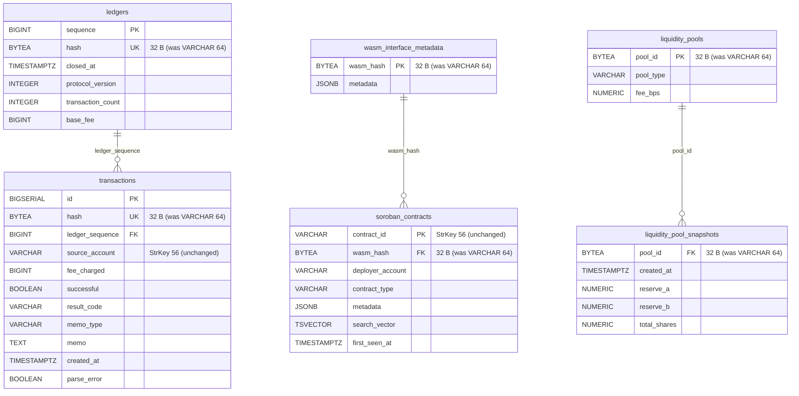

# ADR 0024: Hashes and pool IDs stored as BYTEA(32) instead of VARCHAR(64) hex

**Related:**

- ADR 0011 — S3 offload / lightweight bridge DB schema (size budget framing)
- ADR 0019 — Schema snapshot and sizing at 11M ledgers (sizing baseline)
- ADR 0020 — `transaction_participants` cut + soroban index cut (prior size-win)
- ADR 0023 — Tokens typed metadata columns (latest cumulative schema)

---

## Context

Every hash-derived identifier in the current schema is stored as `VARCHAR(64)`, i.e. lowercase-hex ASCII of a 32-byte SHA-256 (or SHA-256-like) digest. Verified against live DB:

```sql
SELECT hash, length(hash) FROM ledgers LIMIT 3;
-- a2b1d767f934484d5ac7a792ae3b1b49acba3b3016e479021addf291712b95c4 | 64
```

Affected columns (live DB + `crates/db/migrations/`):

| Table                      | Column      | Constraint                    | Source migration |
| -------------------------- | ----------- | ----------------------------- | ---------------- |
| `ledgers`                  | `hash`      | `NOT NULL UNIQUE`             | 0001             |
| `transactions`             | `hash`      | `NOT NULL UNIQUE`             | 0001             |
| `soroban_contracts`        | `wasm_hash` | nullable, indexed (mig. 0008) | 0003             |
| `wasm_interface_metadata`  | `wasm_hash` | `PRIMARY KEY`                 | 0009             |
| `liquidity_pools`          | `pool_id`   | `PRIMARY KEY`                 | 0006             |
| `liquidity_pool_snapshots` | `pool_id`   | `NOT NULL REFERENCES`         | 0006             |

All six values are 32 bytes of binary data that happen to be rendered as 64 hex chars by convention. Storing the hex text costs:

- **Value itself:** 64 bytes payload + 1 B VARLENA header (≤ 126 B) → **65 B per row**.
- **Binary equivalent:** 32 bytes payload + 1 B VARLENA header → **33 B per row** (~49% smaller).
- **B-tree indexes** on these columns mirror the same ratio.

Stellar ledgers hash / tx hash / WASM hash / pool ID are all pure 256-bit digests — no prefix byte, no CRC, no StrKey framing. Conversion is lossless hex ↔ bytes.

The bridge is already pressured for size (ADR 0011 target: keep DB lightweight, push heavy payloads to S3). Hash columns appear in the highest-row-count tables (`transactions.hash`, `liquidity_pool_snapshots.pool_id`) and are mandatory indexes — they are the most compelling targets once `transaction_participants.role` was cut in ADR 0020.

---

## Decision

Migrate the six columns above from `VARCHAR(64)` to `BYTEA` with a `length = 32` CHECK.

### Target DDL

```sql
-- ledgers
ALTER TABLE ledgers
  ALTER COLUMN hash TYPE BYTEA USING decode(hash, 'hex'),
  ADD CONSTRAINT ck_ledgers_hash_len CHECK (octet_length(hash) = 32);

-- transactions
ALTER TABLE transactions
  ALTER COLUMN hash TYPE BYTEA USING decode(hash, 'hex'),
  ADD CONSTRAINT ck_transactions_hash_len CHECK (octet_length(hash) = 32);

-- soroban_contracts
ALTER TABLE soroban_contracts
  ALTER COLUMN wasm_hash TYPE BYTEA USING decode(wasm_hash, 'hex'),
  ADD CONSTRAINT ck_soroban_contracts_wasm_hash_len
    CHECK (wasm_hash IS NULL OR octet_length(wasm_hash) = 32);

-- wasm_interface_metadata (PRIMARY KEY — FK from soroban_contracts.wasm_hash must be compatible)
ALTER TABLE wasm_interface_metadata
  ALTER COLUMN wasm_hash TYPE BYTEA USING decode(wasm_hash, 'hex'),
  ADD CONSTRAINT ck_wim_wasm_hash_len CHECK (octet_length(wasm_hash) = 32);

-- liquidity_pools (PRIMARY KEY)
ALTER TABLE liquidity_pools
  ALTER COLUMN pool_id TYPE BYTEA USING decode(pool_id, 'hex'),
  ADD CONSTRAINT ck_liquidity_pools_pool_id_len CHECK (octet_length(pool_id) = 32);

-- liquidity_pool_snapshots (FK + partitioned parent)
ALTER TABLE liquidity_pool_snapshots
  ALTER COLUMN pool_id TYPE BYTEA USING decode(pool_id, 'hex'),
  ADD CONSTRAINT ck_lps_pool_id_len CHECK (octet_length(pool_id) = 32);
```

Applied in a **new migration `0010_hashes_to_bytea.sql`** as part of the same transaction as the follow-up column backfill and FK revalidation.

### Rust domain layer

- Change struct fields from `String` / `Option<String>` to `[u8; 32]` / `Option<[u8; 32]>` (or `bytes::Bytes` where zero-copy matters).
- sqlx decoding: `BYTEA → Vec<u8>` natively; add a thin newtype `Hash32([u8; 32])` with `TryFrom<&[u8]>` that enforces length.
- JSON serialization: `Hash32` `Serialize` as lowercase hex (`hex::encode`) — preserves the wire format for all 22 REST endpoints (no frontend change).
- JSON deserialization: `Hash32` `Deserialize` from hex string — preserves all existing query parameter paths (`/transactions/{hash}`).

### API surface

**Zero change.** Endpoints continue to accept and return lowercase hex strings. Conversion happens in serde, not in the database.

---

## Rationale

1. **50% per-row storage cut** on columns that appear in some of the biggest tables. At 11M ledgers with ~100 tx each:

   - `transactions.hash`: 1.1B × 32 B saved ≈ **33 GB** on the column alone, plus ~16 GB on its unique index.
   - `liquidity_pool_snapshots.pool_id`: partitioned, 1 row per (pool × day), smaller but meaningful.
   - Total conservative estimate across all six columns + indexes: **45–60 GB saved**, on top of the ~260 GB cut in ADR 0020.

2. **No display/codec asymmetry.** Unlike StrKey-encoded account/contract IDs (ADR drafting pending — rejected here), hashes have one canonical textual form (lowercase hex). Conversion is bidirectional, deterministic, and branch-free. A 4-line `hex::encode`/`hex::decode` pair handles the whole system boundary.

3. **Indexes shrink in lockstep.** B-tree on 32 bytes vs 64 bytes halves the index footprint AND halves the comparison cost on every lookup — `/transactions/{hash}` and wasm-hash joins both benefit.

4. **FK integrity preserved.** `soroban_contracts.wasm_hash → wasm_interface_metadata.wasm_hash` and `liquidity_pool_snapshots.pool_id → liquidity_pools.pool_id` stay typed identically (both sides become `BYTEA`).

5. **StrKey IDs (`account_id`, `contract_id`, `issuer_address`, …) explicitly OUT OF SCOPE.** Those carry a version byte + CRC16 framing and render as `G…`/`C…`. Their migration would require StrKey codec at every boundary (including psql debug) for marginal incremental gain. Keeping them as `VARCHAR(56)` preserves developer ergonomics.

---

## Alternatives Considered

### Alternative 1: Keep `VARCHAR(64)`

**Description:** Do nothing. Rely on TOAST compression and accept the 2× storage cost.

**Pros:**

- Zero migration risk.
- `psql` output stays human-readable (`hash` shows plain hex).
- Consistent with Horizon's schema choice.

**Cons:**

- Leaves ~45–60 GB on the table at 11M-ledger scale.
- Indexes also 2× larger → slower lookups, more cache pressure.
- Inconsistent with the ADR 0011 "lightweight bridge" mandate.

**Decision:** REJECTED — we've already cut the easy wins (ADR 0020); hash columns are the next rational target.

### Alternative 2: `BYTEA` without fixed-length CHECK

**Description:** Convert to `BYTEA` but allow variable length.

**Pros:**

- Slightly simpler migration (no CHECK).

**Cons:**

- Loses the invariant enforcement — a bug could insert a 16-byte or 48-byte value silently.
- Application code already assumes 32 bytes; DB should mirror that.

**Decision:** REJECTED — the CHECK is cheap and the invariant is meaningful.

### Alternative 3: `CHAR(32)` (fixed-width, still textual)

**Description:** Shrink VARCHAR(64) to CHAR(32) by storing a shorter encoding (e.g. base64 without padding, ~43 chars — doesn't fit 32).

**Pros:**

- Still textual, debuggable in psql.

**Cons:**

- Base64 of 32 bytes is 44 chars (with padding) or 43 (without) — no clean fit into 32-char column.
- Base32 needs 52 chars.
- No encoding except binary hits 32 storage bytes, and at that point we may as well use `BYTEA`.

**Decision:** REJECTED — no textual encoding of 32 bytes fits in ≤32 chars.

### Alternative 4: Postgres `uuid` or two `BIGINT` halves

**Description:** Treat the 32-byte hash as two 128-bit halves or four 64-bit words.

**Pros:**

- Fixed-width numeric types, 16 B × 2 = 32 B (same as BYTEA).

**Cons:**

- No semantic fit — these aren't UUIDs and aren't numbers that anyone adds or compares ordinally.
- Application code gains complexity for zero benefit vs BYTEA.
- `uuid` is 128 bits — would need two columns per hash, breaking PK shape.

**Decision:** REJECTED — BYTEA is the idiomatic Postgres answer for fixed-length binary.

---

## Consequences

### Positive

- ~45–60 GB saved at 11M-ledger projection (columns + indexes).
- Faster B-tree lookups on hash point queries (half the bytes compared).
- Migration is self-contained — no touch to 22 REST endpoints' JSON contracts.
- Clean invariant (`CHECK octet_length = 32`) pushes shape enforcement into the DB.

### Negative

- One-time migration cost: `ALTER TABLE ... USING decode(...)` rewrites the affected tables. Coordinate during a maintenance window while live ledger count is still low.
- `psql` shows `\x<hex>` prefix on BYTEA — slight cosmetic change; hex is still legible.
- Any ad-hoc SQL that compares hash to a string literal must switch to `decode('…', 'hex')` or `'\x…'::bytea`. Caught by migrating application code first and lint-reviewing `crates/db/src/**`.
- Rust code touching these columns must move from `String` to `[u8; 32]`/`Hash32` newtype (bounded blast radius: `crates/domain`, `crates/db`, `crates/xdr-parser`, REST handlers). serde boundary keeps the wire format identical.

### Follow-ups (separate tasks)

- Task: implement `0010_hashes_to_bytea.sql` migration + Rust `Hash32` newtype + sqlx wiring.
- Task: audit all literal hash strings in `crates/db/src/**` and rewrite with `decode(...)` / typed bindings.
- ADR candidate (later): same treatment for enum-like columns (`memo_type`, `result_code`, `event_type`, `asset_type`, `contract_type`) → `SMALLINT` or PG `ENUM`. Estimated ~5–10 GB extra, smaller refactor.
- Explicitly NOT done here: StrKey-encoded IDs remain `VARCHAR(56)`.

---

## Schema snapshot after ADR 0024



Unchanged tables (omitted for brevity): `accounts`, `operations`, `soroban_events`, `soroban_invocations`, `tokens`, `nfts`, `transaction_participants`. None of them own a hash-derived column; StrKey IDs stay `VARCHAR(56)`.

---

## References

- ADR 0011 — S3 offload / lightweight bridge DB schema
- ADR 0019 — Schema snapshot and sizing at 11M ledgers
- ADR 0020 — `transaction_participants` role drop + `idx_contracts_deployer` cut
- Stellar SEP-23 — StrKey encoding (explains why account/contract IDs stay text)
- PostgreSQL `BYTEA` docs — https://www.postgresql.org/docs/current/datatype-binary.html
