# ADR 0025: Final schema and endpoint realizability proof (post ADR 0011–0024)

**Related:**

- ADR 0011 — S3 offload / lightweight bridge model
- ADR 0018 — Minimal transactions/operations; XDR to S3
- ADR 0019 — Schema snapshot + 11M-ledger sizing baseline
- ADR 0020 — `transaction_participants` cut to 3 cols; `idx_contracts_deployer` drop
- ADR 0021 — Schema ↔ endpoint ↔ frontend coverage matrix
- ADR 0022 — Schema correction + token metadata enrichment (fixes E9 / E12)
- ADR 0023 — Tokens typed metadata columns (refines 0022 Part 3)
- ADR 0024 — Hashes as `BYTEA(32)`

---

## Status

`proposed` — **verification snapshot**, not a new decision. Captures the
frozen, ready-to-build schema after the corrective chain
ADR 0022 → 0023 → 0024 and proves endpoint realizability end-to-end.

Replaces ADR 0021 as the reference document; ADR 0021 stands historically.

---

## Part I — Final schema (18 logical tables)

### Table inventory

|  #  | Table                      |  Partitioned  | Purpose                                                 | Source ADRs |
| :-: | -------------------------- | :-----------: | ------------------------------------------------------- | :---------: |
|  1  | `ledgers`                  |      no       | Chain head / history anchor                             | 0011, 0024  |
|  2  | `accounts`                 |      no       | Account identity + seen-range                           |    0013     |
|  3  | `transactions`             | yes (monthly) | Minimal tx row, XDR offloaded                           | 0018, 0024  |
|  4  | `transaction_hash_index`   |      no       | Global hash-lookup table                                | 0015, 0024  |
|  5  | `operations`               | yes (monthly) | Per-op slim columns                                     |    0018     |
|  6  | `transaction_participants` | yes (monthly) | 3-col `(account, tx)` edge                              |    0020     |
|  7  | `soroban_contracts`        |      no       | Contract identity + classification + metadata           | 0014, 0022  |
|  8  | `wasm_interface_metadata`  |      no       | ABI `{functions[], wasm_byte_len}` keyed by `wasm_hash` | 0022, 0024  |
|  9  | `soroban_events`           | yes (monthly) | Typed transfer prefix; full topics to S3                |    0018     |
| 10  | `soroban_invocations`      | yes (monthly) | Caller / function / status                              |    0014     |
| 11  | `tokens`                   |      no       | Canonical token registry with typed SEP-1 metadata      | 0022, 0023  |
| 12  | `nfts`                     |      no       | NFT identity + current owner; JSONB for traits          |    0014     |
| 13  | `nft_ownership`            | yes (monthly) | NFT ownership history                                   |    0014     |
| 14  | `liquidity_pools`          |      no       | Pool identity + assets + fee                            | 0014, 0024  |
| 15  | `liquidity_pool_snapshots` | yes (monthly) | Per-ledger pool state + derived TVL/vol/fee             | 0014, 0024  |
| 16  | `lp_positions`             |      no       | Current LP shares per (pool, account)                   |    0014     |
| 17  | `account_balances_current` |      no       | Current balance per (account, asset)                    |    0013     |
| 18  | `account_balance_history`  | yes (monthly) | Balance snapshot per (account, ledger, asset)           |    0013     |

### Full DDL reference

The DDL below consolidates every corrective ADR. **Bold annotations** mark
changes introduced between ADR 0019 (original snapshot) and ADR 0024
(latest).

#### 1. `ledgers`

```sql
CREATE TABLE ledgers (
    sequence          BIGINT      PRIMARY KEY,
    hash              BYTEA       NOT NULL UNIQUE,       -- ADR 0024: was VARCHAR(64)
    closed_at         TIMESTAMPTZ NOT NULL,
    protocol_version  INTEGER     NOT NULL,
    transaction_count INTEGER     NOT NULL,
    base_fee          BIGINT      NOT NULL,
    CONSTRAINT ck_ledgers_hash_len CHECK (octet_length(hash) = 32)
);
CREATE INDEX idx_ledgers_closed_at ON ledgers (closed_at DESC);
```

#### 2. `accounts`

```sql
CREATE TABLE accounts (
    account_id        VARCHAR(56) PRIMARY KEY,
    first_seen_ledger BIGINT      NOT NULL,
    last_seen_ledger  BIGINT      NOT NULL,
    sequence_number   BIGINT      NOT NULL,
    home_domain       VARCHAR(256)
);
CREATE INDEX idx_accounts_last_seen ON accounts (last_seen_ledger DESC);
CREATE INDEX idx_accounts_prefix    ON accounts (account_id text_pattern_ops);
```

#### 3. `transactions`

```sql
CREATE TABLE transactions (
    id                BIGSERIAL   NOT NULL,
    hash              BYTEA       NOT NULL,              -- ADR 0024: was VARCHAR(64)
    ledger_sequence   BIGINT      NOT NULL,
    application_order SMALLINT    NOT NULL,
    source_account    VARCHAR(56) NOT NULL REFERENCES accounts(account_id),
    fee_charged       BIGINT      NOT NULL,
    inner_tx_hash     BYTEA,                             -- ADR 0024: was VARCHAR(64); fee-bump signal
    successful        BOOLEAN     NOT NULL,
    operation_count   SMALLINT    NOT NULL,
    has_soroban       BOOLEAN     NOT NULL DEFAULT false,
    parse_error       BOOLEAN     NOT NULL DEFAULT false,
    created_at        TIMESTAMPTZ NOT NULL,
    PRIMARY KEY (id, created_at),
    CONSTRAINT ck_transactions_hash_len       CHECK (octet_length(hash) = 32),
    CONSTRAINT ck_transactions_inner_hash_len CHECK (inner_tx_hash IS NULL OR octet_length(inner_tx_hash) = 32)
) PARTITION BY RANGE (created_at);

CREATE INDEX idx_tx_source_created ON transactions (source_account, created_at DESC);
CREATE INDEX idx_tx_ledger         ON transactions (ledger_sequence);
CREATE INDEX idx_tx_has_soroban    ON transactions (created_at DESC) WHERE has_soroban;
```

> **XDR fields (`envelope_xdr`, `result_xdr`, `result_meta_xdr`, `memo`, `memo_type`, `operation_tree`) are NOT on this table** — offloaded to `parsed_ledger_{N}.json` per ADR 0018.

#### 4. `transaction_hash_index`

```sql
CREATE TABLE transaction_hash_index (
    hash            BYTEA       PRIMARY KEY,             -- ADR 0024: was VARCHAR(64)
    ledger_sequence BIGINT      NOT NULL,
    created_at      TIMESTAMPTZ NOT NULL,
    CONSTRAINT ck_thi_hash_len CHECK (octet_length(hash) = 32)
);
```

#### 5. `operations`

```sql
CREATE TABLE operations (
    id                BIGSERIAL    NOT NULL,
    transaction_id    BIGINT       NOT NULL,
    application_order SMALLINT     NOT NULL,
    type              VARCHAR(50)  NOT NULL,
    source_account    VARCHAR(56),
    destination       VARCHAR(56)  REFERENCES accounts(account_id),
    contract_id       VARCHAR(56)  REFERENCES soroban_contracts(contract_id),
    asset_code        VARCHAR(12),
    asset_issuer      VARCHAR(56)  REFERENCES accounts(account_id),
    pool_id           BYTEA        REFERENCES liquidity_pools(pool_id),  -- ADR 0024
    transfer_amount   NUMERIC(28,7),
    ledger_sequence   BIGINT       NOT NULL,
    created_at        TIMESTAMPTZ  NOT NULL,
    PRIMARY KEY (id, created_at),
    FOREIGN KEY (transaction_id, created_at)
        REFERENCES transactions (id, created_at) ON DELETE CASCADE,
    CONSTRAINT ck_ops_pool_id_len CHECK (pool_id IS NULL OR octet_length(pool_id) = 32)
) PARTITION BY RANGE (created_at);

CREATE INDEX idx_ops_tx          ON operations (transaction_id);
CREATE INDEX idx_ops_type        ON operations (type, created_at DESC);
CREATE INDEX idx_ops_contract    ON operations (contract_id, created_at DESC)
    WHERE contract_id IS NOT NULL;
CREATE INDEX idx_ops_asset       ON operations (asset_code, asset_issuer, created_at DESC)
    WHERE asset_code IS NOT NULL;
CREATE INDEX idx_ops_pool        ON operations (pool_id, created_at DESC)
    WHERE pool_id IS NOT NULL;
CREATE INDEX idx_ops_destination ON operations (destination, created_at DESC)
    WHERE destination IS NOT NULL;
```

#### 6. `transaction_participants` **(ADR 0020 — cut to 3 cols)**

```sql
CREATE TABLE transaction_participants (
    transaction_id BIGINT      NOT NULL,
    account_id     VARCHAR(56) NOT NULL REFERENCES accounts(account_id),
    created_at     TIMESTAMPTZ NOT NULL,
    PRIMARY KEY (account_id, created_at, transaction_id),
    FOREIGN KEY (transaction_id, created_at)
        REFERENCES transactions (id, created_at) ON DELETE CASCADE
) PARTITION BY RANGE (created_at);

CREATE INDEX idx_tp_tx ON transaction_participants (transaction_id);
```

> Columns dropped vs ADR 0019: `role`, `ledger_sequence` (see ADR 0020).

#### 7. `soroban_contracts` **(ADR 0022 corrected shape)**

```sql
CREATE TABLE soroban_contracts (
    contract_id             VARCHAR(56) PRIMARY KEY,
    wasm_hash               BYTEA       REFERENCES wasm_interface_metadata(wasm_hash),  -- ADR 0024
    wasm_uploaded_at_ledger BIGINT,
    deployer_account        VARCHAR(56) REFERENCES accounts(account_id),
    deployed_at_ledger      BIGINT,
    contract_type           VARCHAR(50),      -- 'nft' | 'fungible' | 'token' | 'other'
    is_sac                  BOOLEAN     NOT NULL DEFAULT false,
    metadata                JSONB,            -- ADR 0022: restored — holds contract-level accumulated metadata
    search_vector           TSVECTOR GENERATED ALWAYS AS (
        to_tsvector('simple', COALESCE(metadata->>'name', '') || ' ' || contract_id)
    ) STORED,
    CONSTRAINT ck_sc_wasm_hash_len CHECK (wasm_hash IS NULL OR octet_length(wasm_hash) = 32)
);
CREATE INDEX idx_contracts_type   ON soroban_contracts (contract_type);
CREATE INDEX idx_contracts_wasm   ON soroban_contracts (wasm_hash)
    WHERE wasm_hash IS NOT NULL;
CREATE INDEX idx_contracts_search ON soroban_contracts USING GIN (search_vector);
CREATE INDEX idx_contracts_prefix ON soroban_contracts (contract_id text_pattern_ops);
-- idx_contracts_deployer: DROPPED by ADR 0020
```

#### 8. `wasm_interface_metadata` **(ADR 0022 corrected to 2-col shape)**

```sql
CREATE TABLE wasm_interface_metadata (
    wasm_hash BYTEA PRIMARY KEY,                                -- ADR 0024
    metadata  JSONB NOT NULL,  -- {functions: [{name, params[], returns}], wasm_byte_len}
    CONSTRAINT ck_wim_hash_len CHECK (octet_length(wasm_hash) = 32)
);
```

> E12 (`GET /contracts/:id/interface`) consumes `metadata -> 'functions'`.
> No `abi` column needed — ADR 0022 resolved that blocker.

#### 9. `soroban_events`

```sql
CREATE TABLE soroban_events (
    id              BIGSERIAL    NOT NULL,
    transaction_id  BIGINT       NOT NULL,
    contract_id     VARCHAR(56)  REFERENCES soroban_contracts(contract_id),
    event_type      VARCHAR(20)  NOT NULL,
    topic0          TEXT,                                  -- typed prefix, e.g. 'sym:transfer'
    event_index     SMALLINT     NOT NULL,
    transfer_from   VARCHAR(56),                           -- ADR 0018
    transfer_to     VARCHAR(56),                           -- ADR 0018
    transfer_amount NUMERIC(39,0),                         -- ADR 0018: i128-capable
    ledger_sequence BIGINT       NOT NULL,
    created_at      TIMESTAMPTZ  NOT NULL,
    PRIMARY KEY (id, created_at),
    FOREIGN KEY (transaction_id, created_at)
        REFERENCES transactions (id, created_at) ON DELETE CASCADE
) PARTITION BY RANGE (created_at);

CREATE INDEX idx_events_contract ON soroban_events (contract_id, created_at DESC);
CREATE INDEX idx_events_transfer_from ON soroban_events (transfer_from, created_at DESC)
    WHERE transfer_from IS NOT NULL;
CREATE INDEX idx_events_transfer_to   ON soroban_events (transfer_to, created_at DESC)
    WHERE transfer_to IS NOT NULL;
```

> Full `topics[1..N]` and raw `data` stay in S3.

#### 10. `soroban_invocations`

```sql
CREATE TABLE soroban_invocations (
    id               BIGSERIAL    NOT NULL,
    transaction_id   BIGINT       NOT NULL,
    contract_id      VARCHAR(56)  REFERENCES soroban_contracts(contract_id),
    caller_account   VARCHAR(56)  REFERENCES accounts(account_id),
    function_name    VARCHAR(100) NOT NULL,
    successful       BOOLEAN      NOT NULL,
    invocation_index SMALLINT     NOT NULL,
    ledger_sequence  BIGINT       NOT NULL,
    created_at       TIMESTAMPTZ  NOT NULL,
    PRIMARY KEY (id, created_at),
    FOREIGN KEY (transaction_id, created_at)
        REFERENCES transactions (id, created_at) ON DELETE CASCADE
) PARTITION BY RANGE (created_at);

CREATE INDEX idx_inv_contract ON soroban_invocations (contract_id, created_at DESC);
CREATE INDEX idx_inv_caller   ON soroban_invocations (caller_account, created_at DESC);
```

> Full `args` / `return_value` / call tree stay in S3.

#### 11. `tokens` **(ADR 0023 authoritative)**

```sql
CREATE TABLE tokens (
    id              SERIAL        PRIMARY KEY,
    asset_type      VARCHAR(20)   NOT NULL,
    asset_code      VARCHAR(12),
    issuer_address  VARCHAR(56)   REFERENCES accounts(account_id),
    contract_id     VARCHAR(56)   REFERENCES soroban_contracts(contract_id),
    name            VARCHAR(256),
    total_supply    NUMERIC(28,7),                -- denormalized; task 0135
    holder_count    INTEGER,                      -- denormalized; task 0135
    description     TEXT,                         -- ADR 0023
    icon_url        VARCHAR(1024),                -- ADR 0023
    home_page       VARCHAR(256),                 -- ADR 0023
    CONSTRAINT ck_tokens_asset_type CHECK (
        asset_type IN ('native', 'classic', 'sac', 'soroban')
    )
);
CREATE UNIQUE INDEX uidx_tokens_classic_asset ON tokens (asset_code, issuer_address)
    WHERE asset_type IN ('classic', 'sac');
CREATE UNIQUE INDEX uidx_tokens_soroban ON tokens (contract_id)
    WHERE asset_type IN ('soroban', 'sac');
CREATE INDEX idx_tokens_type      ON tokens (asset_type);
CREATE INDEX idx_tokens_code_trgm ON tokens USING GIN (asset_code gin_trgm_ops);
```

> Speculative ADR 0019 columns (`decimals`, `metadata_ledger`, `search_vector`)
> are NOT on this table — removed by ADR 0022/0023. Enrichment worker
> writes `description`/`icon_url`/`home_page` directly.

#### 12. `nfts`

```sql
CREATE TABLE nfts (
    id                   SERIAL       PRIMARY KEY,
    contract_id          VARCHAR(56)  NOT NULL REFERENCES soroban_contracts(contract_id),
    token_id             VARCHAR(256) NOT NULL,
    collection_name      VARCHAR(256),
    name                 VARCHAR(256),
    media_url            TEXT,
    metadata             JSONB,                             -- per-NFT traits (variable shape — legit JSONB)
    minted_at_ledger     BIGINT,
    current_owner        VARCHAR(56) REFERENCES accounts(account_id),
    current_owner_ledger BIGINT,
    UNIQUE (contract_id, token_id)
);
CREATE INDEX idx_nfts_collection ON nfts (collection_name);
CREATE INDEX idx_nfts_owner      ON nfts (current_owner);
CREATE INDEX idx_nfts_name_trgm  ON nfts USING GIN (name gin_trgm_ops);
```

#### 13. `nft_ownership`

```sql
CREATE TABLE nft_ownership (
    nft_id          INTEGER      NOT NULL REFERENCES nfts(id) ON DELETE CASCADE,
    transaction_id  BIGINT       NOT NULL,
    owner_account   VARCHAR(56)  REFERENCES accounts(account_id),
    event_type      VARCHAR(20)  NOT NULL,                  -- 'mint' | 'transfer' | 'burn'
    ledger_sequence BIGINT       NOT NULL,
    event_order     SMALLINT     NOT NULL,
    created_at      TIMESTAMPTZ  NOT NULL,
    PRIMARY KEY (nft_id, created_at, ledger_sequence, event_order),
    FOREIGN KEY (transaction_id, created_at)
        REFERENCES transactions (id, created_at) ON DELETE CASCADE
) PARTITION BY RANGE (created_at);
```

#### 14. `liquidity_pools`

```sql
CREATE TABLE liquidity_pools (
    pool_id           BYTEA       PRIMARY KEY,               -- ADR 0024
    asset_a_type      VARCHAR(20) NOT NULL,
    asset_a_code      VARCHAR(12),
    asset_a_issuer    VARCHAR(56) REFERENCES accounts(account_id),
    asset_b_type      VARCHAR(20) NOT NULL,
    asset_b_code      VARCHAR(12),
    asset_b_issuer    VARCHAR(56) REFERENCES accounts(account_id),
    fee_bps           INTEGER     NOT NULL,
    created_at_ledger BIGINT      NOT NULL,
    CONSTRAINT ck_lp_pool_id_len CHECK (octet_length(pool_id) = 32)
);
CREATE INDEX idx_pools_asset_a ON liquidity_pools (asset_a_code, asset_a_issuer);
CREATE INDEX idx_pools_asset_b ON liquidity_pools (asset_b_code, asset_b_issuer);
CREATE INDEX idx_pools_prefix  ON liquidity_pools (pool_id);
```

#### 15. `liquidity_pool_snapshots`

```sql
CREATE TABLE liquidity_pool_snapshots (
    id              BIGSERIAL    NOT NULL,
    pool_id         BYTEA        NOT NULL REFERENCES liquidity_pools(pool_id),  -- ADR 0024
    ledger_sequence BIGINT       NOT NULL,
    reserve_a       NUMERIC(28,7) NOT NULL,
    reserve_b       NUMERIC(28,7) NOT NULL,
    total_shares    NUMERIC(28,7) NOT NULL,
    tvl             NUMERIC(28,7),
    volume          NUMERIC(28,7),
    fee_revenue     NUMERIC(28,7),
    created_at      TIMESTAMPTZ  NOT NULL,
    PRIMARY KEY (id, created_at),
    CONSTRAINT ck_lps_pool_id_len CHECK (octet_length(pool_id) = 32)
) PARTITION BY RANGE (created_at);

CREATE INDEX idx_lps_pool ON liquidity_pool_snapshots (pool_id, created_at DESC);
CREATE INDEX idx_lps_tvl  ON liquidity_pool_snapshots (tvl DESC) WHERE tvl IS NOT NULL;
```

#### 16. `lp_positions`

```sql
CREATE TABLE lp_positions (
    pool_id              BYTEA        NOT NULL REFERENCES liquidity_pools(pool_id),  -- ADR 0024
    account_id           VARCHAR(56)  NOT NULL REFERENCES accounts(account_id),
    shares               NUMERIC(28,7) NOT NULL,
    first_deposit_ledger BIGINT        NOT NULL,
    last_updated_ledger  BIGINT        NOT NULL,
    PRIMARY KEY (pool_id, account_id),
    CONSTRAINT ck_lpp_pool_id_len CHECK (octet_length(pool_id) = 32)
);
CREATE INDEX idx_lpp_shares ON lp_positions (pool_id, shares DESC) WHERE shares > 0;
```

#### 17. `account_balances_current`

```sql
CREATE TABLE account_balances_current (
    account_id          VARCHAR(56)   NOT NULL REFERENCES accounts(account_id),
    asset_type          VARCHAR(20)   NOT NULL,
    asset_code          VARCHAR(12)   NOT NULL DEFAULT '',
    issuer              VARCHAR(56)   NOT NULL DEFAULT '',
    balance             NUMERIC(28,7) NOT NULL,
    last_updated_ledger BIGINT        NOT NULL,
    PRIMARY KEY (account_id, asset_type, asset_code, issuer)
);
CREATE INDEX idx_balances_asset ON account_balances_current (asset_type, asset_code, issuer);
```

#### 18. `account_balance_history`

```sql
CREATE TABLE account_balance_history (
    account_id      VARCHAR(56)   NOT NULL REFERENCES accounts(account_id),
    ledger_sequence BIGINT        NOT NULL,
    asset_type      VARCHAR(20)   NOT NULL,
    asset_code      VARCHAR(12)   NOT NULL DEFAULT '',
    issuer          VARCHAR(56)   NOT NULL DEFAULT '',
    balance         NUMERIC(28,7) NOT NULL,
    created_at      TIMESTAMPTZ   NOT NULL,
    PRIMARY KEY (account_id, ledger_sequence, asset_type, asset_code, issuer, created_at)
) PARTITION BY RANGE (created_at);
```

---

## Part II — Per-column breakdown

Each row: **T** = type, **N** = nullable, **Source** = who writes it, **Notes**.

### `ledgers`

| Column              | T           |  N  | Source | Notes                                  |
| ------------------- | ----------- | :-: | ------ | -------------------------------------- |
| `sequence`          | BIGINT      |  —  | ingest | PK, monotonic                          |
| `hash`              | BYTEA(32)   |  —  | ingest | UK, `CHECK octet_length=32` (ADR 0024) |
| `closed_at`         | TIMESTAMPTZ |  —  | ingest | `idx_ledgers_closed_at`                |
| `protocol_version`  | INTEGER     |  —  | ingest | —                                      |
| `transaction_count` | INTEGER     |  —  | ingest | summary                                |
| `base_fee`          | BIGINT      |  —  | ingest | stroops                                |

### `accounts`

| Column              | T            |  N  | Source | Notes                    |
| ------------------- | ------------ | :-: | ------ | ------------------------ |
| `account_id`        | VARCHAR(56)  |  —  | ingest | PK, StrKey `G…`          |
| `first_seen_ledger` | BIGINT       |  —  | ingest | watermark                |
| `last_seen_ledger`  | BIGINT       |  —  | ingest | watermark                |
| `sequence_number`   | BIGINT       |  —  | ingest | account seq              |
| `home_domain`       | VARCHAR(256) |  ✓  | ingest | from tx `set_options` op |

### `transactions`

| Column              | T           |  N  | Source | Notes                                   |
| ------------------- | ----------- | :-: | ------ | --------------------------------------- |
| `id`                | BIGSERIAL   |  —  | ingest | part of composite PK `(id, created_at)` |
| `hash`              | BYTEA(32)   |  —  | ingest | ADR 0024                                |
| `ledger_sequence`   | BIGINT      |  —  | ingest | S3 bridge key                           |
| `application_order` | SMALLINT    |  —  | ingest | ledger-internal ordering                |
| `source_account`    | VARCHAR(56) |  —  | ingest | FK → `accounts`                         |
| `fee_charged`       | BIGINT      |  —  | ingest | stroops                                 |
| `inner_tx_hash`     | BYTEA(32)   |  ✓  | ingest | fee-bump outer-tx signal                |
| `successful`        | BOOLEAN     |  —  | ingest | —                                       |
| `operation_count`   | SMALLINT    |  —  | ingest | summary                                 |
| `has_soroban`       | BOOLEAN     |  —  | ingest | fast-path partial-index                 |
| `parse_error`       | BOOLEAN     |  —  | ingest | ADR 0018                                |
| `created_at`        | TIMESTAMPTZ |  —  | ingest | partition key                           |

> XDR, memo, op tree → S3 only (ADR 0018).

### `transaction_hash_index`

| Column            | T           |  N  | Source | Notes                                      |
| ----------------- | ----------- | :-: | ------ | ------------------------------------------ |
| `hash`            | BYTEA(32)   |  —  | ingest | PK; E3 lookup gateway (ADR 0016 fail-fast) |
| `ledger_sequence` | BIGINT      |  —  | ingest | bridge to S3                               |
| `created_at`      | TIMESTAMPTZ |  —  | ingest | routes to tx partition                     |

### `operations`

| Column              | T             |  N  | Source | Notes                                      |
| ------------------- | ------------- | :-: | ------ | ------------------------------------------ |
| `id`                | BIGSERIAL     |  —  | ingest | composite PK                               |
| `transaction_id`    | BIGINT        |  —  | ingest | composite FK → `transactions`              |
| `application_order` | SMALLINT      |  —  | ingest | per-tx op order                            |
| `type`              | VARCHAR(50)   |  —  | ingest | op type (payment, invoke_host_function, …) |
| `source_account`    | VARCHAR(56)   |  ✓  | ingest | muxed source                               |
| `destination`       | VARCHAR(56)   |  ✓  | ingest | payment dest                               |
| `contract_id`       | VARCHAR(56)   |  ✓  | ingest | Soroban ops                                |
| `asset_code`        | VARCHAR(12)   |  ✓  | ingest | classic payments                           |
| `asset_issuer`      | VARCHAR(56)   |  ✓  | ingest | classic payments                           |
| `pool_id`           | BYTEA(32)     |  ✓  | ingest | LP ops (ADR 0024)                          |
| `transfer_amount`   | NUMERIC(28,7) |  ✓  | ingest | ADR 0018; XLM scale                        |
| `ledger_sequence`   | BIGINT        |  —  | ingest | S3 bridge                                  |
| `created_at`        | TIMESTAMPTZ   |  —  | ingest | partition key                              |

### `transaction_participants`

| Column           | T           |  N  | Source | Notes                                                                              |
| ---------------- | ----------- | :-: | ------ | ---------------------------------------------------------------------------------- |
| `transaction_id` | BIGINT      |  —  | ingest | composite FK                                                                       |
| `account_id`     | VARCHAR(56) |  —  | ingest | union of source/dest/caller/signer/counter/fee-payer — **dedup** per (account, tx) |
| `created_at`     | TIMESTAMPTZ |  —  | ingest | partition key                                                                      |

> ADR 0020: `role` and `ledger_sequence` removed. 3 cols only.

### `soroban_contracts`

| Column                    | T           |  N  | Source                 | Notes                                     |
| ------------------------- | ----------- | :-: | ---------------------- | ----------------------------------------- |
| `contract_id`             | VARCHAR(56) |  —  | ingest                 | PK, StrKey `C…`                           |
| `wasm_hash`               | BYTEA(32)   |  ✓  | ingest                 | FK → `wasm_interface_metadata` (ADR 0024) |
| `wasm_uploaded_at_ledger` | BIGINT      |  ✓  | ingest                 | —                                         |
| `deployer_account`        | VARCHAR(56) |  ✓  | ingest                 | FK → `accounts`                           |
| `deployed_at_ledger`      | BIGINT      |  ✓  | ingest                 | —                                         |
| `contract_type`           | VARCHAR(50) |  ✓  | classifier (task 0118) | `nft`/`fungible`/`token`/`other`          |
| `is_sac`                  | BOOLEAN     |  —  | ingest                 | SAC distinguisher                         |
| `metadata`                | JSONB       |  ✓  | enrichment             | ADR 0022 — per-contract accumulated       |
| `search_vector`           | TSVECTOR    |  —  | generated              | from `metadata.name` + `contract_id`      |

### `wasm_interface_metadata`

| Column      | T         |  N  | Source               | Notes                                                     |
| ----------- | --------- | :-: | -------------------- | --------------------------------------------------------- |
| `wasm_hash` | BYTEA(32) |  —  | ingest               | PK (ADR 0024)                                             |
| `metadata`  | JSONB     |  —  | wasm-analysis worker | `{functions: [{name, params[], returns}], wasm_byte_len}` |

> E12 reads `metadata -> 'functions'`. ADR 0022 closes this blocker.

### `soroban_events`

| Column            | T             |  N  | Source | Notes                              |
| ----------------- | ------------- | :-: | ------ | ---------------------------------- |
| `id`              | BIGSERIAL     |  —  | ingest | composite PK                       |
| `transaction_id`  | BIGINT        |  —  | ingest | composite FK                       |
| `contract_id`     | VARCHAR(56)   |  ✓  | ingest | FK → `soroban_contracts`           |
| `event_type`      | VARCHAR(20)   |  —  | ingest | `contract`/`system`/`diagnostic`   |
| `topic0`          | TEXT          |  ✓  | ingest | typed prefix (e.g. `sym:transfer`) |
| `event_index`     | SMALLINT      |  —  | ingest | per-tx order                       |
| `transfer_from`   | VARCHAR(56)   |  ✓  | ingest | ADR 0018 — transfer events         |
| `transfer_to`     | VARCHAR(56)   |  ✓  | ingest | ADR 0018                           |
| `transfer_amount` | NUMERIC(39,0) |  ✓  | ingest | ADR 0018 — i128-capable            |
| `ledger_sequence` | BIGINT        |  —  | ingest | S3 bridge                          |
| `created_at`      | TIMESTAMPTZ   |  —  | ingest | partition key                      |

### `soroban_invocations`

| Column             | T            |  N  | Source | Notes                    |
| ------------------ | ------------ | :-: | ------ | ------------------------ |
| `id`               | BIGSERIAL    |  —  | ingest | composite PK             |
| `transaction_id`   | BIGINT       |  —  | ingest | composite FK             |
| `contract_id`      | VARCHAR(56)  |  ✓  | ingest | FK → `soroban_contracts` |
| `caller_account`   | VARCHAR(56)  |  ✓  | ingest | FK → `accounts`          |
| `function_name`    | VARCHAR(100) |  —  | ingest | —                        |
| `successful`       | BOOLEAN      |  —  | ingest | —                        |
| `invocation_index` | SMALLINT     |  —  | ingest | per-tx order             |
| `ledger_sequence`  | BIGINT       |  —  | ingest | S3 bridge                |
| `created_at`       | TIMESTAMPTZ  |  —  | ingest | partition key            |

### `tokens`

| Column           | T             |  N  | Source              | Notes                                      |
| ---------------- | ------------- | :-: | ------------------- | ------------------------------------------ |
| `id`             | SERIAL        |  —  | ingest              | PK                                         |
| `asset_type`     | VARCHAR(20)   |  —  | ingest              | CHECK `in (native, classic, sac, soroban)` |
| `asset_code`     | VARCHAR(12)   |  ✓  | ingest              | SEP-11 ASCII                               |
| `issuer_address` | VARCHAR(56)   |  ✓  | ingest              | classic/SAC                                |
| `contract_id`    | VARCHAR(56)   |  ✓  | ingest              | Soroban/SAC                                |
| `name`           | VARCHAR(256)  |  ✓  | ingest / enrichment | SEP-41 `name()`                            |
| `total_supply`   | NUMERIC(28,7) |  ✓  | task 0135           | denormalized                               |
| `holder_count`   | INTEGER       |  ✓  | task 0135           | denormalized                               |
| `description`    | TEXT          |  ✓  | enrichment          | ADR 0023 — SEP-1                           |
| `icon_url`       | VARCHAR(1024) |  ✓  | enrichment          | ADR 0023 — SEP-1 / SEP-41                  |
| `home_page`      | VARCHAR(256)  |  ✓  | enrichment          | ADR 0023                                   |

### `nfts`

| Column                 | T            |  N  | Source     | Notes                                   |
| ---------------------- | ------------ | :-: | ---------- | --------------------------------------- |
| `id`                   | SERIAL       |  —  | ingest     | PK                                      |
| `contract_id`          | VARCHAR(56)  |  —  | ingest     | FK → `soroban_contracts`                |
| `token_id`             | VARCHAR(256) |  —  | ingest     | per-collection ID                       |
| `collection_name`      | VARCHAR(256) |  ✓  | enrichment | —                                       |
| `name`                 | VARCHAR(256) |  ✓  | enrichment | —                                       |
| `media_url`            | TEXT         |  ✓  | enrichment | —                                       |
| `metadata`             | JSONB        |  ✓  | enrichment | **legit JSONB** — variable traits shape |
| `minted_at_ledger`     | BIGINT       |  ✓  | ingest     | —                                       |
| `current_owner`        | VARCHAR(56)  |  ✓  | ingest     | fast-path; history in `nft_ownership`   |
| `current_owner_ledger` | BIGINT       |  ✓  | ingest     | watermark                               |

### `nft_ownership`

| Column            | T           |  N  | Source | Notes                    |
| ----------------- | ----------- | :-: | ------ | ------------------------ |
| `nft_id`          | INTEGER     |  —  | ingest | PK, CASCADE              |
| `transaction_id`  | BIGINT      |  —  | ingest | composite FK             |
| `owner_account`   | VARCHAR(56) |  ✓  | ingest | FK → `accounts`          |
| `event_type`      | VARCHAR(20) |  —  | ingest | `mint`/`transfer`/`burn` |
| `ledger_sequence` | BIGINT      |  —  | ingest | S3 bridge, PK            |
| `event_order`     | SMALLINT    |  —  | ingest | PK                       |
| `created_at`      | TIMESTAMPTZ |  —  | ingest | partition key            |

### `liquidity_pools`

| Column              | T           |  N  | Source | Notes           |
| ------------------- | ----------- | :-: | ------ | --------------- |
| `pool_id`           | BYTEA(32)   |  —  | ingest | PK (ADR 0024)   |
| `asset_a_type`      | VARCHAR(20) |  —  | ingest | —               |
| `asset_a_code`      | VARCHAR(12) |  ✓  | ingest | —               |
| `asset_a_issuer`    | VARCHAR(56) |  ✓  | ingest | FK → `accounts` |
| `asset_b_type`      | VARCHAR(20) |  —  | ingest | —               |
| `asset_b_code`      | VARCHAR(12) |  ✓  | ingest | —               |
| `asset_b_issuer`    | VARCHAR(56) |  ✓  | ingest | FK → `accounts` |
| `fee_bps`           | INTEGER     |  —  | ingest | basis points    |
| `created_at_ledger` | BIGINT      |  —  | ingest | —               |

### `liquidity_pool_snapshots`

| Column            | T             |  N  | Source          | Notes         |
| ----------------- | ------------- | :-: | --------------- | ------------- |
| `id`              | BIGSERIAL     |  —  | ingest          | composite PK  |
| `pool_id`         | BYTEA(32)     |  —  | ingest          | FK (ADR 0024) |
| `ledger_sequence` | BIGINT        |  —  | ingest          | —             |
| `reserve_a`       | NUMERIC(28,7) |  —  | ingest          | —             |
| `reserve_b`       | NUMERIC(28,7) |  —  | ingest          | —             |
| `total_shares`    | NUMERIC(28,7) |  —  | ingest          | —             |
| `tvl`             | NUMERIC(28,7) |  ✓  | ingest / worker | derived       |
| `volume`          | NUMERIC(28,7) |  ✓  | ingest / worker | derived       |
| `fee_revenue`     | NUMERIC(28,7) |  ✓  | ingest / worker | derived       |
| `created_at`      | TIMESTAMPTZ   |  —  | ingest          | partition key |

### `lp_positions`

| Column                 | T             |  N  | Source | Notes         |
| ---------------------- | ------------- | :-: | ------ | ------------- |
| `pool_id`              | BYTEA(32)     |  —  | ingest | PK (ADR 0024) |
| `account_id`           | VARCHAR(56)   |  —  | ingest | PK            |
| `shares`               | NUMERIC(28,7) |  —  | ingest | —             |
| `first_deposit_ledger` | BIGINT        |  —  | ingest | watermark     |
| `last_updated_ledger`  | BIGINT        |  —  | ingest | watermark     |

### `account_balances_current`

| Column                | T             |  N  | Source | Notes           |
| --------------------- | ------------- | :-: | ------ | --------------- |
| `account_id`          | VARCHAR(56)   |  —  | ingest | composite PK    |
| `asset_type`          | VARCHAR(20)   |  —  | ingest | PK              |
| `asset_code`          | VARCHAR(12)   |  —  | ingest | `''` for native |
| `issuer`              | VARCHAR(56)   |  —  | ingest | `''` for native |
| `balance`             | NUMERIC(28,7) |  —  | ingest | —               |
| `last_updated_ledger` | BIGINT        |  —  | ingest | watermark       |

### `account_balance_history`

Same shape as `account_balances_current`, with extra `ledger_sequence` and
`created_at` PK columns; partitioned by `created_at` monthly.

---

## Part III — Endpoint realizability matrix

Every endpoint listed with **(a)** primary DB query skeleton, **(b)** S3
fetch (if any), and **(c)** feasibility verdict.

### E1. `GET /network/stats` → ✅

```sql
SELECT sequence, closed_at FROM ledgers ORDER BY sequence DESC LIMIT 1;
SELECT count(*) FROM accounts;
SELECT count(*) FROM soroban_contracts;
SELECT count(*)::float / 60 FROM transactions
 WHERE created_at > now() - interval '1 minute';
```

**S3:** none. **Verdict:** ✅ DB only.

### E2. `GET /transactions` (with filters) → ✅

```sql
SELECT t.id, t.hash, t.ledger_sequence, t.source_account,
       t.successful, t.fee_charged, t.created_at, t.operation_count
  FROM transactions t
 WHERE (:source_account IS NULL OR t.source_account = :source_account)
 ORDER BY t.created_at DESC, t.id DESC
 LIMIT :limit;
-- filter[contract_id]/operation_type → join operations o, index on o.contract_id / o.type
```

**S3:** none. **Verdict:** ✅ (response renders `hash` as `encode(t.hash, 'hex')`).

### E3. `GET /transactions/:hash` → ✅ (DB + S3)

```sql
SELECT hash, ledger_sequence, created_at
  FROM transaction_hash_index
 WHERE hash = decode(:hash_hex, 'hex');    -- fail-fast (ADR 0016)

SELECT t.* FROM transactions t
 WHERE t.hash = decode(:hash_hex, 'hex') AND t.created_at = :created_at;

SELECT * FROM operations
 WHERE transaction_id = :tx_id AND created_at = :created_at
 ORDER BY application_order;

SELECT * FROM soroban_events
 WHERE transaction_id = :tx_id AND created_at = :created_at
 ORDER BY event_index;

SELECT * FROM soroban_invocations
 WHERE transaction_id = :tx_id AND created_at = :created_at
 ORDER BY invocation_index;
```

**S3 (`parsed_ledger_{ledger_sequence}.json`):** memo, envelope signatures, fee-bump `feeSource`, raw op params, advanced-mode XDR, diagnostic events, full topics/data.
**Verdict:** ✅ (DB for the bridge; S3 for heavy payload as intended).

### E4. `GET /ledgers` → ✅

```sql
SELECT sequence, hash, closed_at, protocol_version, transaction_count, base_fee
  FROM ledgers
 WHERE sequence < :cursor_sequence
 ORDER BY sequence DESC
 LIMIT :limit;
```

**S3:** none. **Verdict:** ✅.

### E5. `GET /ledgers/:sequence` → ✅

```sql
SELECT * FROM ledgers WHERE sequence = :sequence;
SELECT sequence FROM ledgers WHERE sequence < :sequence ORDER BY sequence DESC LIMIT 1;  -- prev
SELECT sequence FROM ledgers WHERE sequence > :sequence ORDER BY sequence ASC  LIMIT 1;  -- next
SELECT id, hash, source_account, successful, fee_charged,
       application_order, operation_count, created_at
  FROM transactions
 WHERE ledger_sequence = :sequence
 ORDER BY application_order;
```

**S3:** none. **Verdict:** ✅.

### E6. `GET /accounts/:account_id` → ✅

```sql
SELECT account_id, sequence_number, first_seen_ledger, last_seen_ledger, home_domain
  FROM accounts WHERE account_id = :account_id;
SELECT asset_type, asset_code, issuer, balance, last_updated_ledger
  FROM account_balances_current
 WHERE account_id = :account_id;
```

**S3:** none. **Verdict:** ✅.

### E7. `GET /accounts/:account_id/transactions` → ✅

```sql
SELECT t.id, t.hash, t.ledger_sequence, t.source_account,
       t.successful, t.fee_charged, t.created_at
  FROM transaction_participants tp
  JOIN transactions t
       ON t.id = tp.transaction_id AND t.created_at = tp.created_at
 WHERE tp.account_id = :account_id
   AND (tp.created_at, tp.transaction_id) < (:cursor_ca, :cursor_id)
 ORDER BY tp.created_at DESC, tp.transaction_id DESC
 LIMIT :limit;
```

**S3:** none. Bridge table is ~160 GB post-ADR 0020 (vs ~420 GB). **Verdict:** ✅.

### E8. `GET /tokens` → ✅

```sql
SELECT id, asset_type, asset_code, issuer_address, contract_id,
       name, total_supply, holder_count
  FROM tokens
 WHERE (:type IS NULL OR asset_type = :type)
   AND (:code IS NULL OR asset_code ILIKE '%' || :code || '%')
 ORDER BY id DESC
 LIMIT :limit;
```

**S3:** none. Supply/holders denormalized on `tokens` (task 0135; fallback: aggregate over `account_balances_current`). **Verdict:** ✅.

### E9. `GET /tokens/:id` → ✅

```sql
SELECT t.id, t.asset_type, t.asset_code, t.issuer_address, t.contract_id,
       t.name, t.total_supply, t.holder_count,
       t.description, t.icon_url, t.home_page,
       CASE WHEN t.asset_type IN ('soroban','sac')
            THEN sc.deployed_at_ledger END AS deployed_at_ledger
  FROM tokens t
  LEFT JOIN soroban_contracts sc ON sc.contract_id = t.contract_id
 WHERE t.id = :id;
```

**S3:** none. ADR 0023 — description/icon/home-page are typed columns populated by enrichment worker. **Verdict:** ✅ (was ⚠️ pre-ADR 0023).

### E10. `GET /tokens/:id/transactions` → ✅

Classic / SAC:

```sql
SELECT DISTINCT t.id, t.hash, t.ledger_sequence, t.source_account,
       t.successful, t.fee_charged, t.created_at
  FROM operations o
  JOIN transactions t
       ON t.id = o.transaction_id AND t.created_at = o.created_at
 WHERE o.asset_code = :code AND o.asset_issuer = :issuer
 ORDER BY t.created_at DESC LIMIT :limit;
```

Soroban:

```sql
SELECT DISTINCT t.id, t.hash, t.ledger_sequence, t.source_account,
       t.successful, t.fee_charged, t.created_at
  FROM soroban_events e
  JOIN transactions t
       ON t.id = e.transaction_id AND t.created_at = e.created_at
 WHERE e.contract_id = :contract_id AND e.transfer_amount IS NOT NULL
 ORDER BY t.created_at DESC LIMIT :limit;
```

**S3:** none. **Verdict:** ✅.

### E11. `GET /contracts/:contract_id` → ✅

```sql
SELECT contract_id, deployer_account, deployed_at_ledger,
       wasm_hash, is_sac, contract_type, metadata ->> 'name' AS name
  FROM soroban_contracts
 WHERE contract_id = :contract_id;

SELECT COUNT(*) AS total_invocations,
       COUNT(DISTINCT caller_account) AS unique_callers
  FROM soroban_invocations
 WHERE contract_id = :contract_id;
```

**S3:** none. **Verdict:** ✅.

### E12. `GET /contracts/:contract_id/interface` → ✅ (via existing JSONB)

```sql
SELECT wim.metadata -> 'functions' AS functions,
       (wim.metadata ->> 'wasm_byte_len')::bigint AS wasm_byte_len
  FROM soroban_contracts sc
  JOIN wasm_interface_metadata wim ON wim.wasm_hash = sc.wasm_hash
 WHERE sc.contract_id = :contract_id;
```

**S3:** none. ADR 0022 Part 2 — `metadata.functions` already carries `{name, params[], returns}`. **Verdict:** ✅ (was ⚠️ pre-ADR 0022).

### E13. `GET /contracts/:contract_id/invocations` → ✅

```sql
SELECT inv.function_name, inv.caller_account, inv.successful,
       inv.ledger_sequence, t.created_at, t.hash
  FROM soroban_invocations inv
  JOIN transactions t
       ON t.id = inv.transaction_id AND t.created_at = inv.created_at
 WHERE inv.contract_id = :contract_id
 ORDER BY inv.created_at DESC LIMIT :limit;
```

**S3:** none. **Verdict:** ✅.

### E14. `GET /contracts/:contract_id/events` → ✅ (DB + S3 on expand)

```sql
SELECT id, event_type, topic0, event_index, transfer_from, transfer_to,
       transfer_amount, ledger_sequence, transaction_id, created_at
  FROM soroban_events
 WHERE contract_id = :contract_id
 ORDER BY created_at DESC, event_index DESC
 LIMIT :limit;
```

**S3 (lazy, on-click for full topic[1..N] + raw data):** `parsed_ledger_{ledger_sequence}.json → transactions[i].events[event_index]`.
**Verdict:** ✅ (list from DB; detail expand from S3 — intentional per ADR 0018).

### E15. `GET /nfts` → ✅

```sql
SELECT id, name, token_id, collection_name, contract_id, current_owner, media_url
  FROM nfts
 WHERE (:collection IS NULL OR collection_name = :collection)
   AND (:contract_id IS NULL OR contract_id = :contract_id)
 ORDER BY id DESC LIMIT :limit;
```

**S3:** none. **Verdict:** ✅.

### E16. `GET /nfts/:id` → ✅

```sql
SELECT * FROM nfts WHERE id = :id;
```

**S3:** none. `metadata` JSONB legit (variable traits per collection). **Verdict:** ✅.

### E17. `GET /nfts/:id/transfers` → ✅

```sql
SELECT no.event_type, no.owner_account, no.ledger_sequence,
       no.created_at, t.hash
  FROM nft_ownership no
  JOIN transactions t
       ON t.id = no.transaction_id AND t.created_at = no.created_at
 WHERE no.nft_id = :nft_id
 ORDER BY no.created_at DESC, no.event_order DESC
 LIMIT :limit;
```

**S3:** none. **Verdict:** ✅.

### E18. `GET /liquidity-pools` → ✅

```sql
SELECT lp.pool_id, lp.asset_a_code, lp.asset_a_issuer,
       lp.asset_b_code, lp.asset_b_issuer, lp.fee_bps,
       s.reserve_a, s.reserve_b, s.total_shares, s.tvl
  FROM liquidity_pools lp
  JOIN LATERAL (
         SELECT reserve_a, reserve_b, total_shares, tvl
           FROM liquidity_pool_snapshots
          WHERE pool_id = lp.pool_id
          ORDER BY created_at DESC LIMIT 1
       ) s ON TRUE
 WHERE (:min_tvl IS NULL OR s.tvl >= :min_tvl)
 ORDER BY s.tvl DESC NULLS LAST LIMIT :limit;
```

**S3:** none. **Verdict:** ✅ (response hex-encodes `pool_id` BYTEA).

### E19. `GET /liquidity-pools/:id` → ✅

```sql
SELECT lp.*, s.reserve_a, s.reserve_b, s.total_shares, s.tvl, s.created_at
  FROM liquidity_pools lp
  JOIN LATERAL (
         SELECT * FROM liquidity_pool_snapshots
          WHERE pool_id = lp.pool_id
          ORDER BY created_at DESC LIMIT 1
       ) s ON TRUE
 WHERE lp.pool_id = decode(:pool_id_hex, 'hex');

SELECT account_id, shares, first_deposit_ledger, last_updated_ledger
  FROM lp_positions
 WHERE pool_id = decode(:pool_id_hex, 'hex') AND shares > 0
 ORDER BY shares DESC LIMIT :limit;
```

**S3:** none. **Verdict:** ✅.

### E20. `GET /liquidity-pools/:id/transactions` → ✅

```sql
SELECT DISTINCT t.id, t.hash, o.type, t.ledger_sequence,
       t.source_account, t.successful, t.created_at
  FROM operations o
  JOIN transactions t
       ON t.id = o.transaction_id AND t.created_at = o.created_at
 WHERE o.pool_id = decode(:pool_id_hex, 'hex')
 ORDER BY t.created_at DESC LIMIT :limit;
```

**S3:** none. **Verdict:** ✅.

### E21. `GET /liquidity-pools/:id/chart` → ✅

```sql
SELECT date_trunc('day', created_at) AS bucket,
       AVG(tvl)         AS tvl,
       SUM(volume)      AS volume,
       SUM(fee_revenue) AS fee_revenue
  FROM liquidity_pool_snapshots
 WHERE pool_id = decode(:pool_id_hex, 'hex')
   AND created_at BETWEEN :from AND :to
 GROUP BY bucket ORDER BY bucket;
```

**S3:** none. **Verdict:** ✅.

### E22. `GET /search?q=&type=…` → ✅

Classify `q` by shape:

| Classification            | Target                            | Query                                        |
| ------------------------- | --------------------------------- | -------------------------------------------- |
| 64-hex → hash             | `transaction_hash_index`          | `WHERE hash = decode(:q, 'hex')`             |
| `G` + 56 chars → account  | `accounts`                        | exact or `idx_accounts_prefix`               |
| `C` + 56 chars → contract | `soroban_contracts`               | exact or `idx_contracts_prefix`              |
| 64-hex (ambiguous) → pool | `liquidity_pools`                 | `WHERE pool_id = decode(:q, 'hex')`          |
| Short text (asset code)   | `tokens`                          | `idx_tokens_code_trgm`                       |
| Contract name             | `soroban_contracts.search_vector` | `idx_contracts_search` (GIN)                 |
| NFT name / collection     | `nfts`                            | `idx_nfts_name_trgm` / `idx_nfts_collection` |

Exact match → 302 to detail page. Broad match → UNION ALL with per-type limits.
**S3:** none. **Verdict:** ✅.

---

## Part IV — Feasibility summary

|  #  | Endpoint                            | DB only? | S3 used? | Feasible? | Notes                                               |
| :-: | ----------------------------------- | :------: | :------: | :-------: | --------------------------------------------------- |
| E1  | `/network/stats`                    |    ✓     |    —     |    ✅     | —                                                   |
| E2  | `/transactions`                     |    ✓     |    —     |    ✅     | —                                                   |
| E3  | `/transactions/:hash`               | partial  |    ✓     |    ✅     | memo/sigs/XDR from S3 (intent per ADR 0018)         |
| E4  | `/ledgers`                          |    ✓     |    —     |    ✅     | —                                                   |
| E5  | `/ledgers/:sequence`                |    ✓     |    —     |    ✅     | —                                                   |
| E6  | `/accounts/:id`                     |    ✓     |    —     |    ✅     | —                                                   |
| E7  | `/accounts/:id/transactions`        |    ✓     |    —     |    ✅     | bridge table smaller post-0020                      |
| E8  | `/tokens`                           |    ✓     |    —     |    ✅     | denorm via task 0135                                |
| E9  | `/tokens/:id`                       |    ✓     |    —     |    ✅     | **closed by ADR 0023**                              |
| E10 | `/tokens/:id/transactions`          |    ✓     |    —     |    ✅     | —                                                   |
| E11 | `/contracts/:id`                    |    ✓     |    —     |    ✅     | —                                                   |
| E12 | `/contracts/:id/interface`          |    ✓     |    —     |    ✅     | **closed by ADR 0022** via `wim.metadata.functions` |
| E13 | `/contracts/:id/invocations`        |    ✓     |    —     |    ✅     | —                                                   |
| E14 | `/contracts/:id/events`             | partial  |    ✓     |    ✅     | detail expand from S3                               |
| E15 | `/nfts`                             |    ✓     |    —     |    ✅     | —                                                   |
| E16 | `/nfts/:id`                         |    ✓     |    —     |    ✅     | JSONB traits                                        |
| E17 | `/nfts/:id/transfers`               |    ✓     |    —     |    ✅     | —                                                   |
| E18 | `/liquidity-pools`                  |    ✓     |    —     |    ✅     | —                                                   |
| E19 | `/liquidity-pools/:id`              |    ✓     |    —     |    ✅     | —                                                   |
| E20 | `/liquidity-pools/:id/transactions` |    ✓     |    —     |    ✅     | —                                                   |
| E21 | `/liquidity-pools/:id/chart`        |    ✓     |    —     |    ✅     | —                                                   |
| E22 | `/search`                           |    ✓     |    —     |    ✅     | shape-classified                                    |

**22 / 22 endpoints feasible.** No blockers. S3 usage restricted to the three documented lanes (E3 tx detail, E14 event expand — and enrichment is all typed columns not S3 per ADR 0023).

---

## Part V — Open follow-ups (not blockers)

1. **Task 0135** — populate `tokens.total_supply` / `holder_count` at ingest.
2. **Task 0118** — classify `soroban_contracts.contract_type` from WASM to suppress NFT false positives.
3. **Task 0120** — Soroban-native token detection (non-SAC).
4. **Housekeeping: drop legacy `tokens.metadata JSONB`** — the legacy column is not referenced; cleanable in a future maintenance ADR.
5. **Implementation task for ADR 0024** — migration `0010_hashes_to_bytea.sql` + Rust `Hash32` newtype.
6. **ERD regeneration for ADRs 0019/0020** — now stale relative to ADR 0024 BYTEA types; this ADR's Mermaid is authoritative.

None of the above blocks any of the 22 endpoints.

---

## Mermaid ERD (post ADR 0011–0024)

Authoritative schema snapshot. 18 tables. `BYTEA` types carry ADR 0024
annotation in comments; `VARCHAR(56)` StrKey IDs explicitly marked (out
of BYTEA scope per ADR 0024 alt. 2). Edges are declared FKs only.

```mermaid
erDiagram
    ledgers {
        BIGINT sequence PK
        BYTEA hash UK "32 B (ADR 0024)"
        TIMESTAMPTZ closed_at
        INTEGER protocol_version
        INTEGER transaction_count
        BIGINT base_fee
    }

    accounts {
        VARCHAR account_id PK "StrKey 56"
        BIGINT first_seen_ledger
        BIGINT last_seen_ledger
        BIGINT sequence_number
        VARCHAR home_domain
    }

    transactions {
        BIGSERIAL id PK
        BYTEA hash "32 B (ADR 0024)"
        BIGINT ledger_sequence
        SMALLINT application_order
        VARCHAR source_account FK
        BIGINT fee_charged
        BYTEA inner_tx_hash "32 B nullable (ADR 0024)"
        BOOLEAN successful
        SMALLINT operation_count
        BOOLEAN has_soroban
        BOOLEAN parse_error
        TIMESTAMPTZ created_at PK
    }

    transaction_hash_index {
        BYTEA hash PK "32 B (ADR 0024)"
        BIGINT ledger_sequence
        TIMESTAMPTZ created_at
    }

    operations {
        BIGSERIAL id PK
        BIGINT transaction_id FK
        SMALLINT application_order
        VARCHAR type
        VARCHAR destination FK
        VARCHAR contract_id FK
        VARCHAR asset_code
        VARCHAR asset_issuer FK
        BYTEA pool_id FK "32 B (ADR 0024)"
        NUMERIC transfer_amount
        BIGINT ledger_sequence
        TIMESTAMPTZ created_at PK
    }

    transaction_participants {
        BIGINT transaction_id PK,FK
        VARCHAR account_id PK,FK
        TIMESTAMPTZ created_at PK
    }

    soroban_contracts {
        VARCHAR contract_id PK "StrKey 56"
        BYTEA wasm_hash FK "32 B (ADR 0024)"
        BIGINT wasm_uploaded_at_ledger
        VARCHAR deployer_account FK
        BIGINT deployed_at_ledger
        VARCHAR contract_type
        BOOLEAN is_sac
        JSONB metadata
        TSVECTOR search_vector
    }

    wasm_interface_metadata {
        BYTEA wasm_hash PK "32 B (ADR 0024)"
        JSONB metadata "{functions[], wasm_byte_len}"
    }

    soroban_events {
        BIGSERIAL id PK
        BIGINT transaction_id FK
        VARCHAR contract_id FK
        VARCHAR event_type
        TEXT topic0
        SMALLINT event_index
        VARCHAR transfer_from
        VARCHAR transfer_to
        NUMERIC transfer_amount
        BIGINT ledger_sequence
        TIMESTAMPTZ created_at PK
    }

    soroban_invocations {
        BIGSERIAL id PK
        BIGINT transaction_id FK
        VARCHAR contract_id FK
        VARCHAR caller_account FK
        VARCHAR function_name
        BOOLEAN successful
        SMALLINT invocation_index
        BIGINT ledger_sequence
        TIMESTAMPTZ created_at PK
    }

    tokens {
        SERIAL id PK
        VARCHAR asset_type
        VARCHAR asset_code
        VARCHAR issuer_address FK
        VARCHAR contract_id FK
        VARCHAR name
        NUMERIC total_supply
        INTEGER holder_count
        TEXT description
        VARCHAR icon_url
        VARCHAR home_page
    }

    nfts {
        SERIAL id PK
        VARCHAR contract_id FK
        VARCHAR token_id
        VARCHAR collection_name
        VARCHAR name
        TEXT media_url
        JSONB metadata
        BIGINT minted_at_ledger
        VARCHAR current_owner FK
        BIGINT current_owner_ledger
    }

    nft_ownership {
        INTEGER nft_id PK,FK
        BIGINT transaction_id FK
        VARCHAR owner_account FK
        VARCHAR event_type
        BIGINT ledger_sequence PK
        SMALLINT event_order PK
        TIMESTAMPTZ created_at PK
    }

    liquidity_pools {
        BYTEA pool_id PK "32 B (ADR 0024)"
        VARCHAR asset_a_type
        VARCHAR asset_a_code
        VARCHAR asset_a_issuer FK
        VARCHAR asset_b_type
        VARCHAR asset_b_code
        VARCHAR asset_b_issuer FK
        INTEGER fee_bps
        BIGINT created_at_ledger
    }

    liquidity_pool_snapshots {
        BIGSERIAL id PK
        BYTEA pool_id FK "32 B (ADR 0024)"
        BIGINT ledger_sequence
        NUMERIC reserve_a
        NUMERIC reserve_b
        NUMERIC total_shares
        NUMERIC tvl
        NUMERIC volume
        NUMERIC fee_revenue
        TIMESTAMPTZ created_at PK
    }

    lp_positions {
        BYTEA pool_id PK,FK "32 B (ADR 0024)"
        VARCHAR account_id PK,FK
        NUMERIC shares
        BIGINT first_deposit_ledger
        BIGINT last_updated_ledger
    }

    account_balances_current {
        VARCHAR account_id PK,FK
        VARCHAR asset_type PK
        VARCHAR asset_code PK
        VARCHAR issuer PK
        NUMERIC balance
        BIGINT last_updated_ledger
    }

    account_balance_history {
        VARCHAR account_id PK,FK
        BIGINT ledger_sequence PK
        VARCHAR asset_type PK
        VARCHAR asset_code PK
        VARCHAR issuer PK
        NUMERIC balance
        TIMESTAMPTZ created_at PK
    }

    accounts                 ||--o{ soroban_contracts        : "deploys"
    accounts                 ||--o{ tokens                   : "issues"
    accounts                 ||--o{ nfts                     : "currently owns"
    accounts                 ||--o{ liquidity_pools          : "issues asset A"
    accounts                 ||--o{ liquidity_pools          : "issues asset B"
    accounts                 ||--o{ transactions             : "source"
    accounts                 ||--o{ operations               : "dest / issuer"
    accounts                 ||--o{ transaction_participants : "participates in"
    accounts                 ||--o{ soroban_invocations      : "caller"
    accounts                 ||--o{ account_balances_current : "current balance"
    accounts                 ||--o{ account_balance_history  : "balance history"
    accounts                 ||--o{ nft_ownership            : "owner over time"
    accounts                 ||--o{ lp_positions             : "LP participant"

    soroban_contracts        ||--o{ tokens                   : "backs"
    soroban_contracts        ||--o{ nfts                     : "mints"
    soroban_contracts        ||--o{ operations               : "invoked in"
    soroban_contracts        ||--o{ soroban_events           : "emits"
    soroban_contracts        ||--o{ soroban_invocations      : "invoked via"

    wasm_interface_metadata  ||--o{ soroban_contracts        : "ABI keyed by wasm_hash"

    liquidity_pools          ||--o{ operations               : "classic LP op"
    liquidity_pools          ||--o{ liquidity_pool_snapshots : "history"
    liquidity_pools          ||--o{ lp_positions             : "participants"

    transactions             ||--o{ operations               : "contains (composite FK, CASCADE)"
    transactions             ||--o{ transaction_participants : "involves (composite FK, CASCADE)"
    transactions             ||--o{ soroban_events           : "emits (composite FK, CASCADE)"
    transactions             ||--o{ soroban_invocations      : "triggers (composite FK, CASCADE)"
    transactions             ||--o{ nft_ownership            : "records transfer (composite FK, CASCADE)"

    nfts                     ||--o{ nft_ownership            : "ownership history (CASCADE)"
```



**Diagram notes:**

- Every edge is a declared FK; no soft relationships.
- `ledgers` and `transaction_hash_index` have no FK edges by design.
- **`wasm_interface_metadata → soroban_contracts`** edge is now drawn
  (vs ADR 0020/0023 where WIM stood alone). Promoted because
  `soroban_contracts.wasm_hash` was confirmed as an FK in the ADR 0022
  corrected shape.
- **`BYTEA` annotations** on hash-bearing columns reflect ADR 0024.
- StrKey IDs (`account_id`, `contract_id`, etc.) explicitly remain
  `VARCHAR(56)` per ADR 0024 alt. 2 rejection.
- `tokens` carries the final typed SEP-1 metadata columns from ADR 0023.

---

## References

- [ADR 0011](0011_s3-offload-lightweight-db-schema.md)
- [ADR 0018](0018_minimal-transactions-detail-to-s3.md)
- [ADR 0019](0019_schema-snapshot-and-sizing-11m-ledgers.md)
- [ADR 0020](0020_tp-drop-role-and-soroban-contracts-index-cut.md)
- [ADR 0021](0021_schema-endpoint-frontend-coverage-matrix.md)
- [ADR 0022](0022_schema-correction-and-token-metadata-enrichment.md)
- [ADR 0023](0023_tokens-typed-metadata-columns.md)
- [ADR 0024](0024_hashes-bytea-binary-storage.md)
- [backend-overview.md §6](../../docs/architecture/backend/backend-overview.md)
- [frontend-overview.md §6](../../docs/architecture/frontend/frontend-overview.md)
