# ADR 0026: Surrogate `accounts.id BIGINT` replacing StrKey VARCHAR(56) FKs across the schema

**Related:**

- ADR 0011 — Lightweight bridge principle (size budget framing)
- ADR 0013 — Original `accounts(account_id)` natural PK
- ADR 0019 — 11M-ledger sizing baseline
- ADR 0020 — `transaction_participants` cut (~260 GB saved)
- ADR 0024 — Hashes as `BYTEA(32)` (~50 GB saved; explicitly rejected StrKey → BYTEA in Alt 2)
- ADR 0025 — Final consolidated schema + endpoint matrix

---

## Status

`proposed` — single largest storage reduction remaining in the schema.
Swaps the natural StrKey primary key on `accounts` for a surrogate
`BIGINT`, then rewrites every FK column that currently carries
`VARCHAR(56)` account references to `BIGINT`. Estimated gain at
11 M-ledger scale: **~300–500 GB** (beats ADR 0020 cut).

Supersedes the ADR 0024 Alt 2 rejection of StrKey → `BYTEA`, in favor
of a fully numeric surrogate rather than a binary natural key.

---

## Context

After ADR 0020 (`transaction_participants` cut, ~260 GB) and ADR 0024
(hashes as `BYTEA(32)`, ~50 GB), the remaining heavy contributor to
total DB size is the StrKey account reference carried as `VARCHAR(56)`
across many hot tables.

Per live DB inventory, 17 columns across 11 tables hold a 56-char
StrKey account reference:

| Table                      | Column             | Constraint          |
| -------------------------- | ------------------ | ------------------- |
| `transactions`             | `source_account`   | NOT NULL FK         |
| `operations`               | `source_account`   | nullable            |
| `operations`               | `destination`      | FK                  |
| `operations`               | `asset_issuer`     | FK (classic issuer) |
| `transaction_participants` | `account_id`       | NOT NULL FK         |
| `soroban_contracts`        | `deployer_account` | nullable FK         |
| `soroban_events`           | `transfer_from`    | nullable            |
| `soroban_events`           | `transfer_to`      | nullable            |
| `soroban_invocations`      | `caller_account`   | nullable FK         |
| `tokens`                   | `issuer_address`   | FK                  |
| `nfts`                     | `current_owner`    | FK                  |
| `nft_ownership`            | `owner_account`    | nullable FK         |
| `liquidity_pools`          | `asset_a_issuer`   | nullable FK         |
| `liquidity_pools`          | `asset_b_issuer`   | nullable FK         |
| `lp_positions`             | `account_id`       | NOT NULL FK         |
| `account_balances_current` | `account_id`       | NOT NULL FK         |
| `account_balance_history`  | `account_id`       | NOT NULL FK         |

Each value is a 56-char ASCII StrKey (`G…`) that decodes to a 32-byte
Ed25519 pubkey + 1-byte version + 2-byte CRC16. Storing the StrKey
text costs ~57 B per row (56 B payload + 1 B VARLENA header).

Total account set on Stellar mainnet is bounded (<10 M today, projected
low tens of millions). Every account fits comfortably in a `BIGINT`
surrogate key.

### Why not `BYTEA(32)` (ADR 0024 Alt 2 — revisited)

`BYTEA(32)` for account IDs would save ~24 B per row (57 → 33 B).
Surrogate `BIGINT` saves ~49 B per row (57 → 8 B). At 11 M-ledger
scale spread across ~10 B total account-ref rows, the delta between
the two options is **~200–300 GB**. That gap — larger than ADR 0024's
entire budget — is what justifies paying the surrogate-id refactor
cost now.

---

## Decision

### 1. `accounts` gets a surrogate primary key

```sql
CREATE TABLE accounts (
    id                BIGSERIAL    PRIMARY KEY,     -- NEW surrogate
    account_id        VARCHAR(56)  NOT NULL UNIQUE, -- StrKey retained for lookup & display
    first_seen_ledger BIGINT       NOT NULL,
    last_seen_ledger  BIGINT       NOT NULL,
    sequence_number   BIGINT       NOT NULL,
    home_domain       VARCHAR(256)
);
CREATE INDEX idx_accounts_last_seen ON accounts (last_seen_ledger DESC);
CREATE INDEX idx_accounts_prefix    ON accounts (account_id text_pattern_ops);
```

- `id BIGSERIAL PK` — internal surrogate; never leaks to API responses.
- `account_id VARCHAR(56) UNIQUE` — still stored, still indexed. Used for:
  - Ingest lookup (`SELECT id FROM accounts WHERE account_id = $1`).
  - API response rendering (`SELECT account_id FROM accounts JOIN …`).
  - Search (E22), prefix matching, direct `/accounts/:account_id` route param.
- `account_id` remains the stable identity from the user's and chain's
  perspective. The surrogate is purely a storage/indexing optimization.

### 2. All account FKs migrate to `BIGINT → accounts.id`

```sql
-- transactions
ALTER TABLE transactions
    DROP CONSTRAINT transactions_source_account_fkey,
    ADD COLUMN source_account_id BIGINT REFERENCES accounts(id),
    -- backfill: UPDATE transactions t SET source_account_id = a.id FROM accounts a WHERE t.source_account = a.account_id;
    ALTER COLUMN source_account_id SET NOT NULL,
    DROP COLUMN source_account;

-- Same pattern applied to each of the 17 columns in the inventory above.
```

Final column renames (for clarity across the schema):

| Old column                            | New column                            | New type                                   |
| ------------------------------------- | ------------------------------------- | ------------------------------------------ |
| `transactions.source_account`         | `transactions.source_id`              | `BIGINT NOT NULL FK`                       |
| `operations.source_account`           | `operations.source_id`                | `BIGINT FK`                                |
| `operations.destination`              | `operations.destination_id`           | `BIGINT FK`                                |
| `operations.asset_issuer`             | `operations.asset_issuer_id`          | `BIGINT FK`                                |
| `transaction_participants.account_id` | `transaction_participants.account_id` | `BIGINT NOT NULL FK` (same name, new type) |
| `soroban_contracts.deployer_account`  | `soroban_contracts.deployer_id`       | `BIGINT FK`                                |
| `soroban_events.transfer_from`        | `soroban_events.transfer_from_id`     | `BIGINT FK`                                |
| `soroban_events.transfer_to`          | `soroban_events.transfer_to_id`       | `BIGINT FK`                                |
| `soroban_invocations.caller_account`  | `soroban_invocations.caller_id`       | `BIGINT FK`                                |
| `tokens.issuer_address`               | `tokens.issuer_id`                    | `BIGINT FK`                                |
| `nfts.current_owner`                  | `nfts.current_owner_id`               | `BIGINT FK`                                |
| `nft_ownership.owner_account`         | `nft_ownership.owner_id`              | `BIGINT FK`                                |
| `liquidity_pools.asset_a_issuer`      | `liquidity_pools.asset_a_issuer_id`   | `BIGINT FK`                                |
| `liquidity_pools.asset_b_issuer`      | `liquidity_pools.asset_b_issuer_id`   | `BIGINT FK`                                |
| `lp_positions.account_id`             | `lp_positions.account_id`             | `BIGINT FK` (same name, new type)          |
| `account_balances_current.account_id` | `account_balances_current.account_id` | `BIGINT FK` (same name, new type)          |
| `account_balances_current.issuer`     | `account_balances_current.issuer_id`  | `BIGINT FK`                                |
| `account_balance_history.account_id`  | `account_balance_history.account_id`  | `BIGINT FK` (same name, new type)          |
| `account_balance_history.issuer`      | `account_balance_history.issuer_id`   | `BIGINT FK`                                |

Naming convention: `_id` suffix when the column becomes a numeric FK.
Columns that were already called `account_id` (semantically generic)
keep the name; their type changes from `VARCHAR(56)` to `BIGINT`.

### 3. Contract/pool IDs explicitly OUT OF SCOPE

- `soroban_contracts.contract_id VARCHAR(56)` (StrKey `C…`) stays as-is.
- `liquidity_pools.pool_id BYTEA(32)` (per ADR 0024) stays as-is.
- `nfts.contract_id VARCHAR(56)` stays as-is.
- `tokens.contract_id VARCHAR(56)` stays as-is.

A symmetric surrogate for contracts would be a separate future ADR.
This ADR scopes to accounts only, because account refs dominate the
row-count × column-count volume.

---

## Ingest contract

Every parser emits account StrKeys. Before this ADR, they went directly
into `VARCHAR` columns. After, each must be resolved to a `BIGINT id`.

### Resolver

```rust
// Worker-level HashMap<StrKey, i64> cache; size-bounded LRU.
async fn resolve_account_id(
    cache: &mut AccountCache,
    pool: &PgPool,
    strkey: &str,
) -> sqlx::Result<i64> {
    if let Some(&id) = cache.get(strkey) { return Ok(id); }

    let id: i64 = sqlx::query_scalar(
        "INSERT INTO accounts (account_id, first_seen_ledger, last_seen_ledger, sequence_number)
         VALUES ($1, $2, $2, 0)
         ON CONFLICT (account_id) DO UPDATE SET last_seen_ledger = EXCLUDED.last_seen_ledger
         RETURNING id"
    )
    .bind(strkey)
    .bind(current_ledger)
    .fetch_one(pool).await?;

    cache.put(strkey.to_string(), id);
    Ok(id)
}
```

### Batch ingest

For each ledger, collect the distinct set of StrKeys referenced across
all tables in that ledger, batch-resolve in one round trip, then build
rows with surrogate ids. Pseudocode:

```
strkeys = union across tx.source, op.destination, op.asset_issuer,
          inv.caller, event.transfer_from/to, …
id_map  = UPSERT all strkeys, fetch id[]
for each entity, look up id from id_map, insert row with BIGINT
```

### Cache sizing

At mainnet scale, active accounts per ledger is bounded (~1K–10K).
HashMap cache keyed by StrKey with LRU eviction at ~100 K entries
gives near-100% hit rate within a worker's range. Memory cost:
~100 K × (56 B key + 8 B value + overhead) ≈ 10–15 MB per worker.

---

## Query layer impact

Every response that currently selects or displays a StrKey account
field now requires one of two patterns:

### Pattern A — lookup by StrKey at API boundary

User requests `/accounts/:account_id` with StrKey `G…`. Resolve once:

```sql
SELECT id FROM accounts WHERE account_id = $1;
-- then use the resulting BIGINT in all downstream queries.
```

Used for every endpoint that takes an account StrKey as a URL param or
filter (`E2 filter[source_account]`, `E6`, `E7`, `E22` account branch).

### Pattern B — JOIN `accounts` in response

Every list endpoint that displays StrKeys in rows (`E2`, `E7`, tx-detail
participants, token issuer, LP issuer, NFT owner, …) adds a JOIN to
`accounts`:

```sql
SELECT t.id, t.hash, t.ledger_sequence,
       src.account_id AS source_account,   -- resolved StrKey
       t.successful, t.fee_charged, t.created_at
  FROM transactions t
  JOIN accounts src ON src.id = t.source_id
 ORDER BY t.created_at DESC
 LIMIT :limit;
```

Post-JOIN cost: PK lookup on `accounts.id` per row. Page size bounded
(typically 25–100 rows), so additional latency is ~0.5–2 ms per page.

### Per-endpoint impact summary (E1–E22 from ADR 0025)

|  #  | Endpoint                              |             Extra JOIN?             |             Extra lookup?              |
| :-: | ------------------------------------- | :---------------------------------: | :------------------------------------: |
| E1  | `/network/stats`                      |                 no                  |                   no                   |
| E2  | `/transactions`                       |       1× `accounts` (source)        |     only on filter[source_account]     |
| E3  | `/transactions/:hash`                 |   1× (source); N× (participants)    |                   no                   |
| E4  | `/ledgers`                            |                 no                  |                   no                   |
| E5  | `/ledgers/:sequence`                  |      1× (source, for tx table)      |                   no                   |
| E6  | `/accounts/:account_id`               |                 no                  | **yes** (resolve StrKey → id at entry) |
| E7  | `/accounts/:account_id/transactions`  |       1× (source in response)       |            **yes** (entry)             |
| E8  | `/tokens`                             |             1× (issuer)             |                   no                   |
| E9  | `/tokens/:id`                         |             1× (issuer)             |                   no                   |
| E10 | `/tokens/:id/transactions`            |             1× (source)             |                   no                   |
| E11 | `/contracts/:contract_id`             |            1× (deployer)            |                   no                   |
| E12 | `/contracts/:contract_id/interface`   |                 no                  |                   no                   |
| E13 | `/contracts/:contract_id/invocations` |             1× (caller)             |                   no                   |
| E14 | `/contracts/:contract_id/events`      |        2× (transfer_from/to)        |                   no                   |
| E15 | `/nfts`                               |         1× (current_owner)          |                   no                   |
| E16 | `/nfts/:id`                           |         1× (current_owner)          |                   no                   |
| E17 | `/nfts/:id/transfers`                 |             1× (owner)              |                   no                   |
| E18 | `/liquidity-pools`                    | 2× (asset_a_issuer, asset_b_issuer) |                   no                   |
| E19 | `/liquidity-pools/:id`                |    2–3× (issuers + participants)    |                   no                   |
| E20 | `/liquidity-pools/:id/transactions`   |             1× (source)             |                   no                   |
| E21 | `/liquidity-pools/:id/chart`          |                 no                  |                   no                   |
| E22 | `/search`                             |   1× where result type is account   | **yes** if query classifies as StrKey  |

No endpoint breaks. Every JOIN is a PK lookup on the indexed surrogate.

---

## API surface

**Zero change to the external JSON contract.** Responses continue to
carry `source_account: "G…"` etc. The surrogate `id` never leaves the
database boundary. The serialization layer looks up the StrKey via
JOIN (Pattern B) or cached resolver (Pattern A) and emits it
transparently.

Route params like `/accounts/GABC…` accept the StrKey exactly as today.

---

## Size impact at 11 M-ledger scale

Conservative per-column estimate (row count × 49 B per-column saving):

| Table / column                                                                                                                  |   Rows (approx) |                Saving |
| ------------------------------------------------------------------------------------------------------------------------------- | --------------: | --------------------: |
| `transactions.source_id`                                                                                                        |           1.1 B |                ~54 GB |
| `transaction_participants.account_id`                                                                                           |           1.8 B |                ~88 GB |
| `operations.source_id + destination_id + asset_issuer_id`                                                                       | ~0.5 B × 3 cols |                ~70 GB |
| `soroban_events.transfer_from_id + transfer_to_id`                                                                              | ~0.3 B × 2 cols |                ~30 GB |
| `soroban_invocations.caller_id`                                                                                                 |           ~50 M |               ~2.5 GB |
| `account_balance_history.account_id + issuer_id`                                                                                |   ~1 B × 2 cols |               ~100 GB |
| `account_balances_current.account_id + issuer_id`                                                                               |  ~50 M × 2 cols |                 ~5 GB |
| `nft_ownership.owner_id`, `nfts.current_owner_id`, `lp_positions`, `liquidity_pools`, `tokens`, `soroban_contracts.deployer_id` |           small |              ~5–10 GB |
| **Indexes on the same columns**                                                                                                 |               — | +30% of column saving |

**Totals:**

- Heap savings: ~350–400 GB
- Index savings: ~100–130 GB
- **Combined: ~450–530 GB**

Stacks with ADR 0020 (260 GB) and ADR 0024 (50 GB):

| Milestone         | Projected DB size |
| ----------------- | ----------------: |
| ADR 0019 baseline |     ~1.25–1.30 TB |
| + ADR 0020        |     ~1.00–1.05 TB |
| + ADR 0024        |     ~0.95–1.00 TB |
| **+ ADR 0026**    | **~0.45–0.55 TB** |

Cutting total DB by **~55–60%** vs the 0019 baseline, with no endpoint
unlocked or blocked compared to the current matrix.

---

## Rationale

1. **Storage dominates at mainnet scale.** ADRs 0020 and 0024 already
   cleared easier wins. Accounts are referenced almost everywhere and
   the 56-byte StrKey carries ~49 bytes of redundant encoding vs a
   `BIGINT`.
2. **Natural key survives.** `account_id VARCHAR(56) UNIQUE` stays on
   `accounts`. Every StrKey lookup remains O(log n) on the unique
   index; debugging and ad-hoc SQL can still find accounts by `G…`.
3. **API contract unchanged.** External clients never see the surrogate.
   Route shapes, response bodies, filter params all continue to use
   StrKey.
4. **Horizon precedent.** Stellar's own production indexer uses
   `history_account_id` surrogate (integer) exactly for this tradeoff.
   Battle-tested pattern, matches industry practice.
5. **Composable with prior ADRs.** Works on top of the ADR 0020 cut
   and ADR 0024 binary types — they operate on different columns.

---

## Alternatives Considered

### Alternative 1: Keep `VARCHAR(56)` StrKey as FK

**Description:** Do nothing; accept the ~450 GB cost.

**Pros:**

- Zero migration risk.
- Simplest query shape — no JOIN for StrKey display.
- `psql` shows `G…` directly.

**Cons:**

- Single biggest win remaining left on the table.
- Conflicts with ADR 0011 lightweight-bridge mandate.
- Every FK column and its index 7× larger than necessary.

**Decision:** REJECTED — scale does not permit keeping the natural key
everywhere.

### Alternative 2: `account_id BYTEA(32)` (per ADR 0024 Alt 2, re-evaluated)

**Description:** Same as ADR 0024 approach — replace StrKey text with
the 32-byte raw pubkey, keep natural key semantics.

**Pros:**

- Smaller refactor than surrogate: no JOIN changes, no ingest
  resolver, codec only at serde boundary.
- ~200–250 GB saved (57 B → 33 B).

**Cons:**

- Leaves ~200–300 GB unrealized compared to surrogate.
- Requires StrKey codec (version byte + CRC16 + base32) at every
  serde boundary — more complex than hex for hashes, different on
  every platform.
- `psql` loses `G…` display without StrKey encoder.

**Decision:** REJECTED — surrogate yields ~2× the storage win for a
bounded additional refactor cost, and resolves the debugging concern
(natural key still readable on `accounts.account_id`).

### Alternative 3: Partial surrogate — only on biggest tables

**Description:** Apply surrogate to `transactions`, `operations`,
`transaction_participants`, `account_balance_history` only; keep
VARCHAR on tokens/nfts/pools side.

**Pros:**

- Captures most of the storage win (~400 GB of ~500 GB potential).
- Lower refactor surface.

**Cons:**

- Creates heterogeneous reference semantics: some tables use `id`,
  others use `account_id`. Queries joining across this boundary are
  awkward and error-prone.
- Not materially cheaper to implement — the hard part is the
  `id` resolver + API boundary logic, which is shared regardless of
  how many tables use it.

**Decision:** REJECTED — heterogeneity cost outweighs the ~100 GB
preserved in the partial variant.

### Alternative 4: `INT` instead of `BIGINT`

**Description:** 4-byte `INT` suffices for ~2.1 B accounts; current
Stellar total is ~10 M, projected tens of millions.

**Pros:**

- Saves another 4 B per row (~40 GB at 10 B total refs).

**Cons:**

- Negligible headroom margin if long-term growth pattern shifts
  (muxed accounts, contract-generated addresses, etc.).
- Mixed signed-int widths across surrogate columns (`transactions.id`
  is `BIGSERIAL`) hurts consistency.

**Decision:** REJECTED — `BIGINT` costs 4 B more per row for
unlimited headroom; consistency win matters more than the marginal
saving.

---

## Consequences

### Positive

- ~450–530 GB saved at 11 M-ledger scale.
- All account FK indexes shrink ~7×; point-lookup comparison cost
  proportionally cheaper.
- `accounts` becomes the canonical identity table with a clean
  surrogate/natural-key separation.
- Schema idiomatic vs Horizon; future migration tooling and reference
  patterns map directly.

### Negative

- **Refactor blast radius is the largest of the ADR chain.** Every
  ingest path, every query, every serializer that touches an account
  reference changes.
- Every list endpoint adds 1–3 JOINs to `accounts`. Query planner load
  goes up slightly; latency impact ~0.5–2 ms per page (bounded by page
  size).
- `psql` debugging of FK columns requires JOIN to see StrKey. Partially
  offset by the retained `account_id` UNIQUE column — ad-hoc queries
  still work, just with one extra JOIN.
- Ingest needs a cached StrKey → id resolver with upsert semantics.
  One-time implementation cost, persistent worker-level cache.
- Once shipped, reverting to natural keys is expensive — migration is
  effectively one-way. Pre-GA this is acceptable; post-GA it would be
  prohibitive, so this ADR must land before production launch.

### Follow-ups (separate tasks)

- Task: implement migration `0011_accounts_surrogate_id.sql` + every
  downstream table's column swap + Rust resolver + API JOIN updates.
- Task: update `soroban_contracts.search_vector` generated expression
  if any StrKey-derived text remains (none in ADR 0022 shape).
- ADR candidate (future): symmetric surrogate for `soroban_contracts`
  (`contract_id VARCHAR(56)` → `BIGINT id`). Skipped here because
  account rows dominate volume by orders of magnitude.

---

## Schema snapshot after ADR 0026

18 tables unchanged in count; FK column types change on 11 tables.
`accounts` gains `id BIGSERIAL PK` while retaining `account_id
VARCHAR(56) UNIQUE`.

```mermaid
erDiagram
    accounts {
        BIGSERIAL id PK "surrogate (ADR 0026)"
        VARCHAR account_id UK "StrKey 56 (retained)"
        BIGINT first_seen_ledger
        BIGINT last_seen_ledger
        BIGINT sequence_number
        VARCHAR home_domain
    }

    ledgers {
        BIGINT sequence PK
        BYTEA hash UK "32 B (ADR 0024)"
        TIMESTAMPTZ closed_at
        INTEGER protocol_version
        INTEGER transaction_count
        BIGINT base_fee
    }

    transactions {
        BIGSERIAL id PK
        BYTEA hash "32 B (ADR 0024)"
        BIGINT ledger_sequence
        SMALLINT application_order
        BIGINT source_id FK "ADR 0026: was VARCHAR(56)"
        BIGINT fee_charged
        BYTEA inner_tx_hash "32 B nullable (ADR 0024)"
        BOOLEAN successful
        SMALLINT operation_count
        BOOLEAN has_soroban
        BOOLEAN parse_error
        TIMESTAMPTZ created_at PK
    }

    transaction_hash_index {
        BYTEA hash PK "32 B (ADR 0024)"
        BIGINT ledger_sequence
        TIMESTAMPTZ created_at
    }

    operations {
        BIGSERIAL id PK
        BIGINT transaction_id FK
        SMALLINT application_order
        VARCHAR type
        BIGINT source_id FK "ADR 0026"
        BIGINT destination_id FK "ADR 0026"
        VARCHAR contract_id FK "StrKey 56"
        VARCHAR asset_code
        BIGINT asset_issuer_id FK "ADR 0026"
        BYTEA pool_id FK "32 B (ADR 0024)"
        NUMERIC transfer_amount
        BIGINT ledger_sequence
        TIMESTAMPTZ created_at PK
    }

    transaction_participants {
        BIGINT transaction_id PK,FK
        BIGINT account_id PK,FK "ADR 0026: was VARCHAR(56)"
        TIMESTAMPTZ created_at PK
    }

    soroban_contracts {
        VARCHAR contract_id PK "StrKey 56"
        BYTEA wasm_hash FK "32 B (ADR 0024)"
        BIGINT wasm_uploaded_at_ledger
        BIGINT deployer_id FK "ADR 0026"
        BIGINT deployed_at_ledger
        VARCHAR contract_type
        BOOLEAN is_sac
        JSONB metadata
        TSVECTOR search_vector
    }

    wasm_interface_metadata {
        BYTEA wasm_hash PK "32 B (ADR 0024)"
        JSONB metadata
    }

    soroban_events {
        BIGSERIAL id PK
        BIGINT transaction_id FK
        VARCHAR contract_id FK
        VARCHAR event_type
        TEXT topic0
        SMALLINT event_index
        BIGINT transfer_from_id FK "ADR 0026"
        BIGINT transfer_to_id FK "ADR 0026"
        NUMERIC transfer_amount
        BIGINT ledger_sequence
        TIMESTAMPTZ created_at PK
    }

    soroban_invocations {
        BIGSERIAL id PK
        BIGINT transaction_id FK
        VARCHAR contract_id FK
        BIGINT caller_id FK "ADR 0026"
        VARCHAR function_name
        BOOLEAN successful
        SMALLINT invocation_index
        BIGINT ledger_sequence
        TIMESTAMPTZ created_at PK
    }

    tokens {
        SERIAL id PK
        VARCHAR asset_type
        VARCHAR asset_code
        BIGINT issuer_id FK "ADR 0026"
        VARCHAR contract_id FK
        VARCHAR name
        NUMERIC total_supply
        INTEGER holder_count
        TEXT description
        VARCHAR icon_url
        VARCHAR home_page
    }

    nfts {
        SERIAL id PK
        VARCHAR contract_id FK
        VARCHAR token_id
        VARCHAR collection_name
        VARCHAR name
        TEXT media_url
        JSONB metadata
        BIGINT minted_at_ledger
        BIGINT current_owner_id FK "ADR 0026"
        BIGINT current_owner_ledger
    }

    nft_ownership {
        INTEGER nft_id PK,FK
        BIGINT transaction_id FK
        BIGINT owner_id FK "ADR 0026"
        VARCHAR event_type
        BIGINT ledger_sequence PK
        SMALLINT event_order PK
        TIMESTAMPTZ created_at PK
    }

    liquidity_pools {
        BYTEA pool_id PK "32 B (ADR 0024)"
        VARCHAR asset_a_type
        VARCHAR asset_a_code
        BIGINT asset_a_issuer_id FK "ADR 0026"
        VARCHAR asset_b_type
        VARCHAR asset_b_code
        BIGINT asset_b_issuer_id FK "ADR 0026"
        INTEGER fee_bps
        BIGINT created_at_ledger
    }

    liquidity_pool_snapshots {
        BIGSERIAL id PK
        BYTEA pool_id FK "32 B (ADR 0024)"
        BIGINT ledger_sequence
        NUMERIC reserve_a
        NUMERIC reserve_b
        NUMERIC total_shares
        NUMERIC tvl
        NUMERIC volume
        NUMERIC fee_revenue
        TIMESTAMPTZ created_at PK
    }

    lp_positions {
        BYTEA pool_id PK,FK "32 B (ADR 0024)"
        BIGINT account_id PK,FK "ADR 0026"
        NUMERIC shares
        BIGINT first_deposit_ledger
        BIGINT last_updated_ledger
    }

    account_balances_current {
        BIGINT account_id PK,FK "ADR 0026"
        VARCHAR asset_type PK
        VARCHAR asset_code PK
        BIGINT issuer_id PK,FK "ADR 0026"
        NUMERIC balance
        BIGINT last_updated_ledger
    }

    account_balance_history {
        BIGINT account_id PK,FK "ADR 0026"
        BIGINT ledger_sequence PK
        VARCHAR asset_type PK
        VARCHAR asset_code PK
        BIGINT issuer_id PK,FK "ADR 0026"
        NUMERIC balance
        TIMESTAMPTZ created_at PK
    }

    accounts                 ||--o{ transactions             : "source_id"
    accounts                 ||--o{ operations               : "source / destination / issuer"
    accounts                 ||--o{ transaction_participants : "participates in"
    accounts                 ||--o{ soroban_contracts        : "deploys"
    accounts                 ||--o{ soroban_events           : "transfer from / to"
    accounts                 ||--o{ soroban_invocations      : "caller"
    accounts                 ||--o{ tokens                   : "issues"
    accounts                 ||--o{ nfts                     : "currently owns"
    accounts                 ||--o{ nft_ownership            : "owner over time"
    accounts                 ||--o{ liquidity_pools          : "issues asset A / B"
    accounts                 ||--o{ lp_positions             : "LP participant"
    accounts                 ||--o{ account_balances_current : "current balance / issuer"
    accounts                 ||--o{ account_balance_history  : "balance history / issuer"

    soroban_contracts        ||--o{ tokens                   : "backs"
    soroban_contracts        ||--o{ nfts                     : "mints"
    soroban_contracts        ||--o{ operations               : "invoked in"
    soroban_contracts        ||--o{ soroban_events           : "emits"
    soroban_contracts        ||--o{ soroban_invocations      : "invoked via"

    wasm_interface_metadata  ||--o{ soroban_contracts        : "ABI keyed by wasm_hash"

    liquidity_pools          ||--o{ operations               : "classic LP op"
    liquidity_pools          ||--o{ liquidity_pool_snapshots : "history"
    liquidity_pools          ||--o{ lp_positions             : "participants"

    transactions             ||--o{ operations               : "contains (composite FK, CASCADE)"
    transactions             ||--o{ transaction_participants : "involves (composite FK, CASCADE)"
    transactions             ||--o{ soroban_events           : "emits (composite FK, CASCADE)"
    transactions             ||--o{ soroban_invocations      : "triggers (composite FK, CASCADE)"
    transactions             ||--o{ nft_ownership            : "records transfer (composite FK, CASCADE)"

    nfts                     ||--o{ nft_ownership            : "ownership history (CASCADE)"
```



**Diagram notes:**

- `accounts` gains `id BIGSERIAL PK`; `account_id VARCHAR(56)` kept as
  `UK` for StrKey lookup.
- Every account FK column is now `BIGINT` and renamed with `_id` suffix
  (except tables that already used `account_id` — type changes, name
  preserved).
- Contract IDs (`VARCHAR(56)` StrKey `C…`) explicitly retained;
  symmetric refactor is a future ADR candidate.
- BYTEA annotations from ADR 0024 unchanged.
- Tokens typed metadata columns from ADR 0023 unchanged.

---

## References

- [ADR 0011](0011_s3-offload-lightweight-db-schema.md) — lightweight bridge principle
- [ADR 0019](0019_schema-snapshot-and-sizing-11m-ledgers.md) — sizing baseline
- [ADR 0020](0020_tp-drop-role-and-soroban-contracts-index-cut.md) — prior largest cut
- [ADR 0024](0024_hashes-bytea-binary-storage.md) — hashes as BYTEA; rejected StrKey → BYTEA (Alt 2) — re-evaluated here
- [ADR 0025](0025_final-schema-and-endpoint-realizability.md) — endpoint matrix consumed by this ADR's per-endpoint impact analysis
- [Horizon schema reference](https://github.com/stellar/go/tree/master/services/horizon/internal/db2/schema) — `history_account_id` surrogate pattern
- [PostgreSQL surrogate key patterns](https://www.postgresql.org/docs/current/ddl-constraints.html)
