# ADR 0027: Post-surrogate schema snapshot + endpoint realizability (post ADR 0011–0026)

**Related:**

- ADR 0020 — `transaction_participants` 5→3 cols (~260 GB cut)
- ADR 0022 — schema correction + token metadata enrichment
- ADR 0023 — tokens typed metadata columns (`description`/`icon_url`/`home_page`)
- ADR 0024 — hashes as `BYTEA(32)` (~50 GB cut)
- ADR 0025 — prior consolidated snapshot (pre-surrogate)
- ADR 0026 — `accounts.id BIGSERIAL` surrogate (~500 GB cut)

---

## Status

`proposed` — **verification snapshot**, not a new decision. Captures
the final schema after ADR 0026 supersedes ADR 0025 on account
identity. Proves 22/22 endpoint realizability end-to-end against the
new shape.

Supersedes ADR 0025 as the reference snapshot.

---

## Part I — Final schema (18 logical tables)

### Table inventory

|  #  | Table                      |  Partitioned  | Purpose                                  | Primary delta vs ADR 0025                                      |
| :-: | -------------------------- | :-----------: | ---------------------------------------- | -------------------------------------------------------------- |
|  1  | `ledgers`                  |      no       | Chain head / history anchor              | —                                                              |
|  2  | `accounts`                 |      no       | Identity + surrogate PK                  | **`id BIGSERIAL PK`** added                                    |
|  3  | `transactions`             | yes (monthly) | Tx core                                  | `source_id` FK replaces `source_account`                       |
|  4  | `transaction_hash_index`   |      no       | Hash lookup                              | —                                                              |
|  5  | `operations`               |      yes      | Per-op slim columns                      | account FKs now `BIGINT`                                       |
|  6  | `transaction_participants` |      yes      | `(account, tx)` edge                     | `account_id` now `BIGINT`                                      |
|  7  | `soroban_contracts`        |      no       | Contract identity + class + metadata     | `deployer_id` FK                                               |
|  8  | `wasm_interface_metadata`  |      no       | ABI keyed by wasm_hash                   | —                                                              |
|  9  | `soroban_events`           |      yes      | Typed transfer prefix                    | `transfer_from_id` / `transfer_to_id`                          |
| 10  | `soroban_invocations`      |      yes      | Caller/function/status                   | `caller_id` FK                                                 |
| 11  | `tokens`                   |      no       | Token registry with typed SEP-1 metadata | `issuer_id` FK                                                 |
| 12  | `nfts`                     |      no       | NFT + current owner                      | `current_owner_id` FK                                          |
| 13  | `nft_ownership`            |      yes      | Ownership history                        | `owner_id` FK                                                  |
| 14  | `liquidity_pools`          |      no       | Pool identity + assets + fee             | `asset_a/b_issuer_id` FK                                       |
| 15  | `liquidity_pool_snapshots` |      yes      | Per-ledger pool state                    | —                                                              |
| 16  | `lp_positions`             |      no       | LP shares                                | `account_id` now `BIGINT`                                      |
| 17  | `account_balances_current` |      no       | Current balance per (account, asset)     | `account_id` + `issuer_id` BIGINT; UNIQUE indexes restructured |
| 18  | `account_balance_history`  |      yes      | Balance snapshots                        | `account_id` + `issuer_id` BIGINT                              |

### Full DDL

#### 1. `ledgers`

```sql
CREATE TABLE ledgers (
    sequence          BIGINT      PRIMARY KEY,
    hash              BYTEA       NOT NULL UNIQUE,
    closed_at         TIMESTAMPTZ NOT NULL,
    protocol_version  INTEGER     NOT NULL,
    transaction_count INTEGER     NOT NULL,
    base_fee          BIGINT      NOT NULL,
    CONSTRAINT ck_ledgers_hash_len CHECK (octet_length(hash) = 32)
);
CREATE INDEX idx_ledgers_closed_at ON ledgers (closed_at DESC);
```

#### 2. `accounts` **(ADR 0026: surrogate PK)**

```sql
CREATE TABLE accounts (
    id                BIGSERIAL    PRIMARY KEY,            -- surrogate
    account_id        VARCHAR(56)  NOT NULL UNIQUE,        -- StrKey G…, natural key retained
    first_seen_ledger BIGINT       NOT NULL,
    last_seen_ledger  BIGINT       NOT NULL,
    sequence_number   BIGINT       NOT NULL,
    home_domain       VARCHAR(256)
);
CREATE INDEX idx_accounts_last_seen ON accounts (last_seen_ledger DESC);
CREATE INDEX idx_accounts_prefix    ON accounts (account_id text_pattern_ops);
```

#### 3. `transactions`

```sql
CREATE TABLE transactions (
    id                BIGSERIAL   NOT NULL,
    hash              BYTEA       NOT NULL,
    ledger_sequence   BIGINT      NOT NULL,
    application_order SMALLINT    NOT NULL,
    source_id         BIGINT      NOT NULL REFERENCES accounts(id),  -- ADR 0026
    fee_charged       BIGINT      NOT NULL,
    inner_tx_hash     BYTEA,
    successful        BOOLEAN     NOT NULL,
    operation_count   SMALLINT    NOT NULL,
    has_soroban       BOOLEAN     NOT NULL DEFAULT false,
    parse_error       BOOLEAN     NOT NULL DEFAULT false,
    created_at        TIMESTAMPTZ NOT NULL,
    PRIMARY KEY (id, created_at),
    CONSTRAINT ck_transactions_hash_len       CHECK (octet_length(hash) = 32),
    CONSTRAINT ck_transactions_inner_hash_len CHECK (inner_tx_hash IS NULL OR octet_length(inner_tx_hash) = 32)
) PARTITION BY RANGE (created_at);

CREATE INDEX idx_tx_source_created ON transactions (source_id, created_at DESC);
CREATE INDEX idx_tx_ledger         ON transactions (ledger_sequence);
CREATE INDEX idx_tx_has_soroban    ON transactions (created_at DESC) WHERE has_soroban;
```

#### 4. `transaction_hash_index`

```sql
CREATE TABLE transaction_hash_index (
    hash            BYTEA       PRIMARY KEY,
    ledger_sequence BIGINT      NOT NULL,
    created_at      TIMESTAMPTZ NOT NULL,
    CONSTRAINT ck_thi_hash_len CHECK (octet_length(hash) = 32)
);
```

#### 5. `operations`

```sql
CREATE TABLE operations (
    id                BIGSERIAL    NOT NULL,
    transaction_id    BIGINT       NOT NULL,
    application_order SMALLINT     NOT NULL,
    type              VARCHAR(50)  NOT NULL,
    source_id         BIGINT       REFERENCES accounts(id),                      -- ADR 0026
    destination_id    BIGINT       REFERENCES accounts(id),                      -- ADR 0026
    contract_id       VARCHAR(56)  REFERENCES soroban_contracts(contract_id),
    asset_code        VARCHAR(12),
    asset_issuer_id   BIGINT       REFERENCES accounts(id),                      -- ADR 0026
    pool_id           BYTEA        REFERENCES liquidity_pools(pool_id),
    transfer_amount   NUMERIC(28,7),
    ledger_sequence   BIGINT       NOT NULL,
    created_at        TIMESTAMPTZ  NOT NULL,
    PRIMARY KEY (id, created_at),
    FOREIGN KEY (transaction_id, created_at)
        REFERENCES transactions (id, created_at) ON DELETE CASCADE,
    CONSTRAINT ck_ops_pool_id_len CHECK (pool_id IS NULL OR octet_length(pool_id) = 32)
) PARTITION BY RANGE (created_at);

CREATE INDEX idx_ops_tx          ON operations (transaction_id);
CREATE INDEX idx_ops_type        ON operations (type, created_at DESC);
CREATE INDEX idx_ops_contract    ON operations (contract_id, created_at DESC)
    WHERE contract_id IS NOT NULL;
CREATE INDEX idx_ops_asset       ON operations (asset_code, asset_issuer_id, created_at DESC)
    WHERE asset_code IS NOT NULL;
CREATE INDEX idx_ops_pool        ON operations (pool_id, created_at DESC)
    WHERE pool_id IS NOT NULL;
CREATE INDEX idx_ops_destination ON operations (destination_id, created_at DESC)
    WHERE destination_id IS NOT NULL;
```

#### 6. `transaction_participants`

```sql
CREATE TABLE transaction_participants (
    transaction_id BIGINT      NOT NULL,
    account_id     BIGINT      NOT NULL REFERENCES accounts(id),    -- ADR 0026 (type change, name kept)
    created_at     TIMESTAMPTZ NOT NULL,
    PRIMARY KEY (account_id, created_at, transaction_id),
    FOREIGN KEY (transaction_id, created_at)
        REFERENCES transactions (id, created_at) ON DELETE CASCADE
) PARTITION BY RANGE (created_at);

CREATE INDEX idx_tp_tx ON transaction_participants (transaction_id);
```

#### 7. `soroban_contracts`

```sql
CREATE TABLE soroban_contracts (
    contract_id             VARCHAR(56) PRIMARY KEY,                              -- StrKey C… retained
    wasm_hash               BYTEA       REFERENCES wasm_interface_metadata(wasm_hash),
    wasm_uploaded_at_ledger BIGINT,
    deployer_id             BIGINT      REFERENCES accounts(id),                  -- ADR 0026
    deployed_at_ledger      BIGINT,
    contract_type           VARCHAR(50),
    is_sac                  BOOLEAN     NOT NULL DEFAULT false,
    metadata                JSONB,
    search_vector           TSVECTOR GENERATED ALWAYS AS (
        to_tsvector('simple', COALESCE(metadata->>'name', '') || ' ' || contract_id)
    ) STORED,
    CONSTRAINT ck_sc_wasm_hash_len CHECK (wasm_hash IS NULL OR octet_length(wasm_hash) = 32)
);
CREATE INDEX idx_contracts_type   ON soroban_contracts (contract_type);
CREATE INDEX idx_contracts_wasm   ON soroban_contracts (wasm_hash) WHERE wasm_hash IS NOT NULL;
CREATE INDEX idx_contracts_search ON soroban_contracts USING GIN (search_vector);
CREATE INDEX idx_contracts_prefix ON soroban_contracts (contract_id text_pattern_ops);
```

#### 8. `wasm_interface_metadata`

```sql
CREATE TABLE wasm_interface_metadata (
    wasm_hash BYTEA PRIMARY KEY,
    metadata  JSONB NOT NULL,
    CONSTRAINT ck_wim_hash_len CHECK (octet_length(wasm_hash) = 32)
);
```

#### 9. `soroban_events`

```sql
CREATE TABLE soroban_events (
    id               BIGSERIAL    NOT NULL,
    transaction_id   BIGINT       NOT NULL,
    contract_id      VARCHAR(56)  REFERENCES soroban_contracts(contract_id),
    event_type       VARCHAR(20)  NOT NULL,
    topic0           TEXT,
    event_index      SMALLINT     NOT NULL,
    transfer_from_id BIGINT       REFERENCES accounts(id),                        -- ADR 0026
    transfer_to_id   BIGINT       REFERENCES accounts(id),                        -- ADR 0026
    transfer_amount  NUMERIC(39,0),
    ledger_sequence  BIGINT       NOT NULL,
    created_at       TIMESTAMPTZ  NOT NULL,
    PRIMARY KEY (id, created_at),
    FOREIGN KEY (transaction_id, created_at)
        REFERENCES transactions (id, created_at) ON DELETE CASCADE
) PARTITION BY RANGE (created_at);

CREATE INDEX idx_events_contract       ON soroban_events (contract_id, created_at DESC);
CREATE INDEX idx_events_transfer_from  ON soroban_events (transfer_from_id, created_at DESC)
    WHERE transfer_from_id IS NOT NULL;
CREATE INDEX idx_events_transfer_to    ON soroban_events (transfer_to_id, created_at DESC)
    WHERE transfer_to_id IS NOT NULL;
```

#### 10. `soroban_invocations`

```sql
CREATE TABLE soroban_invocations (
    id               BIGSERIAL    NOT NULL,
    transaction_id   BIGINT       NOT NULL,
    contract_id      VARCHAR(56)  REFERENCES soroban_contracts(contract_id),
    caller_id        BIGINT       REFERENCES accounts(id),                        -- ADR 0026
    function_name    VARCHAR(100) NOT NULL,
    successful       BOOLEAN      NOT NULL,
    invocation_index SMALLINT     NOT NULL,
    ledger_sequence  BIGINT       NOT NULL,
    created_at       TIMESTAMPTZ  NOT NULL,
    PRIMARY KEY (id, created_at),
    FOREIGN KEY (transaction_id, created_at)
        REFERENCES transactions (id, created_at) ON DELETE CASCADE
) PARTITION BY RANGE (created_at);

CREATE INDEX idx_inv_contract ON soroban_invocations (contract_id, created_at DESC);
CREATE INDEX idx_inv_caller   ON soroban_invocations (caller_id, created_at DESC);
```

#### 11. `tokens`

```sql
CREATE TABLE tokens (
    id              SERIAL        PRIMARY KEY,
    asset_type      VARCHAR(20)   NOT NULL,
    asset_code      VARCHAR(12),
    issuer_id       BIGINT        REFERENCES accounts(id),                        -- ADR 0026
    contract_id     VARCHAR(56)   REFERENCES soroban_contracts(contract_id),
    name            VARCHAR(256),
    total_supply    NUMERIC(28,7),
    holder_count    INTEGER,
    description     TEXT,
    icon_url        VARCHAR(1024),
    home_page       VARCHAR(256),
    CONSTRAINT ck_tokens_asset_type CHECK (asset_type IN ('native', 'classic', 'sac', 'soroban'))
);
CREATE UNIQUE INDEX uidx_tokens_classic_asset ON tokens (asset_code, issuer_id)
    WHERE asset_type IN ('classic', 'sac');
CREATE UNIQUE INDEX uidx_tokens_soroban ON tokens (contract_id)
    WHERE asset_type IN ('soroban', 'sac');
CREATE INDEX idx_tokens_type      ON tokens (asset_type);
CREATE INDEX idx_tokens_code_trgm ON tokens USING GIN (asset_code gin_trgm_ops);
```

#### 12. `nfts`

```sql
CREATE TABLE nfts (
    id                   SERIAL       PRIMARY KEY,
    contract_id          VARCHAR(56)  NOT NULL REFERENCES soroban_contracts(contract_id),
    token_id             VARCHAR(256) NOT NULL,
    collection_name      VARCHAR(256),
    name                 VARCHAR(256),
    media_url            TEXT,
    metadata             JSONB,
    minted_at_ledger     BIGINT,
    current_owner_id     BIGINT       REFERENCES accounts(id),                    -- ADR 0026
    current_owner_ledger BIGINT,
    UNIQUE (contract_id, token_id)
);
CREATE INDEX idx_nfts_collection ON nfts (collection_name);
CREATE INDEX idx_nfts_owner      ON nfts (current_owner_id);
CREATE INDEX idx_nfts_name_trgm  ON nfts USING GIN (name gin_trgm_ops);
```

#### 13. `nft_ownership`

```sql
CREATE TABLE nft_ownership (
    nft_id          INTEGER      NOT NULL REFERENCES nfts(id) ON DELETE CASCADE,
    transaction_id  BIGINT       NOT NULL,
    owner_id        BIGINT       REFERENCES accounts(id),                          -- ADR 0026
    event_type      VARCHAR(20)  NOT NULL,
    ledger_sequence BIGINT       NOT NULL,
    event_order     SMALLINT     NOT NULL,
    created_at      TIMESTAMPTZ  NOT NULL,
    PRIMARY KEY (nft_id, created_at, ledger_sequence, event_order),
    FOREIGN KEY (transaction_id, created_at)
        REFERENCES transactions (id, created_at) ON DELETE CASCADE
) PARTITION BY RANGE (created_at);
```

#### 14. `liquidity_pools`

```sql
CREATE TABLE liquidity_pools (
    pool_id            BYTEA       PRIMARY KEY,
    asset_a_type       VARCHAR(20) NOT NULL,
    asset_a_code       VARCHAR(12),
    asset_a_issuer_id  BIGINT      REFERENCES accounts(id),                        -- ADR 0026
    asset_b_type       VARCHAR(20) NOT NULL,
    asset_b_code       VARCHAR(12),
    asset_b_issuer_id  BIGINT      REFERENCES accounts(id),                        -- ADR 0026
    fee_bps            INTEGER     NOT NULL,
    created_at_ledger  BIGINT      NOT NULL,
    CONSTRAINT ck_lp_pool_id_len CHECK (octet_length(pool_id) = 32)
);
CREATE INDEX idx_pools_asset_a ON liquidity_pools (asset_a_code, asset_a_issuer_id);
CREATE INDEX idx_pools_asset_b ON liquidity_pools (asset_b_code, asset_b_issuer_id);
```

#### 15. `liquidity_pool_snapshots`

```sql
CREATE TABLE liquidity_pool_snapshots (
    id              BIGSERIAL     NOT NULL,
    pool_id         BYTEA         NOT NULL REFERENCES liquidity_pools(pool_id),
    ledger_sequence BIGINT        NOT NULL,
    reserve_a       NUMERIC(28,7) NOT NULL,
    reserve_b       NUMERIC(28,7) NOT NULL,
    total_shares    NUMERIC(28,7) NOT NULL,
    tvl             NUMERIC(28,7),
    volume          NUMERIC(28,7),
    fee_revenue     NUMERIC(28,7),
    created_at      TIMESTAMPTZ   NOT NULL,
    PRIMARY KEY (id, created_at),
    CONSTRAINT ck_lps_pool_id_len CHECK (octet_length(pool_id) = 32)
) PARTITION BY RANGE (created_at);

CREATE INDEX idx_lps_pool ON liquidity_pool_snapshots (pool_id, created_at DESC);
CREATE INDEX idx_lps_tvl  ON liquidity_pool_snapshots (tvl DESC) WHERE tvl IS NOT NULL;
```

#### 16. `lp_positions`

```sql
CREATE TABLE lp_positions (
    pool_id              BYTEA         NOT NULL REFERENCES liquidity_pools(pool_id),
    account_id           BIGINT        NOT NULL REFERENCES accounts(id),           -- ADR 0026
    shares               NUMERIC(28,7) NOT NULL,
    first_deposit_ledger BIGINT        NOT NULL,
    last_updated_ledger  BIGINT        NOT NULL,
    PRIMARY KEY (pool_id, account_id),
    CONSTRAINT ck_lpp_pool_id_len CHECK (octet_length(pool_id) = 32)
);
CREATE INDEX idx_lpp_shares ON lp_positions (pool_id, shares DESC) WHERE shares > 0;
```

#### 17. `account_balances_current` **(PK reshape for nullable native issuer)**

```sql
CREATE TABLE account_balances_current (
    account_id          BIGINT        NOT NULL REFERENCES accounts(id),            -- ADR 0026
    asset_type          VARCHAR(20)   NOT NULL,
    asset_code          VARCHAR(12),                                               -- NULL for native
    issuer_id           BIGINT        REFERENCES accounts(id),                     -- NULL for native
    balance             NUMERIC(28,7) NOT NULL,
    last_updated_ledger BIGINT        NOT NULL,
    CONSTRAINT ck_abc_native
      CHECK ((asset_type = 'native' AND asset_code IS NULL AND issuer_id IS NULL)
          OR (asset_type <> 'native' AND asset_code IS NOT NULL AND issuer_id IS NOT NULL))
);
CREATE UNIQUE INDEX uidx_abc_native ON account_balances_current (account_id)
    WHERE asset_type = 'native';
CREATE UNIQUE INDEX uidx_abc_credit ON account_balances_current (account_id, asset_code, issuer_id)
    WHERE asset_type <> 'native';
CREATE INDEX idx_abc_asset ON account_balances_current (asset_code, issuer_id)
    WHERE asset_code IS NOT NULL;
```

#### 18. `account_balance_history`

```sql
CREATE TABLE account_balance_history (
    account_id      BIGINT        NOT NULL REFERENCES accounts(id),                -- ADR 0026
    ledger_sequence BIGINT        NOT NULL,
    asset_type      VARCHAR(20)   NOT NULL,
    asset_code      VARCHAR(12),
    issuer_id       BIGINT        REFERENCES accounts(id),                         -- ADR 0026
    balance         NUMERIC(28,7) NOT NULL,
    created_at      TIMESTAMPTZ   NOT NULL,
    CONSTRAINT ck_abh_native
      CHECK ((asset_type = 'native' AND asset_code IS NULL AND issuer_id IS NULL)
          OR (asset_type <> 'native' AND asset_code IS NOT NULL AND issuer_id IS NOT NULL))
) PARTITION BY RANGE (created_at);

CREATE UNIQUE INDEX uidx_abh_native ON account_balance_history (account_id, ledger_sequence, created_at)
    WHERE asset_type = 'native';
CREATE UNIQUE INDEX uidx_abh_credit ON account_balance_history
    (account_id, ledger_sequence, asset_code, issuer_id, created_at)
    WHERE asset_type <> 'native';
```

---

## Part II — Per-column breakdown

Only **columns that changed since ADR 0025** are listed in detail.
Unchanged columns: see ADR 0025 Part II (all types/nullability/source
rows preserved).

### `accounts` (ADR 0026)

| Column              | T            |  N  | Source                    | Notes                                      |
| ------------------- | ------------ | :-: | ------------------------- | ------------------------------------------ |
| `id`                | BIGSERIAL    |  —  | ingest (on first resolve) | **surrogate PK**                           |
| `account_id`        | VARCHAR(56)  |  —  | ingest                    | StrKey `G…`; **UNIQUE** — lookup & display |
| `first_seen_ledger` | BIGINT       |  —  | ingest                    | —                                          |
| `last_seen_ledger`  | BIGINT       |  —  | ingest                    | —                                          |
| `sequence_number`   | BIGINT       |  —  | ingest                    | —                                          |
| `home_domain`       | VARCHAR(256) |  ✓  | ingest                    | —                                          |

### Account FK columns changed to `BIGINT` across 11 tables

| Table                      | New column          | Old column             |      Nullable       | Role                    |
| -------------------------- | ------------------- | ---------------------- | :-----------------: | ----------------------- |
| `transactions`             | `source_id`         | `source_account`       |         no          | source of tx            |
| `operations`               | `source_id`         | `source_account`       |          ✓          | muxed source override   |
| `operations`               | `destination_id`    | `destination`          |          ✓          | payment dest            |
| `operations`               | `asset_issuer_id`   | `asset_issuer`         |          ✓          | classic asset issuer    |
| `transaction_participants` | `account_id`        | `account_id` (VARCHAR) |         no          | union edge              |
| `soroban_contracts`        | `deployer_id`       | `deployer_account`     |          ✓          | deployer                |
| `soroban_events`           | `transfer_from_id`  | `transfer_from`        |          ✓          | transfer event sender   |
| `soroban_events`           | `transfer_to_id`    | `transfer_to`          |          ✓          | transfer event receiver |
| `soroban_invocations`      | `caller_id`         | `caller_account`       |          ✓          | invocation caller       |
| `tokens`                   | `issuer_id`         | `issuer_address`       |          ✓          | classic/SAC issuer      |
| `nfts`                     | `current_owner_id`  | `current_owner`        |          ✓          | NFT owner               |
| `nft_ownership`            | `owner_id`          | `owner_account`        |          ✓          | ownership-event owner   |
| `liquidity_pools`          | `asset_a_issuer_id` | `asset_a_issuer`       |          ✓          | LP asset A issuer       |
| `liquidity_pools`          | `asset_b_issuer_id` | `asset_b_issuer`       |          ✓          | LP asset B issuer       |
| `lp_positions`             | `account_id`        | `account_id` (VARCHAR) |         no          | LP participant          |
| `account_balances_current` | `account_id`        | `account_id` (VARCHAR) |         no          | balance owner           |
| `account_balances_current` | `issuer_id`         | `issuer`               | ✓ (NULL for native) | credit-asset issuer     |
| `account_balance_history`  | `account_id`        | `account_id` (VARCHAR) |         no          | balance owner           |
| `account_balance_history`  | `issuer_id`         | `issuer`               | ✓ (NULL for native) | credit-asset issuer     |

### Native-XLM PK reshape (balances tables)

Prior `DEFAULT ''` sentinel pattern no longer works with `BIGINT FK`.
Replaced with partial UNIQUE indexes + a CHECK constraint enforcing
`(asset_type = 'native') ⇔ (asset_code IS NULL AND issuer_id IS NULL)`.
One row per account for native, one row per (account, asset_code,
issuer) for credit assets.

---

## Part III — Endpoint realizability (all 22, with JOINs)

For each endpoint, updated SQL with `JOIN accounts` where the response
body needs StrKey display, and a StrKey-to-id resolver where the route
param / filter is a StrKey.

### E1. `GET /network/stats` → ✅

```sql
SELECT sequence, closed_at FROM ledgers ORDER BY sequence DESC LIMIT 1;
SELECT count(*) FROM accounts;
SELECT count(*) FROM soroban_contracts;
SELECT count(*)::float / 60 FROM transactions
 WHERE created_at > now() - interval '1 minute';
```

**JOIN:** none. **Verdict:** ✅ DB only.

### E2. `GET /transactions` → ✅

```sql
-- Route preflight (only if filter[source_account] present):
-- SELECT id FROM accounts WHERE account_id = :source_strkey;  -- or NULL → empty result

SELECT t.id, t.hash, t.ledger_sequence,
       a.account_id AS source_account,                              -- JOIN pattern B
       t.successful, t.fee_charged, t.created_at, t.operation_count
  FROM transactions t
  JOIN accounts a ON a.id = t.source_id
 WHERE (:source_id IS NULL OR t.source_id = :source_id)
 ORDER BY t.created_at DESC, t.id DESC
 LIMIT :limit;
-- filter[contract_id]/operation_type: same shape, extra join on operations
```

**JOIN:** 1× (source). **Verdict:** ✅.

### E3. `GET /transactions/:hash` → ✅ (DB + S3)

```sql
SELECT hash, ledger_sequence, created_at
  FROM transaction_hash_index
 WHERE hash = decode(:hash_hex, 'hex');                             -- fail-fast

SELECT t.*, a.account_id AS source_account
  FROM transactions t
  JOIN accounts a ON a.id = t.source_id
 WHERE t.hash = decode(:hash_hex, 'hex') AND t.created_at = :created_at;

SELECT o.*,
       sa.account_id  AS source_account,
       da.account_id  AS destination,
       ia.account_id  AS asset_issuer
  FROM operations o
  LEFT JOIN accounts sa ON sa.id = o.source_id
  LEFT JOIN accounts da ON da.id = o.destination_id
  LEFT JOIN accounts ia ON ia.id = o.asset_issuer_id
 WHERE o.transaction_id = :tx_id AND o.created_at = :created_at
 ORDER BY o.application_order;

SELECT e.*, fa.account_id AS transfer_from, ta.account_id AS transfer_to
  FROM soroban_events e
  LEFT JOIN accounts fa ON fa.id = e.transfer_from_id
  LEFT JOIN accounts ta ON ta.id = e.transfer_to_id
 WHERE e.transaction_id = :tx_id AND e.created_at = :created_at
 ORDER BY e.event_index;

SELECT inv.*, ca.account_id AS caller_account
  FROM soroban_invocations inv
  LEFT JOIN accounts ca ON ca.id = inv.caller_id
 WHERE inv.transaction_id = :tx_id AND inv.created_at = :created_at
 ORDER BY inv.invocation_index;
```

**S3 (`parsed_ledger_{N}.json`):** memo, signatures, fee-bump feeSource, raw op params, XDR, diagnostic events, full topics/data.
**JOIN:** up to 7× (source, 3× op accounts, 2× event accounts, 1× caller).
**Verdict:** ✅.

### E4. `GET /ledgers` → ✅

```sql
SELECT sequence, hash, closed_at, protocol_version, transaction_count, base_fee
  FROM ledgers
 WHERE sequence < :cursor ORDER BY sequence DESC LIMIT :limit;
```

**JOIN:** none. **Verdict:** ✅.

### E5. `GET /ledgers/:sequence` → ✅

```sql
SELECT * FROM ledgers WHERE sequence = :sequence;

SELECT t.id, t.hash, a.account_id AS source_account,
       t.successful, t.fee_charged,
       t.application_order, t.operation_count, t.created_at
  FROM transactions t
  JOIN accounts a ON a.id = t.source_id
 WHERE t.ledger_sequence = :sequence
 ORDER BY t.application_order;
```

**JOIN:** 1×. **Verdict:** ✅.

### E6. `GET /accounts/:account_id` → ✅

```sql
-- Route preflight (StrKey → id):
SELECT id, account_id, sequence_number, first_seen_ledger, last_seen_ledger, home_domain
  FROM accounts WHERE account_id = :account_strkey;

-- Balances (joined to issuer for display):
SELECT abc.asset_type, abc.asset_code,
       ia.account_id AS issuer,
       abc.balance, abc.last_updated_ledger
  FROM account_balances_current abc
  LEFT JOIN accounts ia ON ia.id = abc.issuer_id
 WHERE abc.account_id = :account_surrogate_id
 ORDER BY (abc.asset_type = 'native') DESC, abc.asset_code;
```

**JOIN:** 1× (issuer). **Verdict:** ✅.

### E7. `GET /accounts/:account_id/transactions` → ✅

```sql
-- Preflight: StrKey → id.
SELECT t.id, t.hash, t.ledger_sequence,
       a.account_id AS source_account,
       t.successful, t.fee_charged, t.created_at
  FROM transaction_participants tp
  JOIN transactions t
       ON t.id = tp.transaction_id AND t.created_at = tp.created_at
  JOIN accounts a ON a.id = t.source_id
 WHERE tp.account_id = :account_surrogate_id
   AND (tp.created_at, tp.transaction_id) < (:cursor_ca, :cursor_id)
 ORDER BY tp.created_at DESC, tp.transaction_id DESC
 LIMIT :limit;
```

**JOIN:** 1× (source display). **Verdict:** ✅.

### E8. `GET /tokens` → ✅

```sql
SELECT t.id, t.asset_type, t.asset_code,
       ia.account_id AS issuer_address,
       t.contract_id, t.name, t.total_supply, t.holder_count
  FROM tokens t
  LEFT JOIN accounts ia ON ia.id = t.issuer_id
 WHERE (:type IS NULL OR t.asset_type = :type)
   AND (:code IS NULL OR t.asset_code ILIKE '%' || :code || '%')
 ORDER BY t.id DESC LIMIT :limit;
```

**JOIN:** 1× (issuer). **Verdict:** ✅.

### E9. `GET /tokens/:id` → ✅

```sql
SELECT t.id, t.asset_type, t.asset_code,
       ia.account_id AS issuer_address,
       t.contract_id, t.name, t.total_supply, t.holder_count,
       t.description, t.icon_url, t.home_page,
       CASE WHEN t.asset_type IN ('soroban','sac')
            THEN sc.deployed_at_ledger END AS deployed_at_ledger
  FROM tokens t
  LEFT JOIN accounts ia          ON ia.id = t.issuer_id
  LEFT JOIN soroban_contracts sc ON sc.contract_id = t.contract_id
 WHERE t.id = :id;
```

**JOIN:** 1× (issuer) + LEFT JOIN contract. **Verdict:** ✅.

### E10. `GET /tokens/:id/transactions` → ✅

Classic/SAC (filter by asset_code + issuer):

```sql
-- Preflight: resolve issuer_id from tokens row (:id → issuer_id).
SELECT DISTINCT t.id, t.hash, t.ledger_sequence,
       a.account_id AS source_account,
       t.successful, t.fee_charged, t.created_at
  FROM operations o
  JOIN transactions t
       ON t.id = o.transaction_id AND t.created_at = o.created_at
  JOIN accounts a ON a.id = t.source_id
 WHERE o.asset_code = :code AND o.asset_issuer_id = :issuer_id
 ORDER BY t.created_at DESC LIMIT :limit;
```

Soroban:

```sql
SELECT DISTINCT t.id, t.hash, t.ledger_sequence,
       a.account_id AS source_account,
       t.successful, t.fee_charged, t.created_at
  FROM soroban_events e
  JOIN transactions t
       ON t.id = e.transaction_id AND t.created_at = e.created_at
  JOIN accounts a ON a.id = t.source_id
 WHERE e.contract_id = :contract_id AND e.transfer_amount IS NOT NULL
 ORDER BY t.created_at DESC LIMIT :limit;
```

**JOIN:** 1× (source). **Verdict:** ✅.

### E11. `GET /contracts/:contract_id` → ✅

```sql
SELECT sc.contract_id, da.account_id AS deployer_account,
       sc.deployed_at_ledger, sc.wasm_hash, sc.is_sac, sc.contract_type,
       sc.metadata ->> 'name' AS name
  FROM soroban_contracts sc
  LEFT JOIN accounts da ON da.id = sc.deployer_id
 WHERE sc.contract_id = :contract_id;

SELECT COUNT(*) AS total_invocations,
       COUNT(DISTINCT caller_id) AS unique_callers
  FROM soroban_invocations
 WHERE contract_id = :contract_id;
```

**JOIN:** 1× (deployer). **Verdict:** ✅.

### E12. `GET /contracts/:contract_id/interface` → ✅

```sql
SELECT wim.metadata -> 'functions' AS functions,
       (wim.metadata ->> 'wasm_byte_len')::bigint AS wasm_byte_len
  FROM soroban_contracts sc
  JOIN wasm_interface_metadata wim ON wim.wasm_hash = sc.wasm_hash
 WHERE sc.contract_id = :contract_id;
```

**JOIN:** none on accounts. **Verdict:** ✅.

### E13. `GET /contracts/:contract_id/invocations` → ✅

```sql
SELECT inv.function_name, ca.account_id AS caller_account,
       inv.successful, inv.ledger_sequence, t.created_at, t.hash
  FROM soroban_invocations inv
  JOIN transactions t
       ON t.id = inv.transaction_id AND t.created_at = inv.created_at
  LEFT JOIN accounts ca ON ca.id = inv.caller_id
 WHERE inv.contract_id = :contract_id
 ORDER BY inv.created_at DESC LIMIT :limit;
```

**JOIN:** 1× (caller). **Verdict:** ✅.

### E14. `GET /contracts/:contract_id/events` → ✅ (DB + S3)

```sql
SELECT e.id, e.event_type, e.topic0, e.event_index,
       fa.account_id AS transfer_from,
       ta.account_id AS transfer_to,
       e.transfer_amount, e.ledger_sequence, e.transaction_id, e.created_at
  FROM soroban_events e
  LEFT JOIN accounts fa ON fa.id = e.transfer_from_id
  LEFT JOIN accounts ta ON ta.id = e.transfer_to_id
 WHERE e.contract_id = :contract_id
 ORDER BY e.created_at DESC, e.event_index DESC
 LIMIT :limit;
```

**S3:** full `topics[1..N]` / raw data on detail expand. **JOIN:** 2×. **Verdict:** ✅.

### E15. `GET /nfts` → ✅

```sql
SELECT n.id, n.name, n.token_id, n.collection_name, n.contract_id,
       oa.account_id AS current_owner, n.media_url
  FROM nfts n
  LEFT JOIN accounts oa ON oa.id = n.current_owner_id
 WHERE (:collection IS NULL OR n.collection_name = :collection)
   AND (:contract_id IS NULL OR n.contract_id = :contract_id)
 ORDER BY n.id DESC LIMIT :limit;
```

**JOIN:** 1× (owner). **Verdict:** ✅.

### E16. `GET /nfts/:id` → ✅

```sql
SELECT n.*, oa.account_id AS current_owner_strkey
  FROM nfts n
  LEFT JOIN accounts oa ON oa.id = n.current_owner_id
 WHERE n.id = :id;
```

**JOIN:** 1×. **Verdict:** ✅.

### E17. `GET /nfts/:id/transfers` → ✅

```sql
SELECT no.event_type, oa.account_id AS owner_account,
       no.ledger_sequence, no.created_at, t.hash
  FROM nft_ownership no
  JOIN transactions t
       ON t.id = no.transaction_id AND t.created_at = no.created_at
  LEFT JOIN accounts oa ON oa.id = no.owner_id
 WHERE no.nft_id = :nft_id
 ORDER BY no.created_at DESC, no.event_order DESC LIMIT :limit;
```

**JOIN:** 1× (owner). **Verdict:** ✅.

### E18. `GET /liquidity-pools` → ✅

```sql
SELECT lp.pool_id, lp.asset_a_code,
       aa.account_id AS asset_a_issuer,
       lp.asset_b_code,
       ba.account_id AS asset_b_issuer,
       lp.fee_bps,
       s.reserve_a, s.reserve_b, s.total_shares, s.tvl
  FROM liquidity_pools lp
  LEFT JOIN accounts aa ON aa.id = lp.asset_a_issuer_id
  LEFT JOIN accounts ba ON ba.id = lp.asset_b_issuer_id
  JOIN LATERAL (
         SELECT reserve_a, reserve_b, total_shares, tvl
           FROM liquidity_pool_snapshots
          WHERE pool_id = lp.pool_id
          ORDER BY created_at DESC LIMIT 1
       ) s ON TRUE
 WHERE (:min_tvl IS NULL OR s.tvl >= :min_tvl)
 ORDER BY s.tvl DESC NULLS LAST LIMIT :limit;
```

**JOIN:** 2× (issuers). **Verdict:** ✅.

### E19. `GET /liquidity-pools/:id` → ✅

```sql
SELECT lp.*, aa.account_id AS asset_a_issuer, ba.account_id AS asset_b_issuer,
       s.reserve_a, s.reserve_b, s.total_shares, s.tvl, s.created_at
  FROM liquidity_pools lp
  LEFT JOIN accounts aa ON aa.id = lp.asset_a_issuer_id
  LEFT JOIN accounts ba ON ba.id = lp.asset_b_issuer_id
  JOIN LATERAL (
         SELECT * FROM liquidity_pool_snapshots
          WHERE pool_id = lp.pool_id
          ORDER BY created_at DESC LIMIT 1
       ) s ON TRUE
 WHERE lp.pool_id = decode(:pool_id_hex, 'hex');

SELECT pa.account_id, lpp.shares, lpp.first_deposit_ledger, lpp.last_updated_ledger
  FROM lp_positions lpp
  JOIN accounts pa ON pa.id = lpp.account_id
 WHERE lpp.pool_id = decode(:pool_id_hex, 'hex') AND lpp.shares > 0
 ORDER BY lpp.shares DESC LIMIT :limit;
```

**JOIN:** 3× (2 issuers + participant). **Verdict:** ✅.

### E20. `GET /liquidity-pools/:id/transactions` → ✅

```sql
SELECT DISTINCT t.id, t.hash, o.type, t.ledger_sequence,
       sa.account_id AS source_account,
       t.successful, t.created_at
  FROM operations o
  JOIN transactions t
       ON t.id = o.transaction_id AND t.created_at = o.created_at
  JOIN accounts sa ON sa.id = t.source_id
 WHERE o.pool_id = decode(:pool_id_hex, 'hex')
 ORDER BY t.created_at DESC LIMIT :limit;
```

**JOIN:** 1×. **Verdict:** ✅.

### E21. `GET /liquidity-pools/:id/chart` → ✅

```sql
SELECT date_trunc('day', created_at) AS bucket,
       AVG(tvl) AS tvl, SUM(volume) AS volume, SUM(fee_revenue) AS fee_revenue
  FROM liquidity_pool_snapshots
 WHERE pool_id = decode(:pool_id_hex, 'hex')
   AND created_at BETWEEN :from AND :to
 GROUP BY bucket ORDER BY bucket;
```

**JOIN:** none. **Verdict:** ✅.

### E22. `GET /search?q=&type=…` → ✅

Classify `q` by shape:

| Shape         | Query                                                                                              |
| ------------- | -------------------------------------------------------------------------------------------------- |
| 64 hex        | `SELECT hash FROM transaction_hash_index WHERE hash = decode(:q,'hex');`                           |
| `G…` 56 chars | `SELECT id, account_id FROM accounts WHERE account_id = :q;` (or prefix via `idx_accounts_prefix`) |
| `C…` 56 chars | `SELECT contract_id FROM soroban_contracts WHERE contract_id = :q;` (or prefix)                    |
| 64 hex (pool) | `SELECT pool_id FROM liquidity_pools WHERE pool_id = decode(:q,'hex');`                            |
| Short text    | `SELECT id, asset_code FROM tokens WHERE asset_code ILIKE …` (trigram)                             |
| Contract name | `soroban_contracts.search_vector` GIN                                                              |
| NFT name      | `nfts.name` trigram                                                                                |

Account branch returns surrogate `id` + StrKey; UNION ALL across types with per-type limits; exact match → 302 redirect.
**JOIN:** 1× (on account branch if broad search returns account rows that need display). **Verdict:** ✅.

---

## Part IV — Feasibility summary

|  #  | Endpoint                     | DB only? | S3? | JOIN `accounts` count | Feasible? |
| :-: | ---------------------------- | :------: | :-: | :-------------------: | :-------: |
| E1  | `/network/stats`             |    ✓     |  —  |           0           |    ✅     |
| E2  | `/transactions`              |    ✓     |  —  |           1           |    ✅     |
| E3  | `/transactions/:hash`        | partial  |  ✓  |        up to 7        |    ✅     |
| E4  | `/ledgers`                   |    ✓     |  —  |           0           |    ✅     |
| E5  | `/ledgers/:sequence`         |    ✓     |  —  |           1           |    ✅     |
| E6  | `/accounts/:id`              |    ✓     |  —  |           1           |    ✅     |
| E7  | `/accounts/:id/txs`          |    ✓     |  —  |           1           |    ✅     |
| E8  | `/tokens`                    |    ✓     |  —  |           1           |    ✅     |
| E9  | `/tokens/:id`                |    ✓     |  —  |           1           |    ✅     |
| E10 | `/tokens/:id/txs`            |    ✓     |  —  |           1           |    ✅     |
| E11 | `/contracts/:id`             |    ✓     |  —  |           1           |    ✅     |
| E12 | `/contracts/:id/interface`   |    ✓     |  —  |           0           |    ✅     |
| E13 | `/contracts/:id/invocations` |    ✓     |  —  |           1           |    ✅     |
| E14 | `/contracts/:id/events`      | partial  |  ✓  |           2           |    ✅     |
| E15 | `/nfts`                      |    ✓     |  —  |           1           |    ✅     |
| E16 | `/nfts/:id`                  |    ✓     |  —  |           1           |    ✅     |
| E17 | `/nfts/:id/transfers`        |    ✓     |  —  |           1           |    ✅     |
| E18 | `/liquidity-pools`           |    ✓     |  —  |           2           |    ✅     |
| E19 | `/liquidity-pools/:id`       |    ✓     |  —  |           3           |    ✅     |
| E20 | `/liquidity-pools/:id/txs`   |    ✓     |  —  |           1           |    ✅     |
| E21 | `/liquidity-pools/:id/chart` |    ✓     |  —  |           0           |    ✅     |
| E22 | `/search`                    |    ✓     |  —  |          0–1          |    ✅     |

**22/22 endpoints feasible.** JOIN count per endpoint is bounded
(max 7 on E3 detail; list endpoints 0–3). All JOINs hit `accounts.id`
PK — near-constant-time per row.

### Performance note

Worst case: E3 transaction detail joins `accounts` up to 7× in one
response. Each JOIN is a PK lookup on indexed `accounts.id`. On a hot
cache this adds ~0.1 ms × 7 ≈ 1 ms to detail latency — negligible
compared to the S3 GET that the same endpoint issues. List endpoints
typically add 1 JOIN per row on a bounded page size (25–100 rows);
sub-millisecond overhead.

### S3 dependency (unchanged)

Three lanes, per ADR 0011/0018:

1. **E3** — memo, signatures, fee-bump `feeSource`, op raw params, XDR, diagnostic events.
2. **E14** — full `topics[1..N]` + raw data on detail expand.

Token metadata enrichment (E9) remains typed columns, not S3 (ADR 0023).

---

## Part V — Open follow-ups

1. **Task 0135** — populate `tokens.total_supply` / `holder_count` denormalized.
2. **Task 0118** — classify `soroban_contracts.contract_type` from WASM.
3. **Task 0120** — Soroban-native token detection.
4. **Task 0139** — Partition Lambda overflow bug.
5. **Housekeeping**: drop legacy `tokens.metadata JSONB` (unused).
6. **Migration tasks** (not yet scoped):
   - `0010_hashes_to_bytea.sql` (ADR 0024) + Rust `Hash32` newtype
   - `0011_accounts_surrogate_id.sql` (ADR 0026) + Rust resolver + API JOIN updates
7. **Future ADR candidate**: symmetric surrogate for `soroban_contracts`
   (`contract_id VARCHAR(56) → BIGINT`) — smaller win since contracts
   are orders of magnitude rarer than accounts; skipped for now.

None blocks any of the 22 endpoints.

---

## Mermaid ERD (post ADR 0011–0026)

Authoritative schema. 18 tables. `accounts` gains surrogate `id`;
account FKs are `BIGINT` with `_id` suffix. BYTEA annotations from
ADR 0024 preserved. StrKey contract IDs explicitly retained.

```mermaid
erDiagram
    accounts {
        BIGSERIAL id PK "surrogate (ADR 0026)"
        VARCHAR account_id UK "StrKey 56 (retained)"
        BIGINT first_seen_ledger
        BIGINT last_seen_ledger
        BIGINT sequence_number
        VARCHAR home_domain
    }

    ledgers {
        BIGINT sequence PK
        BYTEA hash UK "32 B (ADR 0024)"
        TIMESTAMPTZ closed_at
        INTEGER protocol_version
        INTEGER transaction_count
        BIGINT base_fee
    }

    transactions {
        BIGSERIAL id PK
        BYTEA hash "32 B"
        BIGINT ledger_sequence
        SMALLINT application_order
        BIGINT source_id FK
        BIGINT fee_charged
        BYTEA inner_tx_hash "32 B nullable"
        BOOLEAN successful
        SMALLINT operation_count
        BOOLEAN has_soroban
        BOOLEAN parse_error
        TIMESTAMPTZ created_at PK
    }

    transaction_hash_index {
        BYTEA hash PK "32 B"
        BIGINT ledger_sequence
        TIMESTAMPTZ created_at
    }

    operations {
        BIGSERIAL id PK
        BIGINT transaction_id FK
        SMALLINT application_order
        VARCHAR type
        BIGINT source_id FK
        BIGINT destination_id FK
        VARCHAR contract_id FK "StrKey 56"
        VARCHAR asset_code
        BIGINT asset_issuer_id FK
        BYTEA pool_id FK "32 B"
        NUMERIC transfer_amount
        BIGINT ledger_sequence
        TIMESTAMPTZ created_at PK
    }

    transaction_participants {
        BIGINT transaction_id PK,FK
        BIGINT account_id PK,FK
        TIMESTAMPTZ created_at PK
    }

    soroban_contracts {
        VARCHAR contract_id PK "StrKey 56"
        BYTEA wasm_hash FK "32 B"
        BIGINT wasm_uploaded_at_ledger
        BIGINT deployer_id FK
        BIGINT deployed_at_ledger
        VARCHAR contract_type
        BOOLEAN is_sac
        JSONB metadata
        TSVECTOR search_vector
    }

    wasm_interface_metadata {
        BYTEA wasm_hash PK "32 B"
        JSONB metadata "{functions[], wasm_byte_len}"
    }

    soroban_events {
        BIGSERIAL id PK
        BIGINT transaction_id FK
        VARCHAR contract_id FK
        VARCHAR event_type
        TEXT topic0
        SMALLINT event_index
        BIGINT transfer_from_id FK
        BIGINT transfer_to_id FK
        NUMERIC transfer_amount
        BIGINT ledger_sequence
        TIMESTAMPTZ created_at PK
    }

    soroban_invocations {
        BIGSERIAL id PK
        BIGINT transaction_id FK
        VARCHAR contract_id FK
        BIGINT caller_id FK
        VARCHAR function_name
        BOOLEAN successful
        SMALLINT invocation_index
        BIGINT ledger_sequence
        TIMESTAMPTZ created_at PK
    }

    tokens {
        SERIAL id PK
        VARCHAR asset_type
        VARCHAR asset_code
        BIGINT issuer_id FK
        VARCHAR contract_id FK
        VARCHAR name
        NUMERIC total_supply
        INTEGER holder_count
        TEXT description
        VARCHAR icon_url
        VARCHAR home_page
    }

    nfts {
        SERIAL id PK
        VARCHAR contract_id FK
        VARCHAR token_id
        VARCHAR collection_name
        VARCHAR name
        TEXT media_url
        JSONB metadata
        BIGINT minted_at_ledger
        BIGINT current_owner_id FK
        BIGINT current_owner_ledger
    }

    nft_ownership {
        INTEGER nft_id PK,FK
        BIGINT transaction_id FK
        BIGINT owner_id FK
        VARCHAR event_type
        BIGINT ledger_sequence PK
        SMALLINT event_order PK
        TIMESTAMPTZ created_at PK
    }

    liquidity_pools {
        BYTEA pool_id PK "32 B"
        VARCHAR asset_a_type
        VARCHAR asset_a_code
        BIGINT asset_a_issuer_id FK
        VARCHAR asset_b_type
        VARCHAR asset_b_code
        BIGINT asset_b_issuer_id FK
        INTEGER fee_bps
        BIGINT created_at_ledger
    }

    liquidity_pool_snapshots {
        BIGSERIAL id PK
        BYTEA pool_id FK "32 B"
        BIGINT ledger_sequence
        NUMERIC reserve_a
        NUMERIC reserve_b
        NUMERIC total_shares
        NUMERIC tvl
        NUMERIC volume
        NUMERIC fee_revenue
        TIMESTAMPTZ created_at PK
    }

    lp_positions {
        BYTEA pool_id PK,FK "32 B"
        BIGINT account_id PK,FK
        NUMERIC shares
        BIGINT first_deposit_ledger
        BIGINT last_updated_ledger
    }

    account_balances_current {
        BIGINT account_id FK
        VARCHAR asset_type
        VARCHAR asset_code "NULL for native"
        BIGINT issuer_id FK "NULL for native"
        NUMERIC balance
        BIGINT last_updated_ledger
    }

    account_balance_history {
        BIGINT account_id FK
        BIGINT ledger_sequence PK
        VARCHAR asset_type
        VARCHAR asset_code "NULL for native"
        BIGINT issuer_id FK "NULL for native"
        NUMERIC balance
        TIMESTAMPTZ created_at PK
    }

    accounts                 ||--o{ transactions             : "source_id"
    accounts                 ||--o{ operations               : "source / destination / issuer"
    accounts                 ||--o{ transaction_participants : "participates in"
    accounts                 ||--o{ soroban_contracts        : "deploys (deployer_id)"
    accounts                 ||--o{ soroban_events           : "transfer_from_id / transfer_to_id"
    accounts                 ||--o{ soroban_invocations      : "caller_id"
    accounts                 ||--o{ tokens                   : "issues (issuer_id)"
    accounts                 ||--o{ nfts                     : "currently owns (current_owner_id)"
    accounts                 ||--o{ nft_ownership            : "owner_id"
    accounts                 ||--o{ liquidity_pools          : "asset_a_issuer_id / asset_b_issuer_id"
    accounts                 ||--o{ lp_positions             : "account_id"
    accounts                 ||--o{ account_balances_current : "account_id / issuer_id"
    accounts                 ||--o{ account_balance_history  : "account_id / issuer_id"

    soroban_contracts        ||--o{ tokens                   : "backs"
    soroban_contracts        ||--o{ nfts                     : "mints"
    soroban_contracts        ||--o{ operations               : "invoked in"
    soroban_contracts        ||--o{ soroban_events           : "emits"
    soroban_contracts        ||--o{ soroban_invocations      : "invoked via"

    wasm_interface_metadata  ||--o{ soroban_contracts        : "ABI keyed by wasm_hash"

    liquidity_pools          ||--o{ operations               : "classic LP op"
    liquidity_pools          ||--o{ liquidity_pool_snapshots : "history"
    liquidity_pools          ||--o{ lp_positions             : "participants"

    transactions             ||--o{ operations               : "contains (composite FK, CASCADE)"
    transactions             ||--o{ transaction_participants : "involves (composite FK, CASCADE)"
    transactions             ||--o{ soroban_events           : "emits (composite FK, CASCADE)"
    transactions             ||--o{ soroban_invocations      : "triggers (composite FK, CASCADE)"
    transactions             ||--o{ nft_ownership            : "records transfer (composite FK, CASCADE)"

    nfts                     ||--o{ nft_ownership            : "ownership history (CASCADE)"
```



**Diagram notes:**

- `accounts` is now the single identity hub — every relation labeled with the column name on the child table, all of type `BIGINT → accounts.id`.
- StrKey contract IDs (`C…`) retained on `soroban_contracts`, `operations`, `soroban_events`, `soroban_invocations`, `tokens`, `nfts`. Symmetric surrogate is a future ADR candidate.
- Native-XLM rows on `account_balances_current` / `account_balance_history` use `NULL` for `asset_code` + `issuer_id` with a CHECK constraint and partial UNIQUE indexes.
- Projected DB size at 11 M ledgers: **~0.45–0.55 TB** (~55–60% cut from ADR 0019 baseline).

---

## References

- [ADR 0011](0011_s3-offload-lightweight-db-schema.md)
- [ADR 0018](0018_minimal-transactions-detail-to-s3.md)
- [ADR 0019](0019_schema-snapshot-and-sizing-11m-ledgers.md)
- [ADR 0020](0020_tp-drop-role-and-soroban-contracts-index-cut.md)
- [ADR 0022](0022_schema-correction-and-token-metadata-enrichment.md)
- [ADR 0023](0023_tokens-typed-metadata-columns.md)
- [ADR 0024](0024_hashes-bytea-binary-storage.md)
- [ADR 0025](0025_final-schema-and-endpoint-realizability.md) — superseded as reference by this ADR
- [ADR 0026](0026_accounts-surrogate-bigint-id.md)
- [backend-overview.md §6](../../docs/architecture/backend/backend-overview.md)
- [frontend-overview.md §6](../../docs/architecture/frontend/frontend-overview.md)
