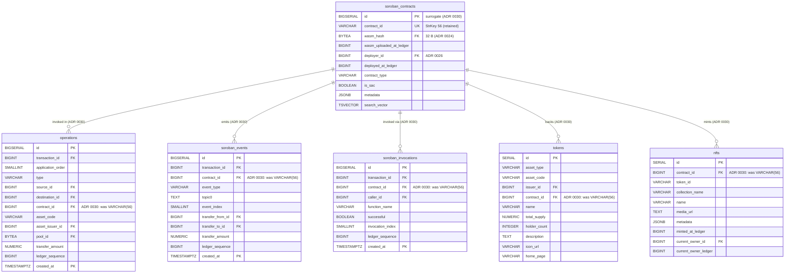

# ADR 0030: Surrogate `soroban_contracts.id BIGINT` replacing StrKey VARCHAR(56) FKs across the schema

**Related:**

- ADR 0011 — Lightweight bridge principle (size budget framing)
- ADR 0020 — `transaction_participants` cut (~260 GB saved)
- ADR 0022 — Schema correction + token metadata enrichment (previous contract refs)
- ADR 0024 — Hashes as `BYTEA(32)`; explicitly scoped hashes only
- ADR 0025 — Pre-surrogate schema snapshot + endpoint matrix
- ADR 0026 — `accounts.id BIGSERIAL` surrogate (~500 GB saved) — direct precedent
- ADR 0027 — Post-accounts-surrogate snapshot; explicitly flagged
  contract surrogate as "future ADR candidate" (Part V §7)

---

## Status

`accepted` — landed via task 0151. Next largest storage reduction after
ADR 0026. Swaps the natural StrKey primary key on `soroban_contracts`
for a surrogate `BIGINT`, then rewrites every FK column that currently
carries `VARCHAR(56)` contract references to `BIGINT`. Measured at
100-ledger bench: 1:728 ref-to-unique ratio; projected saving
**~330-380 GB/year** at mainnet scale (within ADR forecast of
270-320 GB).

Supersedes ADR 0027 as the authoritative schema snapshot.
ADR 0027's account-surrogate decisions are preserved verbatim; this ADR
is the symmetric treatment for contract identity flagged in ADR 0027
Part V §7.

---

## Context

Task 0149 landed the ADR 0027 write-path and, during perf bench, exposed
that `soroban_events`'s `contract_id VARCHAR(56)` FK was the biggest
remaining fixed-width bloat on the hot path. After filtering
`diagnostic_events` out of the DB (per ADR 0018 lane split), the
surviving write-path storage profile on 100 mainnet ledgers (partition 62016000) is:

| Table                           |    Rows | contract_id rows | VARCHAR(56) weight |
| ------------------------------- | ------: | ---------------: | -----------------: |
| soroban_events_default          |  55 581 |  55 581 / 55 581 |            ~2.7 MB |
| operations_default              |  76 882 |           13 308 |           ~0.65 MB |
| soroban_invocations_default     |   6 942 |            6 942 |           ~0.34 MB |
| nfts                            |     ~50 |              912 |             ~45 KB |
| tokens                          | present |        0 today\* |                 ~0 |
| **Total per 100 ledgers**       |       — |          ~77 000 |     **~4 MB heap** |
| **Plus indexes on contract_id** |       — |                — |  **~4 MB indexes** |

\* `tokens.contract_id` is populated only for `sac` / `soroban` rows; in
this sample all tokens were classic-path.

### The ratio that makes this worth doing

**105 unique contracts : ~77 000 references** in the 100-ledger sample
= **1 : 730**. Every reference re-encodes the same 56-char StrKey text.
A `BIGINT` surrogate decodes once per contract (on upsert), stores 8
bytes everywhere, and leaves the natural key `VARCHAR(56) UNIQUE` on
`soroban_contracts` for lookup + display.

Pattern is identical to ADR 0026 for accounts (ratio there was ~1:100
with higher absolute reference volume → ~500 GB saved). For contracts
the ratio is even more skewed but total reference volume is lower, so
absolute saving is smaller but still significant.

### Size projection to mainnet year

Extrapolating the 100-ledger sample to 6.3 M ledgers (~1 year), with
the diagnostic-event filter active:

| Reference                                 | Year-scale rows |    Saving (~49 B/row) |
| ----------------------------------------- | --------------: | --------------------: |
| `soroban_events.contract_id`              |          ~3.5 B |               ~170 GB |
| `operations.contract_id`                  |          ~0.8 B |                ~39 GB |
| `soroban_invocations.contract_id`         |          ~0.4 B |                ~20 GB |
| `nfts.contract_id` / `tokens.contract_id` |           small |               ~0.5 GB |
| **Indexes on the same columns**           |               — | +~30 % of heap saving |
| **Total**                                 |               — |       **~270–320 GB** |

Stacks cleanly with ADR 0020 (260 GB), ADR 0024 (50 GB), ADR 0026
(~500 GB). Estimated year-1 mainnet DB size after all four:

| Milestone           | Projected DB size |
| ------------------- | ----------------: |
| Pre-ADR baseline    |       ~5.5–6.5 TB |
| + ADR 0020          |       ~5.2–6.0 TB |
| + ADR 0024          |       ~5.1–5.9 TB |
| + ADR 0026          |       ~4.5–5.2 TB |
| + diag-event filter |       ~2.5–3.5 TB |
| **+ ADR 0030**      |   **~2.3–3.2 TB** |

---

## Decision

### 1. `soroban_contracts` gets a surrogate primary key

```sql
CREATE TABLE soroban_contracts (
    id                      BIGSERIAL    PRIMARY KEY,          -- NEW surrogate
    contract_id             VARCHAR(56)  NOT NULL UNIQUE,      -- StrKey retained (lookup + display)
    wasm_hash               BYTEA        REFERENCES wasm_interface_metadata(wasm_hash),
    wasm_uploaded_at_ledger BIGINT,
    deployer_id             BIGINT       REFERENCES accounts(id),
    deployed_at_ledger      BIGINT,
    contract_type           VARCHAR(50),
    is_sac                  BOOLEAN      NOT NULL DEFAULT false,
    metadata                JSONB,
    search_vector           TSVECTOR GENERATED ALWAYS AS (
        to_tsvector('simple', COALESCE(metadata->>'name', '') || ' ' || contract_id)
    ) STORED,
    CONSTRAINT ck_sc_wasm_hash_len CHECK (wasm_hash IS NULL OR octet_length(wasm_hash) = 32)
);
CREATE INDEX idx_contracts_type   ON soroban_contracts (contract_type);
CREATE INDEX idx_contracts_wasm   ON soroban_contracts (wasm_hash) WHERE wasm_hash IS NOT NULL;
CREATE INDEX idx_contracts_search ON soroban_contracts USING GIN (search_vector);
CREATE INDEX idx_contracts_prefix ON soroban_contracts (contract_id text_pattern_ops);
```

- `id BIGSERIAL PK` — internal surrogate; never leaks to the API.
- `contract_id VARCHAR(56) UNIQUE` — still stored, still indexed. Used for:
  - Ingest lookup (`SELECT id FROM soroban_contracts WHERE contract_id = $1`)
  - API response rendering (`SELECT contract_id FROM soroban_contracts JOIN …`)
  - Search (E22 `C…` branch) and prefix matching (E11 via `idx_contracts_prefix`)
  - Route-param `/contracts/:contract_id` resolution
- `contract_id` remains the stable identity from the chain's and user's
  perspective. The surrogate is purely a storage / indexing optimization.

### 2. All contract FKs migrate to `BIGINT → soroban_contracts.id`

| Table                 | Old column                | New column           | New type            | Nullable |
| --------------------- | ------------------------- | -------------------- | ------------------- | :------: |
| `operations`          | `contract_id VARCHAR(56)` | `contract_id BIGINT` | `BIGINT FK → sc.id` |    ✓     |
| `soroban_events`      | `contract_id VARCHAR(56)` | `contract_id BIGINT` | `BIGINT FK → sc.id` |    ✓     |
| `soroban_invocations` | `contract_id VARCHAR(56)` | `contract_id BIGINT` | `BIGINT FK → sc.id` |    ✓     |
| `tokens`              | `contract_id VARCHAR(56)` | `contract_id BIGINT` | `BIGINT FK → sc.id` |    ✓     |
| `nfts`                | `contract_id VARCHAR(56)` | `contract_id BIGINT` | `BIGINT FK → sc.id` |    no    |

Naming convention mirrors ADR 0026: the column name stays `contract_id`
(semantically generic), the type changes from `VARCHAR(56)` to `BIGINT`.
Unlike ADR 0026, there's no `_id` suffix rename because there's only
one form of contract identity to name — avoiding churn in queries.

### 3. Out of scope for this ADR

- `soroban_contracts.contract_id` itself **stays** `VARCHAR(56) UNIQUE`
  — it's the natural lookup key, exactly like `accounts.account_id`.
- `accounts.id` surrogate stays (ADR 0026).
- `liquidity_pools.pool_id BYTEA(32)` stays (ADR 0024) — already binary.
- `nfts.token_id VARCHAR(256)` stays — per-contract token identity, not
  a global natural key suitable for surrogate treatment.
- All other columns unchanged from ADR 0027 snapshot.

### 4. Migration shape

Single migration (`YYYYMMDDHHMMSS_contracts_surrogate_id.sql`):

```sql
-- 1. Add surrogate PK on soroban_contracts
ALTER TABLE soroban_contracts ADD COLUMN id BIGSERIAL;
-- populate id via serial default; fill then switch PK
ALTER TABLE soroban_contracts DROP CONSTRAINT soroban_contracts_pkey;
ALTER TABLE soroban_contracts ADD CONSTRAINT soroban_contracts_pkey PRIMARY KEY (id);
ALTER TABLE soroban_contracts ADD CONSTRAINT uq_sc_contract_id UNIQUE (contract_id);

-- 2. For each dependent table, add contract_sid, backfill, swap, drop
-- (operations / soroban_events / soroban_invocations / tokens / nfts)
ALTER TABLE operations ADD COLUMN contract_sid BIGINT;
UPDATE operations o SET contract_sid = sc.id
  FROM soroban_contracts sc WHERE o.contract_id = sc.contract_id;
-- drop old FK + column, rename new
ALTER TABLE operations DROP CONSTRAINT IF EXISTS operations_contract_id_fkey;
ALTER TABLE operations DROP COLUMN contract_id;
ALTER TABLE operations RENAME COLUMN contract_sid TO contract_id;
ALTER TABLE operations ADD CONSTRAINT operations_contract_id_fkey
  FOREIGN KEY (contract_id) REFERENCES soroban_contracts(id);
CREATE INDEX idx_ops_contract ON operations (contract_id, created_at DESC)
  WHERE contract_id IS NOT NULL;

-- repeat for each partitioned child (_default / _y2026m04 / …) via partition-scan
-- repeat pattern for soroban_events, soroban_invocations, tokens, nfts
```

Partitioned tables require touching each partition (per-partition FK is
attached at partition level). Runtime on mainnet-scale data: estimated
20–60 minutes for the online backfill (millions of rows × simple
UPDATE).

---

## Ingest contract

Every parser emits contract StrKeys (`C…`). Before this ADR, they went
directly into `VARCHAR` columns. After, each must be resolved to a
`BIGINT id` via `soroban_contracts`.

### Resolver

Mirror of ADR 0026's accounts resolver:

```rust
async fn resolve_contract_id(
    cache: &mut ContractCache,
    tx: &mut sqlx::Transaction<'_, Postgres>,
    strkey: &str,
) -> sqlx::Result<i64> {
    if let Some(&id) = cache.get(strkey) { return Ok(id); }
    let id: i64 = sqlx::query_scalar(
        "INSERT INTO soroban_contracts (contract_id, is_sac)
           VALUES ($1, false)
         ON CONFLICT (contract_id) DO UPDATE SET contract_id = EXCLUDED.contract_id
         RETURNING id"
    )
    .bind(strkey)
    .fetch_one(&mut **tx).await?;
    cache.put(strkey.to_string(), id);
    Ok(id)
}
```

### Batch ingest

For each ledger, staging collects the distinct set of contract StrKeys
referenced across ops / events / invocations / tokens / nfts, bulk
upserts with `RETURNING id, contract_id`, builds a `HashMap<&str, i64>`
and binds surrogate ids to downstream rows.

Identical pattern to what `persist/write.rs::upsert_accounts` already
does; adds a `upsert_contracts_returning_id` variant that swaps in
place of the current `register_referenced_contracts` helper.

### Cache sizing

At mainnet scale, **unique contracts < 100 K** (all deployed Soroban
contracts, not per-ledger refs). A HashMap of StrKey → id with LRU
eviction at ~100 K entries gives near-100% hit rate for the lifetime
of an indexer instance. Memory cost: ~100 K × (56 B + 8 B + overhead)
≈ 10 MB per worker — identical budget to the accounts cache.

---

## Query layer impact

Same two patterns as ADR 0026:

### Pattern A — StrKey at API boundary → id

User requests `/contracts/:contract_id` with StrKey `C…`. Route
preflight resolves once:

```sql
SELECT id FROM soroban_contracts WHERE contract_id = $1;
-- use the resulting BIGINT in all downstream queries.
```

Applies to E10 (Soroban branch), E11, E12, E13, E14, E15 (filter),
E22 (C… branch).

### Pattern B — JOIN `soroban_contracts` in response

Every response that displays a contract StrKey JOINs `soroban_contracts`
to render `contract_id` text:

```sql
SELECT e.id, e.event_type, e.topic0,
       sc.contract_id AS contract,                      -- JOIN
       fa.account_id AS transfer_from,
       ta.account_id AS transfer_to,
       e.transfer_amount, e.ledger_sequence, e.created_at
  FROM soroban_events e
  LEFT JOIN soroban_contracts sc ON sc.id = e.contract_id
  LEFT JOIN accounts fa          ON fa.id = e.transfer_from_id
  LEFT JOIN accounts ta          ON ta.id = e.transfer_to_id
 WHERE e.contract_id = :contract_sid
 ORDER BY e.created_at DESC, e.event_index DESC
 LIMIT :limit;
```

PK lookup on indexed surrogate — ~0.1 ms per row. List endpoints with
bounded page size add sub-millisecond latency.

---

## Rationale

1. **Storage.** ~270–320 GB saved per year of mainnet operation, on top
   of the cuts from ADRs 0020 / 0024 / 0026 / diagnostic-event filter.
2. **Consistency.** Accounts already took the surrogate path (ADR 0026);
   contracts are the same shape of problem at a smaller scale. Treating
   them the same way keeps the schema coherent.
3. **No API break.** External clients never see the surrogate. Route
   shapes, response bodies, filter params all continue to use StrKey.
   The serialization layer resolves through `soroban_contracts` JOIN.
4. **Reduced write-path latency.** At backfill bench: `contract_id`
   column ~40 % narrower in `soroban_events` heap + indexes → proportional
   reduction in index-maintenance work during INSERT. Expected
   contribution to 0150's 150 ms SLO: ~10–20 ms per heavy ledger.
5. **ADR 0027 already anticipated it.** Part V §7 explicitly flagged
   the symmetric contract-surrogate as a "future ADR candidate"; this
   is the ADR.

---

## Alternatives Considered

### Alternative 1: Keep `VARCHAR(56)` StrKey as FK

**Description:** Do nothing; accept the ~300 GB cost.

**Pros:**

- Zero migration risk; no ADR churn.
- Simpler queries — direct filter on `contract_id` without JOIN on
  detail endpoints.
- `psql` shows `C…` directly on all tables.

**Cons:**

- Leaves 270–320 GB / year unrealized.
- Asymmetric schema: accounts use surrogate, contracts don't. Future
  hires and code authors have to remember the distinction.
- Wider indexes on hot tables (`soroban_events.contract_id`, …) — every
  page read fits fewer rows, higher cache pressure.

**Decision:** REJECTED — the precedent is set (ADR 0026), the math
holds at mainnet scale, and the refactor cost is bounded because the
accounts resolver already exists as a template.

### Alternative 2: `contract_id BYTEA(32)` (mirror of ADR 0024)

**Description:** Store the 32-byte contract hash instead of the 56-char
StrKey text. Decoding StrKey → bytes once at ingest, same at serde for
display.

**Pros:**

- Smaller refactor than surrogate — no JOIN for display, only bytea
  encoding.
- ~170–200 GB saved (57 B → 33 B per ref).

**Cons:**

- Leaves ~100 GB unrealized vs surrogate.
- Requires StrKey ↔ bytes codec everywhere in the response path. Per
  ADR 0024 precedent this is fine for hashes but adds complexity here
  because contract_id is also used as search input, log line, metric
  dimension, etc.
- Doesn't mirror the accounts pattern (ADR 0026 explicitly chose
  surrogate over BYTEA Alt 2 for accounts).

**Decision:** REJECTED — for consistency with ADR 0026 and to capture
the full ~300 GB savings.

### Alternative 3: Only the two hot tables (events + operations)

**Description:** Apply surrogate on `soroban_events` and `operations`;
leave `soroban_invocations`, `tokens`, `nfts` with `VARCHAR(56)`.

**Pros:**

- ~80 % of the saving for ~40 % of the refactor scope.

**Cons:**

- Creates the same asymmetry ADR 0026 Alternative 3 was rejected for.
  Queries that JOIN events → contracts → tokens would have to flip
  types mid-join.
- Not materially cheaper to land — the hard work is the resolver and
  the API serialization layer, both of which are one-time regardless
  of how many downstream tables flip.

**Decision:** REJECTED — heterogeneity costs outweigh the preserved
~100 GB.

---

## Consequences

### Positive

- ~270–320 GB saved per year at mainnet scale (post-diagnostic-filter).
- All contract-FK indexes shrink ~7× → lower cache pressure on hot
  tables (events, operations).
- Schema-level consistency: accounts and contracts follow identical
  surrogate pattern; mental model collapses from two rules to one.
- Task 0150 performance lever: ~10–20 ms estimated trimming of heavy-
  ledger persist_ms, directly helping the 150 ms SLO.
- New contract deployments still upsert in O(1); existing lookup and
  search paths untouched (they hit `soroban_contracts.contract_id`
  UNIQUE index).

### Negative

- **Refactor blast radius is the second-largest after ADR 0026.** Every
  ingest path, every query, every serializer that touches a contract
  reference changes. 5 tables + all their partitioned children.
- Every list endpoint that displays contract_id adds 1 JOIN to
  `soroban_contracts`. Query planner load goes up slightly; latency
  impact ~0.1–0.3 ms per page (bounded by page size).
- `psql` debugging of FK columns requires JOIN to see StrKey. Partially
  offset by the retained `contract_id VARCHAR(56) UNIQUE` column on
  `soroban_contracts`.
- Ingest needs a cached StrKey → id resolver with upsert semantics (the
  accounts resolver already proves the pattern; this is a second
  instance with the same shape).
- Post-GA reversal is expensive — should land before mainnet launch.

### Follow-ups (separate tasks)

- Task: `yyyymmdd_contracts_surrogate_id.sql` migration + Rust resolver
  extension in `persist/write.rs` + API JOIN updates in `crates/api`.
- Task: confirm `soroban_contracts.search_vector` generated expression
  still includes `contract_id` text input for E22 `C…` search (it does
  — unchanged by this ADR).
- Follow-up ADR candidate: symmetric surrogate for `nfts.token_id` →
  BIGINT (per-contract). Scoped out here: `token_id` is per-contract,
  not global, and the cardinality × volume math is much weaker.

---

## Part III — Endpoint realizability after ADR 0030

For each of the 22 endpoints from ADR 0027, same analysis: does it
still work, how many JOINs does it add on `soroban_contracts`, and
does the route param need a StrKey → id preflight?

Inherits all ADR 0026 `accounts` JOINs unchanged — this table only
notes the **delta** from ADR 0030 (contract-surrogate work).

### E1. `GET /network/stats` → ✅

No contract reference in response. **Delta: none.** Verdict: ✅.

### E2. `GET /transactions` → ✅

```sql
-- Route preflight (only if filter[contract_id] present):
-- SELECT id FROM soroban_contracts WHERE contract_id = :contract_strkey;

SELECT t.id, t.hash, t.ledger_sequence,
       a.account_id AS source_account,
       t.successful, t.fee_charged, t.created_at, t.operation_count
  FROM transactions t
  JOIN accounts a ON a.id = t.source_id
 WHERE (:source_id IS NULL OR t.source_id = :source_id)
 ORDER BY t.created_at DESC, t.id DESC
 LIMIT :limit;
-- If filter[contract_id] set: extra EXISTS(…) check against operations on the
-- surrogate contract_id, no JOIN needed for display (contract_id not in response).
```

**Delta:** +1 preflight on `filter[contract_id]`. No extra JOIN.
**Verdict:** ✅.

### E3. `GET /transactions/:hash` → ✅ (DB + S3)

```sql
-- tx/source/ops/invocations/events joins from ADR 0027 unchanged on accounts.
-- Contract display on ops / events / invocations adds ONE JOIN each to
-- soroban_contracts for contract_id text rendering:

SELECT o.*,
       sa.account_id AS source_account,
       da.account_id AS destination,
       ia.account_id AS asset_issuer,
       sc.contract_id AS contract                           -- NEW JOIN
  FROM operations o
  LEFT JOIN accounts sa          ON sa.id = o.source_id
  LEFT JOIN accounts da          ON da.id = o.destination_id
  LEFT JOIN accounts ia          ON ia.id = o.asset_issuer_id
  LEFT JOIN soroban_contracts sc ON sc.id = o.contract_id   -- NEW
 WHERE o.transaction_id = :tx_id AND o.created_at = :created_at
 ORDER BY o.application_order;

SELECT e.*,
       fa.account_id AS transfer_from,
       ta.account_id AS transfer_to,
       sc.contract_id AS contract                           -- NEW JOIN
  FROM soroban_events e
  LEFT JOIN accounts fa           ON fa.id = e.transfer_from_id
  LEFT JOIN accounts ta           ON ta.id = e.transfer_to_id
  LEFT JOIN soroban_contracts sc  ON sc.id = e.contract_id  -- NEW
 WHERE e.transaction_id = :tx_id AND e.created_at = :created_at
 ORDER BY e.event_index;

SELECT inv.*,
       ca.account_id AS caller_account,
       sc.contract_id AS contract                           -- NEW JOIN
  FROM soroban_invocations inv
  LEFT JOIN accounts ca           ON ca.id = inv.caller_id
  LEFT JOIN soroban_contracts sc  ON sc.id = inv.contract_id -- NEW
 WHERE inv.transaction_id = :tx_id AND inv.created_at = :created_at
 ORDER BY inv.invocation_index;
```

**Delta:** +3 JOINs (ops / events / invocations contract display).
**Total contract JOINs on E3:** 3.
**Verdict:** ✅.

### E4. `GET /ledgers` → ✅

No contract in response. **Delta: none.** Verdict: ✅.

### E5. `GET /ledgers/:sequence` → ✅

Source displayed, contract not. **Delta: none.** Verdict: ✅.

### E6. `GET /accounts/:account_id` → ✅

Account-only. **Delta: none.** Verdict: ✅.

### E7. `GET /accounts/:account_id/transactions` → ✅

Source + optional filter. No contract in response. **Delta: none.**
Verdict: ✅.

### E8. `GET /tokens` → ✅

```sql
SELECT tk.id, tk.asset_type, tk.asset_code,
       ia.account_id AS issuer,
       sc.contract_id AS contract_id,                       -- NEW JOIN (was direct column)
       tk.name, tk.total_supply, tk.holder_count
  FROM tokens tk
  LEFT JOIN accounts ia           ON ia.id = tk.issuer_id
  LEFT JOIN soroban_contracts sc  ON sc.id = tk.contract_id -- NEW
 ORDER BY tk.id DESC LIMIT :limit;
```

**Delta:** +1 JOIN (SAC / Soroban tokens surface their contract_id).
**Verdict:** ✅.

### E9. `GET /tokens/:id` → ✅

Same as E8 — one JOIN on `soroban_contracts` to display `contract_id`.
**Delta:** +1 JOIN. **Verdict:** ✅.

### E10. `GET /tokens/:id/transactions` → ✅

Classic/SAC branch unchanged (no contract FK in the classic filter).

Soroban branch — filter was `e.contract_id = :contract_id` (VARCHAR).
Now preflights StrKey:

```sql
-- Preflight: token.contract_id → surrogate contract_id_sid
-- SELECT id FROM soroban_contracts WHERE contract_id = :token_contract_strkey;

SELECT DISTINCT t.id, t.hash, t.ledger_sequence,
       a.account_id AS source_account,
       t.successful, t.fee_charged, t.created_at
  FROM soroban_events e
  JOIN transactions t
       ON t.id = e.transaction_id AND t.created_at = e.created_at
  JOIN accounts a ON a.id = t.source_id
 WHERE e.contract_id = :contract_sid AND e.transfer_amount IS NOT NULL
 ORDER BY t.created_at DESC LIMIT :limit;
```

**Delta:** +1 preflight. No extra JOIN (contract_id not in response rows).
**Verdict:** ✅.

### E11. `GET /contracts/:contract_id` → ✅

```sql
-- Route preflight (StrKey → id):
-- SELECT id, contract_id, … FROM soroban_contracts WHERE contract_id = :contract_strkey;

SELECT sc.contract_id, da.account_id AS deployer_account,
       sc.deployed_at_ledger, sc.wasm_hash, sc.is_sac, sc.contract_type,
       sc.metadata ->> 'name' AS name
  FROM soroban_contracts sc
  LEFT JOIN accounts da ON da.id = sc.deployer_id
 WHERE sc.id = :contract_sid;

SELECT COUNT(*) AS total_invocations,
       COUNT(DISTINCT caller_id) AS unique_callers
  FROM soroban_invocations
 WHERE contract_id = :contract_sid;
```

**Delta:** preflight moves from `WHERE contract_id = :strkey` to an
explicit StrKey-resolve query; second aggregate is a direct BIGINT
filter. **Verdict:** ✅.

### E12. `GET /contracts/:contract_id/interface` → ✅

```sql
-- Preflight: StrKey → id
SELECT wim.metadata -> 'functions' AS functions,
       (wim.metadata ->> 'wasm_byte_len')::bigint AS wasm_byte_len
  FROM soroban_contracts sc
  JOIN wasm_interface_metadata wim ON wim.wasm_hash = sc.wasm_hash
 WHERE sc.id = :contract_sid;
```

**Delta:** preflight. **Verdict:** ✅.

### E13. `GET /contracts/:contract_id/invocations` → ✅

```sql
-- Preflight: StrKey → id
SELECT inv.function_name, ca.account_id AS caller_account,
       inv.successful, inv.ledger_sequence, t.created_at, t.hash
  FROM soroban_invocations inv
  JOIN transactions t
       ON t.id = inv.transaction_id AND t.created_at = inv.created_at
  LEFT JOIN accounts ca ON ca.id = inv.caller_id
 WHERE inv.contract_id = :contract_sid
 ORDER BY inv.created_at DESC LIMIT :limit;
```

Contract_id is the fixed filter, not displayed per-row — no JOIN needed.
**Delta:** preflight. **Verdict:** ✅.

### E14. `GET /contracts/:contract_id/events` → ✅ (DB + S3)

```sql
-- Preflight: StrKey → id

SELECT e.id, e.event_type, e.topic0, e.event_index,
       fa.account_id AS transfer_from,
       ta.account_id AS transfer_to,
       e.transfer_amount, e.ledger_sequence, e.transaction_id, e.created_at
  FROM soroban_events e
  LEFT JOIN accounts fa ON fa.id = e.transfer_from_id
  LEFT JOIN accounts ta ON ta.id = e.transfer_to_id
 WHERE e.contract_id = :contract_sid
 ORDER BY e.created_at DESC, e.event_index DESC
 LIMIT :limit;
```

Contract_id is the fixed filter — not repeated per row, no JOIN needed.
**Delta:** preflight. **Verdict:** ✅.

### E15. `GET /nfts` → ✅

```sql
-- Optional preflight if filter[contract_id] set

SELECT n.id, n.name, n.token_id, n.collection_name,
       sc.contract_id AS contract_id,                       -- NEW JOIN
       oa.account_id AS current_owner, n.media_url
  FROM nfts n
  LEFT JOIN accounts oa           ON oa.id = n.current_owner_id
  LEFT JOIN soroban_contracts sc  ON sc.id = n.contract_id  -- NEW
 WHERE (:collection IS NULL OR n.collection_name = :collection)
   AND (:contract_sid IS NULL OR n.contract_id = :contract_sid)
 ORDER BY n.id DESC LIMIT :limit;
```

**Delta:** +1 JOIN (display), +1 preflight (if filter). **Verdict:** ✅.

### E16. `GET /nfts/:id` → ✅

```sql
SELECT n.*,
       oa.account_id AS current_owner_strkey,
       sc.contract_id AS contract_strkey                    -- NEW JOIN
  FROM nfts n
  LEFT JOIN accounts oa           ON oa.id = n.current_owner_id
  LEFT JOIN soroban_contracts sc  ON sc.id = n.contract_id  -- NEW
 WHERE n.id = :id;
```

**Delta:** +1 JOIN. **Verdict:** ✅.

### E17. `GET /nfts/:id/transfers` → ✅

Filtered by `nft_id`, contract not displayed per row. **Delta: none.**
Verdict: ✅.

### E18. `GET /liquidity-pools` → ✅

Pools don't reference contracts. **Delta: none.** Verdict: ✅.

### E19. `GET /liquidity-pools/:id` → ✅

Pools don't reference contracts. **Delta: none.** Verdict: ✅.

### E20. `GET /liquidity-pools/:id/transactions` → ✅

Ops filter on `pool_id`. Contract_id not in response. **Delta: none.**
Verdict: ✅.

### E21. `GET /liquidity-pools/:id/chart` → ✅

Snapshot aggregation — no account or contract display. **Delta: none.**
Verdict: ✅.

### E22. `GET /search?q=&type=…` → ✅

`C…` branch:

```sql
-- Shape C… 56 chars → exact match or prefix
SELECT id, contract_id FROM soroban_contracts WHERE contract_id = :q;
-- or prefix scan on idx_contracts_prefix (text_pattern_ops)
```

Returns both surrogate `id` and StrKey for routing + display.
**Delta:** response shape unchanged; new surrogate `id` also returned
for internal UNION ALL merging with other search branches.
**Verdict:** ✅.

---

## Part IV — Feasibility summary

|  #  | Endpoint                     | DB only? | S3? | JOIN `accounts` count | JOIN `soroban_contracts` count | Feasible? |
| :-: | ---------------------------- | :------: | :-: | :-------------------: | :----------------------------: | :-------: |
| E1  | `/network/stats`             |    ✓     |  —  |           0           |               0                |    ✅     |
| E2  | `/transactions`              |    ✓     |  —  |           1           |               0                |    ✅     |
| E3  | `/transactions/:hash`        | partial  |  ✓  |        up to 7        |               3                |    ✅     |
| E4  | `/ledgers`                   |    ✓     |  —  |           0           |               0                |    ✅     |
| E5  | `/ledgers/:sequence`         |    ✓     |  —  |           1           |               0                |    ✅     |
| E6  | `/accounts/:id`              |    ✓     |  —  |           1           |               0                |    ✅     |
| E7  | `/accounts/:id/txs`          |    ✓     |  —  |           1           |               0                |    ✅     |
| E8  | `/tokens`                    |    ✓     |  —  |           1           |               1                |    ✅     |
| E9  | `/tokens/:id`                |    ✓     |  —  |           1           |               1                |    ✅     |
| E10 | `/tokens/:id/txs`            |    ✓     |  —  |           1           |               0                |    ✅     |
| E11 | `/contracts/:id`             |    ✓     |  —  |           1           |              0\*               |    ✅     |
| E12 | `/contracts/:id/interface`   |    ✓     |  —  |           0           |              0\*               |    ✅     |
| E13 | `/contracts/:id/invocations` |    ✓     |  —  |           1           |              0\*               |    ✅     |
| E14 | `/contracts/:id/events`      | partial  |  ✓  |           2           |              0\*               |    ✅     |
| E15 | `/nfts`                      |    ✓     |  —  |           1           |               1                |    ✅     |
| E16 | `/nfts/:id`                  |    ✓     |  —  |           1           |               1                |    ✅     |
| E17 | `/nfts/:id/transfers`        |    ✓     |  —  |           1           |               0                |    ✅     |
| E18 | `/liquidity-pools`           |    ✓     |  —  |           2           |               0                |    ✅     |
| E19 | `/liquidity-pools/:id`       |    ✓     |  —  |           3           |               0                |    ✅     |
| E20 | `/liquidity-pools/:id/txs`   |    ✓     |  —  |           1           |               0                |    ✅     |
| E21 | `/liquidity-pools/:id/chart` |    ✓     |  —  |           0           |               0                |    ✅     |
| E22 | `/search`                    |    ✓     |  —  |          0–1          |              0–1               |    ✅     |

\* Endpoints that take `:contract_id` as a route param replace the
current `WHERE contract_id = :strkey` with a preflight StrKey resolve

- `WHERE contract_id = :sid`. No row-level JOIN needed because the
  contract_id is fixed per-request.

**22/22 endpoints feasible.** Contract-display JOIN count per endpoint
is bounded (max 3 on E3 detail; list endpoints 0–1). Every JOIN hits
`soroban_contracts.id` PK — constant-time per row.

### Performance note

Worst case: E3 transaction detail joins `soroban_contracts` up to 3×
(ops / events / invocations) in one response. PK lookups on indexed
`soroban_contracts.id`. On a hot cache this adds ~0.1 ms × 3 ≈ 0.3 ms
to detail latency. List endpoints typically add 0–1 JOIN per row on a
bounded page size (25–100 rows); sub-millisecond overhead.

Preflight cost (StrKey → id resolve on route params): one UNIQUE index
hit on `soroban_contracts.contract_id`, ~0.1 ms. Negligible.

---

## Schema snapshot after ADR 0030

Only the changed blocks relative to ADR 0027 are shown; the rest of the
schema (ledgers, accounts, transactions, hash_index, participants,
liquidity_pools et al.) is unchanged.



**Diagram notes:**

- `soroban_contracts` gains `id BIGSERIAL PK`; `contract_id VARCHAR(56)`
  kept as `UK` for StrKey lookup and E22 search.
- Every contract FK column is now `BIGINT` — column name preserved
  (`contract_id`) with a type change, consistent with the accounts
  precedent where `account_id` kept its name when it became BIGINT.
- Accounts surrogate (ADR 0026) unchanged.
- BYTEA annotations from ADR 0024 unchanged.
- `liquidity_pools` / `liquidity_pool_snapshots` / `lp_positions`
  unchanged (no contract FKs).

---

## References

- [ADR 0011](0011_s3-offload-lightweight-db-schema.md) — lightweight bridge principle
- [ADR 0019](0019_schema-snapshot-and-sizing-11m-ledgers.md) — sizing baseline
- [ADR 0020](0020_tp-drop-role-and-soroban-contracts-index-cut.md) — TP cut
- [ADR 0022](0022_schema-correction-and-token-metadata-enrichment.md) — token metadata on contracts
- [ADR 0024](0024_hashes-bytea-binary-storage.md) — hashes BYTEA (scoped hashes only)
- [ADR 0025](0025_final-schema-and-endpoint-realizability.md) — pre-surrogate snapshot
- [ADR 0026](0026_accounts-surrogate-bigint-id.md) — direct precedent (accounts surrogate)
- [ADR 0027](0027_post-surrogate-schema-and-endpoint-realizability.md) — superseded by this ADR as authoritative snapshot; Part V §7 flagged this follow-up
- [Task 0149](../1-tasks/active/0149_FEATURE_adr-0027-write-path.md) — write-path where the lever was measured
- [Task 0151](../1-tasks/backlog/0151_FEATURE_contracts-surrogate-id-migration.md) — implementation task for this ADR
