# ADR 0031: Enum-like `VARCHAR` columns → `SMALLINT` + Rust enum (with `CHECK` constraint)

**Related:**

- ADR 0020 — `transaction_participants` cut (~260 GB saved)
- ADR 0024 — Hashes as `BYTEA(32)` (binary storage precedent)
- ADR 0026 — `accounts.id BIGSERIAL` surrogate (~500 GB saved)
- ADR 0027 — Post-surrogate schema snapshot
- ADR 0030 — `soroban_contracts.id BIGINT` surrogate (~270-320 GB saved)

---

## Status

`proposed` — next storage/speed lever after ADR 0030. Replaces every
enum-like `VARCHAR(N)` column (closed-domain, known at compile time from
the Stellar XDR protocol) with `SMALLINT` backed by a Rust `#[repr(i16)]`
enum, guarded by a `CHECK` constraint on the numeric range.

Projected effect at mainnet-year (6.3 M ledgers):

| Metric       |                               Improvement |
| ------------ | ----------------------------------------: |
| Heap size    |                              ~160 GB/year |
| Index size   |                               ~60 GB/year |
| **DB total** |                          **~220 GB/year** |
| Index probes | ~2–3 × faster on `WHERE type = …` filters |

Stacks additively with ADRs 0020 / 0024 / 0026 / diagnostic-event filter / 0030.

---

## Context

Task 0151 (ADR 0030 implementation) landed contract surrogate; bench
audit on the 100-ledger partition `62016000` exposed the next fixed-width
bloat on the hot path — every enum-like `VARCHAR` column re-encodes the
same short string on every row.

### Current VARCHAR enum census (100 ledgers, post-ADR-0030)

| Column                                     |   Rows | Distinct |                            Text bytes |
| ------------------------------------------ | -----: | -------: | ------------------------------------: |
| `operations.type VARCHAR(50)`              | 76 882 |       19 |                              1 267 kB |
| `account_balance_history.asset_type`       | 72 435 |        3 |                                768 kB |
| `soroban_events.event_type VARCHAR(20)`    | 55 581 |      1–3 |                                434 kB |
| `account_balances_current.asset_type`      | 22 600 |        3 |                                261 kB |
| `nft_ownership.event_type VARCHAR(20)`     |  (fwd) |       ~4 | (scales w/ mint/transfer/burn volume) |
| `liquidity_pools.asset_a_type` / `_b_type` |  1 958 |      2–3 |                                 29 kB |
| `tokens.asset_type`                        |  (new) |        4 |                               minimal |
| `soroban_contracts.contract_type`          |    105 |        2 |                                 ~1 kB |
| **Total per 100 ledgers**                  |      — |        — |                      **~2.7 MB heap** |
| **Plus indexes on `type`/`asset_type`**    |      — |        — |                       **~0.7 MB idx** |

### Domain is closed and protocol-defined

Every such column maps 1:1 to a discriminator in the Stellar XDR spec:

- `OperationType` (XDR enum) → `operations.type`, values `CREATE_ACCOUNT
= 0 … RESTORE_FOOTPRINT = 26` (27 variants as of Protocol 21)
- `ContractEventType` (Soroban XDR) → `soroban_events.event_type`, values
  `SYSTEM = 0`, `CONTRACT = 1`, `DIAGNOSTIC = 2` (3 variants)
- `AssetType` (XDR) → `account_balance*.asset_type` + pools, values
  `NATIVE = 0`, `CREDIT_ALPHANUM4 = 1`, `CREDIT_ALPHANUM12 = 2`,
  `POOL_SHARE = 3` (4 variants)
- Explorer-synthetic enum → `tokens.asset_type` ∈
  {native, classic, sac, soroban} (4 variants). Domain is defined by
  this project, not XDR, but equally closed.
- `NftEventType` (parser-internal) → `nft_ownership.event_type` ∈
  {mint, transfer, burn} (~3–5 variants).

No column in this census has an open domain. Extension points (new op
type in a future Stellar protocol) are additive, known at upgrade time,
and handled by a single `ALTER TYPE`-equivalent one-liner (add one
`INSERT` to the fixture, or one `#[repr(i16)]` variant + a migration
touching just the `CHECK` constraint).

### Size projection to mainnet year

Extrapolating the 100-ledger sample to ~6.3 M ledgers / year:

| Reference                              | Year-scale rows |                Saving |
| -------------------------------------- | --------------: | --------------------: |
| `operations.type` (VARCHAR → SMALLINT) |          ~4.8 B |                ~70 GB |
| `account_balance_history.asset_type`   |          ~4.6 B |                ~40 GB |
| `soroban_events.event_type`            |          ~3.5 B |                ~20 GB |
| `account_balances_current.asset_type`  |   ~1.4 B (cur.) |                ~10 GB |
| Other (pools, tokens, nfts, contracts) |           minor |                 ~5 GB |
| Indexes on the same columns            |               — | +~30 % of heap saving |
| **Total**                              |               — |  **~160–220 GB/year** |

Stacks cleanly with ADRs 0020, 0024, 0026, 0030:

| Milestone           | Projected DB size |
| ------------------- | ----------------: |
| Pre-ADR baseline    |       ~5.5–6.5 TB |
| + ADR 0020 / 0024   |       ~5.1–5.9 TB |
| + ADR 0026          |       ~4.5–5.2 TB |
| + diag-event filter |       ~2.5–3.5 TB |
| + ADR 0030          |       ~2.3–3.2 TB |
| **+ ADR 0031**      |   **~2.1–3.0 TB** |

---

## Decision

### 1. Every enum-like VARCHAR column becomes `SMALLINT NOT NULL` with a `CHECK` range

```sql
-- operations.type: 19 variants today, protocol room for ~40 total.
ALTER TABLE operations
    ALTER COLUMN type TYPE SMALLINT USING op_type_to_smallint(type),
    ALTER COLUMN type SET NOT NULL,
    ADD CONSTRAINT ck_ops_type_range CHECK (type BETWEEN 0 AND 127);

-- soroban_events.event_type: ContractEventType with 3 variants.
ALTER TABLE soroban_events
    ALTER COLUMN event_type TYPE SMALLINT USING event_type_to_smallint(event_type),
    ALTER COLUMN event_type SET NOT NULL,
    ADD CONSTRAINT ck_events_type_range CHECK (event_type BETWEEN 0 AND 15);

-- Repeat pattern for account_balance*.asset_type, tokens.asset_type,
-- liquidity_pools.asset_a_type / _b_type, nft_ownership.event_type,
-- soroban_contracts.contract_type.
```

Naming stays — column name does not change, only the type. Queries that
read the value by label go through a small helper function (see §3).

The CHECK range is intentionally wider than the current variant count —
gives headroom for protocol additions without another migration.

### 2. Rust enum is the single source of truth for the mapping

```rust
// crates/domain/src/enums/operation_type.rs  (new module)

#[derive(Debug, Clone, Copy, PartialEq, Eq, sqlx::Type, serde::Serialize, serde::Deserialize)]
#[repr(i16)]
#[sqlx(transparent)]
pub enum OperationType {
    CreateAccount = 0,
    Payment = 1,
    PathPaymentStrictReceive = 2,
    // … one variant per Stellar XDR OperationType discriminator
    InvokeHostFunction = 24,
    ExtendFootprintTtl = 25,
    RestoreFootprint = 26,
}

impl OperationType {
    /// String label used in API responses (same as pre-ADR-0031 VARCHAR).
    pub fn as_str(&self) -> &'static str {
        match self {
            Self::CreateAccount => "CREATE_ACCOUNT",
            Self::Payment => "PAYMENT",
            // …
        }
    }
}
```

`#[repr(i16)]` pins the on-disk encoding. `sqlx::Type` with `#[repr]`
encodes/decodes as SMALLINT directly — zero runtime cost.

Analogous enum modules for: `AssetType`, `ContractEventType`,
`TokenAssetType` (explorer-synthetic), `NftEventType`, `ContractType`.

### 3. Display path uses an IMMUTABLE SQL helper function per enum

`psql` debugging, BI tools, and future API handlers that join on raw
columns need a string label without JOIN. Pattern:

```sql
CREATE FUNCTION op_type_name(ty SMALLINT) RETURNS TEXT
IMMUTABLE PARALLEL SAFE LANGUAGE SQL AS $$
  SELECT CASE ty
    WHEN 0 THEN 'CREATE_ACCOUNT'
    WHEN 1 THEN 'PAYMENT'
    WHEN 2 THEN 'PATH_PAYMENT_STRICT_RECEIVE'
    -- …
    WHEN 26 THEN 'RESTORE_FOOTPRINT'
  END
$$;
```

Usage in ad-hoc queries:

```sql
SELECT op_type_name(type) AS type, COUNT(*)
  FROM operations
 GROUP BY type ORDER BY COUNT(*) DESC;
```

`IMMUTABLE` + `PARALLEL SAFE` allow the planner to inline and constant-
fold the expression — same performance as a native ENUM cast.

Migration `0031_enum_helpers.sql` ships one such function per enum:
`op_type_name`, `asset_type_name`, `event_type_name`, `contract_type_name`,
`nft_event_type_name`. Rust enum's `as_str()` must stay bitwise-
compatible with each SQL function — a single integration test iterates
every enum variant, calls the SQL fn, and asserts equality.

### 4. Column ordering nudge (minor, free)

While touching each table, re-order columns to group by PG native
alignment (8-byte BIGINT / NUMERIC first, then 4-byte INT / SERIAL,
then SMALLINT pairs, then 1-byte BOOL, then varlena last). Avoids
padding waste — up to ~5–10 % extra heap saving on append-heavy tables
(`operations`, `soroban_events`) for zero design effort. Captured
in-scope for ADR 0031 since it only makes sense to do it once per
ALTER TABLE window.

### 5. Out of scope for this ADR

- `asset_code VARCHAR(12)` — **stays VARCHAR**. Domain is open (every
  issuer defines their own asset code). Surrogate via lookup table would
  be a different design (own ADR; likely not worth the JOIN for a field
  already capped at 12 chars).
- `function_name VARCHAR(100)` on `soroban_invocations` — **stays
  VARCHAR**. Per-contract arbitrary user-defined symbol. Lookup table
  would compete with the contract surrogate (ADR 0030) on complexity.
- Data-type changes not on an enum-like column (e.g. widening `fee_bps`
  from `INTEGER` to `BIGINT`) — out of scope.

---

## Ingest contract

Parser already produces XDR-typed values (e.g. `stellar_xdr::curr::
OperationType`); today it casts to string via `Debug`/`display`. After
ADR 0031 it skips the string round-trip:

```rust
// crates/xdr-parser/src/operation.rs  (roughly)
let op_type: OperationType = match op.body {
    xdr::OperationBody::Payment(_)                 => OperationType::Payment,
    xdr::OperationBody::CreateAccount(_)           => OperationType::CreateAccount,
    xdr::OperationBody::InvokeHostFunction(_)      => OperationType::InvokeHostFunction,
    // …
};
// Previously: op_type.to_string() → into VARCHAR column
// Now:        op_type as i16   → into SMALLINT column
```

Zero lookup cost. `sqlx::query()` binds `op_type` directly via
`sqlx::Type`.

---

## Query layer impact

### Pattern A — filter by enum value

Before (pre-ADR-0031):

```sql
SELECT * FROM operations WHERE type = 'PAYMENT';
```

After:

```sql
-- Rust side:  .bind(OperationType::Payment as i16)
SELECT * FROM operations WHERE type = $1;
```

Zero JOIN, narrower index probe (SMALLINT btree keys ~4× smaller than
VARCHAR(50) keys), faster comparison (2-byte integer vs varlena
collation).

### Pattern B — display enum label in response

Rust handler decodes `SMALLINT` → `OperationType` → serde renders via
`Serialize` as the canonical string. Zero JOIN, zero server round-trip.

```rust
#[derive(Serialize)]
struct OpResponse {
    #[serde(rename = "type")]
    op_type: OperationType,   // serde renders "PAYMENT" in JSON
    // …
}
```

OpenAPI schema exposes `OperationType` as a string enum (via
`#[derive(utoipa::ToSchema)]`), same external contract as before.

### Pattern C — ad-hoc SQL (psql, dashboards)

```sql
-- GROUP BY with labels:
SELECT op_type_name(type) AS type, COUNT(*)
  FROM operations GROUP BY type;

-- Single-row:
SELECT op_type_name(type) FROM operations WHERE id = 42;
```

One `IMMUTABLE` SQL function call; planner inlines. Zero measurable
overhead.

---

## Rationale

1. **Storage.** ~160–220 GB/year saved at mainnet scale (post all prior
   ADRs). Every append-heavy table (ops, events, balance history)
   shrinks 2–4 bytes per row, plus 2–4 bytes per index entry.
2. **Query speed.** SMALLINT btree indexes are 2–3× narrower than
   VARCHAR(N) equivalents — fewer pages per probe, more rows per cache
   line. Measurable on filter-heavy endpoints (`/transactions?type=…`,
   `/tokens?asset_type=…`).
3. **Parser already has the enum.** Stellar XDR discriminators are
   already `i32`-like in Rust; current code pays a string encode cost.
   SMALLINT lets parser skip that and bind the int directly.
4. **Rust-first type safety.** Every insertion path goes through a Rust
   enum variant — invalid values are a compile error, not a runtime
   one. `CHECK` constraint catches raw SQL attempts to insert garbage.
5. **No API break.** External clients still see canonical strings
   (`"PAYMENT"`, `"native"`, …). Only the storage encoding changes.
6. **Symmetry with other ADRs.** ADR 0024 (bytes over text),
   ADR 0026 / 0030 (integer keys over strings). ADR 0031 extends the
   same "store the narrow integer; render strings at the API boundary"
   principle to enum-like type columns.

---

## Alternatives Considered

### Alternative 1: Keep VARCHAR

**Description:** Do nothing. Accept the ~220 GB/year cost.

**Pros:**

- Zero migration risk; all existing tooling works unchanged.
- `psql SELECT * FROM operations WHERE type = 'PAYMENT'` remains
  immediate.
- BI tools (Grafana, Metabase) render labels natively.

**Cons:**

- ~160–220 GB / year unrealized.
- Every filter (`WHERE type = 'PAYMENT'`) does a string comparison with
  collation on each row probe.
- Stays asymmetric with ADR 0024 / 0026 / 0030 pattern of "narrow
  on-disk, canonical representation at API boundary".

**Decision:** REJECTED — the math works at mainnet scale, the
refactor cost is bounded (one Rust enum module per column, one
`ALTER COLUMN … TYPE SMALLINT USING …` per table).

### Alternative 2: PostgreSQL native `ENUM`

**Description:** `CREATE TYPE operation_type AS ENUM (…)`. Storage is 4
bytes per row (OID reference to `pg_enum`).

**Pros:**

- Native string-in-SQL semantics: `WHERE type = 'PAYMENT'` still works.
- Labels visible in `psql` and BI tools without a helper function.
- Built-in type safety at DB level.

**Cons:**

- **Storage edge lost:** 4 bytes per row vs. 2 bytes for SMALLINT — on
  `operations` alone, +30 GB / year at mainnet scale.
- **`DROP VALUE` does not exist.** Once added, an ENUM value lives
  forever. Stellar protocol upgrades that deprecate op types accumulate
  dead labels.
- **`ALTER TYPE ADD VALUE` cannot run inside a transaction with other
  statements** in some PG versions — couples migration sequencing.
- **No 1:1 mapping to XDR discriminators** — ENUM encoding is OID,
  assigned at CREATE TYPE time, unrelated to the protocol's canonical
  numbering. Indexer would need a second mapping (XDR int → ENUM OID).

**Decision:** REJECTED — loses the storage edge, adds ops friction,
breaks the 1:1 XDR discriminator mapping.

### Alternative 3: Lookup table (ADR 0030 surrogate pattern)

**Description:** `CREATE TABLE operation_types (id SMALLSERIAL, name
VARCHAR UNIQUE)`; `operations.type BIGINT FK → operation_types(id)`.

**Pros:**

- Consistent with ADRs 0026 / 0030.
- Dynamic variant addition without schema migration (just `INSERT`).
- API JOIN for display.

**Cons:**

- **Overkill for cardinality 3–27.** The JOIN cost on every list
  endpoint exceeds the per-row storage win.
- Requires a preflight / JOIN on every query that displays the label
  (4× the work for a field that could just be a constant mapping).
- Doesn't beat SMALLINT on storage (same `BIGINT`-to-small-integer
  trade-off, but 8 bytes instead of 2).

**Decision:** REJECTED — storage worse than SMALLINT, runtime cost
worse than any of the other options. Lookup tables pay off only when
cardinality is > ~100 and the domain is genuinely open.

### Alternative 4: VARCHAR + PG dictionary compression (TOAST)

**Description:** Rely on TOAST / PG's internal short-string dedup /
row compression.

**Pros:**

- Zero schema change.

**Cons:**

- TOAST only kicks in at ~2 kB; short enum strings are in-line and
  fully stored per row. No saving.
- Even with hypothetical row-level dictionary compression, lookup cost
  would exceed SMALLINT's direct integer compare.

**Decision:** REJECTED — no measurable benefit.

---

## Consequences

### Positive

- ~160–220 GB / year saved at mainnet scale, on top of ADRs 0020 /
  0024 / 0026 / 0030 / diagnostic-event filter.
- All enum-column indexes shrink 2–4× → higher rows-per-page, lower
  cache pressure on append-heavy tables.
- Parser removes one string encode per enum per row.
- Rust enum becomes the single source of truth for every type column
  mapping — protocol upgrade = one new variant, one fixture update,
  one migration touching one `CHECK` constraint (if needed).
- Filter queries (`WHERE type = …`) run on native integer comparisons
  — ~2–3× faster index probes on large partitions.

### Negative

- **Ad-hoc SQL debugging** via `psql`: filtering by integer (`WHERE
type = 1`) requires either knowing the mapping or calling
  `op_type_name(type)`. Helper functions are one SQL line but it's one
  keystroke more than the VARCHAR era.
- **BI tools (Grafana / Metabase)** expecting a string column now see
  SMALLINT. Dashboards must wrap the column in `op_type_name(...)` or
  use the Rust enum serialization in upstream API responses.
- **Every ingest path needs the Rust enum** — parser, API, tests.
  Cost is bounded by the column count (≤ 8 tables) and the enum
  definition itself (≤ 30 variants).
- **Rust ↔ SQL drift risk.** A new `OperationType` variant in Rust
  without a matching `op_type_name(ty)` SQL `WHEN` clause would render
  NULL. Mitigated by the integration test that iterates every variant
  and compares against the SQL function output.
- **One-shot data migration** on production RDS at launch — similar in
  shape to ADR 0030, ~20–60 minutes for mainnet-scale data. Must land
  before GA.

### Follow-ups (separate tasks)

- Task: `yyyymmdd_enum_columns_smallint.sql` migration + Rust enum
  modules in `crates/domain/src/enums/` + parser refactor in
  `crates/xdr-parser/` + `sqlx::Type` bindings in `persist/write.rs`.
- Task: API enum serializers — make sure `#[derive(ToSchema)]` on each
  Rust enum exposes a proper OpenAPI `enum` declaration (not bare
  integer).
- Follow-up ADR candidate: `asset_code VARCHAR(12)` deduplication via
  lookup table. Scoped out here: open domain, different trade-off.

---

## Part III — Endpoint realizability after ADR 0031

Same methodology as ADR 0030 Part III. Every endpoint that currently
filters by or displays an enum column is reviewed for the delta
(not the absolute SQL shape — that inherits from ADR 0030).

**Key observation:** the only runtime difference is the client-facing
filter param. Instead of `WHERE type = 'PAYMENT'` the handler does
`let ty = OperationType::from_str(param)?;  … WHERE type = $1`
(binding `ty as i16`). Zero extra JOINs anywhere.

### E1. `GET /network/stats` → ✅

No enum column in response. **Delta: none.** Verdict: ✅.

### E2. `GET /transactions` → ✅

`operations.type` filter (optional). Before: `WHERE EXISTS(SELECT 1
FROM operations o WHERE o.transaction_id = t.id AND o.type = :type)`.
After: same, with `:type` bound as `i16` after `OperationType::from_str`
parses the path/query param. **Delta: parser on input; no extra JOIN.**

### E3. `GET /transactions/:hash` → ✅

Displays `operations.type` per-row. Before: column rendered as
VARCHAR. After: column decoded as `OperationType`, serde renders
canonical string. **Delta: serde path; no extra JOIN.**

### E4–E7. `/ledgers*`, `/accounts*` → ✅

No enum column in response. **Delta: none.**

### E8. `GET /tokens` → ✅

`tokens.asset_type` displayed. Rust `TokenAssetType` serialises to
string. **Delta: serde path only.**

### E9. `GET /tokens/:id` → ✅

Same as E8.

### E10. `GET /tokens/:id/transactions` → ✅

Classic/SAC branch selects `operations.type` filter internally. After:
`i16` filter on SMALLINT. **Delta: persist-path bind; no JOIN.**

### E11–E14. `/contracts/:id*` → ✅

Contract lookups inherit ADR 0030 preflight; additionally any
`operations.type`/`invocations` display goes through Rust enum decode.
**Delta: serde path only.**

### E15. `GET /nfts` → ✅

No enum column in response today. **Delta: none.**

### E16. `GET /nfts/:id` → ✅

If `nft_ownership.event_type` surfaces in future NFT event history
endpoint, Rust `NftEventType` serialises. **Delta: serde path.**

### E17. `GET /nfts/:id/transfers` → ✅

`nft_ownership.event_type` per-row. Rust decode + serde. **Delta:
serde path.**

### E18–E21. `/liquidity-pools*` → ✅

`asset_a_type` / `asset_b_type` displayed on pool rows. Rust
`AssetType` serialises. **Delta: serde path only.**

### E22. `GET /search?q=&type=…` → ✅

`type` param for search kind is already a router-level enum (not a DB
column). **Delta: none for the DB; just guard that router enum does
not collide with DB enums.**

---

## Part IV — Feasibility summary

|  #  | Endpoint                     | DB only? | JOIN `soroban_contracts` | Enum-column touches | Δ vs ADR 0030 | Feasible? |
| :-: | ---------------------------- | :------: | :----------------------: | :-----------------: | :-----------: | :-------: |
| E1  | `/network/stats`             |    ✓     |            0             |          0          |     none      |    ✅     |
| E2  | `/transactions`              |    ✓     |            0             |    1 (ops.type)     |  input bind   |    ✅     |
| E3  | `/transactions/:hash`        | partial  |            3             | 3 (ops/events/inv)  | serde render  |    ✅     |
| E4  | `/ledgers`                   |    ✓     |            0             |          0          |     none      |    ✅     |
| E5  | `/ledgers/:sequence`         |    ✓     |            0             |          0          |     none      |    ✅     |
| E6  | `/accounts/:id`              |    ✓     |            0             |     asset_type      | serde render  |    ✅     |
| E7  | `/accounts/:id/txs`          |    ✓     |            0             |   ops.type (opt)    |  input bind   |    ✅     |
| E8  | `/tokens`                    |    ✓     |            1             |     asset_type      | serde render  |    ✅     |
| E9  | `/tokens/:id`                |    ✓     |            1             |     asset_type      | serde render  |    ✅     |
| E10 | `/tokens/:id/txs`            |    ✓     |            0             |      ops.type       |  input bind   |    ✅     |
| E11 | `/contracts/:id`             |    ✓     |           0\*            |    contract_type    | serde render  |    ✅     |
| E12 | `/contracts/:id/interface`   |    ✓     |           0\*            |          0          |     none      |    ✅     |
| E13 | `/contracts/:id/invocations` |    ✓     |           0\*            |          0          |     none      |    ✅     |
| E14 | `/contracts/:id/events`      | partial  |           0\*            |     event_type      | serde render  |    ✅     |
| E15 | `/nfts`                      |    ✓     |            1             |          0          |     none      |    ✅     |
| E16 | `/nfts/:id`                  |    ✓     |            1             |          0          |     none      |    ✅     |
| E17 | `/nfts/:id/transfers`        |    ✓     |            0             |     event_type      | serde render  |    ✅     |
| E18 | `/liquidity-pools`           |    ✓     |            0             |   asset\_\*\_type   | serde render  |    ✅     |
| E19 | `/liquidity-pools/:id`       |    ✓     |            0             |   asset\_\*\_type   | serde render  |    ✅     |
| E20 | `/liquidity-pools/:id/txs`   |    ✓     |            0             |   ops.type (opt)    |  input bind   |    ✅     |
| E21 | `/liquidity-pools/:id/chart` |    ✓     |            0             |          0          |     none      |    ✅     |
| E22 | `/search`                    |    ✓     |           0–1            |          0          |     none      |    ✅     |

\* Inherited from ADR 0030 (route preflight StrKey → id).

**22/22 endpoints feasible.** Every enum-column interaction is a
compile-time mapping in Rust + a serde render — zero extra JOINs, zero
extra DB round-trips.

### Performance note

`WHERE type = $1::SMALLINT` is ~2–3× faster than `WHERE type = $1::TEXT`
on the same btree index, because:

- SMALLINT keys are 2 bytes vs VARCHAR(50) keys up to 50 bytes — fewer
  btree pages per probe, more rows per page.
- Integer comparison is a single CPU instruction; text comparison
  involves collation lookup + byte-wise compare with early-exit.

On `operations_default` (partition with ~77 k rows at 100 ledgers) the
difference is sub-millisecond but the ratio grows with partition size;
at mainnet-year scale every bit helps.

---

## Schema snapshot after ADR 0031

Only the changed blocks relative to ADR 0030 are shown. `CREATE TYPE`
statements don't appear because we use `SMALLINT` directly (not PG
`ENUM`) — the enum is in Rust.

```mermaid
erDiagram
    operations {
        BIGSERIAL id PK
        BIGINT transaction_id FK
        SMALLINT application_order
        SMALLINT type "ADR 0031: was VARCHAR(50)"
        BIGINT source_id FK
        BIGINT destination_id FK
        BIGINT contract_id FK "ADR 0030"
        VARCHAR asset_code
        BIGINT asset_issuer_id FK
        BYTEA pool_id FK
        NUMERIC transfer_amount
        BIGINT ledger_sequence
        TIMESTAMPTZ created_at PK
    }

    soroban_events {
        BIGSERIAL id PK
        BIGINT transaction_id FK
        BIGINT contract_id FK "ADR 0030"
        SMALLINT event_type "ADR 0031: was VARCHAR(20)"
        TEXT topic0
        SMALLINT event_index
        BIGINT transfer_from_id FK
        BIGINT transfer_to_id FK
        NUMERIC transfer_amount
        BIGINT ledger_sequence
        TIMESTAMPTZ created_at PK
    }

    tokens {
        SERIAL id PK
        SMALLINT asset_type "ADR 0031: was VARCHAR(20)"
        VARCHAR asset_code
        BIGINT issuer_id FK
        BIGINT contract_id FK "ADR 0030"
        VARCHAR name
        NUMERIC total_supply
        INTEGER holder_count
    }

    account_balances_current {
        BIGINT account_id FK
        SMALLINT asset_type "ADR 0031: was VARCHAR"
        VARCHAR asset_code
        BIGINT issuer_id FK
        NUMERIC balance
        BIGINT last_updated_ledger
    }

    account_balance_history {
        BIGINT account_id FK
        BIGINT ledger_sequence
        SMALLINT asset_type "ADR 0031: was VARCHAR"
        VARCHAR asset_code
        BIGINT issuer_id FK
        NUMERIC balance
        TIMESTAMPTZ created_at PK
    }

    liquidity_pools {
        BYTEA pool_id PK
        SMALLINT asset_a_type "ADR 0031: was VARCHAR"
        VARCHAR asset_a_code
        BIGINT asset_a_issuer_id FK
        SMALLINT asset_b_type "ADR 0031: was VARCHAR"
        VARCHAR asset_b_code
        BIGINT asset_b_issuer_id FK
        INTEGER fee_bps
        BIGINT created_at_ledger
    }

    nft_ownership {
        INTEGER nft_id FK
        BIGINT transaction_id FK
        BIGINT owner_id FK
        SMALLINT event_type "ADR 0031: was VARCHAR(20)"
        BIGINT ledger_sequence
        SMALLINT event_order
        TIMESTAMPTZ created_at PK
    }

    soroban_contracts {
        BIGSERIAL id PK "ADR 0030"
        VARCHAR contract_id UK "ADR 0030"
        BYTEA wasm_hash FK
        BIGINT wasm_uploaded_at_ledger
        BIGINT deployer_id FK
        BIGINT deployed_at_ledger
        SMALLINT contract_type "ADR 0031: was VARCHAR(50)"
        BOOLEAN is_sac
        JSONB metadata
        TSVECTOR search_vector
    }
```



**Diagram notes:**

- Every column marked `ADR 0031` flipped from `VARCHAR(N)` to
  `SMALLINT`. Semantics unchanged (NOT NULL-ness, default values,
  referential integrity via CHECK).
- Column ordering in the diagram is updated to reflect the alignment-
  friendly physical layout: 8-byte first, then 4-byte, then 2-byte
  SMALLINT pairs, then 1-byte BOOL, then varlena last.
- ADRs 0026 / 0027 / 0030 snapshot rows are preserved; this diagram is
  an additive overlay on ADR 0030's authoritative snapshot.

---

## References

- [ADR 0020](0020_tp-drop-role-and-soroban-contracts-index-cut.md) — TP cut precedent
- [ADR 0024](0024_hashes-bytea-binary-storage.md) — binary-over-text precedent
- [ADR 0026](0026_accounts-surrogate-bigint-id.md) — accounts surrogate
- [ADR 0027](0027_post-surrogate-schema-and-endpoint-realizability.md) — post-surrogate snapshot
- [ADR 0030](0030_contracts-surrogate-bigint-id.md) — contracts surrogate (immediate precedent)
- [Task 0151](../1-tasks/active/0151_FEATURE_contracts-surrogate-id-migration.md) — context where this lever was measured
- Stellar XDR `OperationType` enum (Protocol 21): `stellar-xdr-next/curr/Stellar-transaction.x`
- Stellar XDR `ContractEventType` enum: `stellar-xdr-next/curr/Stellar-contract.x`
- Stellar XDR `AssetType` enum: `stellar-xdr-next/curr/Stellar-ledger-entries.x`
