# ADR 0037: Current schema snapshot — live DB after `operations_appearances` collapse

**Related:**

- [ADR 0019: Schema snapshot and sizing projection — 11M ledgers](0019_schema-snapshot-and-sizing-11m-ledgers.md) (previous full snapshot)
- [ADR 0020: Drop role and Soroban contracts index cut](0020_tp-drop-role-and-soroban-contracts-index-cut.md)
- [ADR 0023: Tokens typed metadata columns](0023_tokens-typed-metadata-columns.md)
- [ADR 0024: Hashes BYTEA binary storage](0024_hashes-bytea-binary-storage.md)
- [ADR 0025: Final schema and endpoint realizability](0025_final-schema-and-endpoint-realizability.md)
- [ADR 0026: Accounts surrogate BIGINT id](0026_accounts-surrogate-bigint-id.md)
- [ADR 0030: Contracts surrogate BIGINT id](0030_contracts-surrogate-bigint-id.md)
- [ADR 0031: Enum columns SMALLINT with Rust enum](0031_enum-columns-smallint-with-rust-enum.md)
- [ADR 0033: Soroban events appearances — read-time detail](0033_soroban-events-appearances-read-time-detail.md)
- [ADR 0034: Soroban invocations appearances — read-time detail](0034_soroban-invocations-appearances-read-time-detail.md)
- [ADR 0035: Drop `account_balance_history`](0035_drop-account-balance-history.md)
- [ADR 0036: Rename `tokens` to `assets`](0036_rename-tokens-to-assets.md)
- [Task 0163: Operations as appearance index](../1-tasks/archive/0163_refactor_operations-as-appearance-index.md)

---

## Status

`proposed` — documentation / snapshot. No new decisions. Records the **live state of the Dockerized Postgres schema** as of 2026-04-24 (after all 12 SQLx migrations applied — latest: `20260424000000 drop assets sep1 detail cols`). Supersedes the DDL shown in ADR 0019 wherever they diverge.

---

## Context

ADR 0019 captured the full schema after the foundational ADRs 0011–0018. Since then the schema has been reshaped by ADRs 0020, 0023–0026, 0030–0036 and the `operations_appearances` refactor (task 0163). The cumulative diff is significant enough that the 0019 DDL is no longer an accurate reference:

- Text-keyed addresses collapsed to surrogate `BIGINT` ids on `accounts` and `soroban_contracts`.
- All 32-byte hash columns migrated to `BYTEA` with `octet_length = 32` check constraints.
- Enum columns (op type, asset type, contract type, NFT event type) are now `SMALLINT` with Rust-side enum mapping and Postgres label functions.
- `operations` collapsed into `operations_appearances` — a deduplicated appearance index, not an operation-per-row table.
- `soroban_events` and `soroban_invocations` collapsed into minimal `*_appearances` tables.
- `account_balance_history` dropped.
- `tokens` renamed to `assets`.
- `transaction_participants.role` dropped.

This ADR records the schema as it actually exists in the local Docker Postgres 16 instance; every DDL block below was extracted from `pg_dump --schema-only`.

---

## Decision

### Schema surface

**17 business tables** (excluding `_sqlx_migrations`), 10 non-partitioned + 7 partitioned (each with a `_default` partition attached):

Non-partitioned (10): `ledgers`, `accounts`, `assets`, `soroban_contracts`, `wasm_interface_metadata`, `nfts`, `liquidity_pools`, `lp_positions`, `account_balances_current`, `transaction_hash_index`.

Partitioned by monthly `created_at` range (7): `transactions`, `operations_appearances`, `transaction_participants`, `soroban_events_appearances`, `soroban_invocations_appearances`, `nft_ownership`, `liquidity_pool_snapshots`.

### Column conventions (consolidated)

- Account addresses (G-form): stored once as `VARCHAR(56)` on `accounts.account_id`; every other reference uses `accounts.id BIGINT` FK.
- Contract IDs (C-form): stored once as `VARCHAR(56)` on `soroban_contracts.contract_id`; every other reference uses `soroban_contracts.id BIGINT` FK.
- Pool IDs: `BYTEA` with `octet_length = 32` check (natural 32-byte ID, no surrogate).
- Hashes (ledger, tx, inner tx, WASM): `BYTEA` with `octet_length = 32` check.
- Amounts (classic + positive appearance amounts): `BIGINT` (stroops fit in i64 for classic; positive-only in `operations_appearances`).
- Balances / reserves / shares (can be i128): `NUMERIC(28,7)`.
- Enum-style categorical columns: `SMALLINT` with value-range `CHECK` (`0..=15` or `0..=127`), decoded via `*_name(smallint)` SQL helper functions.
- Partitioning key on every high-volume table: `created_at TIMESTAMPTZ`.
- `ledger_sequence` stays as a bridge column to S3 `parsed_ledger_{N}.json` — never an FK target.

### Enum label helper functions

Five `IMMUTABLE PARALLEL SAFE` SQL functions decode `SMALLINT` enums for read-path queries:

- `asset_type_name(smallint)` → `native | credit_alphanum4 | credit_alphanum12 | pool_share`
- `token_asset_type_name(smallint)` → `native | classic_credit | sac | soroban`
- `contract_type_name(smallint)` → `token | other | nft | fungible`
- `nft_event_type_name(smallint)` → `mint | transfer | burn`
- `op_type_name(smallint)` → 27 Stellar XDR op-type names

### Extensions

- `pg_trgm` — trigram GIN indexes on `assets.asset_code` and `nfts.name`.

---

## Full schema snapshot (live DB)

### 1. `ledgers`

```sql
CREATE TABLE ledgers (
    sequence          BIGINT PRIMARY KEY,
    hash              BYTEA NOT NULL UNIQUE,
    closed_at         TIMESTAMPTZ NOT NULL,
    protocol_version  INTEGER NOT NULL,
    transaction_count INTEGER NOT NULL,
    base_fee          BIGINT NOT NULL,
    CONSTRAINT ck_ledgers_hash_len CHECK (octet_length(hash) = 32)
);
CREATE INDEX idx_ledgers_closed_at ON ledgers (closed_at DESC);
```

### 2. `accounts` (surrogate BIGINT id per ADR 0026)

```sql
CREATE TABLE accounts (
    id                BIGSERIAL PRIMARY KEY,
    account_id        VARCHAR(56) NOT NULL UNIQUE,
    first_seen_ledger BIGINT NOT NULL,
    last_seen_ledger  BIGINT NOT NULL,
    sequence_number   BIGINT NOT NULL,
    home_domain       VARCHAR(256)
);
CREATE INDEX idx_accounts_last_seen ON accounts (last_seen_ledger DESC);
CREATE INDEX idx_accounts_prefix    ON accounts (account_id text_pattern_ops);
```

### 3. `soroban_contracts` (surrogate BIGINT id per ADR 0030, JSONB metadata per ADR 0023)

```sql
CREATE TABLE soroban_contracts (
    id                      BIGSERIAL PRIMARY KEY,
    contract_id             VARCHAR(56) NOT NULL UNIQUE,
    wasm_hash               BYTEA REFERENCES wasm_interface_metadata(wasm_hash),
    wasm_uploaded_at_ledger BIGINT,
    deployer_id             BIGINT REFERENCES accounts(id),
    deployed_at_ledger      BIGINT,
    contract_type           SMALLINT,
    is_sac                  BOOLEAN NOT NULL DEFAULT FALSE,
    metadata                JSONB,
    search_vector           TSVECTOR GENERATED ALWAYS AS (
                                to_tsvector(
                                    'simple',
                                    coalesce(metadata->>'name', '') || ' ' || contract_id::text
                                )
                            ) STORED,
    CONSTRAINT ck_sc_wasm_hash_len      CHECK (wasm_hash IS NULL OR octet_length(wasm_hash) = 32),
    CONSTRAINT ck_sc_contract_type_range CHECK (contract_type IS NULL OR (contract_type >= 0 AND contract_type <= 15))
);
CREATE INDEX idx_contracts_type     ON soroban_contracts (contract_type);
CREATE INDEX idx_contracts_wasm     ON soroban_contracts (wasm_hash) WHERE wasm_hash IS NOT NULL;
CREATE INDEX idx_contracts_search   ON soroban_contracts USING GIN (search_vector);
CREATE INDEX idx_contracts_prefix   ON soroban_contracts (contract_id text_pattern_ops);
```

### 4. `wasm_interface_metadata`

```sql
CREATE TABLE wasm_interface_metadata (
    wasm_hash  BYTEA PRIMARY KEY,
    metadata   JSONB NOT NULL,
    CONSTRAINT ck_wim_hash_len CHECK (octet_length(wasm_hash) = 32)
);
```

### 5. `transactions` (partitioned, BYTEA hashes, no `source_account` string)

```sql
CREATE TABLE transactions (
    id                BIGSERIAL,
    hash              BYTEA NOT NULL,
    ledger_sequence   BIGINT NOT NULL,
    application_order SMALLINT NOT NULL,
    source_id         BIGINT NOT NULL REFERENCES accounts(id),
    fee_charged       BIGINT NOT NULL,
    inner_tx_hash     BYTEA,
    successful        BOOLEAN NOT NULL,
    operation_count   SMALLINT NOT NULL,
    has_soroban       BOOLEAN NOT NULL DEFAULT FALSE,
    parse_error       BOOLEAN NOT NULL DEFAULT FALSE,
    created_at        TIMESTAMPTZ NOT NULL,
    PRIMARY KEY (id, created_at),
    CONSTRAINT uq_transactions_hash_created_at UNIQUE (hash, created_at),
    CONSTRAINT ck_transactions_hash_len       CHECK (octet_length(hash) = 32),
    CONSTRAINT ck_transactions_inner_hash_len CHECK (inner_tx_hash IS NULL OR octet_length(inner_tx_hash) = 32)
) PARTITION BY RANGE (created_at);

CREATE INDEX idx_tx_ledger         ON transactions (ledger_sequence);
CREATE INDEX idx_tx_source_created ON transactions (source_id, created_at DESC);
CREATE INDEX idx_tx_has_soroban    ON transactions (created_at DESC) WHERE has_soroban;
CREATE INDEX idx_tx_keyset         ON transactions (created_at DESC, id DESC);  -- task 0132 / E02 no-filter keyset
```

> Note: `idx_tx_hash` / `idx_tx_hash_prefix` from ADR 0019 are absent — hash lookups route through `transaction_hash_index` (fail-fast unique, cross-partition).

### 6. `transaction_hash_index`

```sql
CREATE TABLE transaction_hash_index (
    hash            BYTEA PRIMARY KEY,
    ledger_sequence BIGINT NOT NULL,
    created_at      TIMESTAMPTZ NOT NULL,
    CONSTRAINT ck_thi_hash_len CHECK (octet_length(hash) = 32)
);
-- No FK. No secondary indexes.
```

### 7. `operations_appearances` (partitioned, collapsed per task 0163)

Replaces the former `operations` table: one row per distinct `(tx, op type, source, destination, contract, asset, pool, ledger, created_at)` tuple, with `amount` as a positive aggregation. `UNIQUE NULLS NOT DISTINCT` deduplicates on identity.

```sql
CREATE TABLE operations_appearances (
    id               BIGSERIAL,
    transaction_id   BIGINT NOT NULL,
    type             SMALLINT NOT NULL,
    source_id        BIGINT REFERENCES accounts(id),
    destination_id   BIGINT REFERENCES accounts(id),
    contract_id      BIGINT REFERENCES soroban_contracts(id),
    asset_code       VARCHAR(12),
    asset_issuer_id  BIGINT REFERENCES accounts(id),
    pool_id          BYTEA REFERENCES liquidity_pools(pool_id),
    amount           BIGINT NOT NULL,
    ledger_sequence  BIGINT NOT NULL,
    created_at       TIMESTAMPTZ NOT NULL,
    PRIMARY KEY (id, created_at),
    CONSTRAINT uq_ops_app_identity UNIQUE NULLS NOT DISTINCT
        (transaction_id, type, source_id, destination_id, contract_id,
         asset_code, asset_issuer_id, pool_id, ledger_sequence, created_at),
    CONSTRAINT ck_ops_app_type_range   CHECK (type >= 0 AND type <= 127),
    CONSTRAINT ck_ops_app_amount_pos   CHECK (amount > 0),
    CONSTRAINT ck_ops_app_pool_id_len  CHECK (pool_id IS NULL OR octet_length(pool_id) = 32),
    FOREIGN KEY (transaction_id, created_at)
        REFERENCES transactions (id, created_at) ON DELETE CASCADE
) PARTITION BY RANGE (created_at);

CREATE INDEX idx_ops_app_type        ON operations_appearances (type, created_at DESC);
CREATE INDEX idx_ops_app_source      ON operations_appearances (source_id, created_at DESC)       WHERE source_id IS NOT NULL;
CREATE INDEX idx_ops_app_destination ON operations_appearances (destination_id, created_at DESC)  WHERE destination_id IS NOT NULL;
CREATE INDEX idx_ops_app_contract    ON operations_appearances (contract_id, created_at DESC)     WHERE contract_id IS NOT NULL;
CREATE INDEX idx_ops_app_asset       ON operations_appearances (asset_code, asset_issuer_id, created_at DESC) WHERE asset_code IS NOT NULL;
CREATE INDEX idx_ops_app_pool        ON operations_appearances (pool_id, created_at DESC)         WHERE pool_id IS NOT NULL;
```

### 8. `transaction_participants` (partitioned, `role` dropped per ADR 0020)

```sql
CREATE TABLE transaction_participants (
    transaction_id  BIGINT NOT NULL,
    account_id      BIGINT NOT NULL REFERENCES accounts(id),
    created_at      TIMESTAMPTZ NOT NULL,
    PRIMARY KEY (account_id, created_at, transaction_id),
    FOREIGN KEY (transaction_id, created_at)
        REFERENCES transactions (id, created_at) ON DELETE CASCADE
) PARTITION BY RANGE (created_at);

CREATE INDEX idx_tp_tx ON transaction_participants (transaction_id);
```

### 9. `soroban_events_appearances` (partitioned, appearance index per ADR 0033)

```sql
CREATE TABLE soroban_events_appearances (
    contract_id      BIGINT NOT NULL REFERENCES soroban_contracts(id),
    transaction_id   BIGINT NOT NULL,
    ledger_sequence  BIGINT NOT NULL,
    amount           BIGINT NOT NULL,
    created_at       TIMESTAMPTZ NOT NULL,
    PRIMARY KEY (contract_id, transaction_id, ledger_sequence, created_at),
    FOREIGN KEY (transaction_id, created_at)
        REFERENCES transactions (id, created_at) ON DELETE CASCADE
) PARTITION BY RANGE (created_at);

CREATE INDEX idx_sea_contract_ledger ON soroban_events_appearances (contract_id, ledger_sequence DESC, created_at DESC);
CREATE INDEX idx_sea_transaction     ON soroban_events_appearances (transaction_id, created_at DESC);
CREATE INDEX idx_sea_contract_keyset ON soroban_events_appearances (contract_id, created_at DESC, transaction_id DESC);  -- task 0132 / E02 Statement B
```

### 10. `soroban_invocations_appearances` (partitioned, per ADR 0034)

```sql
CREATE TABLE soroban_invocations_appearances (
    contract_id      BIGINT NOT NULL REFERENCES soroban_contracts(id),
    transaction_id   BIGINT NOT NULL,
    ledger_sequence  BIGINT NOT NULL,
    caller_id        BIGINT REFERENCES accounts(id),
    amount           INTEGER NOT NULL,
    created_at       TIMESTAMPTZ NOT NULL,
    PRIMARY KEY (contract_id, transaction_id, ledger_sequence, created_at),
    FOREIGN KEY (transaction_id, created_at)
        REFERENCES transactions (id, created_at) ON DELETE CASCADE
) PARTITION BY RANGE (created_at);

CREATE INDEX idx_sia_contract_ledger ON soroban_invocations_appearances (contract_id, ledger_sequence DESC);
CREATE INDEX idx_sia_transaction     ON soroban_invocations_appearances (transaction_id);
CREATE INDEX idx_sia_contract_keyset ON soroban_invocations_appearances (contract_id, created_at DESC, transaction_id DESC);  -- task 0132 / E02 Statement B
```

### 11. `assets` (renamed from `tokens` per ADR 0036)

```sql
CREATE TABLE assets (
    id              SERIAL PRIMARY KEY,
    asset_type      SMALLINT NOT NULL,
    asset_code      VARCHAR(12),
    issuer_id       BIGINT REFERENCES accounts(id),
    contract_id     BIGINT REFERENCES soroban_contracts(id),
    name            VARCHAR(256),
    total_supply    NUMERIC(28,7),
    holder_count    INTEGER,
    icon_url        VARCHAR(1024),
    CONSTRAINT ck_assets_asset_type_range CHECK (asset_type >= 0 AND asset_type <= 15),
    CONSTRAINT ck_assets_identity CHECK (
        (asset_type = 0 AND asset_code IS NULL     AND issuer_id IS NULL     AND contract_id IS NULL) OR  -- native
        (asset_type = 1 AND asset_code IS NOT NULL AND issuer_id IS NOT NULL AND contract_id IS NULL) OR  -- classic_credit
        (asset_type = 2 AND asset_code IS NOT NULL AND issuer_id IS NOT NULL AND contract_id IS NOT NULL) OR  -- sac
        (asset_type = 3 AND issuer_id IS NULL      AND contract_id IS NOT NULL)                              -- soroban
    )
);
CREATE UNIQUE INDEX uidx_assets_native        ON assets (asset_type)                WHERE asset_type = 0;
CREATE UNIQUE INDEX uidx_assets_classic_asset ON assets (asset_code, issuer_id)     WHERE asset_type IN (1, 2);
CREATE UNIQUE INDEX uidx_assets_soroban       ON assets (contract_id)               WHERE asset_type IN (2, 3);
CREATE INDEX idx_assets_type      ON assets (asset_type);
CREATE INDEX idx_assets_code_trgm ON assets USING GIN (asset_code gin_trgm_ops);
```

> `uidx_assets_soroban` enforces uniqueness on `contract_id` for both SAC (2) and soroban-native (3) types — the same contract cannot back more than one asset row.
>
> **Asset-detail metadata layout (task 0164):** `description` and `home_page` fields required by `frontend-overview.md §6.9` live in per-entity S3 objects at `s3://<bucket>/assets/{id}.json`, not in the DB. They are off-chain SEP-1 enrichment (from issuer `stellar.toml`) that is neither derived from XDR nor indexed by ledger, so the per-ledger S3 layout from ADR 0011 does not fit — per-entity is the honest shape. `icon_url` stays in DB because the assets list (`/assets`) renders one thumbnail per row; 50× S3 GETs per list page would be prohibitive. This narrows ADR 0023 Part 3: typed SEP-1 columns were proposed for all three fields; only `icon_url` ended up in DB.

### 12. `nfts`

```sql
CREATE TABLE nfts (
    id                    SERIAL PRIMARY KEY,
    contract_id           BIGINT NOT NULL REFERENCES soroban_contracts(id),
    token_id              VARCHAR(256) NOT NULL,
    collection_name       VARCHAR(256),
    name                  VARCHAR(256),
    media_url             TEXT,
    metadata              JSONB,
    minted_at_ledger      BIGINT,
    current_owner_id      BIGINT REFERENCES accounts(id),
    current_owner_ledger  BIGINT,
    UNIQUE (contract_id, token_id)
);
CREATE INDEX idx_nfts_collection      ON nfts (collection_name);
CREATE INDEX idx_nfts_collection_trgm ON nfts USING GIN (collection_name gin_trgm_ops);  -- task 0132 / E15 ILIKE
CREATE INDEX idx_nfts_owner           ON nfts (current_owner_id);
CREATE INDEX idx_nfts_name_trgm       ON nfts USING GIN (name gin_trgm_ops);
```

### 13. `nft_ownership` (partitioned)

```sql
CREATE TABLE nft_ownership (
    nft_id          INTEGER NOT NULL REFERENCES nfts(id) ON DELETE CASCADE,
    transaction_id  BIGINT NOT NULL,
    owner_id        BIGINT REFERENCES accounts(id),   -- NULL on burn
    event_type      SMALLINT NOT NULL,
    ledger_sequence BIGINT NOT NULL,
    event_order     SMALLINT NOT NULL,
    created_at      TIMESTAMPTZ NOT NULL,
    PRIMARY KEY (nft_id, created_at, ledger_sequence, event_order),
    FOREIGN KEY (transaction_id, created_at)
        REFERENCES transactions (id, created_at) ON DELETE CASCADE,
    CONSTRAINT ck_nft_own_event_type_range CHECK (event_type >= 0 AND event_type <= 15)
) PARTITION BY RANGE (created_at);
-- No secondary indexes; PK prefix covers nft_id lookups.
```

### 14. `liquidity_pools`

```sql
CREATE TABLE liquidity_pools (
    pool_id            BYTEA PRIMARY KEY,
    asset_a_type       SMALLINT NOT NULL,
    asset_a_code       VARCHAR(12),
    asset_a_issuer_id  BIGINT REFERENCES accounts(id),
    asset_b_type       SMALLINT NOT NULL,
    asset_b_code       VARCHAR(12),
    asset_b_issuer_id  BIGINT REFERENCES accounts(id),
    fee_bps            INTEGER NOT NULL,
    created_at_ledger  BIGINT NOT NULL,
    CONSTRAINT ck_lp_pool_id_len       CHECK (octet_length(pool_id) = 32),
    CONSTRAINT ck_lp_asset_a_type_range CHECK (asset_a_type >= 0 AND asset_a_type <= 15),
    CONSTRAINT ck_lp_asset_b_type_range CHECK (asset_b_type >= 0 AND asset_b_type <= 15)
);
CREATE INDEX idx_pools_asset_a            ON liquidity_pools (asset_a_code, asset_a_issuer_id);
CREATE INDEX idx_pools_asset_b            ON liquidity_pools (asset_b_code, asset_b_issuer_id);
CREATE INDEX idx_pools_created_at_ledger  ON liquidity_pools (created_at_ledger DESC, pool_id DESC);  -- task 0132 / E18 keyset
```

### 15. `liquidity_pool_snapshots` (partitioned)

```sql
CREATE TABLE liquidity_pool_snapshots (
    id               BIGSERIAL,
    pool_id          BYTEA NOT NULL REFERENCES liquidity_pools(pool_id),
    ledger_sequence  BIGINT NOT NULL,
    reserve_a        NUMERIC(28,7) NOT NULL,
    reserve_b        NUMERIC(28,7) NOT NULL,
    total_shares     NUMERIC(28,7) NOT NULL,
    tvl              NUMERIC(28,7),
    volume           NUMERIC(28,7),
    fee_revenue      NUMERIC(28,7),
    created_at       TIMESTAMPTZ NOT NULL,
    PRIMARY KEY (id, created_at),
    CONSTRAINT uq_lp_snapshots_pool_ledger UNIQUE (pool_id, ledger_sequence, created_at),
    CONSTRAINT ck_lps_pool_id_len CHECK (octet_length(pool_id) = 32)
) PARTITION BY RANGE (created_at);

CREATE INDEX idx_lps_pool ON liquidity_pool_snapshots (pool_id, created_at DESC);
CREATE INDEX idx_lps_tvl  ON liquidity_pool_snapshots (tvl DESC) WHERE tvl IS NOT NULL;
```

### 16. `lp_positions`

```sql
CREATE TABLE lp_positions (
    pool_id              BYTEA NOT NULL REFERENCES liquidity_pools(pool_id),
    account_id           BIGINT NOT NULL REFERENCES accounts(id),
    shares               NUMERIC(28,7) NOT NULL,
    first_deposit_ledger BIGINT NOT NULL,
    last_updated_ledger  BIGINT NOT NULL,
    PRIMARY KEY (pool_id, account_id),
    CONSTRAINT ck_lpp_pool_id_len CHECK (octet_length(pool_id) = 32)
);
CREATE INDEX idx_lpp_shares ON lp_positions (pool_id, shares DESC) WHERE shares > 0;
```

### 17. `account_balances_current`

```sql
CREATE TABLE account_balances_current (
    account_id          BIGINT NOT NULL REFERENCES accounts(id),
    asset_type          SMALLINT NOT NULL,
    asset_code          VARCHAR(12),
    issuer_id           BIGINT REFERENCES accounts(id),
    balance             NUMERIC(28,7) NOT NULL,
    last_updated_ledger BIGINT NOT NULL,
    CONSTRAINT ck_abc_asset_type_range CHECK (asset_type >= 0 AND asset_type <= 15),
    CONSTRAINT ck_abc_native CHECK (
        (asset_type = 0  AND asset_code IS NULL     AND issuer_id IS NULL) OR
        (asset_type <> 0 AND asset_code IS NOT NULL AND issuer_id IS NOT NULL)
    )
);
CREATE UNIQUE INDEX uidx_abc_native ON account_balances_current (account_id)                        WHERE asset_type = 0;
CREATE UNIQUE INDEX uidx_abc_credit ON account_balances_current (account_id, asset_code, issuer_id) WHERE asset_type <> 0;
CREATE INDEX        idx_abc_asset   ON account_balances_current (asset_code, issuer_id)             WHERE asset_code IS NOT NULL;
```

> No declared PK — uniqueness is provided by the two partial unique indexes `uidx_abc_native` / `uidx_abc_credit`.

---

## Foreign key graph (declared only)

| Child                             | Parent                    | Columns                                             | On delete |
| --------------------------------- | ------------------------- | --------------------------------------------------- | --------- |
| `transactions`                    | `accounts`                | `source_id → id`                                    | NO ACTION |
| `transaction_participants`        | `accounts`                | `account_id → id`                                   | NO ACTION |
| `transaction_participants`        | `transactions`            | `(transaction_id, created_at)`                      | CASCADE   |
| `operations_appearances`          | `accounts`                | `source_id / destination_id / asset_issuer_id → id` | NO ACTION |
| `operations_appearances`          | `soroban_contracts`       | `contract_id → id`                                  | NO ACTION |
| `operations_appearances`          | `liquidity_pools`         | `pool_id → pool_id`                                 | NO ACTION |
| `operations_appearances`          | `transactions`            | `(transaction_id, created_at)`                      | CASCADE   |
| `soroban_contracts`               | `accounts`                | `deployer_id → id`                                  | NO ACTION |
| `soroban_contracts`               | `wasm_interface_metadata` | `wasm_hash → wasm_hash`                             | NO ACTION |
| `soroban_events_appearances`      | `soroban_contracts`       | `contract_id → id`                                  | NO ACTION |
| `soroban_events_appearances`      | `transactions`            | `(transaction_id, created_at)`                      | CASCADE   |
| `soroban_invocations_appearances` | `soroban_contracts`       | `contract_id → id`                                  | NO ACTION |
| `soroban_invocations_appearances` | `accounts`                | `caller_id → id`                                    | NO ACTION |
| `soroban_invocations_appearances` | `transactions`            | `(transaction_id, created_at)`                      | CASCADE   |
| `assets`                          | `accounts`                | `issuer_id → id`                                    | NO ACTION |
| `assets`                          | `soroban_contracts`       | `contract_id → id`                                  | NO ACTION |
| `nfts`                            | `soroban_contracts`       | `contract_id → id`                                  | NO ACTION |
| `nfts`                            | `accounts`                | `current_owner_id → id`                             | NO ACTION |
| `nft_ownership`                   | `nfts`                    | `nft_id → id`                                       | CASCADE   |
| `nft_ownership`                   | `accounts`                | `owner_id → id`                                     | NO ACTION |
| `nft_ownership`                   | `transactions`            | `(transaction_id, created_at)`                      | CASCADE   |
| `liquidity_pools`                 | `accounts`                | `asset_a_issuer_id / asset_b_issuer_id → id`        | NO ACTION |
| `liquidity_pool_snapshots`        | `liquidity_pools`         | `pool_id → pool_id`                                 | NO ACTION |
| `lp_positions`                    | `liquidity_pools`         | `pool_id → pool_id`                                 | NO ACTION |
| `lp_positions`                    | `accounts`                | `account_id → id`                                   | NO ACTION |
| `account_balances_current`        | `accounts`                | `account_id / issuer_id → id`                       | NO ACTION |

Tables with no incoming and no outgoing FKs: `ledgers`, `transaction_hash_index`, `wasm_interface_metadata` (roots by design).

---

## Diff vs ADR 0019

| Change                                                                                                        | Driver         |
| ------------------------------------------------------------------------------------------------------------- | -------------- |
| `accounts.account_id VARCHAR(56)` → `accounts.id BIGINT` surrogate PK                                         | ADR 0026       |
| `soroban_contracts.contract_id VARCHAR(56)` → `soroban_contracts.id BIGINT` surrogate PK                      | ADR 0030       |
| `VARCHAR(64)` hashes → `BYTEA(32)` with `octet_length` CHECK                                                  | ADR 0024       |
| `VARCHAR` enums (`type`, `asset_type`, `contract_type`, `event_type`) → `SMALLINT`                            | ADR 0031       |
| `operations` (row-per-op) → `operations_appearances` (deduped appearance index)                               | Task 0163      |
| `soroban_events` (topic0, transfer_from/to/amount) → `soroban_events_appearances` (minimal)                   | ADR 0033       |
| `soroban_invocations` (function_name, caller, invocation_index) → `soroban_invocations_appearances` (minimal) | ADR 0034       |
| `transaction_participants.role` dropped                                                                       | ADR 0020       |
| `account_balance_history` dropped                                                                             | ADR 0035       |
| `tokens` renamed to `assets`, typed metadata columns added                                                    | ADR 0023, 0036 |
| `soroban_contracts.search_vector` now keyed off `metadata->>'name'` + `contract_id`                           | ADR 0023       |
| New helper functions `*_name(smallint)` for enum decoding                                                     | ADR 0031       |
| `pool_id` from `VARCHAR(64)` to `BYTEA(32)` everywhere                                                        | ADR 0024       |

---

## Consequences

### Positive

- Single source of truth for the live schema; can be diffed against future changes.
- All FK edges are explicit and catalog-visible.
- Enum columns are compact (`SMALLINT`) and self-documenting via helper functions.

### Negative

- This ADR must be rewritten whenever a migration lands that adds/removes tables, columns, or indexes. A thin follow-up ADR referencing this one is an acceptable substitute for small deltas.

---

## Open questions

None. This ADR documents state.

---

## References

- Extracted from live `sorban-block-explorer-postgres-1` (Postgres 16.13) on 2026-04-24 via `pg_dump --schema-only`.
- Anchor migration: `20260424000000 drop assets sep1 detail cols` (12 migrations applied).
- [ADR 0019](0019_schema-snapshot-and-sizing-11m-ledgers.md) — previous snapshot (partially superseded).

---

## Mermaid ERD

Entity-relationship diagram of the 17 business tables. All edges are **declared foreign keys** (from `pg_dump`). `ledger_sequence` columns are bridge fields to S3 and not rendered as edges — `ledgers` is intentionally not a relational hub. `transaction_hash_index` and `wasm_interface_metadata` have no FKs (roots by design), but `wasm_interface_metadata` is referenced by `soroban_contracts.wasm_hash`.

```mermaid
erDiagram
    ledgers {
        BIGINT sequence PK
        BYTEA hash UK
        TIMESTAMPTZ closed_at
        INTEGER protocol_version
        INTEGER transaction_count
        BIGINT base_fee
    }

    accounts {
        BIGSERIAL id PK
        VARCHAR account_id UK
        BIGINT first_seen_ledger
        BIGINT last_seen_ledger
        BIGINT sequence_number
        VARCHAR home_domain
    }

    soroban_contracts {
        BIGSERIAL id PK
        VARCHAR contract_id UK
        BYTEA wasm_hash FK
        BIGINT wasm_uploaded_at_ledger
        BIGINT deployer_id FK
        BIGINT deployed_at_ledger
        SMALLINT contract_type
        BOOLEAN is_sac
        JSONB metadata
        TSVECTOR search_vector
    }

    wasm_interface_metadata {
        BYTEA wasm_hash PK
        JSONB metadata
    }

    transactions {
        BIGSERIAL id PK
        BYTEA hash
        BIGINT ledger_sequence
        SMALLINT application_order
        BIGINT source_id FK
        BIGINT fee_charged
        BYTEA inner_tx_hash
        BOOLEAN successful
        SMALLINT operation_count
        BOOLEAN has_soroban
        BOOLEAN parse_error
        TIMESTAMPTZ created_at PK
    }

    transaction_hash_index {
        BYTEA hash PK
        BIGINT ledger_sequence
        TIMESTAMPTZ created_at
    }

    operations_appearances {
        BIGSERIAL id PK
        BIGINT transaction_id FK
        SMALLINT type
        BIGINT source_id FK
        BIGINT destination_id FK
        BIGINT contract_id FK
        VARCHAR asset_code
        BIGINT asset_issuer_id FK
        BYTEA pool_id FK
        BIGINT amount
        BIGINT ledger_sequence
        TIMESTAMPTZ created_at PK
    }

    transaction_participants {
        BIGINT transaction_id PK,FK
        BIGINT account_id PK,FK
        TIMESTAMPTZ created_at PK
    }

    soroban_events_appearances {
        BIGINT contract_id PK,FK
        BIGINT transaction_id PK,FK
        BIGINT ledger_sequence PK
        BIGINT amount
        TIMESTAMPTZ created_at PK
    }

    soroban_invocations_appearances {
        BIGINT contract_id PK,FK
        BIGINT transaction_id PK,FK
        BIGINT ledger_sequence PK
        BIGINT caller_id FK
        INTEGER amount
        TIMESTAMPTZ created_at PK
    }

    assets {
        SERIAL id PK
        SMALLINT asset_type
        VARCHAR asset_code
        BIGINT issuer_id FK
        BIGINT contract_id FK
        VARCHAR name
        NUMERIC total_supply
        INTEGER holder_count
        VARCHAR icon_url
    }

    nfts {
        SERIAL id PK
        BIGINT contract_id FK
        VARCHAR token_id
        VARCHAR collection_name
        VARCHAR name
        TEXT media_url
        JSONB metadata
        BIGINT minted_at_ledger
        BIGINT current_owner_id FK
        BIGINT current_owner_ledger
    }

    nft_ownership {
        INTEGER nft_id PK,FK
        BIGINT transaction_id FK
        BIGINT owner_id FK
        SMALLINT event_type
        BIGINT ledger_sequence PK
        SMALLINT event_order PK
        TIMESTAMPTZ created_at PK
    }

    liquidity_pools {
        BYTEA pool_id PK
        SMALLINT asset_a_type
        VARCHAR asset_a_code
        BIGINT asset_a_issuer_id FK
        SMALLINT asset_b_type
        VARCHAR asset_b_code
        BIGINT asset_b_issuer_id FK
        INTEGER fee_bps
        BIGINT created_at_ledger
    }

    liquidity_pool_snapshots {
        BIGSERIAL id PK
        BYTEA pool_id FK
        BIGINT ledger_sequence
        NUMERIC reserve_a
        NUMERIC reserve_b
        NUMERIC total_shares
        NUMERIC tvl
        NUMERIC volume
        NUMERIC fee_revenue
        TIMESTAMPTZ created_at PK
    }

    lp_positions {
        BYTEA pool_id PK,FK
        BIGINT account_id PK,FK
        NUMERIC shares
        BIGINT first_deposit_ledger
        BIGINT last_updated_ledger
    }

    account_balances_current {
        BIGINT account_id FK
        SMALLINT asset_type
        VARCHAR asset_code
        BIGINT issuer_id FK
        NUMERIC balance
        BIGINT last_updated_ledger
    }

    wasm_interface_metadata        ||--o{ soroban_contracts                : "compiled to"

    accounts                       ||--o{ soroban_contracts                : "deploys"
    accounts                       ||--o{ transactions                     : "source"
    accounts                       ||--o{ transaction_participants         : "participates in (CASCADE via tx)"
    accounts                       ||--o{ operations_appearances           : "source / destination / issuer"
    accounts                       ||--o{ soroban_invocations_appearances  : "caller"
    accounts                       ||--o{ assets                           : "issues"
    accounts                       ||--o{ nfts                             : "currently owns"
    accounts                       ||--o{ nft_ownership                    : "owner over time"
    accounts                       ||--o{ liquidity_pools                  : "issues asset A / B"
    accounts                       ||--o{ lp_positions                     : "LP participant"
    accounts                       ||--o{ account_balances_current         : "holds / issues"

    soroban_contracts              ||--o{ operations_appearances           : "invoked in"
    soroban_contracts              ||--o{ soroban_events_appearances       : "emits"
    soroban_contracts              ||--o{ soroban_invocations_appearances  : "invoked via"
    soroban_contracts              ||--o{ assets                           : "backs (SAC / soroban)"
    soroban_contracts              ||--o{ nfts                             : "mints"

    liquidity_pools                ||--o{ operations_appearances           : "classic LP op"
    liquidity_pools                ||--o{ liquidity_pool_snapshots         : "history"
    liquidity_pools                ||--o{ lp_positions                     : "participants"

    transactions                   ||--o{ operations_appearances           : "contains (composite FK, CASCADE)"
    transactions                   ||--o{ transaction_participants         : "involves (composite FK, CASCADE)"
    transactions                   ||--o{ soroban_events_appearances       : "emits (composite FK, CASCADE)"
    transactions                   ||--o{ soroban_invocations_appearances  : "triggers (composite FK, CASCADE)"
    transactions                   ||--o{ nft_ownership                    : "records transfer (composite FK, CASCADE)"

    nfts                           ||--o{ nft_ownership                    : "ownership history (CASCADE)"
```



**Notes on the diagram:**

- All edges are declared FKs from `pg_dump`. No soft relationships.
- `ledgers` and `transaction_hash_index` have no FK edges — the former is not a relational hub (ledger→S3 bridge), the latter is a lookup keyed by natural `hash`.
- Composite FK `(transaction_id, created_at) → transactions(id, created_at)` is used by every child of the partitioned `transactions` table (labeled in edge description).
- `ON DELETE CASCADE` is explicit on every child→`transactions` edge and on `nft_ownership → nfts`. All other FKs default to `NO ACTION`.
- Tables without outgoing FKs: `ledgers`, `transaction_hash_index`, `wasm_interface_metadata` (root by design). `wasm_interface_metadata` has one incoming FK from `soroban_contracts.wasm_hash`.
